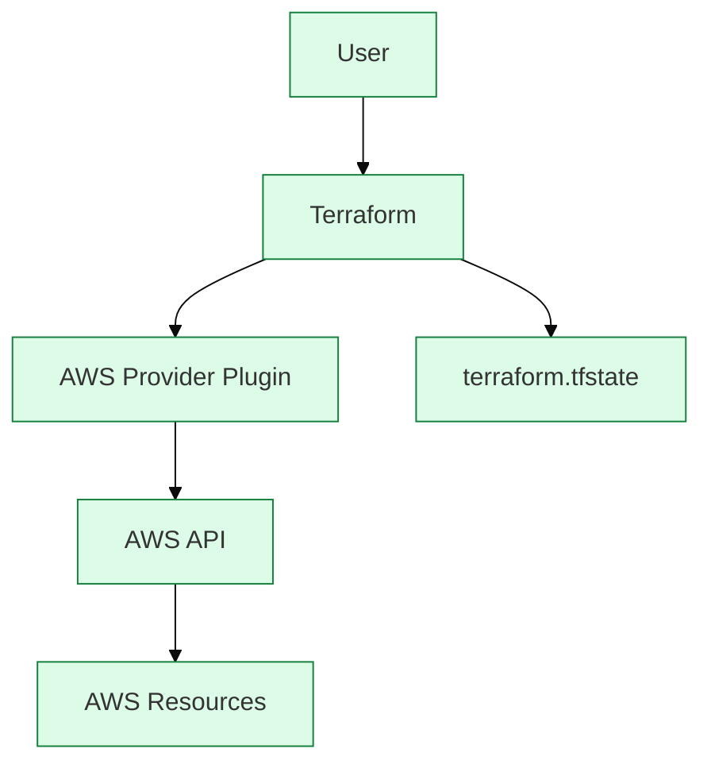
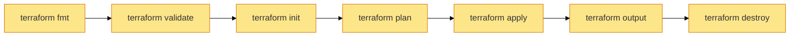

# Chapter 1 – Terraform Basics (Beginner to Intermediate)

> **Terraform on AWS – Complete Beginner Guide**
>
> This chapter is designed for someone with **no Terraform experience**.

---

# Table of Contents

1. What is Infrastructure as Code (IaC)?
2. Why Terraform?
3. How Terraform Works Internally
4. Terraform Architecture
5. Installation (Windows & Linux)
6. AWS IAM User Creation
7. AWS CLI Installation
8. Configure AWS Credentials
9. Environment Variables
10. Terraform Project Folder Structure
11. Understanding Every File
12. Your First Terraform Project
13. What Happens During `terraform init`
14. The `.terraform` Directory
15. Terraform State File
16. Terraform Workflow
17. Lab 1
18. Lab 2
19. Practice Exercises
20. Interview Questions

---

# 1. What is Infrastructure as Code (IaC)?

Infrastructure as Code (IaC) means creating infrastructure using code instead of clicking through the AWS Console.

Without IaC:

```
AWS Console
 ↓
Click VPC
 ↓
Click Create
 ↓
Enter CIDR
 ↓
Save
```

With Terraform:

```hcl
resource "aws_vpc" "main" {
  cidr_block = "10.0.0.0/16"
}
```

Benefits:

- Repeatable
- Version controlled
- Automated
- Easy to review
- Less human error

---

# 2. Why Terraform?

Terraform supports many cloud providers.

| Tool | Supports |
|------|----------|
| Terraform | AWS, Azure, GCP, VMware, Kubernetes |
| CloudFormation | AWS only |

Advantages:

- Multi-cloud
- Reusable modules
- Easy automation
- Large community
- Declarative syntax

---

# 3. How Terraform Works Internally

```mermaid
---
config:
  theme: base
  themeVariables:
    primaryColor: "#dbeafe"
    primaryBorderColor: "#2563eb"
    primaryTextColor: "#111827"
    lineColor: "#16a34a"
---
flowchart LR
A["Write .tf Files"] --> B["terraform init"]
B --> C["Download Provider"]
C --> D["terraform plan"]
D --> E["Compare State vs Code"]
E --> F["terraform apply"]
F --> G["AWS API"]
G --> H["Resources Created"]
```



Terraform compares:

- Your code
- Current infrastructure
- State file

Then it calculates the changes before applying them.

---

# 4. Terraform Architecture



Components:

- User
- Terraform CLI
- Provider Plugin
- AWS APIs
- State File

---

# 5. Installation

## Windows

1. Download Terraform ZIP from HashiCorp.
2. Extract `terraform.exe`.
3. Add folder to PATH.

Verify:

```powershell
terraform version
```

Expected:

```text
Terraform v1.x.x
```

## Linux (Ubuntu)

```bash
sudo apt update
wget https://releases.hashicorp.com/terraform/1.11.0/terraform_1.11.0_linux_amd64.zip
unzip terraform_1.11.0_linux_amd64.zip
sudo mv terraform /usr/local/bin/
terraform version
```

Expected:

```text
Terraform v1.x.x
on linux_amd64
```

---

# 6. AWS IAM User Creation

Create an IAM user with:

- Programmatic access
- Policy: AdministratorAccess (Lab only)

Generate:

- Access Key ID
- Secret Access Key

Never commit these keys to Git.

---

# 7. AWS CLI Installation

Windows:

```powershell
aws --version
```

Linux:

```bash
curl "https://awscli.amazonaws.com/awscli-exe-linux-x86_64.zip" -o awscliv2.zip
unzip awscliv2.zip
sudo ./aws/install
aws --version
```

Expected:

```text
aws-cli/2.x.x
```

---

# 8. Configure Credentials

```bash
aws configure
```

Example:

```text
AWS Access Key ID: AKIA********
AWS Secret Access Key: ************************
Default region: eu-central-1
Default output format: json
```

Verify:

```bash
aws sts get-caller-identity
```

Expected:

```json
{
  "Account":"123456789012",
  "Arn":"arn:aws:iam::123456789012:user/terraform-user"
}
```

---

# 9. Environment Variables

Instead of `aws configure`:

Linux:

```bash
export AWS_ACCESS_KEY_ID=YOURKEY
export AWS_SECRET_ACCESS_KEY=YOURSECRET
export AWS_DEFAULT_REGION=eu-central-1
```

Windows PowerShell:

```powershell
$env:AWS_ACCESS_KEY_ID="YOURKEY"
$env:AWS_SECRET_ACCESS_KEY="YOURSECRET"
$env:AWS_DEFAULT_REGION="eu-central-1"
```

---

# 10. Project Folder Structure

```
terraform-vpc/
├── main.tf
├── variables.tf
├── outputs.tf
├── terraform.tfvars
├── versions.tf
├── providers.tf
└── README.md
```

Purpose:

- `main.tf` → Resources
- `variables.tf` → Inputs
- `outputs.tf` → Display values
- `terraform.tfvars` → Variable values
- `providers.tf` → AWS provider
- `versions.tf` → Terraform/provider versions

---

# 11. First Project

providers.tf

```hcl
provider "aws" {
  region = "eu-central-1"
}
```

main.tf

```hcl
resource "aws_vpc" "demo" {
  cidr_block = "10.0.0.0/16"

  tags = {
    Name = "demo-vpc"
  }
}
```

---

# 12. terraform init

Run:

```bash
terraform init
```

Terraform performs:

1. Reads configuration
2. Downloads provider
3. Creates `.terraform`
4. Creates lock file

Expected:

```text
Initializing provider plugins...
Terraform has been successfully initialized!
```

---

# 13. .terraform Directory

After init:

```
terraform-vpc/
│
├── .terraform/
│   └── providers/
├── .terraform.lock.hcl
```

`.terraform` stores downloaded provider plugins.

`.terraform.lock.hcl` locks provider versions.

---

# 14. Terraform State

Terraform remembers created resources in:

```
terraform.tfstate
```

Example:

```json
{
  "resources":[
    {
      "type":"aws_vpc",
      "name":"demo"
    }
  ]
}
```

Never edit this file manually.

---

# 15. Workflow



Commands:

```bash
terraform fmt
terraform validate
terraform init
terraform plan
terraform apply
terraform output
terraform destroy
```

Sample `plan`:

```text
Plan: 1 to add, 0 to change, 0 to destroy.
```

Sample `apply`:

```text
Apply complete!
Resources: 1 added.
```

Sample `destroy`:

```text
Destroy complete!
Resources: 1 destroyed.
```

---

# Lab 1

Create a VPC named `lab-vpc`.

Verify:

```bash
terraform plan
terraform apply
aws ec2 describe-vpcs
terraform destroy
```

---

# Lab 2

Change:

- Region
- CIDR
- Name tag

Observe `terraform plan` output before applying.

---

# Practice Exercises

1. Create two VPCs in separate folders.
2. Change CIDR and compare plans.
3. Delete the state file and observe Terraform's behavior.
4. Run `terraform fmt` on poorly formatted files.
5. Explore `.terraform` after `init`.

---

# Beginner Tips

- Run `terraform plan` before every apply.
- Never edit `terraform.tfstate`.
- Never store AWS keys in Git.
- Use one folder per project.

---

# Interview Questions

**What is Terraform?**

Infrastructure as Code software used to provision cloud resources declaratively.

**What is Infrastructure as Code?**

Managing infrastructure using code instead of manual configuration.

**What does `terraform init` do?**

- Downloads providers
- Creates `.terraform`
- Initializes backend
- Generates lock file

**What is the state file?**

A file that maps Terraform resources to real cloud resources.

**What is the difference between `plan` and `apply`?**

- `plan` previews changes.
- `apply` executes changes.

