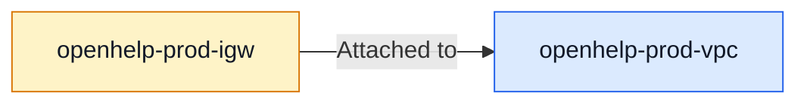
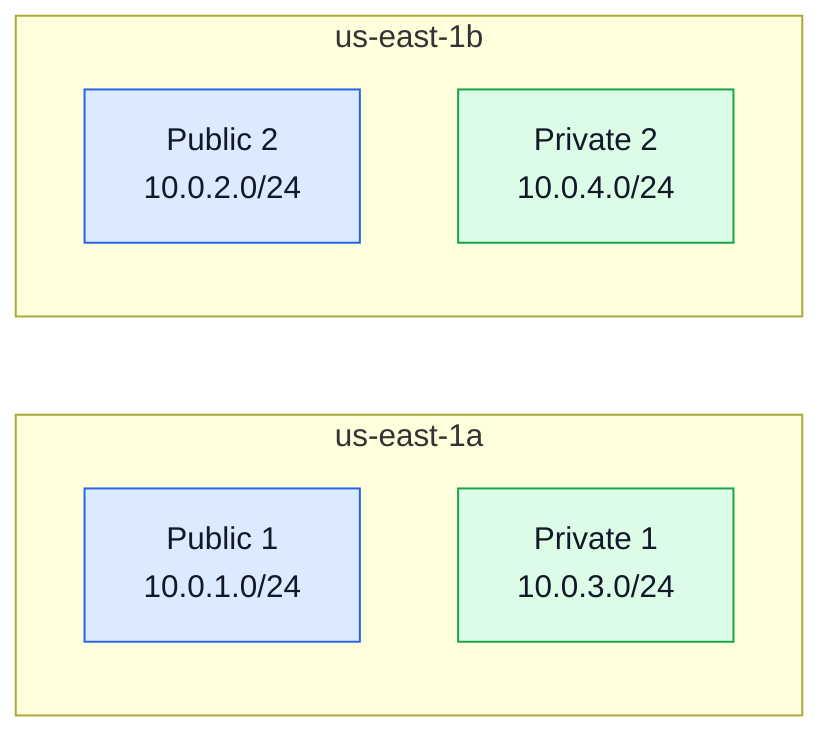
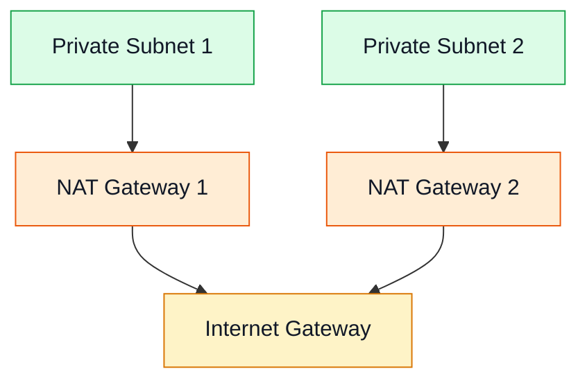
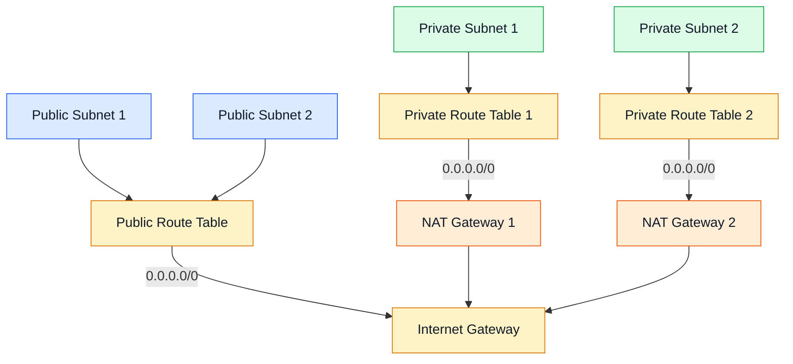
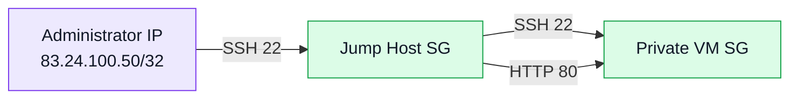
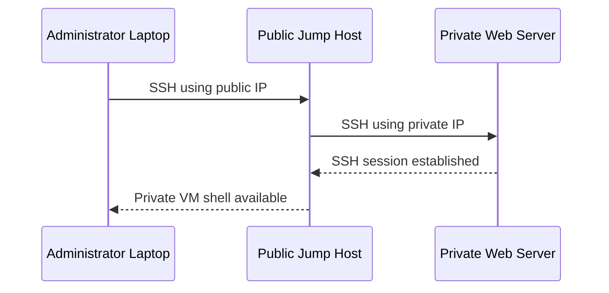

# AWS VPC Manual Setup Guide

> A beginner-friendly, GitHub-ready guide to create a highly available AWS VPC with two Availability Zones, public and private subnets, two NAT Gateways, a jump host, and a private Nginx web server.

---

## Table of Contents

1. [Architecture Overview](#architecture-overview)
2. [Resource Summary](#resource-summary)
3. [Step 1: Create the VPC](#step-1-create-the-vpc)
4. [Step 2: Create and Attach the Internet Gateway](#step-2-create-and-attach-the-internet-gateway)
5. [Step 3: Create Public Subnet 1](#step-3-create-public-subnet-1)
6. [Step 4: Create Private Subnet 1](#step-4-create-private-subnet-1)
7. [Step 5: Create Public Subnet 2](#step-5-create-public-subnet-2)
8. [Step 6: Create Private Subnet 2](#step-6-create-private-subnet-2)
9. [Step 7: Create NAT Gateway 1](#step-7-create-nat-gateway-1)
10. [Step 8: Create NAT Gateway 2](#step-8-create-nat-gateway-2)
11. [Step 9: Create the Public Route Table](#step-9-create-the-public-route-table)
12. [Step 10: Create Private Route Table 1](#step-10-create-private-route-table-1)
13. [Step 11: Create Private Route Table 2](#step-11-create-private-route-table-2)
14. [Step 12: Create the Jump Host Security Group](#step-12-create-the-jump-host-security-group)
15. [Step 13: Create the Private VM Security Group](#step-13-create-the-private-vm-security-group)
16. [Step 14: Launch the Public Jump Host](#step-14-launch-the-public-jump-host)
17. [Step 15: Launch the Private Ubuntu Web Server](#step-15-launch-the-private-ubuntu-web-server)
18. [Step 16: Convert the PEM Key for PuTTY](#step-16-convert-the-pem-key-for-putty)
19. [Step 17: Connect to the Jump Host](#step-17-connect-to-the-jump-host)
20. [Step 18: Connect to the Private VM](#step-18-connect-to-the-private-vm)
21. [Step 19: Verify NAT Internet Access](#step-19-verify-nat-internet-access)
22. [Step 20: Verify Nginx](#step-20-verify-nginx)
23. [Final Verification Checklist](#final-verification-checklist)
24. [Cleanup Order](#cleanup-order)

---

# Architecture Overview


---

# Resource Summary

| Resource | Name | Availability Zone | CIDR / Purpose |
|---|---|---|---|
| VPC | `openhelp-prod-vpc` | Regional | `10.0.0.0/16` |
| Internet Gateway | `openhelp-prod-igw` | Regional | Internet connectivity |
| Public Subnet 1 | `openhelp-prod-public-1` | `us-east-1a` | `10.0.1.0/24` |
| Public Subnet 2 | `openhelp-prod-public-2` | `us-east-1b` | `10.0.2.0/24` |
| Private Subnet 1 | `openhelp-prod-private-1` | `us-east-1a` | `10.0.3.0/24` |
| Private Subnet 2 | `openhelp-prod-private-2` | `us-east-1b` | `10.0.4.0/24` |
| NAT Gateway 1 | `openhelp-prod-nat-1` | `us-east-1a` | Internet egress for Private Subnet 1 |
| NAT Gateway 2 | `openhelp-prod-nat-2` | `us-east-1b` | Internet egress for Private Subnet 2 |
| Public Route Table | `openhelp-prod-public-rt` | Regional | Routes public traffic to the IGW |
| Private Route Table 1 | `openhelp-prod-private-rt-1` | `us-east-1a` | Routes through NAT Gateway 1 |
| Private Route Table 2 | `openhelp-prod-private-rt-2` | `us-east-1b` | Routes through NAT Gateway 2 |
| Jump Host | `openhelp-prod-jump` | `us-east-1a` | Public SSH entry point |
| Private Web Server | `openhelp-prod-private-web` | `us-east-1a` | Private Ubuntu Nginx server |

---


The below video is quite useful before doing the below  excerise

https://www.youtube.com/watch?v=ydxEeVAqVdo&t=1143s


# Step 1: Create the VPC

## Console Path

```text
AWS Console → VPC → Your VPCs → Create VPC
```

## Configuration

```text
Resource to create: VPC only
Name tag: openhelp-prod-vpc
IPv4 CIDR: 10.0.0.0/16
Tenancy: Default
```

Click **Create VPC**.

> **Why:** The VPC is the main isolated network that contains the subnets, gateways, route tables, security groups, and EC2 instances.

---

# Step 2: Create and Attach the Internet Gateway

## Console Path

```text
VPC → Internet Gateways → Create internet gateway
```

## Configuration

```text
Name tag: openhelp-prod-igw
```

After creating it:

```text
Select Internet Gateway
→ Actions
→ Attach to a VPC
→ openhelp-prod-vpc
→ Attach internet gateway
```



> **Why:** An Internet Gateway allows resources in public subnets to communicate with the internet.

---

# Step 3: Create Public Subnet 1

## Console Path

```text
VPC → Subnets → Create subnet
```

## Configuration

```text
VPC: openhelp-prod-vpc
Subnet name: openhelp-prod-public-1
Availability Zone: us-east-1a
IPv4 CIDR: 10.0.1.0/24
```

After creating the subnet:

```text
Select openhelp-prod-public-1
→ Actions
→ Edit subnet settings
→ Enable Auto-assign public IPv4 address
→ Save
```

> **Important:** A subnet is not public only because public IP assignment is enabled. It must also have a route to the Internet Gateway.

---

# Step 4: Create Private Subnet 1

## Configuration

```text
VPC: openhelp-prod-vpc
Subnet name: openhelp-prod-private-1
Availability Zone: us-east-1a
IPv4 CIDR: 10.0.3.0/24
```

Click **Create subnet**.

> Do not enable automatic public IPv4 assignment.

---

# Step 5: Create Public Subnet 2

## Configuration

```text
VPC: openhelp-prod-vpc
Subnet name: openhelp-prod-public-2
Availability Zone: us-east-1b
IPv4 CIDR: 10.0.2.0/24
```

After creation:

```text
Select openhelp-prod-public-2
→ Actions
→ Edit subnet settings
→ Enable Auto-assign public IPv4 address
→ Save
```

---

# Step 6: Create Private Subnet 2

## Configuration

```text
VPC: openhelp-prod-vpc
Subnet name: openhelp-prod-private-2
Availability Zone: us-east-1b
IPv4 CIDR: 10.0.4.0/24
```

Click **Create subnet**.

> Do not enable automatic public IPv4 assignment.

---

## Subnet Layout



---

# Step 7: Create NAT Gateway 1

## Console Path

```text
VPC → NAT Gateways → Create NAT gateway
```

## Configuration

```text
Name: openhelp-prod-nat-1
Subnet: openhelp-prod-public-1
Connectivity type: Public
Elastic IP: Allocate Elastic IP
```

Click **Create NAT gateway** and wait until the state becomes:

```text
Available
```

> **Why:** NAT Gateway 1 allows instances in Private Subnet 1 to access the internet without receiving public IP addresses.

---

# Step 8: Create NAT Gateway 2

## Configuration

```text
Name: openhelp-prod-nat-2
Subnet: openhelp-prod-public-2
Connectivity type: Public
Elastic IP: Allocate a separate Elastic IP
```

Wait until the state becomes:

```text
Available
```

> Each NAT Gateway must have its own Elastic IP.



---

# Step 9: Create the Public Route Table

## Create the Route Table

```text
VPC → Route Tables → Create route table
```

```text
Name: openhelp-prod-public-rt
VPC: openhelp-prod-vpc
```

## Associate Both Public Subnets

```text
Select openhelp-prod-public-rt
→ Subnet associations
→ Edit subnet associations
```

Select:

```text
openhelp-prod-public-1
openhelp-prod-public-2
```

## Add the Internet Route

```text
Routes → Edit routes → Add route
```

```text
Destination: 0.0.0.0/0
Target: Internet Gateway
Internet Gateway: openhelp-prod-igw
```

> **Important:** The correct default route is `0.0.0.0/0`, not `0.0.0.0/24`.

---

# Step 10: Create Private Route Table 1

## Create

```text
Name: openhelp-prod-private-rt-1
VPC: openhelp-prod-vpc
```

## Associate

```text
Subnet: openhelp-prod-private-1
```

## Add Route

```text
Destination: 0.0.0.0/0
Target: NAT Gateway
NAT Gateway: openhelp-prod-nat-1
```

---

# Step 11: Create Private Route Table 2

## Create

```text
Name: openhelp-prod-private-rt-2
VPC: openhelp-prod-vpc
```

## Associate

```text
Subnet: openhelp-prod-private-2
```

## Add Route

```text
Destination: 0.0.0.0/0
Target: NAT Gateway
NAT Gateway: openhelp-prod-nat-2
```

---

## Route Table Flow



---

# Step 12: Create the Jump Host Security Group

## Console Path

```text
EC2 → Security Groups → Create security group
```

## Basic Details

```text
Name: openhelp-prod-jump-sg
Description: Allow SSH from administrator laptop
VPC: openhelp-prod-vpc
```

## Inbound Rule

```text
Type: SSH
Protocol: TCP
Port: 22
Source: My IP
```

Example:

```text
83.24.100.50/32
```

## Outbound Rule

Keep the default:

```text
All traffic
Destination: 0.0.0.0/0
```

> **Security:** Do not allow SSH from `0.0.0.0/0` in a production environment.

---

# Step 13: Create the Private VM Security Group

## Basic Details

```text
Name: openhelp-prod-private-vm-sg
Description: Allow access only from the jump host
VPC: openhelp-prod-vpc
```

## SSH Rule

```text
Type: SSH
Protocol: TCP
Port: 22
Source: Security Group
Source Security Group: openhelp-prod-jump-sg
```

## Optional Nginx Rule

```text
Type: HTTP
Protocol: TCP
Port: 80
Source: Security Group
Source Security Group: openhelp-prod-jump-sg
```

## Outbound Rule

```text
All traffic
Destination: 0.0.0.0/0
```



---

# Step 14: Launch the Public Jump Host

## Console Path

```text
EC2 → Instances → Launch instances
```

## Configuration

```text
Name: openhelp-prod-jump
AMI: Ubuntu Server 24.04 LTS
Instance type: t3.micro
Key pair: Select or create a key pair
VPC: openhelp-prod-vpc
Subnet: openhelp-prod-public-1
Auto-assign public IP: Enable
Security group: openhelp-prod-jump-sg
```

Click **Launch instance**.

Record:

```text
Public IPv4 address
Private IPv4 address
```

---

# Step 15: Launch the Private Ubuntu Web Server

## Configuration

```text
Name: openhelp-prod-private-web
AMI: Ubuntu Server 24.04 LTS
Instance type: t3.micro
Key pair: Same key pair as the jump host
VPC: openhelp-prod-vpc
Subnet: openhelp-prod-private-1
Auto-assign public IP: Disable
Security group: openhelp-prod-private-vm-sg
```

## User Data

Open:

```text
Advanced details → User data
```

Add:

```bash
#!/bin/bash

apt-get update -y
apt-get install -y nginx curl

systemctl enable nginx
systemctl start nginx
```

The private VM should have:

```text
Private IP: Assigned
Public IP: None
```

---

# Step 16: Convert the PEM Key for PuTTY

1. Open **PuTTYgen**.
2. Click **Load**.
3. Select **All Files**.
4. Open the `.pem` key.
5. Click **Save private key**.
6. Save it as:

```text
openhelp-key.ppk
```

---

# Step 17: Connect to the Jump Host

## PuTTY Settings

```text
Host Name: ubuntu@JUMP_HOST_PUBLIC_IP
Port: 22
Connection type: SSH
```

Go to:

```text
Connection → SSH → Auth → Credentials
```

Select:

```text
openhelp-key.ppk
```

Return to **Session** and click **Open**.

Example:

```text
ubuntu@54.210.10.20
```

---

# Step 18: Connect to the Private VM

The private VM cannot be accessed directly from the internet.

## Windows OpenSSH

```bash
ssh -i openhelp-key.pem \
  -J ubuntu@JUMP_PUBLIC_IP \
  ubuntu@PRIVATE_VM_PRIVATE_IP
```

Example:

```bash
ssh -i openhelp-key.pem \
  -J ubuntu@54.210.10.20 \
  ubuntu@10.0.3.80
```

## Single-Line Version

```bash
ssh -i openhelp-key.pem -J ubuntu@54.210.10.20 ubuntu@10.0.3.80
```

## SSH Flow



---

# Step 19: Verify NAT Internet Access

On the private VM:

```bash
curl https://checkip.amazonaws.com
```

The returned IP should match the Elastic IP assigned to:

```text
openhelp-prod-nat-1
```

## Test DNS

```bash
getent hosts ubuntu.com
```

## Test Package Repository Access

```bash
sudo apt-get update
```

## Expected Path

```text
Private Web Server
→ Private Route Table 1
→ NAT Gateway 1
→ Internet Gateway
→ Internet
```

---

# Step 20: Verify Nginx

## Check Service Status

```bash
systemctl status nginx --no-pager
```

## Test Locally

```bash
curl http://localhost
```

## Test from the Jump Host

```bash
curl http://PRIVATE_VM_PRIVATE_IP
```

Example:

```bash
curl http://10.0.3.80
```

Expected response:

```html
<!DOCTYPE html>
<html>
<head>
<title>Welcome to nginx!</title>
</head>
```

> Port `80` must be allowed from `openhelp-prod-jump-sg` to `openhelp-prod-private-vm-sg`.

---

# Final Verification Checklist

## Networking

- [ ] VPC `openhelp-prod-vpc` created
- [ ] Internet Gateway created and attached
- [ ] Public Subnet 1 created in `us-east-1a`
- [ ] Private Subnet 1 created in `us-east-1a`
- [ ] Public Subnet 2 created in `us-east-1b`
- [ ] Private Subnet 2 created in `us-east-1b`
- [ ] Public IP assignment enabled only on public subnets
- [ ] NAT Gateway 1 created in Public Subnet 1
- [ ] NAT Gateway 2 created in Public Subnet 2
- [ ] Each NAT Gateway has a separate Elastic IP

## Routing

- [ ] Public route table associated with both public subnets
- [ ] Public default route points to Internet Gateway
- [ ] Private Route Table 1 associated with Private Subnet 1
- [ ] Private Route Table 1 points to NAT Gateway 1
- [ ] Private Route Table 2 associated with Private Subnet 2
- [ ] Private Route Table 2 points to NAT Gateway 2

## Security

- [ ] Jump Host SG allows SSH only from administrator IP
- [ ] Private VM SG allows SSH only from Jump Host SG
- [ ] Private VM SG allows HTTP from Jump Host SG if required

## EC2

- [ ] Jump host has a public IP
- [ ] Private web server has no public IP
- [ ] Jump host is reachable using PuTTY
- [ ] Private VM is reachable through the jump host
- [ ] Private VM has outbound internet access
- [ ] Nginx is installed and running

---

# Important Notes

> A public subnet requires a route to the Internet Gateway.

> A private subnet uses a NAT Gateway for outbound internet access.

> NAT Gateways do not allow unsolicited inbound internet connections to private EC2 instances.

> Use `0.0.0.0/0` for the default route. `0.0.0.0/24` is incorrect.

> For high availability, use one NAT Gateway per Availability Zone.

> NAT Gateways, Elastic IPs, and public IPv4 addresses can generate AWS charges.

---

# Cleanup Order

Delete resources in the following order:

1. EC2 instances
2. NAT Gateways
3. Elastic IP addresses
4. Route-table associations
5. Custom route tables
6. Subnets
7. Internet Gateway
8. VPC

> Wait for the NAT Gateways to be completely deleted before releasing their Elastic IPs or deleting their public subnets.
