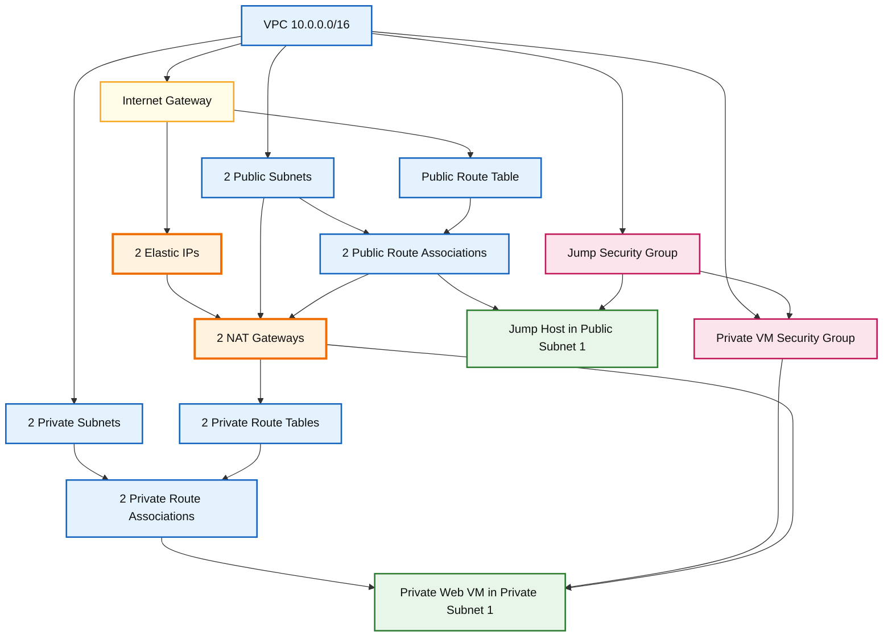

# AWS VPC with Two Public Subnets, Two Private Subnets, Two NAT Gateways, Jump Host and Private Ubuntu VM

> **Beginner-friendly Terraform lab**
>
> This guide creates a complete AWS network with:
>
> - 1 VPC
> - 2 public subnets in two Availability Zones
> - 2 private subnets in two Availability Zones
> - 1 Internet Gateway
> - 2 public NAT Gateways, one in each public subnet, each with its own Elastic IP
> - 1 public Ubuntu jump host
> - 1 private Ubuntu web server
> - SSH access from your laptop through the jump host
> - Availability-Zone-local outbound internet access from each private subnet through its own NAT Gateway
> - No direct public access to the private VM

To understand concept better watch the below video before proceeding further with terraform:-

https://www.youtube.com/watch?v=ydxEeVAqVdo&t=1143s

---

## 1. What we are building

The IP address plan used in this guide is:

| Resource | Availability Zone | CIDR/IP | Purpose |
|---|---|---:|---|
| VPC | Regional | `10.0.0.0/16` | Main private AWS network |
| Public subnet 1 | `us-east-1a` | `10.0.1.0/24` | Jump host and NAT Gateway 1 |
| Public subnet 2 | `us-east-1b` | `10.0.2.0/24` | NAT Gateway 2 and future public resources |
| Private subnet 1 | `us-east-1a` | `10.0.3.0/24` | Private Ubuntu web server |
| Private subnet 2 | `us-east-1b` | `10.0.4.0/24` | Future private workloads |
| Jump host | Public subnet 1 | Dynamic `10.0.1.x` + public IP | Entry point from your laptop |
| Private web VM | Private subnet 1 | Dynamic `10.0.3.x` | Not directly reachable from the internet |
| NAT Gateway 1 | Public subnet 1 | Dynamic `10.0.1.x` + Elastic IP 1 | Outbound internet for private subnet 1 |
| NAT Gateway 2 | Public subnet 2 | Dynamic `10.0.2.x` + Elastic IP 2 | Outbound internet for private subnet 2 |

A `/24` subnet contains 256 addresses. AWS reserves five addresses in every subnet, so 251 addresses are available for resources.

---

## 2. Simple high-availability architecture diagram


### Architecture meaning

```text
Private subnet 1 in us-east-1a
        |
        +--> Private route table 1
                    |
                    +--> NAT Gateway 1 in public subnet 1

Private subnet 2 in us-east-1b
        |
        +--> Private route table 2
                    |
                    +--> NAT Gateway 2 in public subnet 2
```

Each private subnet uses the NAT Gateway in the **same Availability Zone**. This avoids depending on a NAT Gateway in another zone and provides better resilience.

---

## 3. Understand the traffic flow

### 3.1 Laptop to jump host

```text
Laptop
  |
  | SSH TCP/22
  | Source: YOUR_PUBLIC_IP/32
  v
Jump host public IP
```

The jump-host security group permits SSH only from your laptop's public IP.

### 3.2 Laptop to private VM

```text
Laptop
  |
  | SSH ProxyJump
  v
Public jump host
  |
  | SSH using 10.0.3.x
  v
Private Ubuntu VM
```

The private VM:

- Has no public IP.
- Does not accept SSH from the internet.
- Accepts SSH only from the jump-host security group.

### 3.3 Private workloads to the internet

Availability Zone 1:

```text
Private VM in 10.0.3.0/24
  |
  | Private route table 1: 0.0.0.0/0
  v
NAT Gateway 1 in 10.0.1.0/24
  |
  | Public route table: 0.0.0.0/0
  v
Internet Gateway
  |
  v
Internet
```

Availability Zone 2:

```text
Private workload in 10.0.4.0/24
  |
  | Private route table 2: 0.0.0.0/0
  v
NAT Gateway 2 in 10.0.2.0/24
  |
  | Public route table: 0.0.0.0/0
  v
Internet Gateway
  |
  v
Internet
```

The private VM can initiate connections such as:

```bash
sudo apt update
curl https://ubuntu.com
```

An internet client cannot initiate a connection back to the private VM through the NAT Gateway.

---

## 4. Public subnet versus private subnet

A subnet is not public merely because its name contains `public`.

A subnet is public when its associated route table contains:

```text
Destination: 0.0.0.0/0
Target:      Internet Gateway
```

A private subnet in this lab contains:

```text
Destination: 0.0.0.0/0
Target:      NAT Gateway
```

The private VM also has:

```hcl
associate_public_ip_address = false
```

These settings prevent direct public access.

---

## 5. Why each AWS component is required

### VPC

The VPC is your isolated virtual network in AWS.

```text
10.0.0.0/16
```

All four subnets are created inside this address range.

### Public subnets

Public subnets are used for resources that need direct internet routing, such as:

- Jump hosts
- Internet-facing load balancers
- Public NAT Gateways

### Private subnets

Private subnets are used for resources that should not be directly reachable from the internet, such as:

- Application servers
- Databases
- Internal services
- Kubernetes worker nodes

### Internet Gateway

The Internet Gateway is attached to the VPC. It is the route-table target used by resources that communicate directly with the internet.

### NAT Gateway

The NAT Gateway is placed in a public subnet and receives an Elastic IP.

It allows private instances to start outbound internet connections while preventing unsolicited inbound internet connections.

### Route tables

A route table tells AWS where network traffic must go.

Public route:

```text
0.0.0.0/0 → Internet Gateway
```

Private route:

```text
0.0.0.0/0 → NAT Gateway
```

AWS also automatically creates a local VPC route:

```text
10.0.0.0/16 → local
```

The local route allows resources in the VPC to communicate using private IP addresses, subject to security-group and network ACL rules.

### Security groups

Security groups are stateful virtual firewalls attached to network interfaces.

This guide creates:

1. A jump-host security group allowing TCP/22 only from your public `/32`.
2. A private-VM security group allowing TCP/22 only from the jump-host security group.

### EC2 key pair

The EC2 key pair allows SSH public-key authentication.

- AWS stores the public key.
- You keep the private `.pem` key.
- Do not upload the private key to GitHub.
- Do not copy it to the jump host when using `ProxyJump`.

---

## 6. Cost warning

This lab can create billable AWS resources, especially:

- Two NAT Gateways with hourly usage charges
- NAT Gateway data processing charges for traffic passing through each gateway
- EC2 instances
- Public IPv4 addresses
- EBS volumes

Destroy the lab when it is no longer required:

```bash
terraform destroy
```

---

## 7. Prerequisites

Install:

- Terraform
- AWS CLI
- OpenSSH client
- An AWS account
- AWS credentials with permission to create VPC and EC2 resources

Check the commands:

```bash
terraform version
aws --version
ssh -V
```

Configure the AWS CLI:

```bash
aws configure
```

Typical input:

```text
AWS Access Key ID: YOUR_ACCESS_KEY
AWS Secret Access Key: YOUR_SECRET_KEY
Default region name: us-east-1
Default output format: json
```

Verify the active identity:

```bash
aws sts get-caller-identity
```

---

## 8. Create the project directory

```bash
mkdir aws-private-vm-lab
cd aws-private-vm-lab
```

Create these files:

```text
aws-private-vm-lab/
├── versions.tf
├── variables.tf
├── network.tf
├── security.tf
├── instances.tf
├── outputs.tf
└── terraform.tfvars
```

Terraform reads all `.tf` files in the current directory as one configuration. The filenames are for organization; Terraform does not execute them one by one.

---

# Terraform configuration

## 9. `versions.tf`

```hcl
terraform {
  required_version = ">= 1.6.0"

  required_providers {
    aws = {
      source  = "hashicorp/aws"
      version = "~> 6.0"
    }
  }
}

provider "aws" {
  region = var.region

  default_tags {
    tags = {
      Project     = var.project_name
      Environment = var.environment
      ManagedBy   = "Terraform"
    }
  }
}
```

### Explanation

```hcl
terraform {
```

Starts the Terraform settings block.

```hcl
required_version = ">= 1.6.0"
```

Requires Terraform 1.6 or newer.

```hcl
required_providers {
```

Declares external providers used by the project.

```hcl
source = "hashicorp/aws"
```

Downloads the official HashiCorp AWS provider.

```hcl
version = "~> 6.0"
```

Allows compatible AWS provider 6.x releases but not 7.x.

```hcl
provider "aws" {
  region = var.region
}
```

Configures the AWS Region using a Terraform variable.

```hcl
default_tags {
```

Automatically applies common tags to supported AWS resources.

---

## 10. `variables.tf`

```hcl
variable "project_name" {
  description = "Project name used in resource names and tags"
  type        = string
  default     = "openhelp"
}

variable "environment" {
  description = "Deployment environment such as dev, test or prod"
  type        = string
  default     = "prod"
}

variable "region" {
  description = "AWS Region"
  type        = string
  default     = "us-east-1"
}

variable "vpc_cidr" {
  description = "IPv4 CIDR block assigned to the VPC"
  type        = string
  default     = "10.0.0.0/16"
}

variable "availability_zones" {
  description = "Availability Zones used by public and private subnets"
  type        = list(string)
  default     = ["us-east-1a", "us-east-1b"]

  validation {
    condition     = length(var.availability_zones) == 2
    error_message = "Provide exactly two Availability Zones."
  }
}

variable "public_subnet_cidrs" {
  description = "CIDR blocks for the two public subnets"
  type        = list(string)
  default     = ["10.0.1.0/24", "10.0.2.0/24"]

  validation {
    condition     = length(var.public_subnet_cidrs) == 2
    error_message = "Provide exactly two public subnet CIDR blocks."
  }
}

variable "private_subnet_cidrs" {
  description = "CIDR blocks for the two private subnets"
  type        = list(string)
  default     = ["10.0.3.0/24", "10.0.4.0/24"]

  validation {
    condition     = length(var.private_subnet_cidrs) == 2
    error_message = "Provide exactly two private subnet CIDR blocks."
  }
}

variable "ubuntu_ami_id" {
  description = "Official Ubuntu 24.04 LTS AMI ID retrieved with AWS CLI"
  type        = string

  validation {
    condition     = can(regex("^ami-[0-9a-f]+$", var.ubuntu_ami_id))
    error_message = "ubuntu_ami_id must be an AMI ID such as ami-0123456789abcdef0."
  }
}

variable "key_name" {
  description = "Name of an existing EC2 key pair in the selected Region"
  type        = string
}

variable "jump_instance_type" {
  description = "EC2 instance type for the public jump host"
  type        = string
  default     = "t3.micro"
}

variable "private_instance_type" {
  description = "EC2 instance type for the private web server"
  type        = string
  default     = "t3.micro"
}

variable "admin_cidr_blocks" {
  description = "Public IPv4 CIDR blocks allowed to SSH to the jump host"
  type        = list(string)

  validation {
    condition = (
      length(var.admin_cidr_blocks) > 0 &&
      alltrue([
        for cidr in var.admin_cidr_blocks :
        cidr != "0.0.0.0/0" && can(cidrhost(cidr, 0))
      ])
    )

    error_message = "Use a valid restricted CIDR such as 83.24.100.50/32. Do not use 0.0.0.0/0."
  }
}
```

### Important variable concepts

A variable definition describes the expected input:

```hcl
variable "region" {
  type = string
}
```

The actual value is normally supplied in `terraform.tfvars`:

```hcl
region = "us-east-1"
```

### Why validate the AMI

```hcl
can(regex("^ami-[0-9a-f]+$", var.ubuntu_ami_id))
```

This checks that:

- The value begins with `ami-`.
- The remaining characters contain lowercase hexadecimal digits.
- Terraform shows an understandable error before contacting AWS if the format is invalid.

### Why reject `0.0.0.0/0`

```text
0.0.0.0/0
```

means every IPv4 address on the internet. Allowing SSH from this CIDR unnecessarily exposes port 22.

Your laptop IP should normally be written as:

```text
83.24.100.50/32
```

`/32` means one exact IPv4 address.

---

## 11. Find the official Ubuntu 24.04 AMI using AWS CLI

AMI IDs are Region-specific and are replaced as Canonical publishes updated images. Retrieve the current AMI instead of copying an old ID from another Region.

Canonical's AWS account ID is:

```text
099720109477
```

Run:

```bash
aws ec2 describe-images \
  --region us-east-1 \
  --owners 099720109477 \
  --filters \
    "Name=name,Values=ubuntu/images/hvm-ssd-gp3/ubuntu-noble-24.04-amd64-server-*" \
    "Name=architecture,Values=x86_64" \
    "Name=root-device-type,Values=ebs" \
    "Name=virtualization-type,Values=hvm" \
    "Name=state,Values=available" \
  --query 'sort_by(Images, &CreationDate)[-1].[ImageId,Name,CreationDate]' \
  --output table
```

### What each part means

| Part | Meaning |
|---|---|
| `describe-images` | Lists EC2 AMIs |
| `--region us-east-1` | Searches only in Northern Virginia |
| `--owners 099720109477` | Restricts results to Canonical |
| `ubuntu-noble-24.04` | Ubuntu 24.04 LTS, code name Noble |
| `amd64` | x86-64 architecture for instance families such as `t3` |
| `gp3` | Image using a GP3 EBS root volume |
| `state=available` | Returns images that can be launched |
| `sort_by(...CreationDate)[-1]` | Sorts by creation time and selects the newest image |

Return only the AMI ID:

```bash
aws ec2 describe-images \
  --region us-east-1 \
  --owners 099720109477 \
  --filters \
    "Name=name,Values=ubuntu/images/hvm-ssd-gp3/ubuntu-noble-24.04-amd64-server-*" \
    "Name=architecture,Values=x86_64" \
    "Name=root-device-type,Values=ebs" \
    "Name=virtualization-type,Values=hvm" \
    "Name=state,Values=available" \
  --query 'sort_by(Images, &CreationDate)[-1].ImageId' \
  --output text
```

Example format:

```text
ami-0123456789abcdef0
```

Use the actual value returned by your command.

Store it in a shell variable:

```bash
UBUNTU_AMI_ID=$(aws ec2 describe-images \
  --region us-east-1 \
  --owners 099720109477 \
  --filters \
    "Name=name,Values=ubuntu/images/hvm-ssd-gp3/ubuntu-noble-24.04-amd64-server-*" \
    "Name=architecture,Values=x86_64" \
    "Name=root-device-type,Values=ebs" \
    "Name=virtualization-type,Values=hvm" \
    "Name=state,Values=available" \
  --query 'sort_by(Images, &CreationDate)[-1].ImageId' \
  --output text)

echo "$UBUNTU_AMI_ID"
```

---

## 12. `network.tf`

```hcl
# ---------------------------------------------------------
# VPC
# ---------------------------------------------------------

resource "aws_vpc" "this" {
  cidr_block           = var.vpc_cidr
  enable_dns_support   = true
  enable_dns_hostnames = true

  tags = {
    Name = "${var.project_name}-${var.environment}-vpc"
  }
}

# ---------------------------------------------------------
# Internet Gateway
# ---------------------------------------------------------

resource "aws_internet_gateway" "this" {
  vpc_id = aws_vpc.this.id

  tags = {
    Name = "${var.project_name}-${var.environment}-igw"
  }
}

# ---------------------------------------------------------
# Two public subnets
# ---------------------------------------------------------

resource "aws_subnet" "public" {
  count = length(var.public_subnet_cidrs)

  vpc_id                  = aws_vpc.this.id
  cidr_block              = var.public_subnet_cidrs[count.index]
  availability_zone       = var.availability_zones[count.index]
  map_public_ip_on_launch = true

  tags = {
    Name = "${var.project_name}-${var.environment}-public-${count.index + 1}"
    Tier = "public"
  }
}

# ---------------------------------------------------------
# Two private subnets
# ---------------------------------------------------------

resource "aws_subnet" "private" {
  count = length(var.private_subnet_cidrs)

  vpc_id                  = aws_vpc.this.id
  cidr_block              = var.private_subnet_cidrs[count.index]
  availability_zone       = var.availability_zones[count.index]
  map_public_ip_on_launch = false

  tags = {
    Name = "${var.project_name}-${var.environment}-private-${count.index + 1}"
    Tier = "private"
  }
}

# ---------------------------------------------------------
# One shared public route table
# Both public subnets route internet traffic to the IGW
# ---------------------------------------------------------

resource "aws_route_table" "public" {
  vpc_id = aws_vpc.this.id

  route {
    cidr_block = "0.0.0.0/0"
    gateway_id = aws_internet_gateway.this.id
  }

  tags = {
    Name = "${var.project_name}-${var.environment}-public-rt"
  }
}

resource "aws_route_table_association" "public" {
  count = length(aws_subnet.public)

  subnet_id      = aws_subnet.public[count.index].id
  route_table_id = aws_route_table.public.id
}

# ---------------------------------------------------------
# Two Elastic IPs: one for each NAT Gateway
# ---------------------------------------------------------

resource "aws_eip" "nat" {
  count = length(var.public_subnet_cidrs)

  domain = "vpc"

  tags = {
    Name = "${var.project_name}-${var.environment}-nat-eip-${count.index + 1}"
  }

  depends_on = [
    aws_internet_gateway.this
  ]
}

# ---------------------------------------------------------
# Two public NAT Gateways
# NAT 1 is placed in public subnet 1 / AZ 1
# NAT 2 is placed in public subnet 2 / AZ 2
# ---------------------------------------------------------

resource "aws_nat_gateway" "this" {
  count = length(var.public_subnet_cidrs)

  allocation_id = aws_eip.nat[count.index].id
  subnet_id     = aws_subnet.public[count.index].id

  tags = {
    Name = "${var.project_name}-${var.environment}-nat-${count.index + 1}"
  }

  depends_on = [
    aws_internet_gateway.this,
    aws_route_table_association.public
  ]
}

# ---------------------------------------------------------
# Two private route tables
# Each private subnet uses the NAT Gateway in the same AZ
# ---------------------------------------------------------

resource "aws_route_table" "private" {
  count = length(var.private_subnet_cidrs)

  vpc_id = aws_vpc.this.id

  route {
    cidr_block     = "0.0.0.0/0"
    nat_gateway_id = aws_nat_gateway.this[count.index].id
  }

  tags = {
    Name = "${var.project_name}-${var.environment}-private-rt-${count.index + 1}"
  }
}

resource "aws_route_table_association" "private" {
  count = length(aws_subnet.private)

  subnet_id      = aws_subnet.private[count.index].id
  route_table_id = aws_route_table.private[count.index].id
}
```

---

## 13. Network block explanations

### `aws_vpc`

```hcl
resource "aws_vpc" "this" {
```

- `aws_vpc` is the Terraform resource type.
- `this` is Terraform's local name for the resource.
- Other resources reference it as `aws_vpc.this`.

```hcl
cidr_block = var.vpc_cidr
```

Assigns `10.0.0.0/16` to the VPC.

```hcl
enable_dns_support = true
```

Enables DNS resolution in the VPC.

```hcl
enable_dns_hostnames = true
```

Allows supported EC2 instances to receive DNS hostnames.

### `aws_internet_gateway`

```hcl
vpc_id = aws_vpc.this.id
```

An Internet Gateway must be attached to a VPC. Terraform obtains the newly created VPC ID automatically.

This reference also creates an implicit dependency:

```text
Create VPC first
        ↓
Create Internet Gateway
```

### Public subnet loop

```hcl
count = length(var.public_subnet_cidrs)
```

The list contains two CIDRs, so Terraform creates two public subnets.

During the first iteration:

```text
count.index = 0
CIDR        = 10.0.1.0/24
AZ          = us-east-1a
Name        = openhelp-prod-public-1
```

During the second iteration:

```text
count.index = 1
CIDR        = 10.0.2.0/24
AZ          = us-east-1b
Name        = openhelp-prod-public-2
```

```hcl
map_public_ip_on_launch = true
```

Requests automatic public IPv4 assignment for instances launched in the subnet when the instance configuration permits it.

### Private subnet loop

```hcl
map_public_ip_on_launch = false
```

Prevents subnet-level automatic public IPv4 assignment.

### Public route table

```hcl
route {
  cidr_block = "0.0.0.0/0"
  gateway_id = aws_internet_gateway.this.id
}
```

All IPv4 destinations not matched by a more specific route are sent to the Internet Gateway.

### Route-table association

Creating a route table is not enough. It must be associated with the intended subnet:

```hcl
subnet_id      = aws_subnet.public[count.index].id
route_table_id = aws_route_table.public.id
```

### Two Elastic IPs

```hcl
resource "aws_eip" "nat" {
  count  = length(var.public_subnet_cidrs)
  domain = "vpc"
}
```

There are two public-subnet CIDRs, so Terraform creates:

```text
aws_eip.nat[0] → Elastic IP for NAT Gateway 1
aws_eip.nat[1] → Elastic IP for NAT Gateway 2
```

Each public NAT Gateway requires its own Elastic IP.

### Two NAT Gateways

```hcl
resource "aws_nat_gateway" "this" {
  count = length(var.public_subnet_cidrs)

  allocation_id = aws_eip.nat[count.index].id
  subnet_id     = aws_subnet.public[count.index].id
}
```

Terraform pairs resources by index:

| Index | Public subnet | Availability Zone | Elastic IP | NAT Gateway |
|---:|---|---|---|---|
| `0` | `10.0.1.0/24` | `us-east-1a` | `aws_eip.nat[0]` | `aws_nat_gateway.this[0]` |
| `1` | `10.0.2.0/24` | `us-east-1b` | `aws_eip.nat[1]` | `aws_nat_gateway.this[1]` |

A public NAT Gateway must be located in a public subnet whose route table sends `0.0.0.0/0` to the Internet Gateway.

### Two private route tables

```hcl
resource "aws_route_table" "private" {
  count = length(var.private_subnet_cidrs)

  route {
    cidr_block     = "0.0.0.0/0"
    nat_gateway_id = aws_nat_gateway.this[count.index].id
  }
}
```

Terraform creates one private route table per private subnet:

```text
private route table 1 → NAT Gateway 1
private route table 2 → NAT Gateway 2
```

The matching index is important:

```text
private[0] in us-east-1a → nat[0] in us-east-1a
private[1] in us-east-1b → nat[1] in us-east-1b
```

Use `nat_gateway_id`, not `gateway_id`, for a NAT Gateway route. Using the wrong attribute can cause repeated Terraform plan differences.

---

## 14. `security.tf`

The following uses dedicated rule resources. This is clearer for lifecycle management than mixing every rule inside the security-group block.

```hcl
# ---------------------------------------------------------
# Jump-host security group
# ---------------------------------------------------------

resource "aws_security_group" "jump" {
  name        = "${var.project_name}-${var.environment}-jump-sg"
  description = "Security group for the public jump host"
  vpc_id      = aws_vpc.this.id

  tags = {
    Name = "${var.project_name}-${var.environment}-jump-sg"
  }
}

resource "aws_vpc_security_group_ingress_rule" "jump_ssh" {
  for_each = toset(var.admin_cidr_blocks)

  security_group_id = aws_security_group.jump.id
  description       = "SSH from an approved administrator public IP"

  cidr_ipv4   = each.value
  from_port   = 22
  to_port     = 22
  ip_protocol = "tcp"
}

resource "aws_vpc_security_group_egress_rule" "jump_all_outbound" {
  security_group_id = aws_security_group.jump.id
  description       = "Allow all outbound IPv4 traffic"

  cidr_ipv4   = "0.0.0.0/0"
  ip_protocol = "-1"
}

# ---------------------------------------------------------
# Private-VM security group
# ---------------------------------------------------------

resource "aws_security_group" "private_vm" {
  name        = "${var.project_name}-${var.environment}-private-vm-sg"
  description = "Security group for the private Ubuntu VM"
  vpc_id      = aws_vpc.this.id

  tags = {
    Name = "${var.project_name}-${var.environment}-private-vm-sg"
  }
}

resource "aws_vpc_security_group_ingress_rule" "private_ssh_from_jump" {
  security_group_id = aws_security_group.private_vm.id
  description       = "Allow SSH only from the jump-host security group"

  referenced_security_group_id = aws_security_group.jump.id
  from_port                    = 22
  to_port                      = 22
  ip_protocol                  = "tcp"
}

resource "aws_vpc_security_group_egress_rule" "private_all_outbound" {
  security_group_id = aws_security_group.private_vm.id
  description       = "Allow outbound IPv4 traffic through the NAT Gateway"

  cidr_ipv4   = "0.0.0.0/0"
  ip_protocol = "-1"
}
```

---

## 15. Security block explanations

### Jump-host inbound rule

```hcl
for_each = toset(var.admin_cidr_blocks)
```

Creates one ingress rule for every approved administrator CIDR.

```hcl
cidr_ipv4 = each.value
```

Uses the current CIDR from the set.

```hcl
from_port   = 22
to_port     = 22
ip_protocol = "tcp"
```

Allows only SSH.

### Private-VM inbound rule

```hcl
referenced_security_group_id = aws_security_group.jump.id
```

This does not allow every address in the public subnet. It allows traffic from network interfaces that use the jump-host security group.

This is better than hard-coding the jump host's private IP because the instance IP could change after replacement.

### Outbound rules

```hcl
cidr_ipv4   = "0.0.0.0/0"
ip_protocol = "-1"
```

Allows all outbound IPv4 protocols.

For the private VM, the security group allows the traffic, but the private route table determines that internet-bound traffic must travel through the NAT Gateway.

### Stateful behavior

Security groups are stateful. When an allowed outbound request is sent, its response traffic is automatically permitted. A separate inbound rule for the return packets is not required.

---

## 16. `instances.tf`

```hcl
# ---------------------------------------------------------
# Public Ubuntu jump host
# ---------------------------------------------------------

resource "aws_instance" "jump" {
  ami                         = var.ubuntu_ami_id
  instance_type               = var.jump_instance_type
  subnet_id                   = aws_subnet.public[0].id
  vpc_security_group_ids      = [aws_security_group.jump.id]
  key_name                    = var.key_name
  associate_public_ip_address = true

  metadata_options {
    http_endpoint = "enabled"
    http_tokens   = "required"
  }

  root_block_device {
    volume_type           = "gp3"
    volume_size           = 10
    encrypted             = true
    delete_on_termination = true
  }

  tags = {
    Name = "${var.project_name}-${var.environment}-jump"
    Role = "jump-host"
  }

  depends_on = [
    aws_internet_gateway.this,
    aws_route_table_association.public
  ]
}

# ---------------------------------------------------------
# Private Ubuntu web server
# ---------------------------------------------------------

resource "aws_instance" "web" {
  ami                         = var.ubuntu_ami_id
  instance_type               = var.private_instance_type
  subnet_id                   = aws_subnet.private[0].id
  vpc_security_group_ids      = [aws_security_group.private_vm.id]
  key_name                    = var.key_name
  associate_public_ip_address = false

  metadata_options {
    http_endpoint = "enabled"
    http_tokens   = "required"
  }

  root_block_device {
    volume_type           = "gp3"
    volume_size           = 10
    encrypted             = true
    delete_on_termination = true
  }

  user_data = <<-EOF
    #!/bin/bash
    set -euxo pipefail

    export DEBIAN_FRONTEND=noninteractive

    apt-get update -y
    apt-get install -y nginx curl

    cat > /var/www/html/index.html <<'HTML'
    <!doctype html>
    <html lang="en">
      <head>
        <meta charset="utf-8">
        <title>OpenHelp Private Web Server</title>
      </head>
      <body>
        <h1>OpenHelp Private Web Server</h1>
        <p>This Ubuntu VM is running in private subnet 10.0.3.0/24.</p>
        <p>It has no public IPv4 address.</p>
        <p>Its outbound internet traffic uses the NAT Gateway.</p>
      </body>
    </html>
    HTML

    systemctl enable nginx
    systemctl restart nginx
  EOF

  user_data_replace_on_change = true

  tags = {
    Name = "${var.project_name}-${var.environment}-private-web"
    Role = "private-web-server"
  }

  depends_on = [
    aws_nat_gateway.this,
    aws_route_table_association.private
  ]
}
```

---

## 17. Instance block explanations

### AMI

```hcl
ami = var.ubuntu_ami_id
```

Uses the Ubuntu 24.04 AMI ID copied from the AWS CLI result.

### Instance type

```hcl
instance_type = "t3.micro"
```

Controls the virtual CPU and memory capacity. The value is supplied through variables.

### Subnet placement

Jump host:

```hcl
subnet_id = aws_subnet.public[0].id
```

Private VM:

```hcl
subnet_id = aws_subnet.private[0].id
```

Index `[0]` selects the first subnet created by the `count` loop.

### Security groups

```hcl
vpc_security_group_ids = [aws_security_group.jump.id]
```

Attaches the jump-host firewall.

```hcl
vpc_security_group_ids = [aws_security_group.private_vm.id]
```

Attaches the private-VM firewall.

### Key pair

```hcl
key_name = var.key_name
```

Uses an EC2 key pair that already exists in `us-east-1`.

### Public IP behavior

Jump host:

```hcl
associate_public_ip_address = true
```

Private VM:

```hcl
associate_public_ip_address = false
```

The private VM therefore has no direct public address.

### Instance Metadata Service

```hcl
metadata_options {
  http_endpoint = "enabled"
  http_tokens   = "required"
}
```

Enables the EC2 Instance Metadata Service and requires IMDSv2 session tokens.

### Root disk

```hcl
root_block_device {
  volume_type           = "gp3"
  volume_size           = 10
  encrypted             = true
  delete_on_termination = true
}
```

Creates an encrypted 10-GiB GP3 EBS root volume and deletes it with the instance.

### `user_data`

The private VM runs the startup script during its first boot:

1. Updates Ubuntu package metadata.
2. Installs Nginx and curl.
3. Writes a basic web page.
4. Enables and starts Nginx.

This also tests NAT connectivity because `apt-get update` needs outbound internet and DNS access.

### `depends_on`

```hcl
depends_on = [
  aws_nat_gateway.this,
  aws_route_table_association.private
]
```

Makes the intended startup order explicit so the private VM is launched after both NAT Gateways and the private route-table associations are configured. The VM in private subnet 1 then uses NAT Gateway 1.

---

## 18. `outputs.tf`

```hcl
output "vpc_id" {
  description = "ID of the VPC"
  value       = aws_vpc.this.id
}

output "public_subnet_ids" {
  description = "IDs of both public subnets"
  value       = aws_subnet.public[*].id
}

output "private_subnet_ids" {
  description = "IDs of both private subnets"
  value       = aws_subnet.private[*].id
}

output "ubuntu_ami_id" {
  description = "Ubuntu AMI used for both EC2 instances"
  value       = var.ubuntu_ami_id
}

output "jump_public_ip" {
  description = "Public IPv4 address of the jump host"
  value       = aws_instance.jump.public_ip
}

output "jump_private_ip" {
  description = "Private IPv4 address of the jump host"
  value       = aws_instance.jump.private_ip
}

output "web_private_ip" {
  description = "Private IPv4 address of the private web VM"
  value       = aws_instance.web.private_ip
}

output "nat_gateway_public_ips" {
  description = "Elastic public IPv4 addresses used by both NAT Gateways"
  value       = aws_eip.nat[*].public_ip
}

output "nat_gateway_ids" {
  description = "IDs of both NAT Gateways"
  value       = aws_nat_gateway.this[*].id
}

output "ssh_to_jump" {
  description = "Template command for connecting to the jump host"
  value       = "ssh -i openhelp-key.pem ubuntu@${aws_instance.jump.public_ip}"
}

output "ssh_to_private_web" {
  description = "Template command for connecting to the private VM with ProxyJump"
  value       = "ssh -i openhelp-key.pem -J ubuntu@${aws_instance.jump.public_ip} ubuntu@${aws_instance.web.private_ip}"
}
```

### Why outputs are useful

Terraform outputs expose values that AWS assigns dynamically, including:

- Public IP of the jump host
- Private IP of the web server
- Elastic IPs of both NAT Gateways
- Subnet IDs

Read one value without quotes:

```bash
terraform output -raw jump_public_ip
```

---

## 19. Create the EC2 key pair

An EC2 key pair is Regional. Create it in the same Region as the instances:

for windows power shell use the below command

```bash
 cmd /c "aws ec2 create-key-pair --region us-east-1 --key-name openhelp-key --key-type rsa --key-format pem --query KeyMaterial --output text > openhelp-key-fixed.pem"
```

To delete key pair use the below command

```bash
 aws ec2 delete-key-pair --region us-east-1 --key-name openhelp-key
```

Foe linux:- 

```bash
aws ec2 create-key-pair \
  --region us-east-1 \
  --key-name openhelp-key \
  --query 'KeyMaterial' \
  --output text > openhelp-key.pem
```

Restrict the private-key permissions on Linux, macOS, Git Bash or WSL:

```bash
chmod 400 openhelp-key.pem
```

Verify it:

```bash
aws ec2 describe-key-pairs \
  --region us-east-1 \
  --key-names openhelp-key \
  --output table
```

Do not run `create-key-pair` again with the same name unless you have intentionally removed the original key pair.

Add this to `.gitignore`:

```gitignore
*.pem
*.tfstate
*.tfstate.*
.terraform/
.terraform.lock.hcl
crash.log
```

> Many teams commit `.terraform.lock.hcl` to version control to pin provider selections. For a personal lab, decide according to your workflow; never commit private keys or state containing sensitive values.

---

## 20. Find your laptop public IP

Run:

```bash
curl https://checkip.amazonaws.com
```

Example result:

```text
83.24.100.50
```

Convert it to a single-host CIDR:

```text
83.24.100.50/32
```

If your ISP changes your public IP, update `terraform.tfvars` and run `terraform apply` again.

---

## 21. `terraform.tfvars`

Replace the AMI ID and public IP with your real values:

```hcl
project_name = "openhelp"
environment  = "prod"
region       = "us-east-1"

vpc_cidr = "10.0.0.0/16"

availability_zones = [
  "us-east-1a",
  "us-east-1b"
]

public_subnet_cidrs = [
  "10.0.1.0/24",
  "10.0.2.0/24"
]

private_subnet_cidrs = [
  "10.0.3.0/24",
  "10.0.4.0/24"
]

# Replace this with the current value returned by the AWS CLI.
ubuntu_ami_id = "ami-xxxxxxxxxxxxxxxxx"

# This must be an existing EC2 key-pair name, not the .pem filename.
key_name = "openhelp-key"

jump_instance_type    = "t3.micro"
private_instance_type = "t3.micro"

# Replace this with your laptop's current public IPv4 address.
admin_cidr_blocks = [
  "83.24.100.50/32"
]
```

### Automatically replace the AMI value

```bash
UBUNTU_AMI_ID=$(aws ec2 describe-images \
  --region us-east-1 \
  --owners 099720109477 \
  --filters \
    "Name=name,Values=ubuntu/images/hvm-ssd-gp3/ubuntu-noble-24.04-amd64-server-*" \
    "Name=architecture,Values=x86_64" \
    "Name=root-device-type,Values=ebs" \
    "Name=virtualization-type,Values=hvm" \
    "Name=state,Values=available" \
  --query 'sort_by(Images, &CreationDate)[-1].ImageId' \
  --output text)

if [[ ! "$UBUNTU_AMI_ID" =~ ^ami-[0-9a-f]+$ ]]; then
  echo "ERROR: A valid Ubuntu AMI ID was not returned."
  exit 1
fi

sed -i \
  "s/^ubuntu_ami_id.*/ubuntu_ami_id = \"$UBUNTU_AMI_ID\"/" \
  terraform.tfvars

grep '^ubuntu_ami_id' terraform.tfvars
```

On macOS, the `sed` syntax may require:

```bash
sed -i '' \
  "s/^ubuntu_ami_id.*/ubuntu_ami_id = \"$UBUNTU_AMI_ID\"/" \
  terraform.tfvars
```

---

# Deploy the environment

## 22. Initialize Terraform

```bash
terraform init
```

This:

- Downloads the AWS provider.
- Initializes the working directory.
- Creates `.terraform/`.
- Creates or updates the dependency lock file.

---

## 23. Format the code

```bash
terraform fmt -recursive
```

This applies standard Terraform formatting.

Check formatting without changing files:

```bash
terraform fmt -check -recursive
```

---

## 24. Validate the configuration

```bash
terraform validate
```

Expected:

```text
Success! The configuration is valid.
```

Validation checks Terraform syntax and internal references. It does not guarantee that AWS will accept every value.

---

## 25. Review the execution plan

```bash
terraform plan -out=tfplan
```

Review the proposed resources carefully.

Apply the saved plan:

```bash
terraform apply tfplan
```

Alternatively:

```bash
terraform apply
```

Then enter:

```text
yes
```

---

## 26. Expected creation order

Terraform builds a dependency graph. The approximate order is:



screenshot from aws console


---

## 27. View the outputs

```bash
terraform output
```

Example format:

```text
jump_public_ip          = "54.210.10.20"
jump_private_ip         = "10.0.1.25"
web_private_ip          = "10.0.3.80"
nat_gateway_public_ips  = ["3.90.50.40", "44.210.80.25"]
```

AWS chooses the actual host addresses dynamically.

---

# Connect and verify

## 28. Connect to the public jump host

Ubuntu cloud images use the user:

```text
ubuntu
```

Run:

```bash
ssh -i openhelp-key.pem ubuntu@$(terraform output -raw jump_public_ip)
```

On first connection, verify and accept the host fingerprint when appropriate.

---

## 29. Connect to the private VM using ProxyJump

Run from your laptop:

```bash
ssh -i openhelp-key.pem \
  -J ubuntu@$(terraform output -raw jump_public_ip) \
  ubuntu@$(terraform output -raw web_private_ip)
```

`-J` means use the specified machine as an SSH jump host.

The private key remains on your laptop. OpenSSH performs the authentication through the jump connection.

---

## 30. Optional SSH client configuration

Add this to:

```text
~/.ssh/config
```

```sshconfig
Host openhelp-jump
    HostName JUMP_PUBLIC_IP
    User ubuntu
    IdentityFile ~/.ssh/openhelp-key.pem
    IdentitiesOnly yes

Host openhelp-private
    HostName PRIVATE_VM_IP
    User ubuntu
    IdentityFile ~/.ssh/openhelp-key.pem
    IdentitiesOnly yes
    ProxyJump openhelp-jump
```

Replace:

- `JUMP_PUBLIC_IP` with `terraform output -raw jump_public_ip`
- `PRIVATE_VM_IP` with `terraform output -raw web_private_ip`

Connect with:

```bash
ssh openhelp-private
```

---

## 31. Verify that the private VM has no public IP

```bash
aws ec2 describe-instances \
  --region us-east-1 \
  --filters "Name=tag:Name,Values=openhelp-prod-private-web" \
  --query 'Reservations[].Instances[].{
    Name:Tags[?Key==`Name`]|[0].Value,
    State:State.Name,
    PrivateIP:PrivateIpAddress,
    PublicIP:PublicIpAddress,
    SubnetId:SubnetId,
    VpcId:VpcId
  }' \
  --output table
```

Expected meaning:

```text
PrivateIP = 10.0.3.x
PublicIP  = None
```

---

## 32. Verify internet access through the NAT Gateway

Connect to the private VM and run:

```bash
curl https://checkip.amazonaws.com
```

Display both NAT Gateway public IPs:

```bash
terraform output -json nat_gateway_public_ips
```

Because the current private web VM is deployed in private subnet 1 (`10.0.3.0/24`), its outbound address should match the **first** NAT Gateway Elastic IP.

You can display only the first value with:

```bash
terraform output -json nat_gateway_public_ips | jq -r '.[0]'
```

This demonstrates that private subnet 1 uses NAT Gateway 1 in the same Availability Zone.

Test DNS:

```bash
getent hosts ubuntu.com
```

Test HTTPS:

```bash
curl -I https://ubuntu.com
```

Test Ubuntu repositories:

```bash
sudo apt-get update
```

---

## 33. Verify Nginx

On the private VM:

```bash
systemctl status nginx --no-pager
```

Test the local page:

```bash
curl http://localhost
```

Expected text includes:

```text
OpenHelp Private Web Server
```

You can run the test from your laptop through SSH:

```bash
ssh -i openhelp-key.pem \
  -J ubuntu@$(terraform output -raw jump_public_ip) \
  ubuntu@$(terraform output -raw web_private_ip) \
  "curl -s http://localhost"
```

---


## 34. Verify the two NAT Gateway mappings

Display the NAT Gateways:

```bash
aws ec2 describe-nat-gateways \
  --region us-east-1 \
  --filter "Name=vpc-id,Values=$(terraform output -raw vpc_id)" \
  --query 'NatGateways[].{
    Name:Tags[?Key==`Name`]|[0].Value,
    State:State,
    SubnetId:SubnetId,
    NatGatewayId:NatGatewayId,
    PublicIP:NatGatewayAddresses[0].PublicIp,
    PrivateIP:NatGatewayAddresses[0].PrivateIp
  }' \
  --output table
```

Expected logical placement:

```text
openhelp-prod-nat-1 → public subnet 1 → us-east-1a
openhelp-prod-nat-2 → public subnet 2 → us-east-1b
```

Display Terraform's NAT outputs:

```bash
terraform output -json nat_gateway_ids
terraform output -json nat_gateway_public_ips
```

---

## 35. Verify the route tables

List route tables in the VPC:

```bash
aws ec2 describe-route-tables \
  --region us-east-1 \
  --filters "Name=vpc-id,Values=$(terraform output -raw vpc_id)" \
  --query 'RouteTables[].{
    RouteTableId:RouteTableId,
    Routes:Routes,
    Associations:Associations
  }'
```

The public route table should contain a route similar to:

```text
0.0.0.0/0 → igw-xxxxxxxx
```

The private route table should contain:

```text
0.0.0.0/0 → nat-xxxxxxxx
```

Both should also contain:

```text
10.0.0.0/16 → local
```

---

## 36. Verify security groups

```bash
aws ec2 describe-security-groups \
  --region us-east-1 \
  --filters \
    "Name=group-name,Values=openhelp-prod-jump-sg,openhelp-prod-private-vm-sg" \
  --output json
```

Expected design:

| Security group | Inbound | Outbound |
|---|---|---|
| Jump SG | TCP/22 from your `/32` | All IPv4 |
| Private VM SG | TCP/22 from Jump SG | All IPv4 |

---

# Troubleshooting

## 37. SSH to jump host times out

Check:

1. Your current public IP:

   ```bash
   curl https://checkip.amazonaws.com
   ```

2. `admin_cidr_blocks` contains that IP with `/32`.
3. The jump host has a public IP:

   ```bash
   terraform output -raw jump_public_ip
   ```

4. Public subnet route table has `0.0.0.0/0 → Internet Gateway`.
5. Jump security group allows TCP/22.
6. Local or corporate firewall permits outbound SSH.
7. The key pair matches the instance.

After changing your IP:

```bash
terraform apply
```

---

## 38. SSH through the jump host fails

Check direct jump-host access first:

```bash
ssh -i openhelp-key.pem ubuntu@$(terraform output -raw jump_public_ip)
```

Then verify the private address:

```bash
terraform output -raw web_private_ip
```

Check that the private security group references the jump security group.

Use verbose SSH output:

```bash
ssh -vvv \
  -i openhelp-key.pem \
  -J ubuntu@$(terraform output -raw jump_public_ip) \
  ubuntu@$(terraform output -raw web_private_ip)
```

Do not use `ec2-user` for Ubuntu. Use:

```text
ubuntu
```

---

## 39. Private VM cannot access the internet

Check:

1. Both NAT Gateway states:

   ```bash
   aws ec2 describe-nat-gateways \
     --region us-east-1 \
     --filter "Name=state,Values=available" \
     --output table
   ```

2. NAT Gateway 1 is in public subnet 1 and NAT Gateway 2 is in public subnet 2.
3. Each NAT Gateway has its own Elastic IP.
4. Both public subnets use the route table that points to the Internet Gateway.
5. Private route table 1 uses NAT Gateway 1.
6. Private route table 2 uses NAT Gateway 2.
7. Each private subnet is associated with its matching private route table.
7. The private security group permits outbound traffic.
8. VPC DNS support is enabled.

---

## 40. Nginx was not installed

Read cloud-init logs on the private VM:

```bash
sudo cloud-init status --long
```

```bash
sudo tail -n 200 /var/log/cloud-init-output.log
```

Check NAT access:

```bash
curl -I https://archive.ubuntu.com
```

Retry installation manually:

```bash
sudo apt-get update
sudo apt-get install -y nginx
```

---

## 41. AMI not found

AMI IDs are tied to a Region.

Confirm your Terraform Region:

```bash
grep '^region' terraform.tfvars
```

Confirm the AMI exists in that Region:

```bash
aws ec2 describe-images \
  --region us-east-1 \
  --image-ids YOUR_AMI_ID \
  --output table
```

Retrieve it again using the Canonical owner query from this guide.

---

## 42. Key pair not found

List key pairs:

```bash
aws ec2 describe-key-pairs \
  --region us-east-1 \
  --query 'KeyPairs[].KeyName' \
  --output table
```

The `key_name` value must be the AWS key-pair name:

```hcl
key_name = "openhelp-key"
```

It must not be:

```hcl
key_name = "openhelp-key.pem"
```

---

# Production considerations

## 43. Why this guide uses two NAT Gateways

This updated design uses one NAT Gateway per Availability Zone:

```text
us-east-1a:
Private subnet 1 → NAT Gateway 1 → Internet Gateway

us-east-1b:
Private subnet 2 → NAT Gateway 2 → Internet Gateway
```

Advantages:

- Each private subnet uses a NAT Gateway in the same Availability Zone.
- A failure affecting one NAT Gateway or Availability Zone does not automatically remove outbound internet access from the other Availability Zone.
- Cross-AZ NAT traffic is avoided when workloads use the matching route table.
- The layout follows the common production high-availability pattern.

Cost impact:

- Two NAT Gateways incur two hourly charges.
- Each NAT Gateway has data-processing charges.
- Each NAT Gateway uses a public IPv4 Elastic IP.

For a low-cost temporary lab, one NAT Gateway can be used, but it is less resilient.

---

## 44. Better alternatives to a permanent jump host

For production, consider AWS Systems Manager Session Manager because it can reduce the need for:

- A public bastion host
- Inbound SSH
- Long-lived SSH keys

This requires an IAM role, SSM Agent support, and suitable outbound connectivity or VPC endpoints.

The jump host is retained in this guide because it clearly demonstrates public/private subnet routing and SSH ProxyJump.

---

## 45. Additional hardening ideas

Consider these improvements for production:

- Use Session Manager rather than public SSH.
- Use one NAT Gateway per Availability Zone.
- Use VPC endpoints for services such as S3 and Systems Manager.
- Enable VPC Flow Logs.
- Use centralized remote Terraform state with locking.
- Restrict outbound security-group traffic where practical.
- Apply patching and vulnerability management.
- Use IAM roles rather than static AWS credentials on instances.
- Add monitoring and alerting.
- Add CloudTrail and AWS Config.
- Use a hardened or organization-approved AMI.
- Avoid storing secrets in user data or Terraform state.

---

# Clean up

## 46. Destroy the lab

Preview destruction:

```bash
terraform plan -destroy
```

Destroy:

```bash
terraform destroy
```

Enter:

```text
yes
```

Verify that NAT Gateways and EC2 instances are gone to avoid continuing charges.

The locally saved key remains on your laptop. Remove the AWS key pair when no longer required:

```bash
aws ec2 delete-key-pair \
  --region us-east-1 \
  --key-name openhelp-key
```

Remove the local private key only after confirming that it is no longer needed:

```bash
rm -f openhelp-key.pem
```

---

# Final resource summary

| Terraform resource | Quantity | Purpose |
|---|---:|---|
| `aws_vpc` | 1 | Main isolated network |
| `aws_internet_gateway` | 1 | Direct internet routing for public subnet resources |
| `aws_subnet.public` | 2 | Public networks in two AZs |
| `aws_subnet.private` | 2 | Private networks in two AZs |
| `aws_route_table.public` | 1 | Routes public traffic to IGW |
| `aws_route_table.private` | 2 | One private route table per Availability Zone |
| `aws_eip.nat` | 2 | One stable public IPv4 per NAT Gateway |
| `aws_nat_gateway` | 2 | One private-subnet egress gateway per Availability Zone |
| `aws_security_group.jump` | 1 | Protects jump host |
| `aws_security_group.private_vm` | 1 | Protects private VM |
| `aws_instance.jump` | 1 | Public SSH entry point |
| `aws_instance.web` | 1 | Private Ubuntu Nginx server |

---

# Reference documentation

The design and Terraform syntax in this guide were checked against the following primary documentation:

1. [Amazon VPC overview](https://docs.aws.amazon.com/vpc/latest/userguide/what-is-amazon-vpc.html)
2. [Internet Gateway and public/private subnet behavior](https://docs.aws.amazon.com/vpc/latest/userguide/VPC_Internet_Gateway.html)
3. [AWS route-table configuration](https://docs.aws.amazon.com/vpc/latest/userguide/VPC_Route_Tables.html)
4. [AWS routing options](https://docs.aws.amazon.com/vpc/latest/userguide/route-table-options.html)
5. [AWS NAT Gateways](https://docs.aws.amazon.com/vpc/latest/userguide/vpc-nat-gateway.html)
6. [AWS NAT Gateway basics and one-per-AZ resiliency guidance](https://docs.aws.amazon.com/vpc/latest/userguide/nat-gateway-basics.html)
7. [AWS example: private subnets with a NAT Gateway in each Availability Zone](https://docs.aws.amazon.com/vpc/latest/userguide/vpc-example-private-subnets-nat.html)
8. [AWS NAT Gateway use cases](https://docs.aws.amazon.com/vpc/latest/userguide/nat-gateway-scenarios.html)
9. [Connect to a Linux EC2 instance using SSH](https://docs.aws.amazon.com/AWSEC2/latest/UserGuide/connect-linux-inst-ssh.html)
10. [Canonical: Find Ubuntu images on AWS](https://documentation.ubuntu.com/aws/aws-how-to/instances/find-ubuntu-images/)
11. [Terraform AWS provider: VPC](https://registry.terraform.io/providers/hashicorp/aws/latest/docs/resources/vpc)
12. [Terraform AWS provider: Internet Gateway](https://registry.terraform.io/providers/hashicorp/aws/latest/docs/resources/internet_gateway)
13. [Terraform AWS provider: NAT Gateway](https://registry.terraform.io/providers/hashicorp/aws/latest/docs/resources/nat_gateway)
14. [Terraform AWS provider: Elastic IP](https://registry.terraform.io/providers/hashicorp/aws/latest/docs/resources/eip)
15. [Terraform AWS provider: Route table](https://registry.terraform.io/providers/hashicorp/aws/latest/docs/resources/route_table)
16. [Terraform AWS provider: EC2 instance](https://registry.terraform.io/providers/hashicorp/aws/latest/docs/resources/instance)
17. [Terraform AWS provider: Security group](https://registry.terraform.io/providers/hashicorp/aws/latest/docs/resources/security_group)

---

## End-to-end checklist

- [ ] AWS CLI installed
- [ ] Terraform installed
- [ ] AWS credentials configured
- [ ] `aws sts get-caller-identity` successful
- [ ] Official Ubuntu 24.04 AMI retrieved
- [ ] EC2 key pair created
- [ ] `.pem` permissions restricted
- [ ] Laptop public IP retrieved
- [ ] `/32` CIDR added to `terraform.tfvars`
- [ ] `terraform init` completed
- [ ] `terraform fmt` completed
- [ ] `terraform validate` successful
- [ ] `terraform plan` reviewed
- [ ] `terraform apply` successful
- [ ] Jump host reachable
- [ ] Private VM reachable through ProxyJump
- [ ] Private VM has no public IP
- [ ] Private subnet 1 outbound IP matches NAT Gateway 1 Elastic IP
- [ ] Private subnet 2 route points to NAT Gateway 2
- [ ] Nginx page works
- [ ] `terraform destroy` completed after testing
