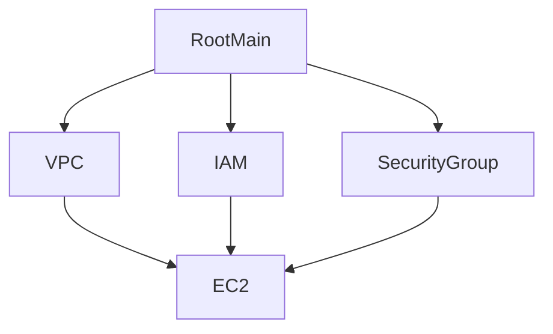
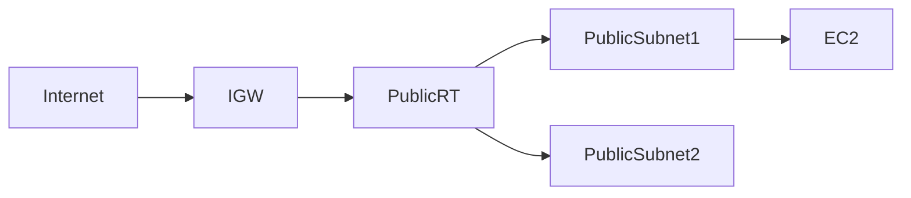

# OpenHelp Terraform Repository Deep Analysis

## Repository Tree
```
.terraform.lock.hcl
main.tf
outputs.tf
providers.tf
README.md
terraform.tfvars.example
variables.tf
versions.tf
docs/OpenHelp_Terraform_Modular_AWS_Jumphost_Guide.md
modules/ec2-jumphost/main.tf
modules/ec2-jumphost/outputs.tf
modules/ec2-jumphost/variables.tf
modules/iam/main.tf
modules/iam/outputs.tf
modules/iam/variables.tf
modules/security-group/main.tf
modules/security-group/outputs.tf
modules/security-group/variables.tf
modules/vpc/main.tf
modules/vpc/outputs.tf
modules/vpc/variables.tf
scripts/install-tools.sh
scripts/kubernetes-tools.sh
```

## File: versions.tf

Purpose and execution details for versions.tf.

```hcl
terraform {
  required_version = ">= 1.6.3"

  required_providers {
    aws = {
      source  = "hashicorp/aws"
      version = ">= 5.25.0"
    }
  }

  backend "s3" {
    bucket = "openhelpbucket2"
    key    = "ec2/terraform.tfstate"
    region = "us-east-1"
  }
}

```

## File: providers.tf

Purpose and execution details for providers.tf.

```hcl
provider "aws" {
  region = var.region
}

```

## File: variables.tf

Purpose and execution details for variables.tf.

```hcl
variable "region" {
  description = "AWS region"
  type        = string
  default     = "us-east-1"
}

variable "project_name" {
  description = "Project name used for resource naming and tags"
  type        = string
  default     = "openhelp-jumphost"
}

variable "vpc_cidr" {
  description = "CIDR block for VPC"
  type        = string
  default     = "10.0.0.0/16"
}

variable "public_subnet_1_cidr" {
  description = "CIDR block for public subnet 1"
  type        = string
  default     = "10.0.1.0/24"
}

variable "public_subnet_2_cidr" {
  description = "CIDR block for public subnet 2"
  type        = string
  default     = "10.0.0.0/24"
}

variable "private_subnet_1_cidr" {
  description = "CIDR block for private subnet 1"
  type        = string
  default     = "10.0.2.0/24"
}

variable "private_subnet_2_cidr" {
  description = "CIDR block for private subnet 2"
  type        = string
  default     = "10.0.3.0/24"
}

variable "availability_zone_1" {
  description = "First availability zone"
  type        = string
  default     = "us-east-1a"
}

variable "availability_zone_2" {
  description = "Second availability zone"
  type        = string
  default     = "us-east-1b"
}

variable "allowed_ports" {
  description = "Inbound ports allowed to the jumphost"
  type        = list(number)
  default     = [22, 80, 443, 8080, 9000, 9090, 3306]
}

variable "allowed_cidr" {
  description = "CIDR allowed to access jumphost ports"
  type        = string
  default     = "217.119.64.63/32"
}

variable "iam_role_name" {
  description = "IAM role name for EC2 jumphost"
  type        = string
  default     = "openhelp-jumphost-iam-role"
}

variable "iam_instance_profile_name" {
  description = "IAM instance profile name for EC2 jumphost"
  type        = string
  default     = "openhelp-jumphost-profile"
}

variable "ami_id" {
  description = "AMI ID for EC2 jumphost"
  type        = string
  default     = "ami-0152204c1a187337c"
}

variable "instance_type" {
  description = "EC2 instance type"
  type        = string
  default     = "t3.small"
}

variable "key_name" {
  description = "Existing EC2 key pair name"
  type        = string
  default     = "openhelp-key"
}

variable "instance_name" {
  description = "EC2 jumphost instance name"
  type        = string
  default     = "openhelp-jumphost-server"
}

variable "root_volume_size" {
  description = "Root EBS volume size in GB"
  type        = number
  default     = 30
}

```

## File: main.tf

Purpose and execution details for main.tf.

```hcl
module "vpc" {
  source = "./modules/vpc"

  project_name          = var.project_name
  vpc_cidr              = var.vpc_cidr
  public_subnet_1_cidr  = var.public_subnet_1_cidr
  public_subnet_2_cidr  = var.public_subnet_2_cidr
  private_subnet_1_cidr = var.private_subnet_1_cidr
  private_subnet_2_cidr = var.private_subnet_2_cidr
  availability_zone_1   = var.availability_zone_1
  availability_zone_2   = var.availability_zone_2
}

module "security_group" {
  source = "./modules/security-group"

  project_name  = var.project_name
  vpc_id        = module.vpc.vpc_id
  allowed_ports = var.allowed_ports
  allowed_cidr  = var.allowed_cidr
}

module "iam" {
  source = "./modules/iam"

  iam_role_name             = var.iam_role_name
  iam_instance_profile_name = var.iam_instance_profile_name
}

module "ec2_jumphost" {
  source = "./modules/ec2-jumphost"

  instance_name        = var.instance_name
  ami_id               = var.ami_id
  instance_type        = var.instance_type
  key_name             = var.key_name
  subnet_id            = module.vpc.public_subnet_1_id
  security_group_ids   = [module.security_group.security_group_id]
  iam_instance_profile = module.iam.instance_profile_name
  root_volume_size     = var.root_volume_size
  user_data_file       = "${path.module}/scripts/install-tools.sh"
}

```

## File: outputs.tf

Purpose and execution details for outputs.tf.

```hcl
output "region" {
  description = "AWS region"
  value       = var.region
}

output "vpc_id" {
  description = "VPC ID"
  value       = module.vpc.vpc_id
}

output "public_subnet_1_id" {
  description = "Public subnet 1 ID"
  value       = module.vpc.public_subnet_1_id
}

output "public_subnet_2_id" {
  description = "Public subnet 2 ID"
  value       = module.vpc.public_subnet_2_id
}

output "private_subnet_1_id" {
  description = "Private subnet 1 ID"
  value       = module.vpc.private_subnet_1_id
}

output "private_subnet_2_id" {
  description = "Private subnet 2 ID"
  value       = module.vpc.private_subnet_2_id
}

output "security_group_id" {
  description = "Jumphost security group ID"
  value       = module.security_group.security_group_id
}

output "iam_role_name" {
  description = "IAM role name"
  value       = module.iam.iam_role_name
}

output "instance_id" {
  description = "EC2 jumphost instance ID"
  value       = module.ec2_jumphost.instance_id
}

output "jumphost_public_ip" {
  description = "Public IP address of the EC2 jumphost"
  value       = module.ec2_jumphost.public_ip
}

```


## Module Dependency Architecture



## Resource Execution Order

1. Provider initialization
2. Backend initialization
3. Variable loading
4. VPC creation
5. Subnets creation
6. Route tables
7. IAM role
8. IAM instance profile
9. Security group
10. EC2 instance
11. Cloud-init
12. Tool installation

## Network Architecture


