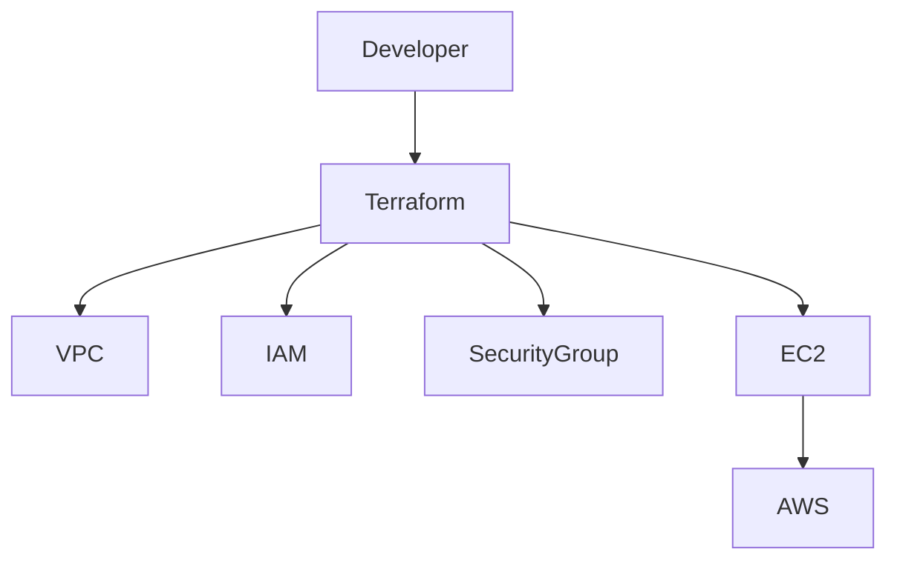
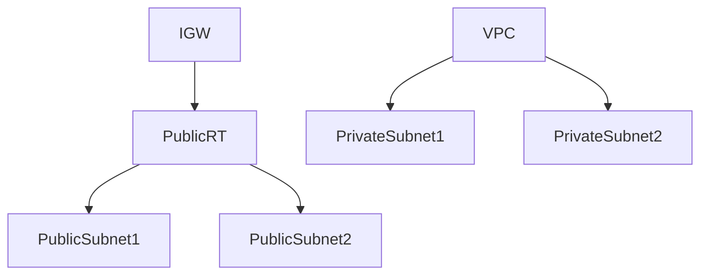
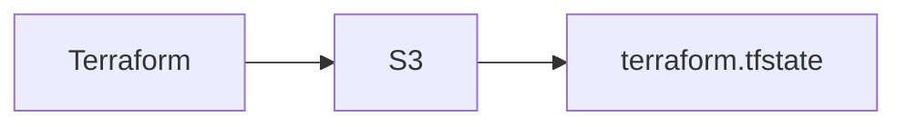
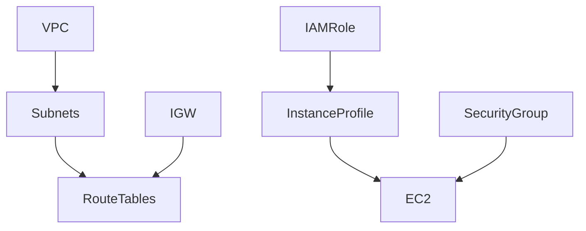

# OpenHelp Terraform Modular AWS Infrastructure
## Enterprise Architecture & Deep Dive Guide

# Table of Contents
1. Introduction
2. Project Overview
3. Infrastructure Architecture
4. Terraform Execution Flow
5. Root Module Files
6. VPC Module Deep Dive
7. IAM Module Deep Dive
8. Security Group Module Deep Dive
9. EC2 Jumphost Module Deep Dive
10. User Data Execution Flow
11. Backend State Architecture
12. Network Packet Flow
13. Dependency Graph
14. Terraform Lifecycle
15. Deployment Walkthrough
16. Outputs Explanation
17. Troubleshooting
18. Best Practices
19. Interview Questions
20. Production Enhancements

---

# 1. Introduction

This document explains the complete OpenHelp modular Terraform project used to deploy AWS infrastructure.

Goals:

- Reusable modules
- Standard architecture
- Remote state
- Automated provisioning
- DevOps tooling

---

# 2. Project Overview

Project Tree

```text
openhelp-terraform-modular-aws-jumphost/
├── versions.tf
├── providers.tf
├── main.tf
├── variables.tf
├── outputs.tf
├── terraform.tfvars
├── modules/
│   ├── vpc/
│   ├── iam/
│   ├── security-group/
│   └── ec2-jumphost/
└── scripts/
    └── install-tools.sh
```

---

# 3. High Level Architecture


---

# 4. Terraform Execution Flow

```text
terraform init
terraform validate
terraform plan
terraform apply
terraform output
```

Detailed Order:

1. Backend initialized
2. Providers downloaded
3. Variables loaded
4. VPC created
5. IAM created
6. Security Group created
7. EC2 created
8. User Data executed

---

# 5. Root Module Files

## versions.tf

Purpose:

- Terraform version control
- Provider version control
- Backend configuration

## providers.tf

Purpose:

Creates AWS provider session.

## variables.tf

Purpose:

Stores configurable values.

Examples:

- Region
- CIDR
- AMI
- Instance type

## outputs.tf

Displays:

- VPC ID
- Subnet IDs
- Instance ID
- Public IP

---

# 6. VPC Module Deep Dive

Resources:

- VPC
- Internet Gateway
- Public Subnet 1
- Public Subnet 2
- Private Subnet 1
- Private Subnet 2
- Route Tables

Architecture:



CIDR Layout:

```text
10.0.0.0/16
├── 10.0.1.0/24
├── 10.0.0.0/24
├── 10.0.2.0/24
└── 10.0.3.0/24
```

---

# 7. IAM Module Deep Dive

Creates:

- IAM Role
- IAM Instance Profile
- Policy Attachments

Flow:

```text
EC2
 |
IAM Instance Profile
 |
IAM Role
 |
AWS APIs
```

Policies:

- EKS
- EC2
- CloudFormation
- IAM

---

# 8. Security Group Module

Allowed Ports

| Port | Purpose |
|--------|----------|
|22|SSH|
|80|HTTP|
|443|HTTPS|
|8080|Jenkins|
|9000|SonarQube|
|9090|Prometheus|
|3306|MySQL|

---

# 9. EC2 Module

Creates:

- EC2
- EBS
- IAM Profile attachment
- User data execution

Boot Sequence

```text
Launch EC2
→ Cloud Init
→ User Data
→ Install Tools
```

---

# 10. User Data Script

Installation Order

1. OS Updates
2. Java
3. Jenkins
4. Terraform
5. Docker
6. Kubectl
7. Helm
8. AWS CLI
9. SonarQube
10. Trivy

---

# 11. Backend Architecture



Benefits:

- Shared state
- Team collaboration
- Recovery

---

# 12. Network Packet Flow

SSH Flow

```text
Admin PC
  |
Internet
  |
IGW
  |
Public Subnet
  |
EC2
```

---

# 13. Dependency Graph

```text
VPC
 |
 +--> Subnets
 |
 +--> Route Tables

IAM
 |
 +--> Instance Profile

Security Group

All Above
 |
 EC2
```

---

# 14. Terraform Lifecycle

## Init

Downloads providers.

## Validate

Validates syntax.

## Plan

Build execution plan.

## Apply

Creates infrastructure.

## Destroy

Deletes infrastructure.

---

# 15. Deployment Walkthrough

```bash
terraform init
terraform validate
terraform plan
terraform apply
```

Expected Outputs:

```text
instance_id
public_ip
vpc_id
subnet_ids
```

---

# 16. Outputs Explanation

VPC ID:
Used by dependent modules.

Subnet IDs:
Used by EC2.

Instance ID:
Used for management.

Public IP:
Used for SSH.

---

# 17. Troubleshooting

Terraform Not Found

```bash
terraform -version
```

AWS Credentials

```bash
aws sts get-caller-identity
```

State Lock Issues

```bash
terraform force-unlock LOCK_ID
```

---

# 18. Best Practices

- Use modules
- Use remote backend
- Avoid hardcoding
- Use least privilege IAM
- Use private subnets

---

# 19. Interview Questions

### What is a Terraform module?

Reusable Terraform code.

### Why remote state?

Team collaboration.

### Why IAM role instead of access key?

Improved security.

### Why public and private subnets?

Security segregation.

### What is cloud-init?

Bootstrap engine for EC2.

### What is user-data?

Startup automation script.

---

# 20. Production Enhancements

Add:

- NAT Gateway
- EKS Cluster
- ALB
- Route53
- ACM
- ArgoCD
- Prometheus
- Grafana
- Velero
- WAF
- GuardDuty

---

# Appendix A - Complete Execution Timeline

```text
terraform init
    |
Provider Download
    |
Backend Initialization
    |
terraform plan
    |
Dependency Resolution
    |
terraform apply
    |
VPC
    |
Subnets
    |
IAM
    |
Security Groups
    |
EC2
    |
Cloud Init
    |
Install Tools
```

---

# Appendix B - AWS Resource Relationships



---

# Appendix C - Enterprise Standards

Naming:

openhelp-vpc
openhelp-sg
openhelp-jumphost

Tagging:

Environment=Dev
Owner=OpenHelp
Terraform=True

Cost Allocation:

Mandatory tagging for billing visibility.
