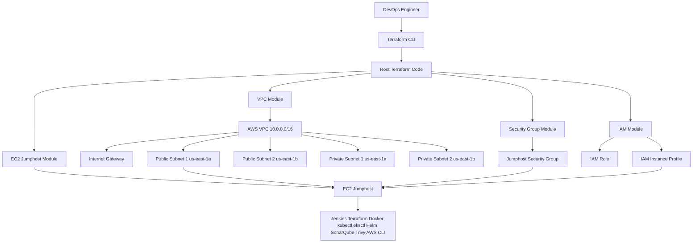
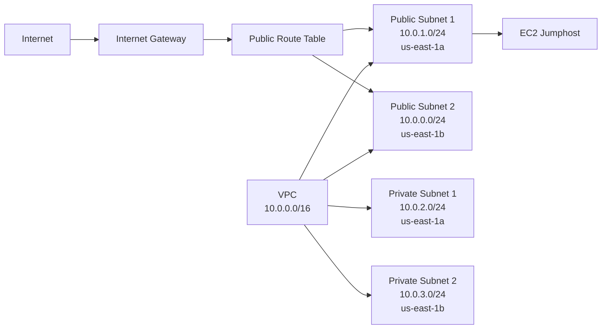
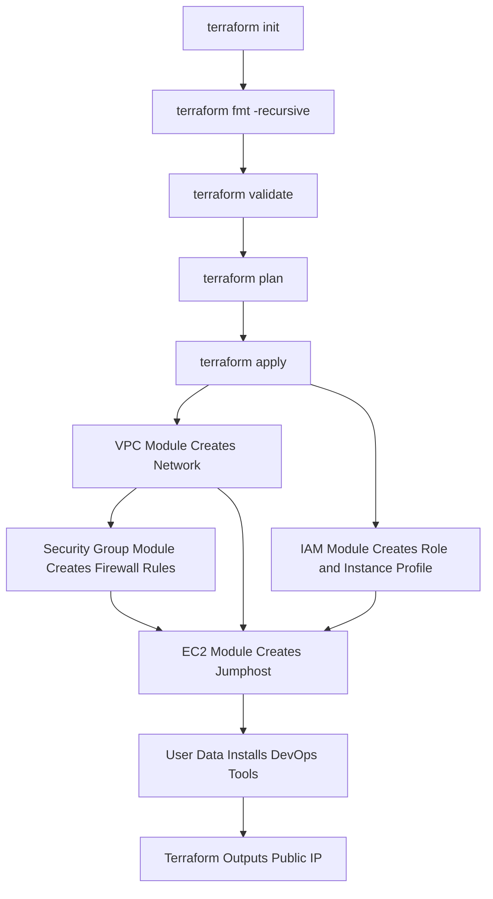

# OpenHelp AWS Jumphost Infrastructure using Terraform Modules

## 1. Project Overview

This document converts your original Terraform EC2 jumphost setup into a reusable module-based Terraform project.

Your uploaded code included VPC, public/private subnets, internet gateway, route tables, security group, IAM role, IAM policy attachments, instance profile, EC2 jumphost, backend S3 state, and bootstrap scripts for DevOps tools. This modular version keeps the same purpose but makes the code cleaner and reusable. The source file showed the original structure and resources such as `iam-instance-profile.tf`, `iam-policy.tf`, `iam-role.tf`, `jumphost.tf`, `terraform.tf`, `variables.tf`, and `vpc.tf`. 

## 2. What This Project Creates

| Component | Purpose |
|---|---|
| VPC | Isolated AWS network |
| Internet Gateway | Internet access for public subnets |
| Public Subnets | Subnets for public-facing EC2 jumphost |
| Private Subnets | Subnets reserved for private workloads |
| Route Tables | Routing for public and private subnets |
| Security Group | Allows SSH, Jenkins, SonarQube, Prometheus, HTTP, HTTPS, and MySQL |
| IAM Role | Allows EC2 to access required AWS services |
| IAM Instance Profile | Attaches IAM role to EC2 |
| EC2 Jumphost | DevOps server with bootstrap tools |

---

## 3. Recommended Folder Structure

```text
openhelp-terraform-modular-aws-jumphost/
├── main.tf
├── outputs.tf
├── providers.tf
├── README.md
├── terraform.tfvars.example
├── variables.tf
├── versions.tf
├── docs/
│   └── OpenHelp_Terraform_Modular_AWS_Jumphost_Guide.md
├── modules/
│   ├── ec2-jumphost/
│   │   ├── main.tf
│   │   ├── outputs.tf
│   │   └── variables.tf
│   ├── iam/
│   │   ├── main.tf
│   │   ├── outputs.tf
│   │   └── variables.tf
│   ├── security-group/
│   │   ├── main.tf
│   │   ├── outputs.tf
│   │   └── variables.tf
│   └── vpc/
│       ├── main.tf
│       ├── outputs.tf
│       └── variables.tf
└── scripts/
    ├── install-tools.sh
    └── kubernetes-tools.sh
```

---

## 4. High-Level Architecture Diagram



---

## 5. Network Architecture Diagram



---

## 6. Terraform Execution Flow



---

## 7. Root Module Code

### 7.1 `versions.tf`

```hcl
terraform {
  required_version = ">= 1.6.3"

  required_providers {
    aws = {
      source  = "hashicorp/aws"
      version = ">= 5.25.0"
    }
  }

  backend "s3" {
    bucket = "openhelpbucket2"
    key    = "ec2/terraform.tfstate"
    region = "us-east-1"
  }
}
```

### 7.2 `providers.tf`

```hcl
provider "aws" {
  region = var.region
}
```

### 7.3 `main.tf`

```hcl
module "vpc" {
  source = "./modules/vpc"

  project_name          = var.project_name
  vpc_cidr              = var.vpc_cidr
  public_subnet_1_cidr  = var.public_subnet_1_cidr
  public_subnet_2_cidr  = var.public_subnet_2_cidr
  private_subnet_1_cidr = var.private_subnet_1_cidr
  private_subnet_2_cidr = var.private_subnet_2_cidr
  availability_zone_1   = var.availability_zone_1
  availability_zone_2   = var.availability_zone_2
}

module "security_group" {
  source = "./modules/security-group"

  project_name  = var.project_name
  vpc_id        = module.vpc.vpc_id
  allowed_ports = var.allowed_ports
  allowed_cidr  = var.allowed_cidr
}

module "iam" {
  source = "./modules/iam"

  iam_role_name             = var.iam_role_name
  iam_instance_profile_name = var.iam_instance_profile_name
}

module "ec2_jumphost" {
  source = "./modules/ec2-jumphost"

  instance_name        = var.instance_name
  ami_id               = var.ami_id
  instance_type        = var.instance_type
  key_name             = var.key_name
  subnet_id            = module.vpc.public_subnet_1_id
  security_group_ids   = [module.security_group.security_group_id]
  iam_instance_profile = module.iam.instance_profile_name
  root_volume_size     = var.root_volume_size
  user_data_file       = "${path.module}/scripts/install-tools.sh"
}
```

---

## 8. Module Details

### 8.1 VPC Module

Path:

```text
modules/vpc/
```

Creates:

- VPC
- Internet Gateway
- 2 public subnets
- 2 private subnets
- Public route table
- Private route table
- Route table associations

### 8.2 Security Group Module

Path:

```text
modules/security-group/
```

Allowed inbound ports:

| Port | Usage |
|---|---|
| 22 | SSH |
| 80 | HTTP |
| 443 | HTTPS |
| 8080 | Jenkins |
| 9000 | SonarQube |
| 9090 | Prometheus |
| 3306 | MySQL/MariaDB |

### 8.3 IAM Module

Path:

```text
modules/iam/
```

Creates:

- IAM role for EC2
- IAM instance profile
- EKS custom policy
- Required AWS managed policy attachments

Note:-

Create key pair from:-

Method 1: AWS Console (Recommended for Beginners)

Login to AWS Console:

AWS Console EC2

Steps
Open EC2
Left Menu → Network & Security
Click Key Pairs
Click Create Key Pair

Fill:

Name: openhelp-key
Key Pair Type: RSA
Private Key Format: .pem


List the ami image id as well


PS C:\Users\sreej\Desktop\sreejith_devops\Microservices-E-Commerce-eks-project\openhelp-terraform-modular-aws-jumphost> aws ssm get-parameters --names /aws/service/ami-amazon-linux-latest/al2023-ami-kernel-default-x86_64 --query "Parameters[0].Value" --output text
ami-0152204c1a187337c                                                                                                                                                                                                                                                                                                                                                                      

use the correct bucket


PS C:\Users\sreej\Desktop\sreejith_devops\Microservices-E-Commerce-eks-project\openhelp-terraform-modular-aws-jumphost> aws s3 ls                                                                                                                                       
2026-06-10 08:38:36 openhelpbucket1
2026-06-10 08:38:36 openhelpbucket2


variable "allowed_cidr" {
  description = "CIDR allowed to access jumphost ports"
  type        = string
  default     = "0.0.0.0/0"
}


variable "allowed_cidr" {
  description = "CIDR allowed to access jumphost ports"
  type        = string
  default     = "217.119.64.63/32"
}

Replace ip with your public ip you get from whatismyip.com
217.119.64.63


> `AdministratorAccess` is intentionally removed from this standard module. Add it only in temporary labs if needed.

### 8.4 EC2 Jumphost Module

Path:

```text
modules/ec2-jumphost/
```

Creates:

- EC2 instance
- 30 GB root volume
- IAM instance profile attachment
- Security group attachment
- User data script execution

---

## 9. Execution Commands

### Step 1: Copy example variables

```bash
cp terraform.tfvars.example terraform.tfvars
```

### Step 2: Edit values

```bash
vi terraform.tfvars
```

### Step 3: Initialize Terraform

```bash
terraform init
```

Expected output:

```text
Terraform has been successfully initialized!
```

### Step 4: Format code

```bash
terraform fmt -recursive
```

### Step 5: Validate code

```bash
terraform validate
```

Expected output:

```text
Success! The configuration is valid.
```

### Step 6: Preview plan

```bash
terraform plan
```

Expected output:

```text
Plan: 20+ to add, 0 to change, 0 to destroy.
```

### Step 7: Apply

```bash
terraform apply
```

Type:

```text
yes
```

Or:

```bash
terraform apply -auto-approve
```

---

## 10. Expected Outputs

```bash
terraform output
```

Example:

```text
region = "us-east-1"
vpc_id = "vpc-xxxxxxxx"
public_subnet_1_id = "subnet-xxxxxxxx"
public_subnet_2_id = "subnet-yyyyyyyy"
private_subnet_1_id = "subnet-aaaaaaaa"
private_subnet_2_id = "subnet-bbbbbbbb"
security_group_id = "sg-xxxxxxxx"
iam_role_name = "openhelp-jumphost-iam-role"
instance_id = "i-xxxxxxxx"
jumphost_public_ip = "44.xx.xx.xx"
```

---

## 11. SSH to Jumphost

```bash
ssh -i your-key.pem ec2-user@<jumphost_public_ip>
```

Example:

```bash
ssh -i us-east-1.pem ec2-user@44.xx.xx.xx
```

---

## 12. Verify Installed Tools on Jumphost

```bash
terraform -v
aws --version
git --version
docker --version
kubectl version --client
eksctl version
helm version
java -version
mvn -v
ansible --version
```

---

## 13. Destroy Infrastructure

```bash
terraform destroy
```

Type:

```text
yes
```

Or:

```bash
terraform destroy -auto-approve
```

---

## 14. Important Best Practices

### Use modules

Modules make infrastructure clean, reusable, and easy to maintain.

### Use variables

Avoid hardcoded values for region, subnet CIDRs, AMI ID, instance type, and key pair.

### Restrict SSH in production

Current lab value:

```hcl
allowed_cidr = "0.0.0.0/0"
```

Production recommendation:

```hcl
allowed_cidr = "YOUR_PUBLIC_IP/32"
```

### Avoid AdministratorAccess

Your original code attached AdministratorAccess for testing. This standard module removes it by default.

### S3 backend bucket must already exist

This backend uses:

```hcl
bucket = "openhelpbucket2"
key    = "ec2/terraform.tfstate"
region = "us-east-1"
```

Create the backend bucket before running:

```bash
terraform init
```

---

## 15. Interview-Oriented Explanation

### What is a Terraform module?

A Terraform module is a reusable group of Terraform files. It helps split infrastructure into logical blocks such as VPC, IAM, Security Group, and EC2.

### Why use modules?

Modules make code:

- Reusable
- Easy to understand
- Easy to test
- Easy to maintain
- Suitable for real DevOps projects

### What is a jumphost?

A jumphost is a server used to securely access and manage infrastructure.

### Why attach IAM role to EC2?

IAM role allows EC2 to access AWS services without storing access keys on the server.

### Why use user data?

User data runs commands automatically during EC2 startup. It is useful for installing tools and bootstrapping servers.
