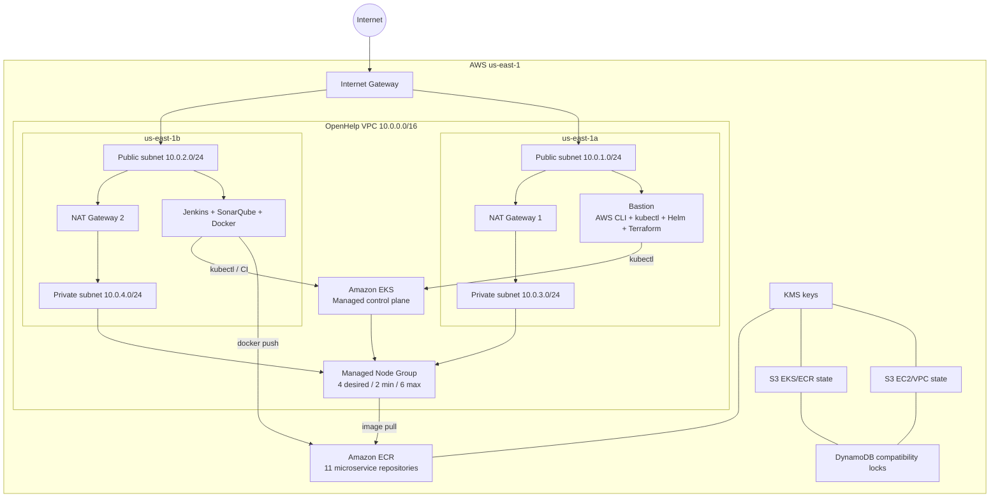
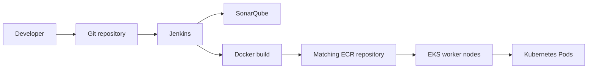

# OpenHelp AWS EKS Microservices Terraform Bundle

This bundle keeps the **OpenHelp Day5 architecture** and changes the application registry layer from one generic ECR repository to **11 ECR repositories** required by the microservices e-commerce application.

## What this creates

- 1 VPC: `10.0.0.0/16`
- 2 public subnets: `10.0.1.0/24`, `10.0.2.0/24`
- 2 private subnets: `10.0.3.0/24`, `10.0.4.0/24`
- 1 Internet Gateway
- 2 NAT Gateways, one per AZ
- 1 public bastion EC2
- 1 public Jenkins + SonarQube EC2
- 1 Amazon EKS cluster
- EKS managed node group: desired 4, minimum 2, maximum 6
- EKS worker nodes only in private subnets
- 2 encrypted/versioned S3 Terraform-state buckets
- native S3 lockfiles plus 2 DynamoDB compatibility lock tables
- KMS encryption for state, Kubernetes secrets, and ECR
- **11 private ECR repositories**

## The 11 ECR repositories

1. `emailservice`
2. `checkoutservice`
3. `recommendationservice`
4. `frontend`
5. `paymentservice`
6. `productcatalogservice`
7. `cartservice`
8. `loadgenerator`
9. `currencyservice`
10. `shippingservice`
11. `adservice`

These names deliberately match the microservices project so service Jenkins jobs can push directly to the corresponding repository.

## Architecture



## Repository structure

```text
openhelp-eks-microservices-terraform/
├── README.md
├── .gitignore
├── bootstrap-state/
│   ├── versions.tf
│   ├── variables.tf
│   ├── main.tf
│   ├── outputs.tf
│   └── terraform.tfvars
├── ec2-infra/
│   ├── backend.tf
│   ├── versions.tf
│   ├── variables.tf
│   ├── network.tf
│   ├── security.tf
│   ├── iam.tf
│   ├── instances.tf
│   ├── outputs.tf
│   └── terraform.tfvars
└── eks-infra/
    ├── backend.tf
    ├── versions.tf
    ├── variables.tf
    ├── data.tf
    ├── iam.tf
    ├── eks.tf
    ├── ecr.tf
    ├── outputs.tf
    └── terraform.tfvars
```

## Important design decision

There is **no separate `ecr-terraform/` folder** in this bundle. ECR belongs to `eks-infra` and uses the existing EKS/ECR Terraform state. This preserves the OpenHelp architecture and removes the second repository's standalone ECR backend/code.

The only behavior taken from the other microservices project is the requirement for the same 11 repository names. The actual ECR implementation is OpenHelp-style: KMS encryption, immutable tags, scan-on-push, lifecycle cleanup, and production-safe deletion.

## Prerequisites

Install locally before starting:

```bash
terraform version
aws --version
```

Configure AWS authentication using an IAM role, IAM Identity Center, or another secure credential method. Avoid committing AWS keys.

Check identity:

```bash
aws sts get-caller-identity
```

Get your account ID:

```bash
aws sts get-caller-identity --query Account --output text
```

## Step 1 — Replace account-specific values

Search the bundle for:

```text
123456789012
83.24.100.50/32
ami-REPLACE_ME
openhelp-key
```

```bash
PS C:\Users\sreej\Desktop\sreejith_devops> aws ec2 describe-images --owners 099720109477 --filters "Name=name,Values=ubuntu/images/hvm-ssd-gp3/ubuntu-noble-24.04-amd64-server-*" "Name=state,Values=available" --query 'Images | sort_by(@,&CreationDate)[-1].[ImageId,Name]' --output table --region us-east-1
------------------------------------------------------------------------                                                                                                                                                                                                                                                                                                                                                                           
|                            DescribeImages                            |
+----------------------------------------------------------------------+
|  ami-052355af2a014bd2c                                               |
|  ubuntu/images/hvm-ssd-gp3/ubuntu-noble-24.04-amd64-server-20260714  |
+----------------------------------------------------------------------+
```

delete and create new key

```bash
PS C:\Users\sreej\Desktop\sreejith_devops> aws ec2 delete-key-pair --region us-east-1 --key-name openhelp-key; Remove-Item -Force openhelp-key.pem -ErrorAction SilentlyContinue; aws ec2 create-key-pair --region us-east-1 --key-name openhelp-key --key-type rsa --key-format pem --query KeyMaterial --output text | Out-File -Encoding ascii openhelp-key.pem
{                                                                                                                                                                                                                                                                                                                                                                                                                                                  
    "Return": true,
    "KeyPairId": "key-0a8784646cce3c7a5"
}
```

Get free tier instance list

```bash
PS C:\Users\sreej\Desktop\sreejith_devops\openhelp-eks-microservices-terraform\ec2-infra> aws ec2 describe-instance-types --region us-east-1 --filters "Name=free-tier-eligible,Values=true" --query "InstanceTypes[].InstanceType" --output table
-----------------------                                                                                                                                                                                                                                                                                                                                                                                                                            
|DescribeInstanceTypes|
+---------------------+
|  c7i-flex.large     |
|  t3.micro           |
|  t4g.small          |
|  t4g.micro          |
|  t3.small           |
|  m7i-flex.large     |
+---------------------+

```


Update them with:

- your AWS account ID
- your current public IPv4 address followed by `/32`
- a valid Ubuntu 24.04 AMI for `us-east-1`
- your EC2 key-pair name

For Linux/macOS you can find placeholders with:

```bash
grep -R "123456789012\|83.24.100.50/32\|ami-REPLACE_ME" -n .
```


## Step 3 — Bootstrap Terraform state

```bash
cd bootstrap-state
terraform init
terraform fmt -recursive
terraform validate
terraform plan
terraform apply
terraform output
```

This creates the two state buckets, their KMS keys, and DynamoDB compatibility lock tables.

## Step 4 — Update backend files

Before initializing `ec2-infra` and `eks-infra`, confirm the account ID embedded in these files matches the bucket names created in Step 3:

```text
ec2-infra/backend.tf
eks-infra/backend.tf
eks-infra/terraform.tfvars
```

Backend blocks cannot use normal Terraform variables, so these values are explicit.

## Step 5 — Deploy VPC, bastion, Jenkins and SonarQube

```bash
cd ../ec2-infra
terraform init
terraform fmt -recursive
terraform validate
terraform plan
terraform apply
terraform output
```

Expected important outputs include:

```text
bastion_public_ip
tools_public_ip
private_subnet_ids
bastion_role_arn
tools_role_arn
jenkins_url
sonarqube_url
```

## Step 6 — Verify the tools hosts

Bastion:

```bash
ssh -i openhelp-key.pem ubuntu@BASTION_PUBLIC_IP
aws --version
kubectl version --client
helm version
terraform version
aws sts get-caller-identity
```

Jenkins/SonarQube host:

```bash
ssh -i openhelp-key.pem ubuntu@TOOLS_PUBLIC_IP
sudo cloud-init status --wait
sudo systemctl status jenkins --no-pager
sudo docker ps
sudo cat /var/lib/jenkins/secrets/initialAdminPassword
```

Open only from your allowed CIDR:

```text
http://TOOLS_PUBLIC_IP:8080
http://TOOLS_PUBLIC_IP:9000
```

## Step 7 — Deploy EKS + all 11 ECR repositories

```bash
cd ../eks-infra
terraform init
terraform fmt -recursive
terraform validate
terraform plan
terraform apply
terraform output
```

This one apply creates the EKS cluster **and the 11 ECR repositories** because ECR is part of the EKS/application-delivery Terraform layer.

## Step 8 — Verify EKS

From the bastion:

```bash
aws eks update-kubeconfig   --region us-east-1   --name openhelp-prod-eks

kubectl cluster-info
kubectl get nodes -o wide
kubectl get pods -A
```

Normal desired state is 4 Ready worker nodes with private VPC addresses.

## Step 9 — Verify the 11 ECR repositories

```bash
aws ecr describe-repositories   --region us-east-1   --query 'repositories[].repositoryName'   --output table
```

Or from Terraform:

```bash
terraform output ecr_repository_names
terraform output ecr_repository_urls
```

Expected names are the 11 services listed above.

## Step 10 — How Jenkins pushes a service image

Example for `adservice`:

```bash
AWS_ACCOUNT_ID=$(aws sts get-caller-identity --query Account --output text)
AWS_REGION=us-east-1
SERVICE=adservice
IMAGE_TAG=${BUILD_NUMBER:-v1}
ECR_URI=${AWS_ACCOUNT_ID}.dkr.ecr.${AWS_REGION}.amazonaws.com/${SERVICE}

aws ecr get-login-password --region ${AWS_REGION}   | docker login --username AWS --password-stdin     ${AWS_ACCOUNT_ID}.dkr.ecr.${AWS_REGION}.amazonaws.com

docker build -t ${ECR_URI}:${IMAGE_TAG} .
docker push ${ECR_URI}:${IMAGE_TAG}
```

For another service, change only:

```bash
SERVICE=frontend
```

or `checkoutservice`, `cartservice`, etc.

## Why `microservice_names` is defined in Terraform

`microservice_names` is a reusable set containing the 11 names. `for_each` loops over that set:

```hcl
resource "aws_ecr_repository" "services" {
  for_each = var.microservice_names
  name     = each.value
}
```

Terraform therefore creates one repository per service without duplicating the resource block 11 times.

## ECR security behavior

Every repository gets:

```text
Private repository
KMS encryption
Immutable image tags
Scan on push
14-day cleanup of untagged images
force_delete = false by default
```

`force_delete = false` is deliberate for production: Terraform will not silently remove a repository containing images. Set `ecr_force_delete = true` only for a disposable lab when you explicitly want easier destruction.

## Jenkins IAM behavior

The Jenkins/tools EC2 instance uses an IAM instance profile. No static AWS keys are required on the instance. Its inline policy allows:

- `eks:DescribeCluster` for the OpenHelp EKS cluster
- ECR login
- push/pull operations against the 11 named repositories

The EKS access-entry configuration separately grants the tools role Kubernetes access to the cluster.

## EKS worker IAM behavior

The worker-node role has:

- `AmazonEKSWorkerNodePolicy`
- `AmazonEKS_CNI_Policy`
- `AmazonEC2ContainerRegistryReadOnly`

This allows nodes to join the cluster, use VPC networking, and pull private images from ECR.

## Deployment flow after infrastructure exists



For example:

```text
adservice source
  -> Jenkins
  -> Docker image adservice:25
  -> <account>.dkr.ecr.us-east-1.amazonaws.com/adservice:25
  -> EKS Deployment
  -> Pod pulls adservice:25
```

## Destroy order

Destroy the dependency layers in reverse order:

```bash
cd eks-infra
terraform destroy

cd ../ec2-infra
terraform destroy
```

The bootstrap state resources intentionally use `prevent_destroy = true`. Do not delete state buckets until the managed infrastructure is gone and you have backed up/migrated state.

Because ECR defaults to `ecr_force_delete = false`, `terraform destroy` will stop if repositories still contain images. That is a safety feature. For a disposable lab, either empty the repositories first or explicitly set `ecr_force_delete = true`, apply that change, and then destroy.

## What was removed from the second repository

Do **not** copy these from the other project:

```text
ecr-terraform/backend.tf
ecr-terraform/ecr-repo-main.tf
ecr-terraform/ecr-jenkinfile
```

They are not needed in this architecture. Your OpenHelp Terraform controls ECR from `eks-infra/ecr.tf` and keeps EKS/ECR in the same remote state.

## Final creation order

```text
1. bootstrap-state
      |
      v
2. ec2-infra
   VPC + subnets + NAT + bastion + Jenkins/SonarQube + IAM
      |
      v
3. eks-infra
   EKS + worker nodes + access entries + add-ons + 11 ECR repositories
      |
      v
4. Jenkins service pipelines
   build -> scan/test -> docker push -> deployment/GitOps
```

## Cleanup cluster


Yes. For this bundle, destroy in the reverse order of creation:

eks-infra
ec2-infra
bootstrap-state last

Your README explicitly uses this reverse dependency order.

1. Destroy EKS + 11 ECR repositories

Go to:

openhelp-eks-microservices-terraform/eks-infra

Run:

terraform init

terraform plan -destroy

terraform destroy

Type:

yes

This removes the EKS cluster, managed node group, EKS IAM/access resources, add-ons, KMS/ECR resources, and the 11 ECR repositories that belong to this Terraform state. Your bundle creates EKS and all 11 ECR repositories together from eks-infra.

2
Your current configuration deliberately has:

ecr_force_delete = false

Therefore, if any ECR repository contains Docker images, Terraform may fail to delete that repository. The README calls this a production safety feature.

If this is only a lab and you want to delete everything, edit:

eks-infra/terraform.tfvars

and set:

ecr_force_delete = true

Then run:

terraform apply

After that:

terraform destroy


3. Destroy VPC + EC2 infrastructure

Now:

cd ../ec2-infra

Run:

terraform init

terraform plan -destroy

terraform destroy

Type:

yes

