# One AWS VPC with two public subnets, two private subnets, one NAT gateway, and two EC2 instances

**A 100-step Terraform beginner reference · checked against AWS and HashiCorp documentation on 29 September 2026**

> **The requested design uses ONE VPC.** “Public network” and “private network” here mean subnets and their routes inside the same VPC, not separate VPCs. The examples use `us-east-1`; you may change the Region in one variable. Commands are written for Bash in Linux, macOS, Git Bash, or WSL. A short PowerShell mapping appears below. IDs and outputs in this document are *illustrative*, never values to paste back into your account.

## 0. Architecture: see the destination before starting

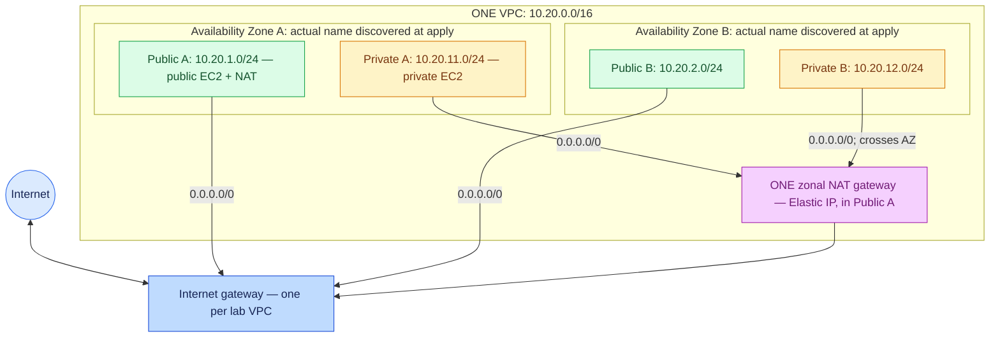

| Item | Final result | Why it exists |
| --- | --- | --- |
| VPC | One custom VPC, `10.20.0.0/16` | Isolates this lab's IPv4 address space. |
| Availability Zones | First two available AZs reported by AWS | Place subnets in separate failure domains. AZ *names* may map differently across accounts. |
| Public A / B | `10.20.1.0/24`, `10.20.2.0/24` | Both use a route to the internet gateway. |
| Private A / B | `10.20.11.0/24`, `10.20.12.0/24` | Both use a route to the same NAT gateway for outbound IPv4. |
| Internet gateway (IGW) | One, attached to the VPC | Enables internet routing for public IPv4 addresses. |
| Elastic IP (EIP) | One, allocated to the NAT gateway | Stable public IPv4 for the NAT's internet-facing traffic. |
| NAT gateway | One **zonal, public** NAT in Public A | Allows private instances to initiate outbound IPv4 connections. It does **not** accept unsolicited internet connections to them. |
| Route tables | One public table, one private table | Subnet association decides which default route applies. The VPC's AWS-created main table remains unused by these four explicitly associated subnets. |
| Public EC2 | One Amazon Linux 2023 instance in Public A | Has both a private IPv4 and an auto-assigned public IPv4. No inbound security-group rule is opened. |
| Private EC2 | One Amazon Linux 2023 instance in Private A | Has a private IPv4 only and reaches the internet through NAT. |
| Access | AWS Systems Manager Session Manager | Interactive shells without SSH keys or inbound port 22; the instances need IAM permissions and outbound access to Systems Manager. |

**Important constraint:** One *zonal* NAT in A is a single-AZ egress dependency for both private subnets. Private B also sends traffic across AZs to A, which can create cross-AZ charges. This teaches the exact requested topology; for production, consider NAT in each active AZ or assess a regional NAT gateway. Regional NAT has a different design: it does not sit in a public subnet and does not use this explicit EIP/subnet recipe. [AWS NAT concepts](https://docs.aws.amazon.com/vpc/latest/userguide/vpc-nat-gateway.html), [regional NAT](https://docs.aws.amazon.com/vpc/latest/userguide/nat-gateways-regional.html), [AWS VPC options](https://docs.aws.amazon.com/vpc/latest/userguide/create-vpc-options.html).

**Cost before you type `apply`:** NAT gateway hours **and** data processed, two EC2 instance hours, EBS storage, the NAT EIP, the public EC2's public IPv4, and possibly cross-AZ or internet transfer can be billed. A stopped EC2 can still have EBS charges; leaving NAT running continues NAT charges. Check your Region and account's live prices and Free Tier/credit eligibility. This is not automatically a free lab. [VPC pricing](https://aws.amazon.com/vpc/pricing/), [NAT pricing](https://docs.aws.amazon.com/vpc/latest/userguide/nat-gateway-pricing.html), [public IPv4 charges](https://docs.aws.amazon.com/AWSEC2/latest/UserGuide/elastic-ip-addresses-eip.html).

## 1. The mental model and subnet arithmetic

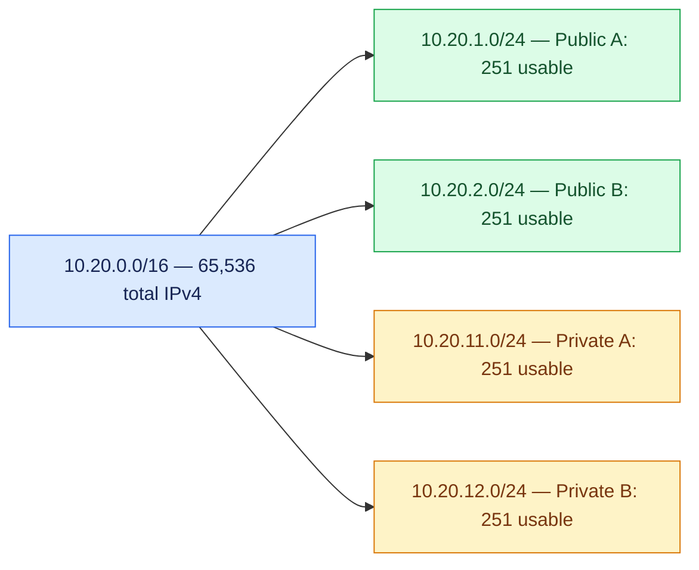

`/16` means 16 network bits and 16 host bits: `2^16 = 65,536` addresses in the overall VPC block. `/24` means 24 network bits and 8 host bits: `2^8 = 256` addresses in each subnet. AWS reserves five addresses in each normal IPv4 subnet. Thus `256 - 5 = 251` assignable addresses per `/24`. Four `/24` subnets use 1,024 addresses of the VPC's larger block and provide a combined maximum of 1,004 assignable addresses, subject to other practical limits. You cannot put two overlapping subnets in this VPC. [AWS subnet sizing](https://docs.aws.amazon.com/vpc/latest/userguide/subnet-sizing.html).

| Subnet | CIDR | Address range | AWS reserved | First/last assignable |
| --- | --- | --- | --- | --- |
| Public A | `10.20.1.0/24` | `.0`–`.255` | `.0`, `.1`, `.2`, `.3`, `.255` | `10.20.1.4`–`10.20.1.254` |
| Public B | `10.20.2.0/24` | `.0`–`.255` | `.0`, `.1`, `.2`, `.3`, `.255` | `10.20.2.4`–`10.20.2.254` |
| Private A | `10.20.11.0/24` | `.0`–`.255` | `.0`, `.1`, `.2`, `.3`, `.255` | `10.20.11.4`–`10.20.11.254` |
| Private B | `10.20.12.0/24` | `.0`–`.255` | `.0`, `.1`, `.2`, `.3`, `.255` | `10.20.12.4`–`10.20.12.254` |

**Why public/private is a routing property:** A subnet associated with a table containing `0.0.0.0/0 → IGW` is public. A subnet whose default IPv4 route goes to NAT and does not go to the IGW is private. The public EC2 also needs its own public IP; a route alone does not give it one. A security group still decides permitted inbound and outbound traffic. [AWS internet gateway guide](https://docs.aws.amazon.com/vpc/latest/userguide/VPC_Internet_Gateway.html).

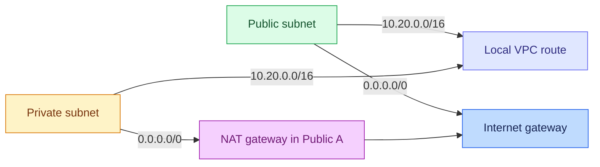

| Route table | AWS-created local route | Our default route | Associated subnets |
| --- | --- | --- | --- |
| Public | `10.20.0.0/16 → local` | `0.0.0.0/0 → igw-...` | Public A and B |
| Private | `10.20.0.0/16 → local` | `0.0.0.0/0 → nat-...` | Private A and B |

The local route appears automatically and is **not** created as a separate `aws_route` in the code. “Default route” means everything not covered by a more specific route; the VPC-local `/16` wins for intra-VPC traffic. This project is IPv4 only; `0.0.0.0/0` is not an IPv6 route. [AWS subnet route tables](https://docs.aws.amazon.com/vpc/latest/userguide/subnet-route-tables.html).

## 2. Read this syntax key before editing code

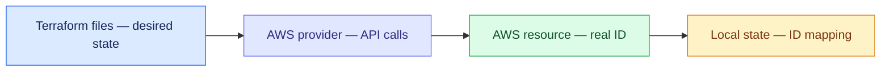

| Syntax | Example | Exact meaning |
| --- | --- | --- |
| `terraform { required_providers { ... } }` | `hashicorp/aws` | Pick a provider source and compatible version. This does not create an AWS resource. |
| `provider "aws" { ... }` | `region = var.aws_region` | Configure the provider's target Region; authentication comes from your selected AWS profile. |
| `variable "x" { ... }` | `aws_region` | Declare an input, type, default and optional validation. |
| `locals { ... }` | `name_prefix` | Name a reusable expression; not an AWS object. |
| `data "aws_..." "name" { ... }` | AZ list, AMI parameter | Read something that already exists; does not create it. |
| `resource "aws_vpc" "lab" { ... }` | `aws_vpc.lab` | Declare a new managed object. First quoted text is the resource type; second is its Terraform-local label. |
| `aws_vpc.lab.id` | Evaluated after creation | The real AWS-generated `vpc-...` ID; references imply dependency ordering. Never type a made-up ID into another resource. |
| `var.x`, `local.x` | `var.vpc_cidr` | Read an input or local expression. |
| `output "x" { value = ... }` | `vpc_id` | Print a useful value after `apply` and record it in Terraform state. |
| `tags = { Name = "..." }` | Display label | `Name` is a tag, not the AWS-generated ID. Tags need not be unique. |
| `# ...` | Code comment | An explanation ignored by Terraform. |
| `depends_on = [...]` | NAT after public route | Explicit dependency when a reference alone does not ensure an operational prerequisite. |

**ID cheat sheet:** `vpc-...` VPC; `subnet-...` subnet; `igw-...` internet gateway; `eipalloc-...` EIP *allocation ID* (the EIP itself is a dotted IPv4 address); `nat-...` NAT gateway; `rtb-...` route table; `rtbassoc-...` association; `sg-...` security group; `i-...` EC2 instance; `ami-...` AMI; `arn:aws:iam::...:role/...` IAM role ARN. Each is assigned by AWS in **your** account and Region, so sample suffixes below are illustrative.

## 3. Steps 1–20: prepare the workstation and confirm the plan

### Phase A · Account and tools

1. **Choose the AWS account.** What: confirm you may create VPC, EC2, Elastic IP, IAM role/instance profile, and Systems Manager resources. Why: Terraform cannot compensate for an explicit AWS Organizations deny or missing `iam:PassRole`. Result: an authorized account and role.
2. **Choose one Region.** What: use `us-east-1` in the worked example. Why: VPCs, subnets, AMIs, NAT, and instances are Region-specific, while IAM is account-global. Result: all regional commands target the same place.
3. **Install Terraform CLI.** Use [HashiCorp's platform-specific install page](https://developer.hashicorp.com/terraform/install), then run `terraform version`. Why: `terraform` reads `.tf` files and applies the graph. Example: `Terraform v1.16.x` (your installed version can differ); this document accepts Terraform `>= 1.5, < 2.0`.
4. **Install AWS CLI v2.** Use the [AWS official install guide](https://docs.aws.amazon.com/cli/latest/userguide/getting-started-install.html), then run `aws --version`. Why: independent AWS-side verification and SSM login. Example: `aws-cli/2.x ...`.
5. **Set up your AWS SSO/IAM Identity Center profile.** Run `aws configure sso --profile vpc-lab` and answer the prompts with your real start URL, SSO Region, account and permission set. Why: the CLI/provider can use short-lived credentials instead of embedding keys in Terraform. If your organization already supplied an authorized profile, use that profile instead. [CLI SSO configuration](https://docs.aws.amazon.com/cli/latest/userguide/cli-configure-sso.html).
6. **Sign in.** Run `aws sso login --profile vpc-lab`; complete the browser prompt. Why: the profile must have a valid session. Possible output: `Successfully logged into Start URL: ...`.
7. **Select the profile and Region in this Bash terminal.** Run `export AWS_PROFILE=vpc-lab` and `export AWS_DEFAULT_REGION=us-east-1`. Why: every subsequent `aws` command and Terraform's AWS provider uses the same identity; Terraform's `aws_region` variable below also targets `us-east-1`. Change all Region inputs together if you choose another Region.
8. **Verify identity.** Run `aws sts get-caller-identity --query '{Account:Account,Arn:Arn}' --output json`. Why: prevent deploying into the wrong account. Illustrative output: `{"Account":"123456789012","Arn":"arn:aws:sts::123456789012:assumed-role/LabRole/name"}`. Stop and correct the profile if the account differs.
9. **Verify two AZs exist.** Run `aws ec2 describe-availability-zones --filters Name=state,Values=available --query 'AvailabilityZones[*].[ZoneName,ZoneId,State]' --output table`. Why: this design needs two; Terraform selects the first two returned available AZ names in your account. Example names: `us-east-1a`, `us-east-1b` (not guaranteed in every account).
10. **Verify instance type availability and quotas.** Run `aws ec2 describe-instance-type-offerings --location-type availability-zone --filters Name=instance-type,Values=t3.micro --query 'InstanceTypeOfferings[*].[Location,InstanceType]' --output table`. Why: `t3.micro` must be offered in the selected AZ; two instances also need sufficient EC2 quota. If not, choose a compatible x86_64 type in `terraform.tfvars`.

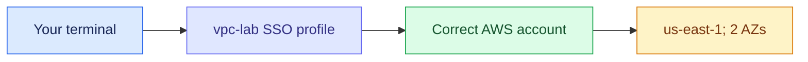

**PowerShell equivalents for Steps 7–8:** `$env:AWS_PROFILE = 'vpc-lab'`; `$env:AWS_DEFAULT_REGION = 'us-east-1'`; then run the same `aws sts get-caller-identity ...` command. For later Bash `$(terraform output -raw vpc_id)` examples, PowerShell uses `$(terraform output -raw vpc_id)` inside double quotes as well. `export`, `mkdir -p`, and `rm` are Bash examples; create/edit files in PowerShell with your normal editor.

### Phase B · Address plan and workspace

11. **Choose VPC CIDR `10.20.0.0/16`.** Why: it includes all four proposed `/24` subnet ranges. Before real integration with VPN/another VPC, choose a block that does not overlap your existing network.
12. **Choose Public A `10.20.1.0/24`.** Why: the public EC2 and zonal NAT both need a public subnet in AZ A.
13. **Choose Public B `10.20.2.0/24`.** Why: demonstrate a second AZ and reserve public placement there.
14. **Choose Private A `10.20.11.0/24`.** Why: the private EC2 lives here without a public IP.
15. **Choose Private B `10.20.12.0/24`.** Why: the second private subnet is available for later private workloads.
16. **Check the four CIDRs do not overlap.** Why: each subnet must fit in the VPC and have its own range. Compare the third octet: `1`, `2`, `11`, `12`; a `/24` fixes those first three octets.
17. **Understand public addressing.** Why: `map_public_ip_on_launch = true` makes the default public-subnet behavior clear; the public EC2 additionally requests a public IP explicitly. Neither setting creates an IGW route by itself.
18. **Understand private addressing.** Why: `map_public_ip_on_launch = false` and `associate_public_ip_address = false` make the private EC2's intended lack of public IPv4 explicit.
19. **Create a dedicated working directory.** Run `mkdir -p ~/terraform-single-vpc-lab && cd ~/terraform-single-vpc-lab`. Why: Terraform loads every `.tf` file in its current directory, and local state stays with this lab. Check with `pwd`.
20. **Choose a text editor and keep one line ending convention.** For example, `code .` in VS Code, or `nano versions.tf`. Why: you will create the exact files below and paste their contents; do not paste Markdown fence markers into `.tf` files.

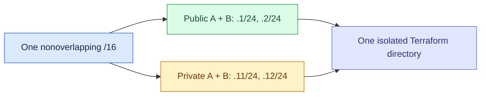

## 4. Steps 21–60: write the entire working Terraform project

**Files to create:** `versions.tf`, `provider.tf`, `variables.tf`, `terraform.tfvars`, `vpc.tf`, `routing.tf`, `security.tf`, `iam.tf`, `ec2.tf`, `outputs.tf`, `.gitignore`. Paste every full code block into the matching file. There are no third-party Terraform modules. In one directory, Terraform combines all `.tf` files regardless of file name or order. Keep `terraform.tfvars` local; it is excluded from Git.

### Phase C · Versions, provider, variables, Git

21. **Create `versions.tf`.** Why: Terraform must know compatible CLI/provider versions; `init` later downloads an actual version and writes `.terraform.lock.hcl`.

```hcl
# versions.tf
terraform {
  required_version = ">= 1.5.0, < 2.0.0"

  required_providers {
    aws = {
      source  = "hashicorp/aws"
      version = ">= 6.39.0, < 7.0.0"
    }
  }
}
```

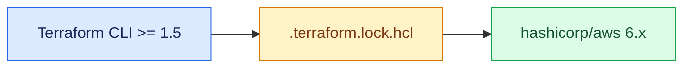

22. **Read `terraform {}`.** It configures Terraform itself; it does not create a VPC. `required_version` rejects incompatible executables rather than silently running with an unknown syntax.
23. **Read `required_providers.aws`.** The local name is `aws`, `source` identifies the official HashiCorp AWS provider, and the version range permits 6.x releases from 6.39 onward. Version 6.39 includes `availability_mode` for the zonal NAT example. Commit the generated lock file to pin the exact chosen provider and checksums. [Provider NAT argument reference](https://registry.terraform.io/providers/hashicorp/aws/6.39.0/docs/resources/nat_gateway), [Terraform dependency lock file](https://developer.hashicorp.com/terraform/language/files/dependency-lock).
24. **Create `provider.tf`.** Why: the provider needs the Region and common tags. Credentials are deliberately **not** written in this file.

```hcl
# provider.tf
provider "aws" {
  region = var.aws_region

  default_tags {
    tags = {
      Project   = var.name_prefix
      ManagedBy = "Terraform"
      Purpose   = "Learning"
    }
  }
}
```

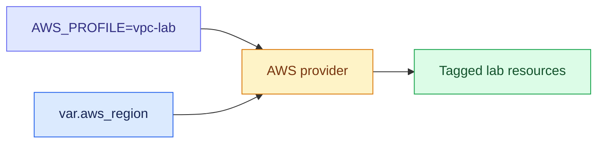

25. **Read `provider "aws"`.** `region = var.aws_region` points to the input defined next. `default_tags` adds three tags where the resource supports them. `Name` tags are provided per resource and are human labels, while real IDs come from AWS.
26. **Create `variables.tf`.** Why: change Region, CIDR, name, and instance type in one place without editing many resources.

```hcl
# variables.tf
variable "aws_region" {
  description = "AWS Region for the VPC, EC2, and AMI lookup."
  type        = string
  default     = "us-east-1"
}

variable "name_prefix" {
  description = "Name prefix for this one-VPC lab; use a short unique value."
  type        = string
  default     = "beginner-vpc"
}

variable "vpc_cidr" {
  description = "Private IPv4 CIDR enclosing the four fixed /24 subnets."
  type        = string
  default     = "10.20.0.0/16"
}

variable "instance_type" {
  description = "An x86_64 EC2 instance type offered in the selected AZs."
  type        = string
  default     = "t3.micro"
}
```

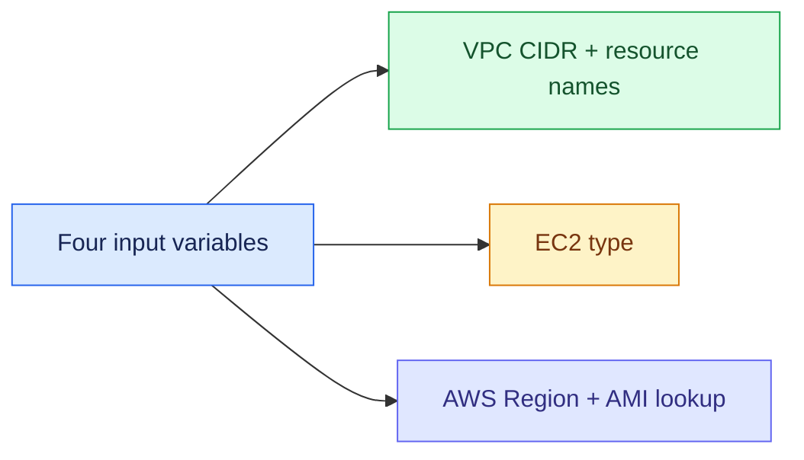

27. **Read each variable declaration.** `description` documents it; `type = string` rejects other types; `default` supplies a value if `terraform.tfvars` does not override it. This lab fixes the four subnet CIDRs in `vpc.tf`; changing `vpc_cidr` alone to a block not containing them will fail. For a different address plan, change all five CIDRs together.
28. **Create `terraform.tfvars`.** Why: record *your* chosen values without changing reusable declarations. Do not put passwords or AWS keys here.

```hcl
# terraform.tfvars (your local values; ignored by Git)
aws_region    = "us-east-1"
name_prefix   = "beginner-vpc"
vpc_cidr      = "10.20.0.0/16"
instance_type = "t3.micro"
```

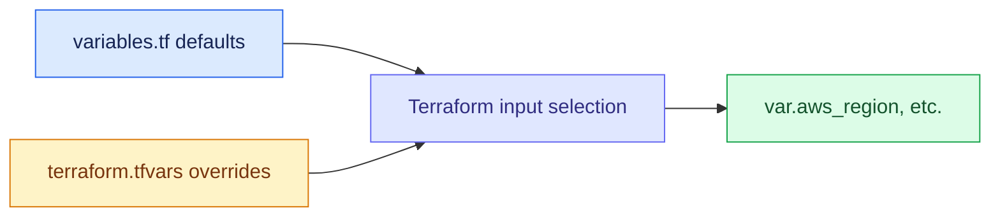

29. **Create `.gitignore`.** Why: local state and plans may contain sensitive values; provider binaries and machine-specific `.tfvars` do not belong in Git. `.terraform.lock.hcl` **does** belong in Git for reproducible provider selection.

```gitignore
# .gitignore
.terraform/
*.tfstate
*.tfstate.*
*.tfplan
*.tfvars
*.tfvars.json
crash.log
crash.*.log
.terraform.tfstate.lock.info
```

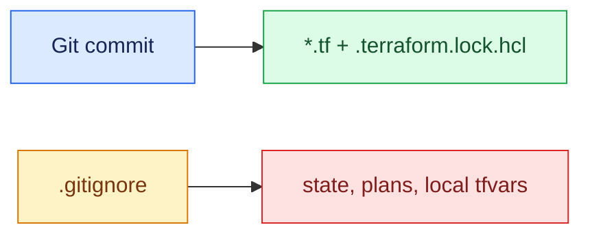

30. **Understand local state.** This lab uses the default local backend. `terraform.tfstate` maps `aws_vpc.lab` to its actual `vpc-...` ID, and similarly for every managed object. Guard the directory; keep a secure backup if you will retain the lab. Never “clean up” by deleting state before Terraform destroys the infrastructure. [Terraform state](https://developer.hashicorp.com/terraform/language/state).

### Phase D · VPC and four subnets

31. **Create `vpc.tf` with all content below.** Why: this file describes one VPC, four non-overlapping subnets, and the dynamic AZ lookup.

```hcl
# vpc.tf
data "aws_availability_zones" "available" {
  state = "available"
}

locals {
  az_a = data.aws_availability_zones.available.names[0]
  az_b = data.aws_availability_zones.available.names[1]
}

resource "aws_vpc" "lab" {
  cidr_block           = var.vpc_cidr
  enable_dns_support   = true
  enable_dns_hostnames = true

  tags = {
    Name = "${var.name_prefix}-vpc"
  }
}

resource "aws_subnet" "public_a" {
  vpc_id                  = aws_vpc.lab.id
  cidr_block              = "10.20.1.0/24"
  availability_zone       = local.az_a
  map_public_ip_on_launch = true

  tags = {
    Name = "${var.name_prefix}-public-a"
  }
}

resource "aws_subnet" "public_b" {
  vpc_id                  = aws_vpc.lab.id
  cidr_block              = "10.20.2.0/24"
  availability_zone       = local.az_b
  map_public_ip_on_launch = true

  tags = {
    Name = "${var.name_prefix}-public-b"
  }
}

resource "aws_subnet" "private_a" {
  vpc_id                  = aws_vpc.lab.id
  cidr_block              = "10.20.11.0/24"
  availability_zone       = local.az_a
  map_public_ip_on_launch = false

  tags = {
    Name = "${var.name_prefix}-private-a"
  }
}

resource "aws_subnet" "private_b" {
  vpc_id                  = aws_vpc.lab.id
  cidr_block              = "10.20.12.0/24"
  availability_zone       = local.az_b
  map_public_ip_on_launch = false

  tags = {
    Name = "${var.name_prefix}-private-b"
  }
}
```

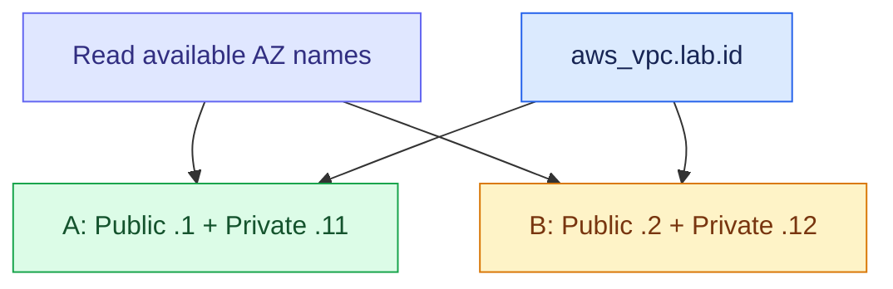

32. **Read the AZ data block.** `data` queries available AZs in the configured Region; `state = "available"` filters unavailable ones. It does not create an AZ. Verify at least two in Step 9; AZ names are account-relative.
33. **Read `locals`.** `names[0]` and `[1]` select two results; `local.az_a` and `local.az_b` keep each public/private pair together. The “a/b” labels are names within this guide; check output for real AZ names.
34. **Read `aws_vpc.lab`.** `cidr_block` reserves the VPC range; `enable_dns_support` enables Amazon-provided DNS resolution; `enable_dns_hostnames` supports AWS DNS hostnames. The provider creates a real `vpc-...` ID. `Name` is only a tag.
35. **Read Public A.** `vpc_id` references the just-created VPC; `cidr_block` carves out `10.20.1.0/24`; `availability_zone` selects A; `map_public_ip_on_launch` requests public IPv4 for normal new launches. These attributes do **not** add a route; that comes in `routing.tf`.
36. **Read Public B.** Same parameters, but `10.20.2.0/24` and AZ B. It shares the public route table later and has no EC2 instance in this exercise.
37. **Read Private A.** It uses `10.20.11.0/24` and AZ A, with auto public IP disabled. The private EC2 references this subnet ID.
38. **Read Private B.** It uses `10.20.12.0/24` and AZ B, with auto public IP disabled. Its outbound traffic will go cross-AZ to the one NAT in A.
39. **Understand `${var.name_prefix}`.** This interpolates a variable into a string such as `beginner-vpc-public-a`. Changing the tag does not change the CIDR or the AWS-generated `subnet-...` ID.
40. **Check the VPC/subnet dependency.** All four subnet resources reference `aws_vpc.lab.id`, so Terraform knows to create the VPC first. There are five managed resources in this file; the data and locals blocks create none.

### Phase E · Internet gateway, one EIP, one NAT, two route tables

41. **Create `routing.tf` with all content below.** Why: subnet placement does not define reachability until routes and subnet associations exist.

```hcl
# routing.tf
resource "aws_internet_gateway" "lab" {
  vpc_id = aws_vpc.lab.id

  tags = {
    Name = "${var.name_prefix}-igw"
  }
}

resource "aws_route_table" "public" {
  vpc_id = aws_vpc.lab.id

  tags = {
    Name = "${var.name_prefix}-public-rt"
  }
}

resource "aws_route" "public_default" {
  route_table_id         = aws_route_table.public.id
  destination_cidr_block = "0.0.0.0/0"
  gateway_id             = aws_internet_gateway.lab.id
}

resource "aws_route_table_association" "public_a" {
  subnet_id      = aws_subnet.public_a.id
  route_table_id = aws_route_table.public.id
}

resource "aws_route_table_association" "public_b" {
  subnet_id      = aws_subnet.public_b.id
  route_table_id = aws_route_table.public.id
}

resource "aws_eip" "nat" {
  domain = "vpc"

  tags = {
    Name = "${var.name_prefix}-nat-eip"
  }
}

resource "aws_nat_gateway" "lab" {
  allocation_id      = aws_eip.nat.id
  subnet_id          = aws_subnet.public_a.id
  connectivity_type  = "public"
  availability_mode  = "zonal"

  # NAT must have an operational public route and subnet association.
  depends_on = [
    aws_route.public_default,
    aws_route_table_association.public_a
  ]

  tags = {
    Name = "${var.name_prefix}-nat-a"
  }
}

resource "aws_route_table" "private" {
  vpc_id = aws_vpc.lab.id

  tags = {
    Name = "${var.name_prefix}-private-rt"
  }
}

resource "aws_route" "private_default" {
  route_table_id         = aws_route_table.private.id
  destination_cidr_block = "0.0.0.0/0"
  nat_gateway_id         = aws_nat_gateway.lab.id
}

resource "aws_route_table_association" "private_a" {
  subnet_id      = aws_subnet.private_a.id
  route_table_id = aws_route_table.private.id
}

resource "aws_route_table_association" "private_b" {
  subnet_id      = aws_subnet.private_b.id
  route_table_id = aws_route_table.private.id
}
```

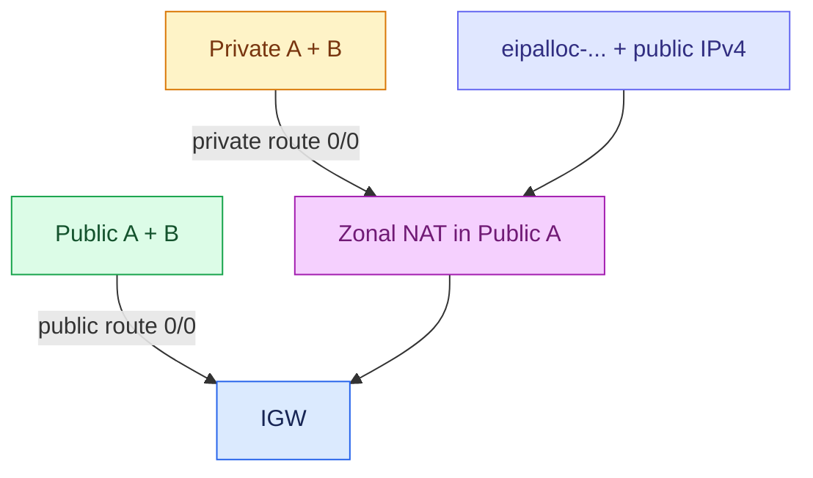

42. **Read `aws_internet_gateway.lab`.** Its `vpc_id` attaches the one IGW to this one VPC. Merely creating the IGW does not make instances public; routes and public IPs are still required.
43. **Read `aws_route_table.public`.** Creates an initially VPC-local table; the separate `aws_route.public_default` adds `0.0.0.0/0 → gateway_id` (an `igw-...`). Route-table `id` has prefix `rtb-...`.
44. **Read the two public associations.** `subnet_id` points to each public subnet; `route_table_id` is the same public table. Without an explicit association, a subnet follows the VPC's main table instead.
45. **Read `aws_eip.nat`.** `domain = "vpc"` allocates one EIP. `aws_eip.nat.id` is its **allocation ID** (`eipalloc-...`), while `aws_eip.nat.public_ip` is the internet-visible dotted IPv4 address. They are different values.
46. **Read `aws_nat_gateway.lab`.** `allocation_id` attaches that EIP; `subnet_id` places NAT in Public A; `connectivity_type = "public"` chooses internet-facing NAT; `availability_mode = "zonal"` makes the single-AZ choice explicit.
47. **Read NAT `depends_on`.** The NAT refers to the subnet and EIP already, but does not otherwise reference the public route or association. These two dependencies ensure its public subnet has a usable path through the IGW before NAT creation.
48. **Read `aws_route_table.private`.** It holds the VPC-local route plus the separate `aws_route.private_default` rule. The latter uses **`nat_gateway_id`**, not `gateway_id`; its target will be `nat-...`.
49. **Read the two private associations.** Both reference the same private route table and thus the same NAT default route. This is why the one NAT serves both AZs and why B depends on A's egress.
50. **Trace packets.** Public EC2 outbound: instance private IP → IGW mapping with its public IP → internet. Private EC2 outbound: private IP → NAT's private IP → IGW mapping to NAT's EIP → internet. Return traffic follows the stateful translation; the NAT is **not** a path for initiating inbound access to private EC2. [AWS public NAT behavior](https://docs.aws.amazon.com/vpc/latest/userguide/vpc-nat-gateway.html).

### Phase F · Security, instance IAM, the two EC2 instances

51. **Create `security.tf`.** Why: security groups are stateful instance firewalls. Each group has no inbound rules and explicit all-IPv4 outbound rules for this networking lab. In production, restrict outbound to the application's needs.

```hcl
# security.tf
resource "aws_security_group" "public_ec2" {
  name        = "${var.name_prefix}-public-ec2"
  description = "Public lab EC2: no inbound; allow outbound IPv4"
  vpc_id      = aws_vpc.lab.id

  egress {
    description = "Lab outbound traffic including DNS and HTTPS"
    from_port   = 0
    to_port     = 0
    protocol    = "-1"
    cidr_blocks = ["0.0.0.0/0"]
  }

  tags = {
    Name = "${var.name_prefix}-public-sg"
  }
}

resource "aws_security_group" "private_ec2" {
  name        = "${var.name_prefix}-private-ec2"
  description = "Private lab EC2: no inbound; allow outbound IPv4"
  vpc_id      = aws_vpc.lab.id

  egress {
    description = "Lab outbound traffic through NAT"
    from_port   = 0
    to_port     = 0
    protocol    = "-1"
    cidr_blocks = ["0.0.0.0/0"]
  }

  tags = {
    Name = "${var.name_prefix}-private-sg"
  }
}
```

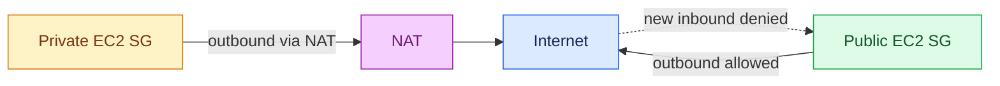

52. **Read each security group field.** `name` is an account/VPC group label; `description` is required by AWS; `vpc_id` scopes the group; AWS assigns its `sg-...` ID. No `ingress` block means no inbound permission for either instance (verify it after apply).
53. **Read `egress`.** `protocol = "-1"` means all protocols; with this choice `from_port` and `to_port` are zero placeholders; `cidr_blocks = ["0.0.0.0/0"]` allows outbound to all IPv4 destinations. Stateful security groups allow matching response traffic. The subnet route and NAT/IGW must *also* be correct; a permissive SG does not create a route.
54. **Create `iam.tf`.** Why: an EC2 role and instance profile allow both SSM agents to register; the workstation user's permission to start sessions is a separate IAM concern.

```hcl
# iam.tf
data "aws_iam_policy_document" "ec2_assume_role" {
  statement {
    effect  = "Allow"
    actions = ["sts:AssumeRole"]

    principals {
      type        = "Service"
      identifiers = ["ec2.amazonaws.com"]
    }
  }
}

resource "aws_iam_role" "ssm" {
  name               = "${var.name_prefix}-ssm-role"
  assume_role_policy = data.aws_iam_policy_document.ec2_assume_role.json

  tags = {
    Name = "${var.name_prefix}-ssm-role"
  }
}

resource "aws_iam_role_policy_attachment" "ssm_core" {
  role       = aws_iam_role.ssm.name
  policy_arn = "arn:aws:iam::aws:policy/AmazonSSMManagedInstanceCore"
}

resource "aws_iam_instance_profile" "ssm" {
  name = "${var.name_prefix}-ssm-profile"
  role = aws_iam_role.ssm.name

  tags = {
    Name = "${var.name_prefix}-ssm-profile"
  }
}
```

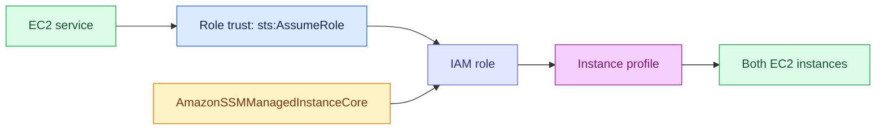

55. **Read the trust document and role.** The policy document constructs JSON permitting EC2 (`ec2.amazonaws.com`) to call `sts:AssumeRole`; `aws_iam_role.ssm` holds this trust relationship. The resource itself does not grant SSM API actions until the attachment exists.
56. **Read the attachment and instance profile.** The AWS-managed `AmazonSSMManagedInstanceCore` policy grants instance-side SSM permissions. The instance profile is the container EC2 actually receives at launch. Your *human* SSO role also needs `ssm:StartSession` and related authorization as set by your administrator. [AWS instance permissions](https://docs.aws.amazon.com/systems-manager/latest/userguide/setup-instance-permissions.html).
57. **Create `ec2.tf`.** Why: put one x86_64 Amazon Linux 2023 instance in Public A, and one in Private A, with encrypted gp3 root disks and IMDSv2 required.

```hcl
# ec2.tf
data "aws_ssm_parameter" "al2023_ami" {
  name = "/aws/service/ami-amazon-linux-latest/al2023-ami-kernel-default-x86_64"
}

resource "aws_instance" "public" {
  ami                         = data.aws_ssm_parameter.al2023_ami.insecure_value
  instance_type               = var.instance_type
  subnet_id                   = aws_subnet.public_a.id
  vpc_security_group_ids      = [aws_security_group.public_ec2.id]
  associate_public_ip_address = true
  iam_instance_profile        = aws_iam_instance_profile.ssm.name

  metadata_options {
    http_tokens = "required"
  }

  root_block_device {
    volume_type           = "gp3"
    volume_size           = 10
    encrypted             = true
    delete_on_termination = true
  }

  depends_on = [
    aws_route.public_default,
    aws_route_table_association.public_a,
    aws_iam_role_policy_attachment.ssm_core
  ]

  tags = {
    Name = "${var.name_prefix}-public-ec2"
  }
}

resource "aws_instance" "private" {
  ami                         = data.aws_ssm_parameter.al2023_ami.insecure_value
  instance_type               = var.instance_type
  subnet_id                   = aws_subnet.private_a.id
  vpc_security_group_ids      = [aws_security_group.private_ec2.id]
  associate_public_ip_address = false
  iam_instance_profile        = aws_iam_instance_profile.ssm.name

  metadata_options {
    http_tokens = "required"
  }

  root_block_device {
    volume_type           = "gp3"
    volume_size           = 10
    encrypted             = true
    delete_on_termination = true
  }

  depends_on = [
    aws_route.private_default,
    aws_route_table_association.private_a,
    aws_iam_role_policy_attachment.ssm_core
  ]

  tags = {
    Name = "${var.name_prefix}-private-ec2"
  }
}
```

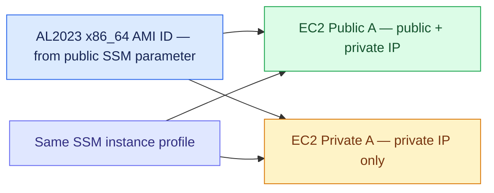

58. **Read the AMI lookup.** AWS maintains a *public* SSM parameter whose value is the Region's current AL2023 x86_64 `ami-...`. The data source reads it when planning. `insecure_value` is appropriate **only because this is a public AMI ID**, which is not a secret; the normal `.value` is marked sensitive by the provider. An AMI parameter changing later may propose replacing instances on a future plan: review before apply. [AWS public AMI parameters](https://docs.aws.amazon.com/AWSEC2/latest/UserGuide/finding-an-ami-parameter-store.html), [provider SSM data source](https://registry.terraform.io/providers/hashicorp/aws/latest/docs/data-sources/ssm_parameter).
59. **Read the public EC2 arguments.** `subnet_id` selects Public A; the list of `vpc_security_group_ids` attaches its SG; `associate_public_ip_address = true` explicitly requests the public IP; the instance profile enables SSM; `http_tokens = "required"` enforces IMDSv2; `root_block_device` selects a 10 GiB encrypted gp3 volume deleted with the instance. `depends_on` waits for usable routing and the SSM policy. Public IP does **not** mean an open inbound service; its SG has none.
60. **Read the private EC2 arguments.** The structure is identical except for Private A's `subnet_id`, private SG, `associate_public_ip_address = false`, and a dependency on the private NAT route. AWS assigns each instance an `i-...` ID and a private IP; only the public instance gets a public IP. AL2023 normally includes SSM Agent; network access to the SSM endpoints must work. [Session Manager prerequisites](https://docs.aws.amazon.com/systems-manager/latest/userguide/session-manager-prerequisites.html).

### Phase G · Outputs and the Terraform workflow

61. **Create `outputs.tf`.** Why: after apply, Terraform exposes the real IDs and IPs. These outputs also feed the read-only verification commands below.

```hcl
# outputs.tf
output "aws_region" {
  description = "Region used by the lab."
  value       = var.aws_region
}

output "availability_zones" {
  description = "Actual selected AZ names for the A and B subnets."
  value = {
    a = local.az_a
    b = local.az_b
  }
}

output "vpc_id" {
  description = "The AWS-generated VPC ID."
  value       = aws_vpc.lab.id
}

output "subnet_ids" {
  description = "The four AWS-generated subnet IDs."
  value = {
    public_a  = aws_subnet.public_a.id
    public_b  = aws_subnet.public_b.id
    private_a = aws_subnet.private_a.id
    private_b = aws_subnet.private_b.id
  }
}

output "internet_gateway_id" {
  description = "The internet gateway ID."
  value       = aws_internet_gateway.lab.id
}

output "nat_gateway_id" {
  description = "The zonal NAT gateway ID."
  value       = aws_nat_gateway.lab.id
}

output "nat_eip_allocation_id" {
  description = "Allocation ID, distinct from the EIP address."
  value       = aws_eip.nat.id
}

output "nat_eip_public_ip" {
  description = "Public IPv4 visible on internet requests from private EC2."
  value       = aws_eip.nat.public_ip
}

output "public_route_table_id" {
  description = "Route table used by both public subnets."
  value       = aws_route_table.public.id
}

output "private_route_table_id" {
  description = "Route table used by both private subnets."
  value       = aws_route_table.private.id
}

output "public_security_group_id" {
  description = "Security group for the public EC2."
  value       = aws_security_group.public_ec2.id
}

output "private_security_group_id" {
  description = "Security group for the private EC2."
  value       = aws_security_group.private_ec2.id
}

output "public_instance_id" {
  description = "Public EC2 instance ID for SSM and EC2 queries."
  value       = aws_instance.public.id
}

output "public_instance_public_ip" {
  description = "Auto-assigned public IPv4; can change after stop/start."
  value       = aws_instance.public.public_ip
}

output "public_instance_private_ip" {
  description = "Private IPv4 of the public EC2."
  value       = aws_instance.public.private_ip
}

output "private_instance_id" {
  description = "Private EC2 instance ID for SSM."
  value       = aws_instance.private.id
}

output "private_instance_private_ip" {
  description = "Private IPv4 of the private EC2."
  value       = aws_instance.private.private_ip
}
```

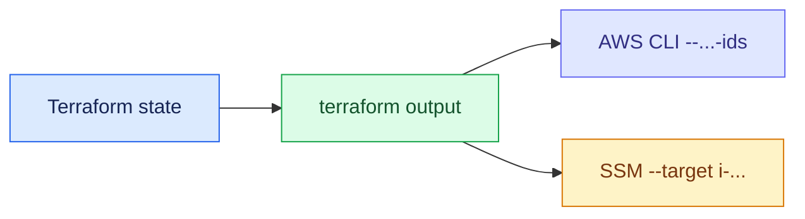

62. **Read output syntax.** `output "vpc_id" { value = aws_vpc.lab.id }` exposes a scalar. `subnet_ids` and `availability_zones` are maps; inspect them with `terraform output -json subnet_ids`, not `-raw`. Outputs are useful labels over state, not a second source of truth.
63. **Check all required files exist.** Run `ls -1 .gitignore *.tf terraform.tfvars` (Bash). Expect the listed eleven files. Why: if a file is missing, a reference may fail; if it is in a *different* directory, Terraform will not load it.
64. **Check your Region is consistent.** Run `aws configure get region --profile vpc-lab` and read `aws_region` in `terraform.tfvars`. The CLI Region also comes from `AWS_DEFAULT_REGION` set earlier, which can override a profile default. Why: EC2 CLI verification must query the Terraform Region.
65. **Initialize.** Run `terraform init`. Why: downloads the selected AWS provider, configures the local backend, and creates `.terraform.lock.hcl`. Sample end: `Terraform has been successfully initialized!`. If it cannot reach the registry, correct network/proxy settings; init itself does not create AWS resources.
66. **Inspect providers.** Run `terraform providers`. Why: confirm this root configuration requires `registry.terraform.io/hashicorp/aws`; this is a local inspection command, not a deploy.
67. **Format.** Run `terraform fmt -recursive` and then `terraform fmt -check -recursive`. Why: consistent HCL style; the `-check` form exits nonzero if formatting is needed. Sample: file names printed on the first run, then no output and exit code 0 on the second.
68. **Validate syntax and schema.** Run `terraform validate`. Expected: `Success! The configuration is valid.` Why: catches malformed HCL and many schema/reference errors; it does **not** test AWS permissions, quotas, or actual reachability.
69. **Generate a saved execution plan.** Run `terraform plan -out=lab.tfplan`. Why: Terraform queries the AZs and public AMI parameter, calculates dependencies, and stores precisely the changes you will review. In an empty lab, expect approximately `Plan: 23 to add, 0 to change, 0 to destroy.` if all sources resolve and no unmanaged extras are added. Exact display and computed values vary.
70. **Read the saved plan.** Run `terraform show -no-color lab.tfplan`. Why: confirm **one** VPC, **four** subnets, **one** NAT and EIP, **one** IGW, **two** EC2, the IAM resources, and the routing before creating anything. The binary plan can contain sensitive information, so `.gitignore` excludes `*.tfplan`. Recreate the plan after any code/variable change.

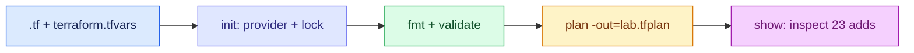

**Example plan fragment — illustrative:**

```text
# aws_vpc.lab will be created
  + resource "aws_vpc" "lab" {
      + cidr_block = "10.20.0.0/16"
      + id         = (known after apply)
    }
# aws_nat_gateway.lab will be created
  + resource "aws_nat_gateway" "lab" {
      + availability_mode = "zonal"
      + id                = (known after apply)
    }
Plan: 23 to add, 0 to change, 0 to destroy.
```

`+` means creation; `(known after apply)` means AWS will allocate that ID. The full plan includes the rest of the resources and may format fields differently. [Terraform plan](https://developer.hashicorp.com/terraform/cli/commands/plan), [validate](https://developer.hashicorp.com/terraform/cli/commands/validate).

### Phase H · Apply and inspect real AWS objects

71. **Apply the exact reviewed plan.** Run `terraform apply lab.tfplan`. Why: makes the planned AWS API calls in dependency order. A saved plan usually does not prompt again, so inspect Step 70 first. NAT creation can take several minutes. Expected finish: `Apply complete! Resources: 23 added, 0 changed, 0 destroyed.` if this was an empty lab and nothing failed.
72. **Read outputs.** Run `terraform output`, then `terraform output -raw vpc_id`, then `terraform output -json subnet_ids`. Why: copy the actual IDs, not illustrative IDs from this guide. `-raw` prints scalar strings without quotes; `-json` preserves the map keys.
73. **Verify the VPC.** Run `aws ec2 describe-vpcs --vpc-ids "$(terraform output -raw vpc_id)" --query 'Vpcs[0].[VpcId,CidrBlock,State,IsDefault]' --output table`. Expected values: `vpc-...`, `10.20.0.0/16`, `available`, `False`. Why: this is a custom, not default, VPC.
74. **Verify all four subnets.** Run `aws ec2 describe-subnets --filters "Name=vpc-id,Values=$(terraform output -raw vpc_id)" --query 'Subnets[*].[SubnetId,CidrBlock,AvailabilityZone,MapPublicIpOnLaunch]' --output table`. Why: see four `subnet-...` IDs, the right CIDRs, paired AZs, and `True` for public / `False` for private. If other resources already exist in the VPC, this filter includes them as well.
75. **Verify the IGW attachment.** Run `aws ec2 describe-internet-gateways --internet-gateway-ids "$(terraform output -raw internet_gateway_id)" --query 'InternetGateways[0].[InternetGatewayId,Attachments[0].VpcId,Attachments[0].State]' --output table`. Expected: `igw-...`, this `vpc-...`, `available`. Why: an unattached IGW cannot serve the public route.
76. **Verify NAT, its subnet and its EIP.** Run `aws ec2 describe-nat-gateways --nat-gateway-ids "$(terraform output -raw nat_gateway_id)" --query 'NatGateways[0].[NatGatewayId,State,SubnetId,NatGatewayAddresses[0].PublicIp,AvailabilityMode]' --output table`. Expected: one `nat-...`, `available`, Public A's subnet ID, NAT EIP, and `zonal`. If your CLI's service model omits `AvailabilityMode`, query the other fields or update AWS CLI.
77. **Verify the EIP allocation.** Run `aws ec2 describe-addresses --allocation-ids "$(terraform output -raw nat_eip_allocation_id)" --query 'Addresses[0].[AllocationId,PublicIp,AssociationId]' --output table`. Why: prove `eipalloc-...` belongs to a real public IP and is associated (`eipassoc-...`). Compare the IPv4 to `terraform output -raw nat_eip_public_ip`.
78. **Inspect public routes.** Run `aws ec2 describe-route-tables --route-table-ids "$(terraform output -raw public_route_table_id)" --query 'RouteTables[0].Routes[*].[DestinationCidrBlock,GatewayId,NatGatewayId,State]' --output table`. Expect local `10.20.0.0/16` and a `0.0.0.0/0` with `igw-...` in the gateway column, state `active`.
79. **Inspect private routes.** Run `aws ec2 describe-route-tables --route-table-ids "$(terraform output -raw private_route_table_id)" --query 'RouteTables[0].Routes[*].[DestinationCidrBlock,GatewayId,NatGatewayId,State]' --output table`. Expect local `/16` and `0.0.0.0/0` with **`nat-...`** in the NAT column, state `active`.
80. **Inspect both EC2 instances.** Run `aws ec2 describe-instances --instance-ids "$(terraform output -raw public_instance_id)" "$(terraform output -raw private_instance_id)" --query 'Reservations[].Instances[].{ID:InstanceId,Subnet:SubnetId,Private:PrivateIpAddress,Public:PublicIpAddress,State:State.Name}' --output table`. Expected: both `running`; public VM has a public IP; private VM's public IP is empty/`None`.

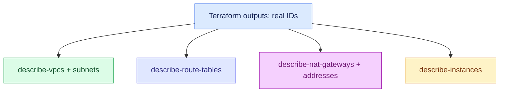

**Illustrative compact outputs (your suffixes and IPs will differ):**

```text
vpc_id                    = "vpc-0a1b2c3d4e5f67890"
internet_gateway_id       = "igw-0a1b2c3d4e5f67890"
nat_gateway_id            = "nat-0a1b2c3d4e5f67890"
nat_eip_allocation_id     = "eipalloc-0a1b2c3d4e5f67890"
nat_eip_public_ip         = "198.51.100.42"      # example documentation IP
public_instance_id        = "i-0123456789abcdef0"
public_instance_public_ip = "203.0.113.24"      # example documentation IP
private_instance_id       = "i-0fedcba9876543210"
private_instance_private_ip = "10.20.11.4"       # actual allocation can vary
```

Documentation ranges `198.51.100.0/24` and `203.0.113.0/24` here are **fake examples**, not usable AWS public addresses. If your output is different, that is normal. The number after `vpc-` identifies your own VPC, and a subnet's ID cannot be deduced from its CIDR.

### Phase I · Test security and outbound paths

81. **Verify no ingress is opened.** Run `aws ec2 describe-security-groups --group-ids "$(terraform output -raw public_security_group_id)" "$(terraform output -raw private_security_group_id)" --query 'SecurityGroups[*].{Id:GroupId,Ingress:IpPermissions,Egress:IpPermissionsEgress}' --output json`. Why: both `Ingress` arrays should be `[]`; egress should include an IPv4 all-protocol `0.0.0.0/0` rule.
82. **Verify SSM registration.** Run `aws ssm describe-instance-information --filters "Key=InstanceIds,Values=$(terraform output -raw private_instance_id)" --query 'InstanceInformationList[*].[InstanceId,PingStatus,PlatformName]' --output table`; repeat with `public_instance_id`. Expected after boot/registration: both show `Online` and Amazon Linux. It can take a few minutes. An empty list is not yet proof of a route failure; inspect the troubleshooting table.
83. **Install/verify the Session Manager plugin on your workstation.** Use the [AWS installation instructions](https://docs.aws.amazon.com/systems-manager/latest/userguide/session-manager-working-with-install-plugin.html). Run `session-manager-plugin --version`. Why: AWS CLI `start-session` uses this local plugin. The EC2 instances run a *different* component, SSM Agent.
84. **Open the private VM session.** Run `aws ssm start-session --target "$(terraform output -raw private_instance_id)"`. Possible output: `Starting session with SessionId: ...`, then a shell prompt on the instance. Why: SSM agents initiate outbound connections to AWS; neither private IP reachability from your laptop nor inbound SSH is needed. Exit with `exit`.
85. **From the private VM shell, test the route.** Run `hostname`, `ip -4 route`, and `curl -4 -sS --max-time 15 https://checkip.amazonaws.com`. Expect the last command to print **the NAT EIP from Step 77**, not the private VM's `10.20.11.x` address. `ip -4 route` on the Linux VM shows its *subnet router* (for example, `default via 10.20.11.1`); the AWS subnet route table's `nat-...` target is visible via the AWS CLI in Step 79, not as a NAT hop inside Linux.
86. **Open the public VM session and compare.** Run `aws ssm start-session --target "$(terraform output -raw public_instance_id)"`; inside it, run `curl -4 -sS --max-time 15 https://checkip.amazonaws.com`. Expect its public IPv4 from `terraform output -raw public_instance_public_ip`, **not** NAT EIP. Use `exit` to close the session.
87. **Trace the privacy rule.** From outside AWS, an unsolicited connection to the private EC2 is impossible through this design: it has no public IP, its subnet has no IGW default route, the NAT only supports initiated outbound connections, and its SG has no inbound rule. The public EC2 has a public IP but its SG likewise has no inbound rule.
88. **Compare subnet associations.** Run `aws ec2 describe-route-tables --route-table-ids "$(terraform output -raw public_route_table_id)" "$(terraform output -raw private_route_table_id)" --query 'RouteTables[*].{RouteTable:RouteTableId,Subnets:Associations[*].SubnetId}' --output json`. Why: confirm two public IDs under the public table and two private IDs under the private table. The main route table has no explicitly associated lab subnet.
89. **If private SSM or curl fails, inspect in this order.** Check private EC2 `running`, SSM `Online`, instance IAM profile/policy, private SG outbound, private route `nat-...` active, NAT `available`, NAT's Public A route to IGW, VPC DNS, and any account-customized NACL/proxy. Check AWS CLI user's `ssm:StartSession` permission separately when registration is Online but the session is denied.
90. **If public curl fails, inspect in this order.** Verify public IP exists, the instance is in Public A, its SG permits outbound, Public A associates with the public table, the IGW route is `active`, and the VPC IGW attachment is `available`. An inbound HTTPS/SSH rule is not required for outbound curl.

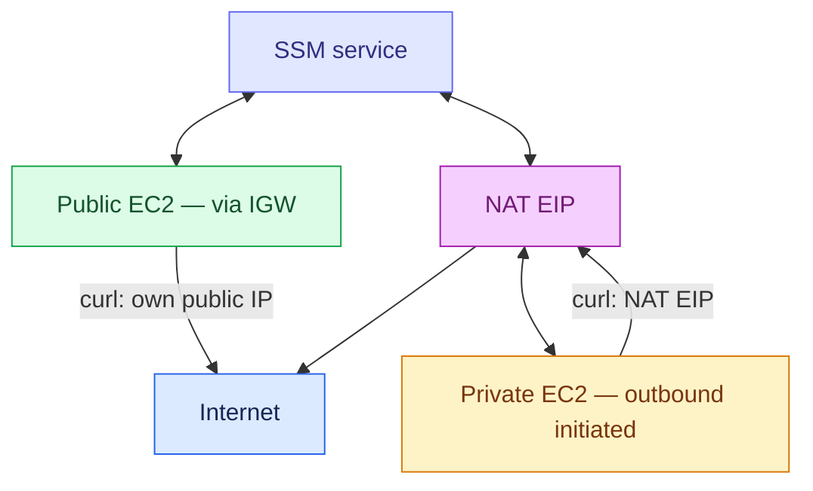

**Possible private shell output (illustrative):**

```text
$ hostname
ip-10-20-11-4.ec2.internal
$ ip -4 route
default via 10.20.11.1 dev ens5
10.20.11.0/24 dev ens5 proto kernel scope link src 10.20.11.4
$ curl -4 -sS --max-time 15 https://checkip.amazonaws.com
198.51.100.42
```

The fake `198.51.100.42` equals the fake NAT EIP above. If the curl result is a different **real** IPv4, compare it to your real `terraform output -raw nat_eip_public_ip`; corporate inspection/proxy routing can also change observed source IP. [AWS SSM outbound endpoint needs](https://docs.aws.amazon.com/systems-manager/latest/userguide/session-manager-getting-started-privatelink.html).

### Phase J · Review changes, remove costs, verify removal

91. **Detect drift.** Run `terraform plan`. Expected after a clean deployment: `No changes. Your infrastructure matches the configuration.` Why: spot manual AWS Console changes or public AMI parameter updates before applying anything else. If AMI changed, an instance replacement might be proposed; decide deliberately.
92. **Inspect state addresses without printing the whole state.** Run `terraform state list`. Expect `aws_vpc.lab`, four `aws_subnet.*`, one `aws_nat_gateway.lab`, two `aws_instance.*`, and the remaining managed resources. Why: know what Terraform owns; `state list` is read-only.
93. **Commit reusable code.** If this is a Git repository, run `git status --short` and inspect the changes. Commit `.tf`, `.gitignore`, and `.terraform.lock.hcl` if appropriate. Why: share reproducible configuration while keeping local `terraform.tfstate`, plans, and `terraform.tfvars` out of Git. Do not commit real credentials.
94. **Record IDs before cleanup if you want later audit.** Run `terraform output -raw vpc_id` and `terraform output -raw nat_eip_allocation_id`. Why: after destroy the outputs disappear; you can use these IDs to confirm deletion. You may save them privately; they are examples of resource identifiers, not passwords.
95. **Decide when to end the lab.** Look at current [VPC pricing](https://aws.amazon.com/vpc/pricing/) and your account's Billing/Cost Explorer. Why: the NAT is chargeable while allocated and available, including when the EC2 instances are stopped.
96. **Preview deletion in a saved plan.** Run `terraform plan -destroy -out=destroy.tfplan`. Why: inspect what Terraform would remove. An untouched empty-lab configuration should show roughly `Plan: 0 to add, 0 to change, 23 to destroy.` A changed lab may have a different count.
97. **Read the deletion plan.** Run `terraform show -no-color destroy.tfplan`. Why: confirm it targets this VPC, NAT/EIP, two EC2, route tables and IAM role; never destroy from the wrong directory/account/Region. Check `aws sts get-caller-identity` again if uncertain.
98. **Apply the reviewed deletion.** Run `terraform apply destroy.tfplan`. Why: safely follows Terraform's dependency graph: EC2/routes/NAT and related associations are removed before their enclosing objects. Expect `Apply complete! Resources: 0 added, 0 changed, 23 destroyed.` NAT release can take time.
99. **Verify Terraform state is empty.** Run `terraform state list` (normally no managed resource addresses) and `terraform output` (no active lab outputs). Why: distinguish completed destroy from merely stopping EC2. If destroy failed partway, keep the state and retry after fixing the named dependency.
100. **Verify the billable AWS resources are gone.** Run `aws ec2 describe-vpcs --filters "Name=tag:Name,Values=beginner-vpc-vpc" --query 'Vpcs[*].VpcId' --output json` and `aws ec2 describe-addresses --filters "Name=tag:Name,Values=beginner-vpc-nat-eip" --query 'Addresses[*].AllocationId' --output json`. If you changed `name_prefix`, replace `beginner-vpc` with your value. Expected: `[]` for both. A deleted NAT may remain visible temporarily as a historical/deleting object in some describe responses; the released EIP and empty Terraform state are key confirmations. Check Billing later for delayed posting of already incurred charges.

```mermaid
flowchart LR
  Live["23 managed resources"]:::live --> Preview["plan -destroy + show"]:::preview --> Apply["apply destroy.tfplan"]:::apply --> Empty["empty state; VPC/EIP absent"]:::empty
  classDef live fill:#fee2e2,stroke:#dc2626,color:#7f1d1d
  classDef preview fill:#fef3c7,stroke:#d97706,color:#78350f
  classDef apply fill:#e0e7ff,stroke:#6366f1,color:#312e81
  classDef empty fill:#dcfce7,stroke:#16a34a,color:#14532d
```

## 5. Reference: every important attribute in the project

This section expands the working code into a lookup table. “Change safely” means *review `terraform plan`* after any change; some attributes force replacement. Terraform provider schemas evolve, so use the linked provider reference for every less-common option rather than assuming this compact lab lists all AWS API flags.

### VPC and subnet options

| Statement in this lab | Kind / example value | Why it is set; relevant alternative |
| --- | --- | --- |
| `aws_vpc.lab` | Managed VPC resource | Creates one VPC. A `data "aws_vpc"` would only *look up* an existing VPC, not satisfy this lab's fresh creation. |
| `cidr_block = var.vpc_cidr` | IPv4 CIDR, `10.20.0.0/16` | Container for all four subnets. For a future VPN/peering design, first select a non-overlapping network. |
| `enable_dns_support = true` | Boolean | Makes Amazon DNS resolution usable in the VPC; SSM endpoint hostnames must resolve. |
| `enable_dns_hostnames = true` | Boolean | Enables AWS DNS hostnames for instances where relevant; useful for normal EC2 behavior. |
| `data.aws_availability_zones.available.names[0/1]` | Existing service data | Selects two AZ *names*; verify two are available. For reproducibility across accounts, explicit AZ IDs are possible with additional mapping. |
| `aws_subnet.public_a.vpc_id = aws_vpc.lab.id` | AWS `vpc-...` ID reference | Automatically creates ordering and attaches the subnet to the correct VPC. |
| `cidr_block = "10.20.1.0/24"` | Subnet block | 251 normally assignable addresses; each subnet must not overlap another. |
| `availability_zone = local.az_a` | One AZ | AWS subnets are zonal; a subnet is not spread across two AZs. |
| `map_public_ip_on_launch = true/false` | Subnet default | Applies to ordinary launches that use the subnet default; the two instances also set public-IP association explicitly. IPv4 public IPs can be billed. |
| `tags.Name` | Display label | Human-friendly tag; AWS-created resource ID remains the unique identifier. |

```mermaid
flowchart LR
  CIDR["VPC /16"]:::vpc --> PA["Subnet Public A /24"]:::public
  CIDR --> PB["Subnet Public B /24"]:::public
  CIDR --> PRA["Subnet Private A /24"]:::private
  CIDR --> PRB["Subnet Private B /24"]:::private
  classDef vpc fill:#dbeafe,stroke:#2563eb,color:#172554
  classDef public fill:#dcfce7,stroke:#16a34a,color:#14532d
  classDef private fill:#fef3c7,stroke:#d97706,color:#78350f
```

### Gateways, EIP, routes, and association options

| Statement | What the value refers to | Why this exact attribute is used |
| --- | --- | --- |
| `aws_internet_gateway.lab.vpc_id` | VPC ID | Attaches the IGW to this VPC. |
| `aws_eip.nat.domain = "vpc"` | EIP address allocation for VPC | Required public address for the zonal *public* NAT. The resource's `id` is `eipalloc-...`; its `public_ip` is the dotted address. |
| `aws_nat_gateway.lab.allocation_id` | `eipalloc-...` | Attaches that EIP to NAT; **do not** put the dotted public IP here. |
| `aws_nat_gateway.lab.subnet_id` | Public A `subnet-...` | Places the zonal NAT in a public subnet. |
| `connectivity_type = "public"` | NAT connectivity type | Routes private IPv4 outbound toward internet via the VPC IGW. `private` NAT is a different non-internet use case. |
| `availability_mode = "zonal"` | NAT availability mode | Exactly one single-AZ NAT as in the requested design; `regional` requires a different configuration and placement model. |
| `aws_route_table.*.vpc_id` | VPC ID | Creates a table inside the VPC; AWS inserts the VPC-local route. |
| `aws_route.public_default.route_table_id` | Public `rtb-...` | Selects the table to modify. |
| `destination_cidr_block = "0.0.0.0/0"` | All IPv4 destinations | Default route, used when the more specific VPC-local `/16` does not match. |
| `gateway_id = aws_internet_gateway.lab.id` | `igw-...` | Correct target field for the public IGW route. |
| `nat_gateway_id = aws_nat_gateway.lab.id` | `nat-...` | Correct target field for the private NAT route. |
| `aws_route_table_association.*.subnet_id` | `subnet-...` | Assigns this table to a specific subnet. This is **not** an instance-level route. |
| `aws_route_table_association.*.route_table_id` | `rtb-...` | Two associations can point to the same table. AWS assigns each association its own `rtbassoc-...` ID. |

```mermaid
flowchart LR
  RT["rtb-...: public"]:::rt --> Route["0/0: gateway_id"]:::route --> IGW["igw-..."]:::igw
  RT2["rtb-...: private"]:::rt --> Route2["0/0: nat_gateway_id"]:::route --> NAT["nat-..."]:::nat
  EIP["eipalloc-..."]:::eip --> NAT
  classDef rt fill:#dbeafe,stroke:#2563eb,color:#172554
  classDef route fill:#e0e7ff,stroke:#6366f1,color:#312e81
  classDef igw fill:#dcfce7,stroke:#16a34a,color:#14532d
  classDef nat fill:#f5d0fe,stroke:#a21caf,color:#701a75
  classDef eip fill:#fef3c7,stroke:#d97706,color:#78350f
```

**Association example with sample output:**

```bash
aws ec2 describe-route-tables --route-table-ids "$(terraform output -raw private_route_table_id)" --query 'RouteTables[0].Associations[*].[SubnetId,RouteTableAssociationId,Main]' --output table
```

```text
subnet-0aaa...   rtbassoc-0111...   False
subnet-0bbb...   rtbassoc-0222...   False
```

The subnet IDs must equal the `private_a` and `private_b` values in `terraform output -json subnet_ids`; the actual formatting of the CLI table has borders. The `False` values mean these are explicit non-main-table associations. [AWS route tables](https://docs.aws.amazon.com/vpc/latest/userguide/VPC_Route_Tables.html), [route-table options](https://docs.aws.amazon.com/vpc/latest/userguide/route-table-options.html).

### Security, IAM, AMI and EC2 options

| Statement | Meaning | Why used / important option |
| --- | --- | --- |
| `aws_security_group.*.vpc_id` | SG belongs to one VPC | A VPC security group ID `sg-...` can be attached to EC2 in that VPC. |
| No `ingress` blocks | Zero explicit inbound rules | Prevents unsolicited SSH/HTTP to both VMs. This is verified with `IpPermissions = []`. |
| `egress.protocol = "-1"` | Every IPv4 protocol | Keeps a first network lab simple, including DNS, SSM, HTTP/HTTPS; narrow it for workloads. |
| `egress.cidr_blocks = ["0.0.0.0/0"]` | Any IPv4 destination | Allows outbound from the SG; the subnet route table still determines whether and how packets leave. |
| `aws_iam_policy_document.ec2_assume_role` | Rendered trust JSON | Lets the EC2 service assume the role. This is a Terraform data source, not a standalone IAM policy resource. |
| `AmazonSSMManagedInstanceCore` | AWS-managed policy ARN | Grants the instance agent SSM permissions. It does not grant your human SSO user a session. |
| `aws_iam_instance_profile.ssm.name` | IAM profile name | EC2 attaches the profile; the profile wraps the role. IAM names are account-global; use a unique `name_prefix`. |
| `data.aws_ssm_parameter...insecure_value` | Public AMI ID, e.g., `ami-...` | Reads a public nonsecret parameter for the current Region. Never use `insecure_value` for passwords. |
| `aws_instance.*.ami` | AMI ID | Base OS image; chosen AL2023 image matches the x86_64 `t3.micro` example. |
| `instance_type = var.instance_type` | EC2 size | Determines CPU/RAM and price. Select an available x86_64 type when changing it. |
| `subnet_id = aws_subnet.*.id` | Placement | Public VM in A public; private VM in A private. |
| `vpc_security_group_ids = [sg.id]` | List of SG IDs | Even one SG is written as a list. |
| `associate_public_ip_address` | Boolean | `true` for public VM, `false` for private VM; a subnet route alone does not assign a public IP. |
| `iam_instance_profile` | Profile name | Supplies SSM role credentials to the VM via EC2. The deployer usually needs `iam:PassRole`. |
| `metadata_options.http_tokens = "required"` | IMDSv2 only | Software requesting instance metadata must obtain an IMDSv2 token. |
| `root_block_device.volume_type = "gp3"` | EBS storage type | General purpose SSD. `volume_size = 10` is GiB, billed while provisioned. |
| `encrypted = true` | EBS encryption | Encrypts the root volume at rest using the account's selected/default EBS KMS key arrangement. An organization-managed KMS key may require extra permissions. |
| `delete_on_termination = true` | Disk lifecycle | Removing the instance removes its root volume; do not store irreplaceable data there. |
| `depends_on` | Explicit ordering | Public VM waits for IGW route and association; private VM waits for NAT route; both wait for SSM policy attachment. |

```mermaid
flowchart TB
  User["Human SSO principal"]:::human -->|"ssm:StartSession allowed?"| SSM["Session Manager"]:::ssm
  EC2["EC2 + instance profile"]:::ec2 -->|"AmazonSSMManagedInstanceCore"| SSM
  EC2 -->|"outbound 443 + DNS"| Network["IGW or NAT path"]:::net
  classDef human fill:#dbeafe,stroke:#2563eb,color:#172554
  classDef ssm fill:#e0e7ff,stroke:#6366f1,color:#312e81
  classDef ec2 fill:#dcfce7,stroke:#16a34a,color:#14532d
  classDef net fill:#fef3c7,stroke:#d97706,color:#78350f
```

## 6. Reference: command syntax, outputs and when to use each

| Command syntax | What it reads/does | Output or change | When to use |
| --- | --- | --- | --- |
| `terraform version` | Local binary | Installed CLI version | Before starting or diagnosing incompatibility. |
| `terraform init` | `.tf`, provider registry, backend | Provider install and lock file; **no VPC** | First run, after backend/provider changes. |
| `terraform init -upgrade` | Same, allowing provider updates | Can update lock file | Only when intentionally upgrading; read provider changelog and re-plan. |
| `terraform fmt -recursive` | HCL files | Rewrites formatting | Before validation/commit. |
| `terraform fmt -check -recursive` | HCL files | Exit 0 if already formatted | CI or self-check. |
| `terraform validate` | HCL and provider schema | Valid/invalid config | After init and edits; AWS may still reject actual apply. |
| `terraform plan` | Config + state + AWS data | Change preview | Before every apply and after manual AWS changes. |
| `terraform plan -out=lab.tfplan` | Same, saves plan | Binary plan file | Review exact proposal before applying it. |
| `terraform show -no-color lab.tfplan` | Saved plan | Human-readable preview | Review counts, replacements, subnet and NAT details. |
| `terraform apply lab.tfplan` | Saved plan | Creates/changes real AWS resources | After reviewing saved plan. |
| `terraform output -raw vpc_id` | Terraform state output | One string without quotes | Insert VPC ID into an AWS CLI command. |
| `terraform output -json subnet_ids` | Terraform state output | JSON map | Inspect all four subnet IDs by key. |
| `terraform state list` | State addresses | Terraform resource names | Check ownership; not an AWS inventory. |
| `terraform state show aws_vpc.lab` | One state resource | State attributes | Examine managed ID and attributes; state may contain sensitive values. |
| `terraform plan -destroy -out=destroy.tfplan` | Config + state | Saved deletion preview | Cleanup before irreversible removal. |
| `terraform apply destroy.tfplan` | Reviewed deletion plan | Deletes managed AWS objects | Cleanly end the lab. |
| `aws sts get-caller-identity` | AWS identity | Account and ARN | Prevent wrong-account actions. |
| `aws ec2 describe-vpcs --vpc-ids ID` | AWS EC2 API | Actual VPC properties | Independent read-only verification. |
| `aws ssm start-session --target i-ID` | Session Manager | Interactive VM shell | Access private or public VM with no inbound SSH. |

```mermaid
flowchart LR
  Config["Edit config"]:::config --> Validate["fmt + validate"]:::validate --> Plan["plan + show"]:::plan --> Apply["apply"]:::apply
  Apply --> Verify["output + AWS describe"]:::verify
  Verify --> Cleanup["destroy plan + apply"]:::cleanup
  classDef config fill:#dbeafe,stroke:#2563eb,color:#172554
  classDef validate fill:#dcfce7,stroke:#16a34a,color:#14532d
  classDef plan fill:#fef3c7,stroke:#d97706,color:#78350f
  classDef apply fill:#e0e7ff,stroke:#6366f1,color:#312e81
  classDef verify fill:#f5d0fe,stroke:#a21caf,color:#701a75
  classDef cleanup fill:#fee2e2,stroke:#dc2626,color:#7f1d1d
```

### How AWS CLI options work in these examples

```bash
aws ec2 describe-vpcs --vpc-ids "$(terraform output -raw vpc_id)" --query 'Vpcs[0].[VpcId,CidrBlock,State]' --output table
```

```mermaid
flowchart LR
  Output["terraform output -raw vpc_id"]:::tf --> ID["vpc-... argument"]:::id --> AWS["AWS DescribeVpcs"]:::aws --> Query["--query selects 3 fields"]:::query --> Table["--output table"]:::table
  classDef tf fill:#dbeafe,stroke:#2563eb,color:#172554
  classDef id fill:#e0e7ff,stroke:#6366f1,color:#312e81
  classDef aws fill:#dcfce7,stroke:#16a34a,color:#14532d
  classDef query fill:#fef3c7,stroke:#d97706,color:#78350f
  classDef table fill:#f5d0fe,stroke:#a21caf,color:#701a75
```

- `aws` starts AWS CLI; `ec2` selects the service; `describe-vpcs` is a **read** operation.
- `--vpc-ids` filters by the *real* VPC ID. For commands using `--filters "Name=vpc-id,Values=..."`, the filter name is an EC2 API property, not a Terraform address.
- `$(terraform output -raw vpc_id)` runs Terraform first in **Bash** and substitutes the returned string. Quotes preserve the entire argument. It only works while the local Terraform state and output still exist.
- `--query` is a client-side [JMESPath query](https://docs.aws.amazon.com/cli/latest/userguide/cli-usage-filter.html); `Vpcs[0]` means first array element, `[VpcId,CidrBlock,State]` selects fields. An empty result can print nothing or `null`.
- `--output table` formats for a human. Swap for `--output json` for structured output or `--output text` for scripts; the command still contacts the same AWS API.
- `AWS_PROFILE` and `AWS_DEFAULT_REGION` select credentials and Region. Add `--profile vpc-lab --region us-east-1` to an individual `aws` command to override the environment for that one call.

### How real IDs flow through Terraform

The important reference is `aws_vpc.lab.id`. At plan time, Terraform may display `(known after apply)`. AWS responds to `CreateVpc` with a new value such as `vpc-0a1b...`; Terraform records it in state. A subnet uses that value directly as its `vpc_id`, and the output exposes it to the CLI. **Never substitute a `Name` tag for an ID argument.**

```mermaid
flowchart LR
  Address["Terraform: aws_vpc.lab"]:::tf --> Create["AWS CreateVpc"]:::api --> ID["AWS returns vpc-..."]:::id --> State["State records address ↔ ID"]:::state
  ID --> Subnet["aws_subnet.public_a.vpc_id"]:::subnet
  classDef tf fill:#dbeafe,stroke:#2563eb,color:#172554
  classDef api fill:#e0e7ff,stroke:#6366f1,color:#312e81
  classDef id fill:#dcfce7,stroke:#16a34a,color:#14532d
  classDef state fill:#fef3c7,stroke:#d97706,color:#78350f
  classDef subnet fill:#f5d0fe,stroke:#a21caf,color:#701a75
```

**Syntax distinction:** `terraform state show aws_vpc.lab` uses a *Terraform resource address*. `aws ec2 describe-vpcs --vpc-ids vpc-...` uses the *AWS-generated ID*. `output "vpc_id"` chooses an output label and returns the AWS ID. `Name = "beginner-vpc-vpc"` is only a tag. These four strings serve different purposes.

## 7. Worked variations and options (each is a separate choice)

**Keep the exact base files from Section 4 for the 100-step lab.** The following are alternatives to study or implement in a separate branch. Review a new plan before switching designs; moving gateways, AMIs, CIDRs, or keys may replace resources.

### Option A — one zonal NAT (this lab)

```mermaid
flowchart LR
  A["Private A"]:::private --> NAT["NAT A"]:::nat
  B["Private B"]:::private -->|cross-AZ| NAT --> IGW[IGW]:::igw
  classDef private fill:#fef3c7,stroke:#d97706,color:#78350f
  classDef nat fill:#f5d0fe,stroke:#a21caf,color:#701a75
  classDef igw fill:#dbeafe,stroke:#2563eb,color:#172554
```

Use when following this teaching exercise. It is straightforward and creates one NAT hourly resource. If AZ A or its NAT path fails, private B loses that egress even if its own AZ is healthy. Inter-AZ traffic can cost more. [AWS NAT use cases](https://docs.aws.amazon.com/vpc/latest/userguide/nat-gateway-scenarios.html).

### Option B — two zonal NAT gateways for AZ-aligned egress

```mermaid
flowchart TB
  A["Private A"]:::private --> NATA["NAT A in Public A"]:::nat --> IGW[IGW]:::igw
  B["Private B"]:::private --> NATB["NAT B in Public B"]:::nat --> IGW
  classDef private fill:#fef3c7,stroke:#d97706,color:#78350f
  classDef nat fill:#f5d0fe,stroke:#a21caf,color:#701a75
  classDef igw fill:#dbeafe,stroke:#2563eb,color:#172554
```

Requires a **second EIP**, a second zonal NAT in Public B, a **separate private route table for B**, a default route to NAT B, and a Private B association to that B table. This changes the requested “one NAT” count, but improves zonal isolation; it has an additional NAT hourly charge. AWS's multi-AZ production example uses one NAT per active AZ. [AWS example architecture](https://docs.aws.amazon.com/vpc/latest/userguide/vpc-example-private-subnets-nat.html).

### Option C — newer regional NAT gateway

```mermaid
flowchart LR
  A["Private A"]:::private --> RN["One regional NAT ID — AWS expands across AZs"]:::nat --> IGW[IGW]:::igw
  B["Private B"]:::private --> RN
  classDef private fill:#fef3c7,stroke:#d97706,color:#78350f
  classDef nat fill:#f5d0fe,stroke:#a21caf,color:#701a75
  classDef igw fill:#dbeafe,stroke:#2563eb,color:#172554
```

`availability_mode = "regional"` is an option supported by current AWS/provider versions. **Do not change only that one line in this lab:** regional NAT uses a VPC-level placement model rather than our `subnet_id`-in-Public-A plus EIP recipe, and AWS provisions AZ-local capacity differently. Evaluate supported Regions, current pricing, regional NAT arguments, and expansion behavior before writing a separate full configuration. It may be one gateway ID while AWS bills capacity across the zones it uses. [AWS regional NAT guide](https://docs.aws.amazon.com/vpc/latest/userguide/nat-gateways-regional.html), [provider NAT reference](https://registry.terraform.io/providers/hashicorp/aws/latest/docs/resources/nat_gateway).

### Option D — no internet NAT for SSM: VPC endpoints

```mermaid
flowchart LR
  EC2["Private EC2"]:::private --> VPCE["Interface endpoints — ssm + ssmmessages — plus ec2messages if required"]:::endpoint --> SSM["Systems Manager"]:::ssm
  classDef private fill:#fef3c7,stroke:#d97706,color:#78350f
  classDef endpoint fill:#dbeafe,stroke:#2563eb,color:#172554
  classDef ssm fill:#e0e7ff,stroke:#6366f1,color:#312e81
```

For a private management plane, create the appropriate Systems Manager interface VPC endpoints, enable private DNS, and permit HTTPS between instance and endpoint security groups. Check endpoint and data-processing prices. This gives **SSM access**, but does not automatically provide general internet access or make `curl https://checkip.amazonaws.com` work. The requested lab uses NAT instead. [AWS SSM VPC endpoint guidance](https://docs.aws.amazon.com/systems-manager/latest/userguide/session-manager-getting-started-privatelink.html).

### Option E — optional SSH only to the public VM

The base configuration uses SSM. If an exercise *requires* SSH, obtain or import an EC2 key pair **before applying**. Add a variable for a trusted workstation's `/32` CIDR and a key-pair name, add a narrowly scoped `ingress` block **only** to `aws_security_group.public_ec2`, and add `key_name = var.key_name` to `aws_instance.public`. Never use `0.0.0.0/0` as the SSH source. An existing EC2 can be replaced when key-related launch settings change, so inspect `terraform plan` before modifying a live lab. Your current public IP can change; update the CIDR accordingly. The private VM remains accessed by SSM.

```hcl
# Illustrative optional additions, not part of the base project.
# Add these variable blocks to variables.tf:
variable "admin_cidr" {
  description = "Your current public IPv4 as a /32, for example 203.0.113.10/32."
  type        = string
}

variable "key_name" {
  description = "Name of an existing EC2 key pair in this AWS Region."
  type        = string
}

# Add INSIDE aws_security_group.public_ec2 in security.tf:
ingress {
  description = "SSH only from my current workstation IPv4"
  from_port   = 22
  to_port     = 22
  protocol    = "tcp"
  cidr_blocks = [var.admin_cidr]
}

# Add INSIDE aws_instance.public in ec2.tf:
key_name = var.key_name

# Supply both in your LOCAL terraform.tfvars, replacing with your actual values:
admin_cidr = "203.0.113.10/32"
key_name   = "my-existing-regional-ec2-keypair"
```

```mermaid
flowchart LR
  Laptop["Your actual IP /32 — private SSH key"]:::user -->|"TCP 22"| SG["Public VM SG inbound rule"]:::sg --> Pub["Public EC2 + key pair"]:::pub
  Internet["Any other source"]:::bad -. denied .-> SG
  classDef user fill:#dbeafe,stroke:#2563eb,color:#172554
  classDef sg fill:#fef3c7,stroke:#d97706,color:#78350f
  classDef pub fill:#dcfce7,stroke:#16a34a,color:#14532d
  classDef bad fill:#fee2e2,stroke:#dc2626,color:#7f1d1d
```

`203.0.113.10/32` is a documentation placeholder and will **not** allow your real computer. Substitute the actual workstation public IPv4 `/32`, keep the private key only on your workstation, and set restrictive file permissions. Once applied, the basic syntax is `ssh -i /path/to/private-key ec2-user@PUBLIC_EC2_IP`; get the IP with `terraform output -raw public_instance_public_ip`. [AWS EC2 connection troubleshooting](https://docs.aws.amazon.com/AWSEC2/latest/UserGuide/TroubleshootingInstancesConnecting.html).

### Option F — a different Region, instance type, or IPv4 plan

```mermaid
flowchart LR
  Vars["terraform.tfvars"]:::vars --> Region["Region + AZs + AMI"]:::region
  Vars --> Type["EC2 compatible x86_64 type"]:::type
  CIDRs["vpc.tf + vpc_cidr"]:::cidr --> Plan["terraform plan: review replacements"]:::plan
  Region --> Plan
  Type --> Plan
  classDef vars fill:#dbeafe,stroke:#2563eb,color:#172554
  classDef region fill:#e0e7ff,stroke:#6366f1,color:#312e81
  classDef type fill:#dcfce7,stroke:#16a34a,color:#14532d
  classDef cidr fill:#fef3c7,stroke:#d97706,color:#78350f
  classDef plan fill:#f5d0fe,stroke:#a21caf,color:#701a75
```

For `eu-west-1`, edit `aws_region = "eu-west-1"` **and** set `AWS_DEFAULT_REGION=eu-west-1` in Bash (or matching PowerShell variable) before using AWS CLI. Verify available AZs and instance type offerings again. **Do not merely change Region against an existing local state** and assume Terraform will migrate resources; finish/destroy the old lab first or isolate a new directory/state. IAM role names are account-global and can collide if you deploy identical prefixes into two Regions.

To replace the network with `10.50.0.0/16`, also change the four `cidr_block` values in `vpc.tf` to distinct contained ranges such as `10.50.1.0/24`, `10.50.2.0/24`, `10.50.11.0/24`, and `10.50.12.0/24`. Network CIDR changes on deployed resources may require replacement; plan and protect anything stored on the instances. `t3.micro` is x86_64; selecting a Graviton ARM instance requires the `arm64` AL2023 AMI parameter and a compatible type together.

### Option G — remote Terraform state for a team

```mermaid
flowchart LR
  EngineerA["Engineer A"]:::user --> S3["Existing private S3 state bucket — encryption + versioning + lockfile"]:::s3
  EngineerB["Engineer B"]:::user --> S3
  S3 --> State["One protected state path"]:::state
  classDef user fill:#dbeafe,stroke:#2563eb,color:#172554
  classDef s3 fill:#dcfce7,stroke:#16a34a,color:#14532d
  classDef state fill:#fef3c7,stroke:#d97706,color:#78350f
```

The base lab intentionally has a local backend. For collaborative work, create a **separate, already-existing** private S3 bucket with encryption, versioning, and suitable access controls before configuring the Terraform S3 backend; the backend cannot bootstrap its own bucket from this same state. Current Terraform S3 backends can use `use_lockfile = true` for state locking, subject to your CLI version and IAM permissions. Keep backend bucket creation/ownership separate from this disposable VPC. Do not paste a real bucket name from another account blindly. [HashiCorp S3 backend](https://developer.hashicorp.com/terraform/language/backend/s3), [state guidance](https://developer.hashicorp.com/terraform/language/state/backends).

```hcl
# Separate, optional backend example; NOT part of the base files above.
terraform {
  backend "s3" {
    bucket       = "YOUR-EXISTING-PRIVATE-STATE-BUCKET"
    key          = "learning/single-vpc/terraform.tfstate"
    region       = "us-east-1"
    encrypt      = true
    use_lockfile = true
  }
}
```

If you deliberately migrate an existing local state, follow `terraform init -migrate-state` prompts and protect a backup. Backend configuration cannot use ordinary `var.*` expressions. Do not store credentials in the backend block or commit state.

## 8. Troubleshooting: symptom → evidence → correction

```mermaid
flowchart TB
  Fail["Failure"]:::bad --> Auth["Identity / permissions"]:::auth
  Fail --> Network["Route + SG + NAT + DNS"]:::network
  Fail --> State["Terraform code + state"]:::state
  Fail --> Capacity["AZ + quotas + pricing"]:::capacity
  classDef bad fill:#fee2e2,stroke:#dc2626,color:#7f1d1d
  classDef auth fill:#e0e7ff,stroke:#6366f1,color:#312e81
  classDef network fill:#dbeafe,stroke:#2563eb,color:#172554
  classDef state fill:#fef3c7,stroke:#d97706,color:#78350f
  classDef capacity fill:#dcfce7,stroke:#16a34a,color:#14532d
```

| Symptom | Read-only evidence to gather | Likely fix / explanation |
| --- | --- | --- |
| `terraform init` provider download fails | Network/proxy/registry error text; `terraform version` | Restore access to the Terraform Registry and verify proxy/TLS configuration; no AWS object has been created by init. |
| `terraform validate` undefined reference | File name, resource label, typo in error line | Confirm all `.tf` files are in one directory; use exactly `aws_subnet.public_a`, not a tag or guessed ID. |
| `UnauthorizedOperation` on EC2 | `aws sts get-caller-identity`, denied API name | Ask account administrator for the specific permission or SCP change; do not switch accounts without checking. |
| `iam:PassRole` denied | EC2 launch error and caller ARN | Deployer needs scoped permission to pass this SSM role to EC2; instance policy alone cannot grant that. |
| `ssm:GetParameter` denied / AMI data lookup fails | Error on `data.aws_ssm_parameter.al2023_ami` | Grant read of the AWS public AMI parameter or supply a reviewed, Region-correct x86_64 AMI through a different approved method. |
| Fewer than two AZs | Step 9's AWS CLI result | Choose a Region with two available standard AZs; do not assume AZ letters from another account. |
| `InsufficientInstanceCapacity` | EC2 launch error and selected AZ/type | Try another compatible x86_64 type or AZ after planning consequences. |
| Overlapping subnet CIDR | AWS subnet API error; check `vpc.tf` | Ensure each `/24` differs and all fit inside the `/16`. |
| EIP allocation limit or NAT failure | `describe-addresses`, `describe-nat-gateways` | Check account EIP/NAT quotas, NAT's public subnet, IGW route, and any org restrictions. Fix the cause and run a new plan. |
| Public EC2 lacks public IP | Step 80, `associate_public_ip_address` | Confirm instance is in Public A and launch argument is `true`; review plan for replacement before editing. |
| Private EC2 unexpectedly has public IP | Step 80, subnet and instance fields | Check launch flag `false` and Private A placement. Do not treat a SG as a substitute for private placement. |
| NAT `available` but private HTTPS times out | Step 79 route, Step 76 NAT subnet/EIP, Step 75 IGW, SG and NACL | An available NAT does not create a private default route. Check subnet association and both default routes. |
| `aws ssm start-session` says target not connected | Step 82 `PingStatus`; EC2 profile; SSM endpoints | Wait for boot, verify SSM policy, outbound 443/DNS via IGW/NAT, agent status, and endpoint access. |
| `AccessDenied` for `StartSession` while target Online | Caller identity and IAM denial | Ask for the required human-side SSM session IAM permission on this instance; EC2's SSM role is not your user role. |
| `session-manager-plugin` missing | `session-manager-plugin --version` | Install local plugin for AWS CLI; or use the AWS console Session Manager if authorized. |
| `terraform plan` shows EC2 replacement later | AMI parameter current value versus state, changed root disk/key | Public AMI reference moves over time; either accept deliberate replacement or pin a reviewed AMI version in a separate design. |
| Destroy says dependency/ENI in use | `terraform state list`, AWS error details | Look for non-Terraform resources added inside the VPC or a pending NAT/EC2 teardown; resolve blocker, keep state, retry. |
| Unexpected ongoing cost | NAT/EIP/EC2/EBS inventory and Billing | Stop or destroy the correct resources; stopping EC2 alone does not delete NAT or EBS. |

**A practical route inspection example:**

```bash
aws ec2 describe-route-tables --route-table-ids "$(terraform output -raw private_route_table_id)" --query 'RouteTables[0].Routes[*].[DestinationCidrBlock,GatewayId,NatGatewayId,State]' --output table
```

```text
10.20.0.0/16    local     None                   active
0.0.0.0/0       None      nat-0a1b2c3d4e5f...  active
```

The rendered table includes borders and column ordering from the query. If `0.0.0.0/0` instead targets `igw-...` in a purported private subnet, you attached the wrong table or changed the route; fix `routing.tf`, then `plan` and `apply`. If the NAT route is correct but the private VM cannot connect, continue outward to NAT, its public subnet route, EIP and IGW, and check the SG/NACL/DNS paths.

### Where each command runs

| Location | Commands from this document | Why this location matters |
| --- | --- | --- |
| **Your workstation**, inside `~/terraform-single-vpc-lab` | `terraform init`, `fmt`, `validate`, `plan`, `apply`, `output`, `state list` | Terraform needs this directory's `.tf` files and state. |
| **Your workstation**, with the correct AWS profile/Region | `aws sts ...`, `aws ec2 describe-...`, `aws ssm describe-instance-information`, `aws ssm start-session` | These call AWS APIs using your human identity. Do not run them inside the EC2 guest merely to inspect your workstation's Terraform state. |
| **Private EC2 SSM shell**, after Step 84 | `hostname`, `ip -4 route`, `curl -4 ...` | Proves the private guest's own connectivity; its curl source on the internet should be the NAT EIP. |
| **Public EC2 SSM shell**, after Step 86 | `curl -4 ...`, `exit` | Proves the public guest's own connectivity; its curl source should be its own public IPv4. |

```mermaid
flowchart LR
  Laptop["Your workstation: Terraform + AWS CLI"]:::laptop -->|SSM session| Private["Private guest: ip route + curl"]:::private
  Laptop -->|SSM session| Public["Public guest: curl"]:::public
  Private --> NAT["NAT EIP observed by website"]:::nat
  Public --> IP["Public VM IP observed by website"]:::ip
  classDef laptop fill:#dbeafe,stroke:#2563eb,color:#172554
  classDef private fill:#fef3c7,stroke:#d97706,color:#78350f
  classDef public fill:#dcfce7,stroke:#16a34a,color:#14532d
  classDef nat fill:#f5d0fe,stroke:#a21caf,color:#701a75
  classDef ip fill:#e0e7ff,stroke:#6366f1,color:#312e81
```

### More example verification output

The following is one *possible* compact rendering. Every `vpc-`, `subnet-`, `nat-`, `i-`, and public IPv4 shown here is illustrative; use `terraform output` in your account. The commands themselves are in Steps 73–80.

```text
VPC check:
vpc-0a1b2c3d4e5f67890  10.20.0.0/16  available  False

Subnet check:
subnet-0aaa...   10.20.1.0/24    us-east-1a  True
subnet-0bbb...   10.20.2.0/24    us-east-1b  True
subnet-0ccc...   10.20.11.0/24   us-east-1a  False
subnet-0ddd...   10.20.12.0/24   us-east-1b  False

NAT check:
nat-0a1b2c3d4e5f67890  available  subnet-0aaa...  198.51.100.42  zonal

EC2 check:
i-0123456789abcdef0  subnet-0aaa...  10.20.1.4   203.0.113.24  running
i-0fedcba9876543210  subnet-0ccc...  10.20.11.4  None          running
```

```mermaid
flowchart LR
  VPC["vpc-... /16"]:::vpc --> PA["subnet-0aaa public A"]:::public --> EC2P["i-... + public IP"]:::public
  VPC --> PRA["subnet-0ccc private A"]:::private --> EC2R["i-... no public IP"]:::private
  PA --> NAT["nat-... zonal + EIP"]:::nat
  classDef vpc fill:#dbeafe,stroke:#2563eb,color:#172554
  classDef public fill:#dcfce7,stroke:#16a34a,color:#14532d
  classDef private fill:#fef3c7,stroke:#d97706,color:#78350f
  classDef nat fill:#f5d0fe,stroke:#a21caf,color:#701a75
```

## 9. Final checklist of what you should see

```mermaid
flowchart TB
  One["1 VPC + 1 IGW"]:::core --> Four["4 subnets across 2 AZs"]:::subnets
  Four --> TwoRT["2 custom route tables"]:::routes
  TwoRT --> Egress["1 EIP + 1 zonal NAT"]:::nat
  Egress --> TwoVM["2 EC2; public IP only on public VM"]:::instances
  classDef core fill:#dbeafe,stroke:#2563eb,color:#172554
  classDef subnets fill:#dcfce7,stroke:#16a34a,color:#14532d
  classDef routes fill:#e0e7ff,stroke:#6366f1,color:#312e81
  classDef nat fill:#f5d0fe,stroke:#a21caf,color:#701a75
  classDef instances fill:#fef3c7,stroke:#d97706,color:#78350f
```

- One **custom** VPC with CIDR `10.20.0.0/16` and one IGW attachment.
- Exactly four lab subnets in two AZs, with the four exact `/24` CIDRs in the table.
- One public custom route table associated with **both public** subnets, pointing `0.0.0.0/0` to `igw-...`.
- One private custom route table associated with **both private** subnets, pointing `0.0.0.0/0` to **the same** `nat-...`.
- One zonal public NAT gateway in **Public A**, attached to one EIP allocation.
- One public instance in **Public A** with private **and** public IPv4; one private instance in **Private A** with private IPv4 **only**.
- Both security groups have **no inbound rules** and an outbound IPv4 rule; both instances are SSM-managed when IAM and endpoints work.
- The public VM's outbound `checkip` result matches its public IPv4; the private VM's result matches the NAT EIP.
- After a successful `destroy`, state contains no managed lab resources and the lab VPC/EIP are absent from AWS.

## 10. Source references and scope

This guide is an end-to-end **IPv4 lab for the exact topology**. It gives full copy/paste Terraform configuration, commands, sample output shapes, ID explanations, sensible alternatives, and cleanup. AWS accounts differ in permission boundaries, AZ offerings, prices and quotas; a real `plan` and AWS-side checks remain necessary. No AWS credentials were supplied or infrastructure deployed while preparing this reference.

| Topic | Primary documentation |
| --- | --- |
| VPC/subnet CIDR and reserved IPs | [AWS subnet sizing](https://docs.aws.amazon.com/vpc/latest/userguide/subnet-sizing.html) |
| Public/private route and internet gateway | [AWS internet gateway](https://docs.aws.amazon.com/vpc/latest/userguide/VPC_Internet_Gateway.html), [subnet route tables](https://docs.aws.amazon.com/vpc/latest/userguide/subnet-route-tables.html) |
| NAT, zonal/regional, pricing | [AWS NAT concepts](https://docs.aws.amazon.com/vpc/latest/userguide/vpc-nat-gateway.html), [regional NAT](https://docs.aws.amazon.com/vpc/latest/userguide/nat-gateways-regional.html), [AWS VPC pricing](https://aws.amazon.com/vpc/pricing/) |
| AMI lookup and SSM management | [AWS AL2023 public AMI parameters](https://docs.aws.amazon.com/AWSEC2/latest/UserGuide/finding-an-ami-parameter-store.html), [Session Manager prerequisites](https://docs.aws.amazon.com/systems-manager/latest/userguide/session-manager-prerequisites.html) |
| Terraform language, plan, state | [Terraform CLI commands](https://developer.hashicorp.com/terraform/cli/commands), [plan](https://developer.hashicorp.com/terraform/cli/commands/plan), [state](https://developer.hashicorp.com/terraform/language/state) |
| Exact AWS provider fields | [NAT gateway](https://registry.terraform.io/providers/hashicorp/aws/latest/docs/resources/nat_gateway), [EC2 instance](https://registry.terraform.io/providers/hashicorp/aws/latest/docs/resources/instance), [SSM parameter data source](https://registry.terraform.io/providers/hashicorp/aws/latest/docs/data-sources/ssm_parameter) |
