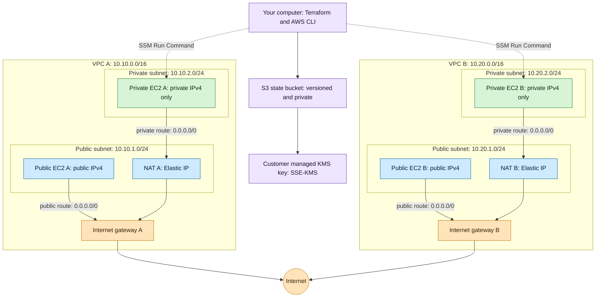
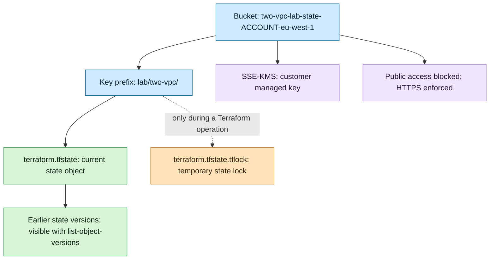

# Beginner lab: two AWS VPCs, public and private EC2, NAT, and KMS-encrypted Terraform state

This guide starts with a **lab AWS account using Region `eu-west-1`** and a computer with an Ubuntu/WSL Bash terminal. You will create **two independent VPCs**. Each VPC will have one public subnet, one private subnet, one public EC2 instance, one private EC2 instance, and one public NAT gateway. Terraform state will live in a versioned S3 bucket encrypted with a customer managed AWS KMS key. Terraform will coordinate writes using an S3 `.tflock` object.

> **Cost and scope:** This lab creates **two billed NAT gateways**, four EC2 instances with EBS volumes, two NAT Elastic IPs, two instance public IPv4 addresses, a customer managed KMS key, and S3 storage/requests. NAT gateways are billed while they exist, even if you do nothing. Destroy the lab when finished; see Step 11. This is a **single-AZ-per-VPC learning lab**, not a high availability production deployment. Check the [AWS Pricing Calculator](https://calculator.aws/#/) for your account/Region; do not assume a free tier covers these resources.

## 1. What you are building

**A VPC itself is not public or private.** Its subnets become public when their route table has a default route to an internet gateway; a private subnet here has a default route to a NAT gateway. Public EC2 instances explicitly receive public IPv4 addresses. Private EC2 instances do not. The two VPCs have separate route tables and **no peering or transit gateway**; they cannot talk to each other simply because both exist in the same account.



The NAT gateway **sits in the public subnet**. Its Elastic IP is the source address the internet sees when its VPC's private EC2 goes out. NAT allows an outbound request and its reply; it does not give the private instance an incoming public address. The security groups below have **no inbound rules**, including no SSH rule. AWS Systems Manager (SSM) lets you run verification commands on the instances through their outbound connection.

| Term | Plain meaning in this lab |
| --- | --- |
| VPC | An isolated IPv4 network inside your AWS account. |
| Subnet | A smaller address range inside exactly one VPC and one Availability Zone (AZ). |
| Internet gateway (IGW) | The VPC's route target for direct internet traffic from public subnets. |
| Route table | Decides where a packet goes for its destination. Each public subnet has `0.0.0.0/0 → IGW`; each private subnet has `0.0.0.0/0 → NAT`. AWS adds the VPC's `local` route automatically. |
| NAT gateway | Makes outbound internet access possible for IPv4-only private instances. |
| Security group | Instance firewall: here, no inbound rules and outbound IPv4 allowed. A route does not bypass the firewall. |
| Terraform state | A record that maps the resources in Terraform code to real AWS IDs; it can contain sensitive values. |
| S3 key | The full name of an S3 object, such as `lab/two-vpc/terraform.tfstate`. The apparent directories are prefixes of object keys. |

### Subnet math, worked out

An IPv4 address has 32 bits. For a `/24`, **24 bits identify the network** and 8 bits remain for addresses: `2^(32 − 24) = 256`. Its subnet mask is `255.255.255.0`. AWS reserves the **first four** and the **last** IPv4 address of each subnet, leaving `256 − 5 = 251` assignable IPv4 addresses. A `/16` has `2^(32 − 16) = 65,536` total addresses; its mask is `255.255.0.0`. A VPC's `/16` is an address container; you cannot assign all 65,536 addresses to EC2 until you create subnets inside it. See [AWS subnet sizing](https://docs.aws.amazon.com/vpc/latest/userguide/subnet-sizing.html).

| Network | CIDR | Full address range | Assignable addresses if subnet |
| --- | --- | --- | ---: |
| VPC A | `10.10.0.0/16` | `10.10.0.0`–`10.10.255.255` | Create subnets first |
| A public | `10.10.1.0/24` | `10.10.1.0`–`10.10.1.255` | 251: `.4`–`.254` |
| A private | `10.10.2.0/24` | `10.10.2.0`–`10.10.2.255` | 251: `.4`–`.254` |
| VPC B | `10.20.0.0/16` | `10.20.0.0`–`10.20.255.255` | Create subnets first |
| B public | `10.20.1.0/24` | `10.20.1.0`–`10.20.1.255` | 251: `.4`–`.254` |
| B private | `10.20.2.0/24` | `10.20.2.0`–`10.20.2.255` | 251: `.4`–`.254` |

For example, in `10.10.1.0/24`, AWS reserves `10.10.1.0` (network), `.1` (VPC router), `.2` (reserved for DNS), `.3` (future use), and `.255` (end of range). `10.10.1.4` through `10.10.1.254` are assignable. The two `/24` subnets in each VPC do **not overlap**. VPC A (`10.10.*.*`) and B (`10.20.*.*`) also do not overlap, which makes future inter-VPC connectivity easier to plan, but this lab does not set it up. A NAT gateway and EC2 network interfaces consume addresses from their respective subnets; an Elastic IP is a separate **public** IPv4 address.

To calculate the subnet ranges yourself, type this in the same Bash terminal. The command only prints numbers; it does not change AWS:

```bash
python3 - <<'PY'
import ipaddress
for cidr in ("10.10.1.0/24", "10.10.2.0/24", "10.20.1.0/24", "10.20.2.0/24"):
    subnet = ipaddress.ip_network(cidr)
    print(cidr, "first:", subnet.network_address, "last:", subnet.broadcast_address,
          "total:", subnet.num_addresses, "AWS-assignable:", subnet.num_addresses - 5)
PY
```

Each line shows its first/last address, `total: 256`, and `AWS-assignable: 251`. The `ipaddress` module is built into Python 3.

## 2. Terraform state bucket: exactly what is inside it

We create the bucket first using a small **bootstrap** Terraform configuration whose own state stays **local** in `bootstrap/terraform.tfstate`. The larger **infrastructure** configuration then uses the bucket as a remote backend. Terraform cannot use a bucket as its backend until the bucket exists.



| Bucket item or feature | What it does | When you see it |
| --- | --- | --- |
| `lab/two-vpc/terraform.tfstate` | Current mapping from code to AWS resources. **Treat as sensitive**; do not publish/download into Git. | After the infrastructure backend has written state. |
| Previous versions of that state object | Allows recovery of older state snapshots after mistakes; **not** a substitute for a full AWS resource backup. | With `list-object-versions`, not the normal object listing. |
| `lab/two-vpc/terraform.tfstate.tflock` | S3-native Terraform lock that prevents simultaneous state-changing operations. Terraform deletes it normally at the end; versioning can retain historical versions/delete markers. | Usually only while a plan/apply/destroy holds the lock. |
| KMS key | Encrypts the state and lockfile objects at rest; S3 Bucket Keys reduce KMS request traffic. | Verify in bucket encryption and object metadata. |
| Bucket policy/public access block | Denies insecure HTTP and public access. | Verify via AWS CLI. |

**Three different uses of “lock”:** `use_lockfile = true` means **Terraform state locking**; `.terraform.lock.hcl` in each working directory pins **provider versions** and should be committed to Git; **S3 Object Lock** means retention/legal hold for S3 object versions and is a separate feature. This lab uses the first two. It does **not** set Object Lock retention on the backend bucket: retained lockfile objects can complicate normal deletion/cleanup. Current Terraform documentation supports S3 lockfiles and marks DynamoDB-based locking deprecated. [Terraform S3 backend](https://developer.hashicorp.com/terraform/language/backend/s3) · [S3 Object Lock](https://docs.aws.amazon.com/AmazonS3/latest/userguide/object-lock.html).

## Step 0 — Prepare your computer and AWS account

1. Open **Ubuntu in WSL** on Windows, or a Linux terminal. The commands below are **Bash**, including `export`, `$(...)`, and `cat <<EOF`; do not paste them into PowerShell. Install [Terraform CLI](https://developer.hashicorp.com/terraform/install) **1.10 or newer**, [AWS CLI v2](https://docs.aws.amazon.com/cli/latest/userguide/getting-started-install.html), `nano`, and Python 3. Use the official OS-specific installers. Then type:

   ```bash
   terraform version
   aws --version
   python3 --version
   ```

   **Result:** All three programs print their versions. If `terraform: command not found` appears, complete the Terraform installation and reopen the terminal.

2. Obtain AWS credentials for a **lab IAM/Identity Center identity**, not the root user. For an organization using Identity Center, type `aws configure sso --profile lab`, answer the prompts with your organization's start URL and SSO Region, then `aws sso login --profile lab`. If your lab account uses an IAM access key instead, type `aws configure --profile lab` and supply its access key, secret, default Region `eu-west-1`, and output `json`. **Never paste the secret into a `.tf` file or Git.** The identity must be allowed to manage EC2/VPC, S3, KMS, IAM roles and instance profiles (including `iam:PassRole`), and SSM commands. Organization policies can still deny some operations.

3. Select the profile and Region for **this terminal session**:

   ```bash
   export AWS_PROFILE=lab
   export AWS_REGION=eu-west-1
   aws sts get-caller-identity
   ```

   **Result:** `get-caller-identity` prints your `Account` and ARN. Confirm this is the **intended AWS account** before creating anything. `AWS_PROFILE` tells both AWS CLI and Terraform which saved credentials to use; `AWS_REGION` is used in the backend setup below. If you chose another Region, change `AWS_REGION` **and both `aws_region` defaults** before creating resources.

## Step 1 — Create a tidy working folder

Type these commands in the Bash terminal from a folder where you want your project:

```bash
mkdir -p two-vpc-terraform-lab/bootstrap two-vpc-terraform-lab/infrastructure
cd two-vpc-terraform-lab
```

`mkdir -p` creates two separate Terraform working directories. `cd` puts you at the project root. The final layout is:

```text
two-vpc-terraform-lab/
├── .gitignore
├── bootstrap/
│   ├── versions.tf
│   ├── main.tf
│   └── outputs.tf
└── infrastructure/
    ├── versions.tf
    ├── variables.tf
    ├── main.tf
    ├── outputs.tf
    └── backend.hcl          # generated in Step 6; kept out of Git
```

Type `nano .gitignore`, paste the following, save with **Ctrl+O**, Enter, and exit with **Ctrl+X**. Use the same save/exit steps for every `nano` command below.

```gitignore
.terraform/
*.tfstate
*.tfstate.*
*.tfplan
*.tfvars
backend.hcl
crash.log
crash.*.log
```

This ignores state, working downloads, plans, and your locally generated backend configuration. **Keep the generated `.terraform.lock.hcl` files in Git**; they are different from `.tflock` state locks.

## Step 2 — Write the bootstrap Terraform files

From the project root, type `nano bootstrap/versions.tf` and paste **all** of this file:

```hcl
terraform {
  required_version = ">= 1.10.0"

  required_providers {
    aws = {
      source  = "hashicorp/aws"
      version = "~> 6.0"
    }
  }
}
```

`required_version` rejects Terraform versions without the S3 lockfile feature. `required_providers` gets a compatible AWS provider; `~> 6.0` permits compatible 6.x releases and excludes 7.x. `terraform init` will record the exact selected provider in `.terraform.lock.hcl`.

Type `nano bootstrap/main.tf`, then paste:

```hcl
variable "aws_region" {
  description = "AWS Region used by both the state bucket and the network lab."
  type        = string
  default     = "eu-west-1"
}

provider "aws" {
  region = var.aws_region
}

data "aws_caller_identity" "current" {}

resource "aws_kms_key" "state" {
  description             = "KMS key for two-vpc-lab Terraform state"
  deletion_window_in_days = 7
  enable_key_rotation     = true

  tags = { Project = "two-vpc-lab" }
}

resource "aws_kms_alias" "state" {
  name          = "alias/two-vpc-lab-terraform-state"
  target_key_id = aws_kms_key.state.key_id
}

resource "aws_s3_bucket" "state" {
  bucket        = "two-vpc-lab-state-${data.aws_caller_identity.current.account_id}-${var.aws_region}"
  force_destroy = false

  tags = { Project = "two-vpc-lab" }
}

resource "aws_s3_bucket_versioning" "state" {
  bucket = aws_s3_bucket.state.id

  versioning_configuration {
    status = "Enabled"
  }
}

resource "aws_s3_bucket_public_access_block" "state" {
  bucket                  = aws_s3_bucket.state.id
  block_public_acls       = true
  block_public_policy     = true
  ignore_public_acls      = true
  restrict_public_buckets = true
}

resource "aws_s3_bucket_server_side_encryption_configuration" "state" {
  bucket = aws_s3_bucket.state.id

  rule {
    apply_server_side_encryption_by_default {
      sse_algorithm     = "aws:kms"
      kms_master_key_id = aws_kms_key.state.arn
    }

    bucket_key_enabled = true
  }
}

data "aws_iam_policy_document" "state_tls_only" {
  statement {
    sid     = "DenyInsecureTransport"
    effect  = "Deny"
    actions = ["s3:*"]

    resources = [
      aws_s3_bucket.state.arn,
      "${aws_s3_bucket.state.arn}/*"
    ]

    principals {
      type        = "*"
      identifiers = ["*"]
    }

    condition {
      test     = "Bool"
      variable = "aws:SecureTransport"
      values   = ["false"]
    }
  }
}

resource "aws_s3_bucket_policy" "state_tls_only" {
  bucket = aws_s3_bucket.state.id
  policy = data.aws_iam_policy_document.state_tls_only.json
}
```

**Read the file from top to bottom:**

| Code | Why it exists |
| --- | --- |
| `variable` + `provider` | Pick the AWS Region; the default is Dublin, `eu-west-1`. |
| `aws_caller_identity` | Reads your account ID so the S3 bucket name is unique to your account and Region. |
| `aws_kms_key` + `aws_kms_alias` | Make a customer managed key and an easy-to-recognize alias. Rotation is enabled. The 7-day window applies if you later schedule key deletion. |
| `aws_s3_bucket` | Creates the state bucket. `force_destroy = false` protects against accidentally destroying a nonempty bucket. |
| `aws_s3_bucket_versioning` | Keeps earlier object versions, including older state snapshots. |
| `aws_s3_bucket_public_access_block` | Enables all four S3 public-access-block switches. |
| `aws_s3_bucket_server_side_encryption_configuration` | Configures default **SSE-KMS** using the new key, with S3 Bucket Keys enabled. |
| `aws_iam_policy_document` + `aws_s3_bucket_policy` | Deny S3 access without HTTPS. |

Type `nano bootstrap/outputs.tf`, then paste:

```hcl
output "state_bucket_name" {
  description = "S3 bucket holding the infrastructure Terraform state."
  value       = aws_s3_bucket.state.id
}

output "state_kms_key_arn" {
  description = "KMS key used for both the state object and its lockfile."
  value       = aws_kms_key.state.arn
}
```

Outputs give you the exact bucket name and KMS key ARN required in the next stage. **KMS is for the state bucket and lockfile.** The EC2 root EBS volumes also request encryption; they use your account's default EBS KMS key, which may be different from this state-bucket key.

## Step 3 — Create and check the S3 bucket and KMS key

Run these **one at a time**:

```bash
cd bootstrap
terraform fmt
terraform init
terraform validate
terraform plan
terraform apply
```

| Command | What it does | What to check |
| --- | --- | --- |
| `cd bootstrap` | Moves to the bootstrap directory. | Your prompt ends in `bootstrap`. |
| `terraform fmt` | Formats the `.tf` files. | Prints modified names, or nothing if already formatted. |
| `terraform init` | Downloads the AWS provider and prepares **local** bootstrap state. | Says Terraform has been successfully initialized. |
| `terraform validate` | Checks Terraform configuration structure. | Says the configuration is valid. |
| `terraform plan` | Shows changes without creating them. | Look for one bucket, one KMS key/alias, and bucket protections. |
| `terraform apply` | Repeats the plan and creates resources. | Read the changes, then type `yes` when prompted. Creation can take a few minutes. |

Now save the two outputs as shell variables **before leaving this directory**:

```bash
export STATE_BUCKET="$(terraform output -raw state_bucket_name)"
export STATE_KMS_ARN="$(terraform output -raw state_kms_key_arn)"
terraform output
```

`$(terraform output -raw ...)` substitutes each output into a Bash variable. `export` makes it available to later shell commands. The bucket is named like `two-vpc-lab-state-123456789012-eu-west-1` (your account number will differ). Do not delete `bootstrap/terraform.tfstate`: it is needed to manage the bucket and KMS key later.

Verify the bucket settings with **AWS CLI**:

```bash
aws s3api get-bucket-versioning --bucket "$STATE_BUCKET"
aws s3api get-bucket-encryption --bucket "$STATE_BUCKET"
aws s3api get-public-access-block --bucket "$STATE_BUCKET"
aws kms describe-key --key-id "$STATE_KMS_ARN" --query 'KeyMetadata.[Arn,KeyState]' --output table
aws s3api list-objects-v2 --bucket "$STATE_BUCKET" --query 'Contents[].Key' --output table
```

The first four show `Enabled`, `aws:kms` plus the key ARN, four `true` public-access flags, and an `Enabled` KMS key. The last command normally shows **no objects yet**: the network configuration has not written its state. `get-bucket-encryption` may also display the S3 Bucket Key setting.

**Before Step 6:** AWS recommends waiting **15 minutes after first enabling versioning** before writing an object to a new bucket, to allow the setting to propagate. You can use that time to write the network Terraform files. [AWS S3 versioning guidance](https://docs.aws.amazon.com/AmazonS3/latest/userguide/versioning-workflows.html).

## Step 4 — Write the VPC/EC2 Terraform files

Move back to the project root, then create each file with `nano`:

```bash
cd ..
nano infrastructure/versions.tf
```

Paste this complete `infrastructure/versions.tf`:

```hcl
terraform {
  required_version = ">= 1.10.0"

  required_providers {
    aws = {
      source  = "hashicorp/aws"
      version = "~> 6.0"
    }
  }

  backend "s3" {}
}
```

`backend "s3" {}` tells Terraform it will use S3, but the **actual bucket name, KMS key and lock settings** arrive from `backend.hcl` in Step 6. Terraform backend blocks cannot refer to normal Terraform variables/outputs, which is why we bootstrap first.

Type `nano infrastructure/variables.tf`, then paste:

```hcl
variable "aws_region" {
  description = "Must match the Region of the S3 state bucket."
  type        = string
  default     = "eu-west-1"
}

variable "instance_type" {
  description = "EC2 type for the four lab instances."
  type        = string
  default     = "t3.micro"
}
```

The two defaults choose the same AWS Region as the bucket and a small example EC2 instance type. AWS may charge for all four instances, even if a particular free tier exists on your account.

Type `nano infrastructure/main.tf`, then paste the **entire** file:

```hcl
provider "aws" {
  region = var.aws_region
}

locals {
  networks = {
    a = {
      vpc_cidr     = "10.10.0.0/16"
      public_cidr  = "10.10.1.0/24"
      private_cidr = "10.10.2.0/24"
    }
    b = {
      vpc_cidr     = "10.20.0.0/16"
      public_cidr  = "10.20.1.0/24"
      private_cidr = "10.20.2.0/24"
    }
  }
}

data "aws_availability_zones" "available" {
  state = "available"
}

data "aws_ssm_parameter" "al2023_ami" {
  name = "/aws/service/ami-amazon-linux-latest/al2023-ami-kernel-default-x86_64"
}

resource "aws_vpc" "lab" {
  for_each             = local.networks
  cidr_block           = each.value.vpc_cidr
  enable_dns_support   = true
  enable_dns_hostnames = true

  tags = { Name = "two-vpc-lab-${each.key}", Project = "two-vpc-lab" }
}

resource "aws_internet_gateway" "lab" {
  for_each = local.networks
  vpc_id   = aws_vpc.lab[each.key].id

  tags = { Name = "two-vpc-lab-${each.key}-igw", Project = "two-vpc-lab" }
}

resource "aws_subnet" "public" {
  for_each                = local.networks
  vpc_id                  = aws_vpc.lab[each.key].id
  cidr_block              = each.value.public_cidr
  availability_zone       = data.aws_availability_zones.available.names[0]
  map_public_ip_on_launch = false

  tags = { Name = "two-vpc-lab-${each.key}-public", Project = "two-vpc-lab" }
}

resource "aws_subnet" "private" {
  for_each                = local.networks
  vpc_id                  = aws_vpc.lab[each.key].id
  cidr_block              = each.value.private_cidr
  availability_zone       = data.aws_availability_zones.available.names[0]
  map_public_ip_on_launch = false

  tags = { Name = "two-vpc-lab-${each.key}-private", Project = "two-vpc-lab" }
}

resource "aws_route_table" "public" {
  for_each = local.networks
  vpc_id   = aws_vpc.lab[each.key].id

  route {
    cidr_block = "0.0.0.0/0"
    gateway_id = aws_internet_gateway.lab[each.key].id
  }

  tags = { Name = "two-vpc-lab-${each.key}-public-rt", Project = "two-vpc-lab" }
}

resource "aws_route_table_association" "public" {
  for_each       = local.networks
  subnet_id      = aws_subnet.public[each.key].id
  route_table_id = aws_route_table.public[each.key].id
}

resource "aws_eip" "nat" {
  for_each = local.networks
  domain   = "vpc"

  tags = { Name = "two-vpc-lab-${each.key}-nat-eip", Project = "two-vpc-lab" }
}

resource "aws_nat_gateway" "lab" {
  for_each      = local.networks
  allocation_id = aws_eip.nat[each.key].id
  subnet_id     = aws_subnet.public[each.key].id

  depends_on = [aws_internet_gateway.lab, aws_route_table_association.public]

  tags = { Name = "two-vpc-lab-${each.key}-nat", Project = "two-vpc-lab" }
}

resource "aws_route_table" "private" {
  for_each = local.networks
  vpc_id   = aws_vpc.lab[each.key].id

  route {
    cidr_block     = "0.0.0.0/0"
    nat_gateway_id = aws_nat_gateway.lab[each.key].id
  }

  tags = { Name = "two-vpc-lab-${each.key}-private-rt", Project = "two-vpc-lab" }
}

resource "aws_route_table_association" "private" {
  for_each       = local.networks
  subnet_id      = aws_subnet.private[each.key].id
  route_table_id = aws_route_table.private[each.key].id
}

resource "aws_security_group" "instance" {
  for_each    = local.networks
  name        = "two-vpc-lab-${each.key}-instances"
  description = "Outbound only; remote management via Systems Manager"
  vpc_id      = aws_vpc.lab[each.key].id

  tags = { Name = "two-vpc-lab-${each.key}-instances", Project = "two-vpc-lab" }
}

resource "aws_vpc_security_group_egress_rule" "instance_ipv4" {
  for_each          = local.networks
  security_group_id = aws_security_group.instance[each.key].id
  ip_protocol       = "-1"
  cidr_ipv4         = "0.0.0.0/0"

  tags = { Name = "two-vpc-lab-${each.key}-egress", Project = "two-vpc-lab" }
}

resource "aws_iam_role" "ssm" {
  name = "two-vpc-lab-ssm-ec2"

  assume_role_policy = jsonencode({
    Version = "2012-10-17"
    Statement = [{
      Effect    = "Allow"
      Action    = "sts:AssumeRole"
      Principal = { Service = "ec2.amazonaws.com" }
    }]
  })

  tags = { Project = "two-vpc-lab" }
}

resource "aws_iam_role_policy_attachment" "ssm" {
  role       = aws_iam_role.ssm.name
  policy_arn = "arn:aws:iam::aws:policy/AmazonSSMManagedInstanceCore"
}

resource "aws_iam_instance_profile" "ssm" {
  name = "two-vpc-lab-ssm-ec2"
  role = aws_iam_role.ssm.name

  tags = { Project = "two-vpc-lab" }
}

resource "aws_instance" "public" {
  for_each                    = local.networks
  ami                         = data.aws_ssm_parameter.al2023_ami.value
  instance_type               = var.instance_type
  subnet_id                   = aws_subnet.public[each.key].id
  associate_public_ip_address = true
  vpc_security_group_ids      = [aws_security_group.instance[each.key].id]
  iam_instance_profile        = aws_iam_instance_profile.ssm.name
  volume_tags                 = { Project = "two-vpc-lab" }

  root_block_device {
    encrypted   = true
    volume_type = "gp3"
  }

  metadata_options {
    http_tokens = "required"
  }

  depends_on = [aws_route_table_association.public, aws_iam_role_policy_attachment.ssm]

  tags = { Name = "two-vpc-lab-${each.key}-public-ec2", Project = "two-vpc-lab" }
}

resource "aws_instance" "private" {
  for_each                    = local.networks
  ami                         = data.aws_ssm_parameter.al2023_ami.value
  instance_type               = var.instance_type
  subnet_id                   = aws_subnet.private[each.key].id
  associate_public_ip_address = false
  vpc_security_group_ids      = [aws_security_group.instance[each.key].id]
  iam_instance_profile        = aws_iam_instance_profile.ssm.name
  volume_tags                 = { Project = "two-vpc-lab" }

  root_block_device {
    encrypted   = true
    volume_type = "gp3"
  }

  metadata_options {
    http_tokens = "required"
  }

  depends_on = [aws_route_table_association.private, aws_iam_role_policy_attachment.ssm]

  tags = { Name = "two-vpc-lab-${each.key}-private-ec2", Project = "two-vpc-lab" }
}
```

**Follow what the code creates, in order:**

| Code block | What happens in AWS |
| --- | --- |
| `locals.networks` | Names VPC A and B and their nonoverlapping CIDRs. `for_each` repeats a resource **once for A and once for B**. |
| `aws_availability_zones`, `aws_ssm_parameter` | Select an available AZ and look up the current x86_64 Amazon Linux 2023 AMI in your Region. |
| `aws_vpc`, `aws_subnet` | Create 2 VPCs and 4 subnets; the sample deliberately puts both subnets of a VPC in one AZ. |
| `aws_internet_gateway` | Attach 1 IGW to each VPC. |
| Public route table + association | Send each public subnet's nonlocal IPv4 traffic to its IGW. |
| `aws_eip`, `aws_nat_gateway` | Allocate 1 Elastic IP and create 1 public NAT gateway **inside each VPC's public subnet**. |
| Private route table + association | Send each private subnet's nonlocal IPv4 traffic to **its own VPC's NAT**. |
| Security group and egress rule | Permit outgoing IPv4; no incoming port is opened. |
| IAM role, policy attachment, instance profile | Allow EC2's SSM Agent to call the Systems Manager service. The IAM role belongs to the **instances**, not to Terraform's human operator. |
| `aws_instance.public` | Launch one Amazon Linux 2023 EC2 per public subnet with a public IP. |
| `aws_instance.private` | Launch one Amazon Linux 2023 EC2 per private subnet **without** a public IP. |
| `root_block_device`, `metadata_options` | Encrypt each root EBS volume using the account default EBS KMS key and require IMDSv2. |

Type `nano infrastructure/outputs.tf`, then paste:

```hcl
output "vpc_ids" {
  description = "VPC ID for each network."
  value       = { for name, vpc in aws_vpc.lab : name => vpc.id }
}

output "public_subnet_ids" {
  description = "Public subnet ID for each VPC."
  value       = { for name, subnet in aws_subnet.public : name => subnet.id }
}

output "private_subnet_ids" {
  description = "Private subnet ID for each VPC."
  value       = { for name, subnet in aws_subnet.private : name => subnet.id }
}

output "nat_gateway_ids" {
  description = "Public NAT gateway ID for each VPC."
  value       = { for name, nat in aws_nat_gateway.lab : name => nat.id }
}

output "nat_public_ips" {
  description = "Elastic public IPv4 address used by each NAT gateway."
  value       = { for name, eip in aws_eip.nat : name => eip.public_ip }
}

output "public_instance_ids" {
  description = "Instance IDs of the public EC2 instances."
  value       = { for name, instance in aws_instance.public : name => instance.id }
}

output "private_instance_ids" {
  description = "Instance IDs of the private EC2 instances."
  value       = { for name, instance in aws_instance.private : name => instance.id }
}

output "private_a_instance_id" {
  description = "VPC A private instance ID for copy-and-paste CLI tests."
  value       = aws_instance.private["a"].id
}

output "private_b_instance_id" {
  description = "VPC B private instance ID for copy-and-paste CLI tests."
  value       = aws_instance.private["b"].id
}

output "public_instance_ips" {
  description = "Public IPv4 addresses of the public EC2 instances."
  value       = { for name, instance in aws_instance.public : name => instance.public_ip }
}

output "private_instance_ips" {
  description = "Private IPv4 addresses of the private EC2 instances."
  value       = { for name, instance in aws_instance.private : name => instance.private_ip }
}
```

Outputs print the IDs and IPs you need for AWS CLI verification. An output is **information**, not a new resource.

## Step 5 — Configure the S3 backend with KMS and locking

At the project root, run exactly this Bash block:

```bash
cat > infrastructure/backend.hcl <<EOF
bucket       = "$STATE_BUCKET"
key          = "lab/two-vpc/terraform.tfstate"
region       = "$AWS_REGION"
encrypt      = true
kms_key_id   = "$STATE_KMS_ARN"
use_lockfile = true
EOF
```

This writes `backend.hcl` with your **actual** bucket name and key ARN. The `key` line names an S3 object, not a KMS key. `kms_key_id` selects the KMS key for both state and lockfile; `use_lockfile` makes Terraform acquire and release the `.tflock` object. No DynamoDB table is needed. Your AWS identity needs S3 access to the state object and lockfile plus KMS `Encrypt`, `Decrypt`, and `GenerateDataKey` permissions. See the [Terraform S3 backend permissions](https://developer.hashicorp.com/terraform/language/backend/s3#permissions-required).

To check the generated settings without looking at any secret, type `cat infrastructure/backend.hcl`. The bucket name and KMS ARN are identifiers, not passwords. **Do not commit** `backend.hcl`; it is ignored by `.gitignore`.

## Step 6 — Plan and create the VPCs, NAT gateways, and instances

Run these one at a time:

```bash
cd infrastructure
terraform fmt
terraform init -backend-config=backend.hcl
terraform validate
terraform plan
terraform apply
terraform output
```

`cd infrastructure` selects the **other** Terraform state. `terraform fmt` formats code. `terraform init -backend-config=backend.hcl` downloads the provider, connects to the already-created S3 bucket, and configures KMS-backed state and locking. `terraform validate` checks structure. `terraform plan` previews resources; inspect that it targets **the right account/Region** and shows **two VPCs, four subnets, two NAT gateways, and four instances**. `terraform apply` makes the changes after you type `yes`. `terraform output` displays AWS IDs and IPs. NAT provisioning can take several minutes. Do **not** run `terraform apply` in two terminals at once.

You can repeat `terraform plan` after the apply. If nothing changed, it should report **no changes**. If the AMI public parameter has changed since you applied, a later plan may show an instance replacement; read it before approving.

## Step 7 — Verify the network with AWS CLI

Continue **inside `infrastructure/`**, with the same shell variables exported earlier. Type each command and compare its result to the explanation:

```bash
aws ec2 describe-vpcs --filters Name=tag:Project,Values=two-vpc-lab --query 'Vpcs[].[VpcId,CidrBlock,State]' --output table
```

Expect **two** VPC IDs with `10.10.0.0/16` and `10.20.0.0/16`, both `available`.

```bash
aws ec2 describe-subnets --filters Name=tag:Project,Values=two-vpc-lab --query 'Subnets[].[VpcId,SubnetId,CidrBlock,AvailabilityZone,AvailableIpAddressCount]' --output table
```

Expect **four** subnet rows. `AvailableIpAddressCount` starts at 251 and drops as private addresses are assigned to instances/NAT and other interfaces. The selected AZ name depends on your account.

```bash
aws ec2 describe-route-tables --filters Name=tag:Project,Values=two-vpc-lab --query 'RouteTables[].{VPC:VpcId,Routes:Routes,SubnetAssociations:Associations[].SubnetId}' --output json
```

Expect **four custom route tables**. In each VPC, the public table's `0.0.0.0/0` has a `GatewayId` beginning `igw-`; the private table's `0.0.0.0/0` has a `NatGatewayId` beginning `nat-`. Each table is associated with the matching subnet. AWS also maintains a **main** route table per VPC; our two custom associations are explicit.

```bash
aws ec2 describe-nat-gateways --filter Name=tag:Project,Values=two-vpc-lab --query 'NatGateways[].[NatGatewayId,VpcId,SubnetId,State,NatGatewayAddresses[0].PublicIp]' --output table
```

Expect **two** gateways in `available` state with **different** VPC IDs and public Elastic IPs. The flag here is `--filter` (singular), as defined by the NAT gateway CLI command.

```bash
aws ec2 describe-instances --filters Name=tag:Project,Values=two-vpc-lab --query 'Reservations[].Instances[].[InstanceId,VpcId,SubnetId,State.Name,PrivateIpAddress,PublicIpAddress]' --output table
```

Expect **four running** instances. Two show a public IP; both private instances have **no** public IP. Being in a public subnet alone does not force a public IP: the instance resource explicitly requested it.

```bash
aws ec2 describe-volumes --filters Name=tag:Project,Values=two-vpc-lab --query 'Volumes[].[VolumeId,Encrypted,KmsKeyId,Size]' --output table
```

Expect **four encrypted EBS root volumes** (`Encrypted` = `True`). Their KMS key may differ from the state-bucket KMS key because these volumes use the account's default EBS encryption key.

## Step 8 — Prove private EC2 uses its own NAT gateway

First get the two private instance IDs and the NAT Elastic IP outputs:

```bash
export PRIVATE_A_ID="$(terraform output -raw private_a_instance_id)"
export PRIVATE_B_ID="$(terraform output -raw private_b_instance_id)"
terraform output nat_public_ips
aws ssm describe-instance-information --filters "Key=InstanceIds,Values=$PRIVATE_A_ID,$PRIVATE_B_ID" --query 'InstanceInformationList[].[InstanceId,PingStatus]' --output table
```

The first two commands capture instance IDs. The third prints NAT A and NAT B's expected **public** IPs. The SSM query should show both instances as `Online`; give EC2/SSM a few minutes after launch if it is initially empty. The private instances reach SSM through **their NAT gateways**.

Run a harmless shell command on **both** private instances, without SSH or public IPs:

```bash
export COMMAND_ID="$(aws ssm send-command --instance-ids "$PRIVATE_A_ID" "$PRIVATE_B_ID" --document-name AWS-RunShellScript --parameters 'commands=["curl -fsS --max-time 10 https://checkip.amazonaws.com"]' --query 'Command.CommandId' --output text)"
aws ssm wait command-executed --command-id "$COMMAND_ID" --instance-id "$PRIVATE_A_ID"
aws ssm wait command-executed --command-id "$COMMAND_ID" --instance-id "$PRIVATE_B_ID"
aws ssm get-command-invocation --command-id "$COMMAND_ID" --instance-id "$PRIVATE_A_ID" --query '[Status,StandardOutputContent,StandardErrorContent]' --output json
aws ssm get-command-invocation --command-id "$COMMAND_ID" --instance-id "$PRIVATE_B_ID" --query '[Status,StandardOutputContent,StandardErrorContent]' --output json
```

`send-command` asks SSM to execute `curl` **inside** each instance. `checkip.amazonaws.com` replies with the public IP it sees. `wait` polls for successful completion, and `get-command-invocation` prints the status and output. **Private A's returned IP should equal `nat_public_ips.a`; private B's should equal `nat_public_ips.b`.** This tests outbound routing end to end. No inbound SSH rule or `key_name` was needed. [AWS CLI SSM command waiter](https://docs.aws.amazon.com/cli/latest/reference/ssm/wait/command-executed.html).

## Step 9 — Inspect S3 objects, versions, lock, and encryption

The bucket should now hold the state object. Type:

```bash
aws s3api list-objects-v2 --bucket "$STATE_BUCKET" --query 'Contents[].[Key,Size,LastModified]' --output table
```

Expect `lab/two-vpc/terraform.tfstate`. `lab/` and `two-vpc/` are **key prefixes**, not necessarily separate objects. You normally **will not see `.tflock`** in this current-object listing when Terraform has finished normally.

```bash
aws s3api list-object-versions --bucket "$STATE_BUCKET" --prefix lab/two-vpc/ --query '{Versions:Versions[].[Key,VersionId,IsLatest],DeleteMarkers:DeleteMarkers[].[Key,VersionId,IsLatest]}' --output json
```

Expect version IDs for your state; after more Terraform operations, expect more versions. You may also see earlier `.tflock` versions and delete markers because **bucket versioning remembers deletes**. The current-object listing and version listing therefore answer different questions.

```bash
aws s3api head-object --bucket "$STATE_BUCKET" --key lab/two-vpc/terraform.tfstate --query '{Encryption:ServerSideEncryption,KmsKey:SSEKMSKeyId,Version:VersionId}' --output table
aws s3api get-bucket-policy --bucket "$STATE_BUCKET" --query Policy --output text
```

The first command shows `aws:kms`, your state key ARN, and a version ID **without downloading the state**. The second shows the bucket policy denying insecure transport. The object holds infrastructure details: do not copy it into a public repository. `get-bucket-versioning`, `get-bucket-encryption`, and `get-public-access-block` from Step 3 remain useful checks.

## Step 10 — Common errors and what to check

| Symptom | Check and action |
| --- | --- |
| `AccessDenied` during KMS/bucket init | Check `aws sts get-caller-identity`; confirm the intended AWS profile, bucket ownership, S3 object/lockfile permissions and KMS `Encrypt`, `Decrypt`, `GenerateDataKey` grants. A KMS key policy and IAM permissions must both allow use. |
| `AccessDenied` creating EC2 role/profile | Your Terraform operator needs IAM create/attach permissions and `iam:PassRole`. Ask the AWS account administrator for the lab permissions; do not put credentials into Terraform code. |
| SSM query shows no private instances | Wait several minutes; verify NAT is `available`, private route points at it, outbound SG rule exists, instance profile attached, and SSM Agent is present/running on the AMI. In this lab, private SSM needs NAT; there are no SSM VPC endpoints. |
| NAT stuck, limit exceeded, or EC2 launch fails | Check service quotas, instance type/AMI availability, Elastic IP capacity, and that account permissions permit internet gateways/NAT. Inspect the error from `terraform apply` and run `terraform plan` again after fixing the cause. |
| Bucket or IAM/KMS alias already exists | Choose a different project-specific name consistently in the bootstrap code, and remove any partial resources **through their Terraform state** rather than deleting them blindly in the AWS Console. The fixed role/alias names can collide if you run this lab twice in one account. |
| `terraform init` says backend settings changed | Confirm `backend.hcl` points to the intended **existing** bucket/Region. Do not accept state migration or `-reconfigure` until you know which state you are moving or reusing. |
| `NoSuchBucket` from AWS CLI | Confirm `STATE_BUCKET` is still set (`echo "$STATE_BUCKET"`); if using a fresh shell, `cd bootstrap`, rerun the two `export STATE_...` commands from Step 3, then return. |

## Step 11 — Clean up in the right order

**Destroy the networking first while its S3 state bucket and KMS key still exist.** Run from `infrastructure/`:

```bash
terraform plan -destroy
terraform destroy
```

Read the destroy plan, then type `yes` to `terraform destroy`. Wait until Terraform confirms complete. This deletes the four EC2 instances and volumes, both NAT gateways and Elastic IPs, both VPC networks, the role/profile, and other infrastructure resources. The **versioned state object may still exist in S3** after destroy; that is normal. Check `terraform plan` if needed. NAT deletion can take a few minutes.

If you intend to **keep the state history**, stop here and keep paying for the bucket/KMS key. If this is only a disposable lab and you have checked you do not need the state versions, remove the bootstrap resources as follows:

1. Type `cd ../bootstrap`. Open `nano main.tf` and change exactly **one line** in the `aws_s3_bucket.state` resource from `force_destroy = false` to `force_destroy = true`. Save and exit. This tells Terraform that the **versioned bucket, including prior versions/delete markers**, may be emptied and deleted during destroy. This is a destructive choice; only do it for the disposable lab bucket.
2. Type each command:

   ```bash
   terraform plan
   terraform apply
   terraform plan -destroy
   terraform destroy
   ```

   The first `apply` records `force_destroy = true` in the bootstrap state. Inspect both plans and type `yes` at each apply/destroy prompt. The last command empties the bucket, removes its policy/configuration/alias, and **schedules the customer managed KMS key for deletion after 7 days**. Key deletion is delayed by AWS and makes any remaining data encrypted under it unreadable. Never schedule deletion if another bucket or application uses the key. [AWS KMS key deletion](https://docs.aws.amazon.com/kms/latest/developerguide/deleting-keys.html).

3. From the project root, `git status --short` can show which **code** is ready to commit. The `.gitignore` keeps local state/backend settings out of the commit. If you later change regions, accounts, names, or CIDRs, plan it as a **new** deployment rather than editing a running lab without checking the plan.

## What changes for a real production design?

This lab uses **one AZ in each VPC**, so losing that AZ affects its instances and NAT. A highly available layout normally uses **at least two AZs per VPC**, a public/private subnet pair in **each AZ**, and a NAT gateway in each AZ with each AZ's private route table pointing at its **same-AZ NAT**. Production also needs application-specific inbound rules, load balancing, logging/monitoring, backups, tighter IAM/KMS access, and a deliberate inter-VPC connection if workloads must talk. More AZs/NATs mean more resources and cost. [AWS NAT gateways](https://docs.aws.amazon.com/vpc/latest/userguide/vpc-nat.html) · [NAT pricing model](https://docs.aws.amazon.com/vpc/latest/userguide/nat-gateway-pricing.html).

## Official references used for this guide

- [HashiCorp: S3 backend, lockfiles, SSE-KMS, and permissions](https://developer.hashicorp.com/terraform/language/backend/s3)
- [AWS: subnet sizing and five reserved IPv4 addresses](https://docs.aws.amazon.com/vpc/latest/userguide/subnet-sizing.html)
- [AWS: how public and private subnet routes work](https://docs.aws.amazon.com/vpc/latest/userguide/VPC_Route_Tables.html)
- [AWS: NAT gateway behavior](https://docs.aws.amazon.com/vpc/latest/userguide/vpc-nat.html)
- [AWS: Amazon Linux 2023 AMI public SSM parameters](https://docs.aws.amazon.com/AWSEC2/latest/UserGuide/finding-an-ami-parameter-store.html)
- [AWS: SSM Agent on Amazon Linux 2023](https://docs.aws.amazon.com/systems-manager/latest/userguide/ami-preinstalled-agent.html)
- [AWS: S3 Bucket Keys with SSE-KMS](https://docs.aws.amazon.com/AmazonS3/latest/userguide/bucket-key.html)
- [AWS: EBS encryption key defaults](https://docs.aws.amazon.com/ebs/latest/userguide/encryption-examples.html)

*Guide checked against the linked official documentation on 2026-09-25. Resource creation and AWS CLI output depend on your account, Region, permissions, quotas, and the selected provider/AMI versions.*
