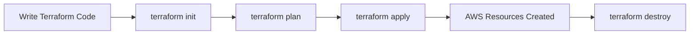
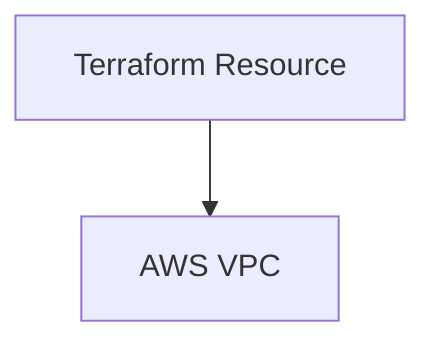
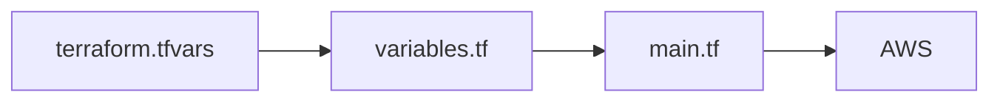
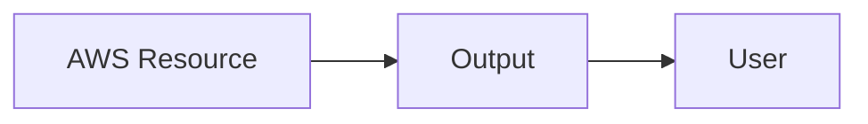

# Terraform on AWS – Beginner Hands-on Guide (Part 1)

> GitHub Friendly | Beginner Tutorial | Practice Guide

# Table of Contents

1. Terraform Basics
2. Provider
3. Resources
4. Variables
5. Outputs
6. Practice Exercise

---

# 1. Terraform Basics

Terraform is an Infrastructure as Code (IaC) tool. Instead of creating AWS resources manually, you describe them in code.

## Workflow



## Install

```bash
terraform version
```

Expected

```text
Terraform v1.x.x
```

---

# Project Structure

```text
terraform-vpc/
├── main.tf
├── variables.tf
├── outputs.tf
├── terraform.tfvars
```

---

# 2. Provider

A provider tells Terraform which cloud to talk to.

## main.tf

```hcl
terraform {
  required_providers {
    aws = {
      source  = "hashicorp/aws"
      version = "~> 6.0"
    }
  }
}

provider "aws" {
  region = "eu-central-1"
}
```

Explanation

- `terraform` defines required providers.
- `provider "aws"` configures AWS.
- `region` decides where resources are created.

Initialize

```bash
terraform init
```

Expected

```text
Initializing provider plugins...
Terraform has been successfully initialized!
```

---

# 3. Resources

A resource creates infrastructure.

## Example: Create a VPC

```hcl
resource "aws_vpc" "main" {
  cidr_block           = "10.0.0.0/16"
  enable_dns_support   = true
  enable_dns_hostnames = true

  tags = {
    Name = "openhelp-vpc"
  }
}
```

Mermaid



Explanation

- `resource` = create something.
- `aws_vpc` = AWS resource type.
- `main` = local Terraform name.
- `cidr_block` = IP range.
- `tags` = labels shown in AWS.

Run

```bash
terraform plan
```

Sample

```text
Plan: 1 to add, 0 to change, 0 to destroy.
```

Apply

```bash
terraform apply
```

Expected

```text
Apply complete!

Resources:
1 added.
```

Destroy

```bash
terraform destroy
```

---

# 4. Variables

Variables avoid hardcoding values.

## variables.tf

```hcl
variable "aws_region" {
  description = "AWS Region"
  type        = string
  default     = "eu-central-1"
}

variable "vpc_cidr" {
  description = "VPC CIDR"
  type        = string
}
```

## terraform.tfvars

```hcl
vpc_cidr = "10.0.0.0/16"
```

## main.tf

```hcl
provider "aws" {
  region = var.aws_region
}

resource "aws_vpc" "main" {
  cidr_block = var.vpc_cidr

  tags = {
    Name = "practice-vpc"
  }
}
```

Variable Flow



Useful Types

```hcl
variable "instance_type" {
  type = string
}

variable "ports" {
  type = list(number)
}

variable "tags" {
  type = map(string)
}
```

Example map

```hcl
tags = {
  Name = "demo"
  Owner = "Sreejith"
  Env = "Dev"
}
```

---

# 5. Outputs

Outputs display values after apply.

## outputs.tf

```hcl
output "vpc_id" {
  value = aws_vpc.main.id
}

output "vpc_cidr" {
  value = aws_vpc.main.cidr_block
}
```

Run

```bash
terraform apply
```

Expected

```text
Outputs:

vpc_id = "vpc-0123456789abcdef"
vpc_cidr = "10.0.0.0/16"
```

Show later

```bash
terraform output
```

Expected

```text
vpc_cidr = 10.0.0.0/16
vpc_id = vpc-0123456789abcdef
```

Output Flow



---

# Complete Example

## main.tf

```hcl
terraform {
  required_providers {
    aws = {
      source = "hashicorp/aws"
      version = "~> 6.0"
    }
  }
}

provider "aws" {
  region = var.aws_region
}

resource "aws_vpc" "main" {
  cidr_block           = var.vpc_cidr
  enable_dns_support   = true
  enable_dns_hostnames = true

  tags = {
    Name = "openhelp-vpc"
  }
}
```

## variables.tf

```hcl
variable "aws_region" {
  type = string
  default = "eu-central-1"
}

variable "vpc_cidr" {
  type = string
}
```

## terraform.tfvars

```hcl
vpc_cidr = "10.0.0.0/16"
```

## outputs.tf

```hcl
output "vpc_id" {
  value = aws_vpc.main.id
}
```

## Commands

```bash
terraform init
terraform fmt
terraform validate
terraform plan
terraform apply
terraform output
terraform destroy
```

---

# Beginner Practice

1. Change VPC CIDR to `192.168.0.0/16`.
2. Change region to `us-east-1`.
3. Change tag Name.
4. Add another output for ARN.
5. Remove default region and pass using `terraform.tfvars`.

---

# Interview Questions

**Q. What is Terraform?**

Infrastructure as Code tool used to provision cloud resources using code.

**Q. What is a Provider?**

A plugin that allows Terraform to communicate with a platform such as AWS.

**Q. What is a Resource?**

Any infrastructure object created by Terraform, such as a VPC or EC2 instance.

**Q. Why use Variables?**

To make code reusable and avoid hardcoding.

**Q. Why use Outputs?**

To display useful values like IDs, ARNs, and IP addresses after deployment.
