# AWS EKS Cluster Using Modular Terraform - Beginner Friendly Runbook

This document explains how to create an **AWS EKS Kubernetes cluster** using **Terraform in modular form**.

This is written for a beginner. Every step explains:

- what file to create
- what code to write
- what Terraform does in the backend
- how one module refers to another module
- how the root Terraform files connect everything together

> Scope: This guide creates only an **EKS cluster**.  
> It does **not** install Elasticsearch, Kibana, Rancher, ArgoCD, or any application.

Official references:

- Amazon EKS Kubernetes versions: <https://docs.aws.amazon.com/eks/latest/userguide/kubernetes-versions.html>
- Terraform AWS provider: <https://registry.terraform.io/providers/hashicorp/aws/latest>
- Terraform AWS VPC module: <https://registry.terraform.io/modules/terraform-aws-modules/vpc/aws/latest>
- Terraform AWS EKS module: <https://registry.terraform.io/modules/terraform-aws-modules/eks/aws/latest>

---

## Final Architecture

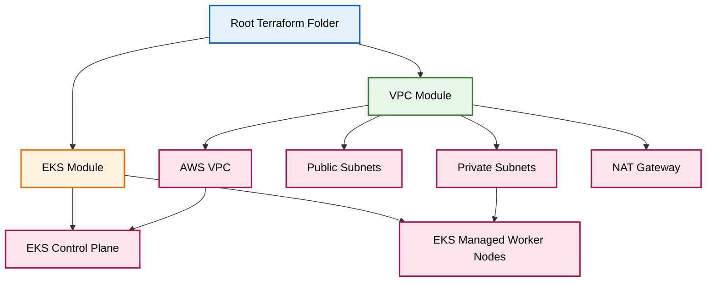

Simple meaning:

- **Root folder** is the main control room.
- **VPC module** creates networking.
- **EKS module** creates Kubernetes cluster and worker nodes.
- The EKS module needs VPC information, so it receives `vpc_id` and `private_subnets` from the VPC module.

---

# Step 1. Create Folder Structure

Run these commands from your Linux machine, CI host, or Terraform workstation.

```bash
mkdir -p eks-modular/modules/vpc
mkdir -p eks-modular/modules/eks
cd eks-modular

touch provider.tf variables.tf terraform.tfvars main.tf outputs.tf
touch modules/vpc/main.tf modules/vpc/variables.tf modules/vpc/outputs.tf
touch modules/eks/main.tf modules/eks/variables.tf modules/eks/outputs.tf
```

You are creating this structure:

```text
eks-modular/
├── provider.tf
├── variables.tf
├── terraform.tfvars
├── main.tf
├── outputs.tf
└── modules/
    ├── vpc/
    │   ├── main.tf
    │   ├── variables.tf
    │   └── outputs.tf
    └── eks/
        ├── main.tf
        ├── variables.tf
        └── outputs.tf
```

### Beginner explanation

Terraform reads files from the current folder. Here, `eks-modular/` is the **root module**.

Inside it, we create two child modules:

- `modules/vpc` = networking module
- `modules/eks` = Kubernetes cluster module

### Backend example

When you run `terraform apply`, Terraform first reads the root `main.tf`. Then it sees:

```hcl
module "vpc" {
  source = "./modules/vpc"
}
```

That tells Terraform:

> Go inside the folder `modules/vpc` and run the Terraform code there.

### Diagram

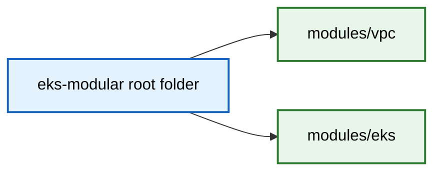

---

# Step 2. Create `provider.tf`

File:

```text
provider.tf
```

Content:

```hcl
terraform {
  required_version = ">= 1.6.0"

  required_providers {
    aws = {
      source  = "hashicorp/aws"
      version = "~> 6.0"
    }
  }
}

provider "aws" {
  region = var.aws_region
}
```

### Beginner explanation

This file tells Terraform:

- use Terraform version `1.6.0` or newer
- download the AWS provider from HashiCorp
- create resources in the AWS region stored in `var.aws_region`

### What is provider?

A Terraform provider is like a driver.

Example:

```text
Terraform itself does not know how to create an AWS VPC.
The AWS provider teaches Terraform how to talk to AWS APIs.
```

### Backend example

When you run:

```bash
terraform init
```

Terraform downloads the AWS provider plugin. Later, when you run:

```bash
terraform apply
```

Terraform uses that provider to call AWS APIs like:

```text
Create VPC
Create subnets
Create EKS cluster
Create node group
```

### Diagram

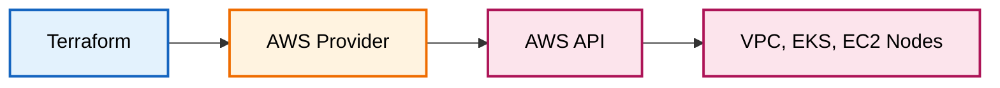

---

# Step 3. Create `variables.tf`

File:

```text
variables.tf
```

Content:

```hcl
variable "aws_region" {
  type    = string
  default = "eu-central-1"
}

variable "cluster_name" {
  type    = string
  default = "openhelp-prod-eks"
}
```

### Beginner explanation

Variables are input values.

Instead of hardcoding the region and cluster name everywhere, we keep them as variables.

Example:

```hcl
var.aws_region
```

means:

```text
Use the value of the aws_region variable.
```

### Backend example

If `aws_region = "eu-central-1"`, Terraform creates the cluster in the Frankfurt AWS region.

If later you change it to:

```hcl
aws_region = "eu-west-1"
```

Terraform understands that you want to use Ireland instead.

### Diagram

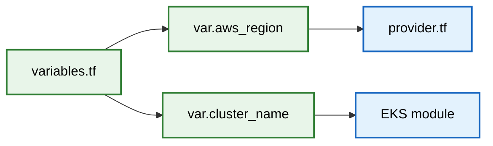

---

# Step 4. Create `terraform.tfvars`

File:

```text
terraform.tfvars
```

Content:

```hcl
aws_region   = "eu-central-1"
cluster_name = "openhelp-prod-eks"
```

### Beginner explanation

`variables.tf` declares the variables.

`terraform.tfvars` gives actual values to those variables.

Simple example:

```text
variables.tf      = I need a variable called cluster_name
terraform.tfvars  = The cluster_name value is openhelp-prod-eks
```

### Backend example

Terraform automatically reads `terraform.tfvars` when you run:

```bash
terraform plan
terraform apply
```

You do not need to pass this file manually.

### Diagram

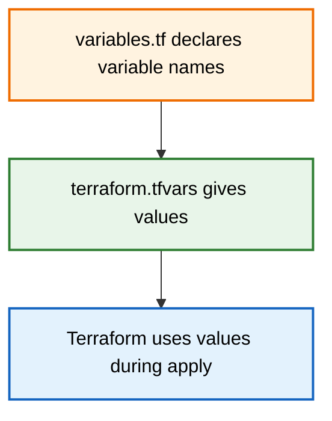

---

# Step 5. Create `modules/vpc/variables.tf`

File:

```text
modules/vpc/variables.tf
```

Content:

```hcl
variable "aws_region" {
  type = string
}
```

### Beginner explanation

This variable belongs only to the VPC module.

The VPC module needs the AWS region so it can create subnets in the correct Availability Zones.

For example:

```hcl
"${var.aws_region}a"
"${var.aws_region}b"
"${var.aws_region}c"
```

If the region is `eu-central-1`, this becomes:

```text
eu-central-1a
eu-central-1b
eu-central-1c
```

### Backend example

The root module passes the value to the VPC module like this:

```hcl
module "vpc" {
  source     = "./modules/vpc"
  aws_region = var.aws_region
}
```

So the value flows like this:

```text
terraform.tfvars -> root variables.tf -> root main.tf -> modules/vpc/variables.tf
```

### Diagram

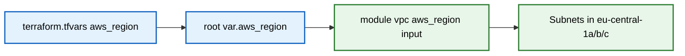

---

# Step 6. Create `modules/vpc/main.tf`

File:

```text
modules/vpc/main.tf
```

Content:

```hcl
module "vpc" {
  source  = "terraform-aws-modules/vpc/aws"
  version = "~> 6.0"

  name = "openhelp-eks-vpc"
  cidr = "10.10.0.0/16"

  azs = [
    "${var.aws_region}a",
    "${var.aws_region}b",
    "${var.aws_region}c"
  ]

  private_subnets = [
    "10.10.1.0/24",
    "10.10.2.0/24",
    "10.10.3.0/24"
  ]

  public_subnets = [
    "10.10.101.0/24",
    "10.10.102.0/24",
    "10.10.103.0/24"
  ]

  enable_nat_gateway = true
  single_nat_gateway = true

  tags = {
    Environment = "prod"
    Project     = "openhelp"
  }
}
```

### Beginner explanation

This module creates the AWS network.

It creates:

- VPC
- 3 private subnets
- 3 public subnets
- route tables
- internet gateway
- NAT gateway

### What is VPC?

A VPC is your private network inside AWS.

Example:

```text
Your office has a private network like 192.168.0.0/24.
AWS VPC is the same idea, but inside AWS.
```

Here we use:

```text
10.10.0.0/16
```

That gives enough IP addresses for the EKS cluster.

### What are private subnets?

EKS worker nodes are placed in private subnets.

That means worker nodes do not directly expose public IPs to the internet.

### What are public subnets?

Public subnets are used for internet-facing resources such as load balancers or NAT gateway.

### What is NAT Gateway?

Private worker nodes need internet access to download container images and patches.

They use NAT Gateway for outbound internet access.

### Backend example

Terraform calls AWS and creates resources similar to:

```text
aws_vpc
aws_subnet
aws_route_table
aws_internet_gateway
aws_nat_gateway
```

We do not write all those low-level resources manually because the public VPC module creates them for us.

### Diagram

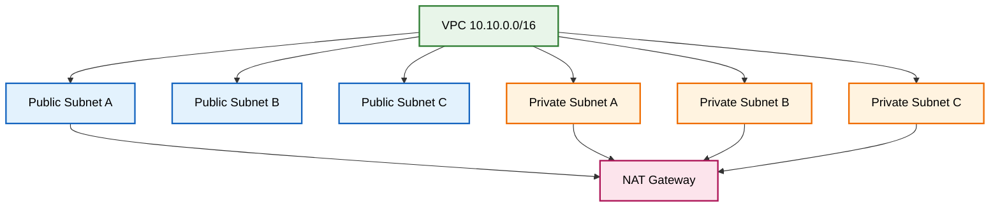

---

# Step 7. Create `modules/vpc/outputs.tf`

File:

```text
modules/vpc/outputs.tf
```

Content:

```hcl
output "vpc_id" {
  value = module.vpc.vpc_id
}

output "private_subnets" {
  value = module.vpc.private_subnets
}
```

### Beginner explanation

Outputs are values that a module gives back to the root module.

The VPC module creates many things. The EKS module needs at least these two values:

```text
vpc_id
private_subnets
```

Why?

Because EKS must know:

- which VPC to use
- which subnets should contain worker nodes

### Backend example

The VPC module creates a VPC with an AWS ID like:

```text
vpc-0abc123456789
```

It also creates subnet IDs like:

```text
subnet-011111111
subnet-022222222
subnet-033333333
```

This output passes those IDs to the root module.

### Diagram

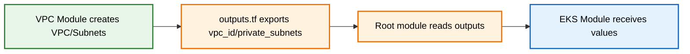

---

# Step 8. Create `modules/eks/variables.tf`

File:

```text
modules/eks/variables.tf
```

Content:

```hcl
variable "cluster_name" {
  type = string
}

variable "vpc_id" {
  type = string
}

variable "private_subnets" {
  type = list(string)
}
```

### Beginner explanation

These are input variables for the EKS module.

The EKS module needs:

- cluster name
- VPC ID
- private subnet IDs

### Why does EKS need private subnets?

Worker nodes will run inside private subnets.

Example:

```text
Pod runs on worker node.
Worker node is inside private subnet.
Private subnet is inside VPC.
```

### Backend example

The root module sends values into this EKS module:

```hcl
module "eks" {
  source          = "./modules/eks"
  cluster_name    = var.cluster_name
  vpc_id          = module.vpc.vpc_id
  private_subnets = module.vpc.private_subnets
}
```

This is the most important part of modular Terraform.

### Diagram

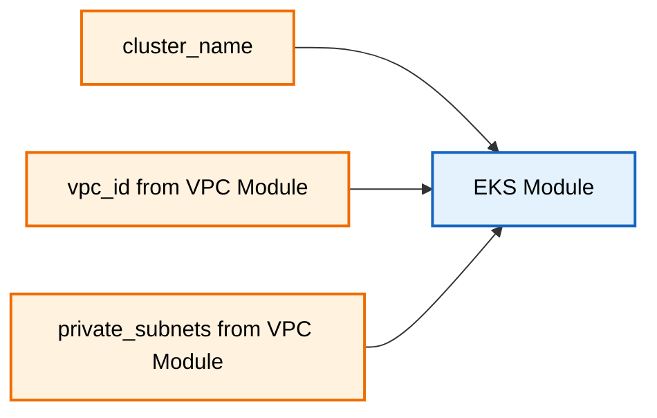

---

# Step 9. Create `modules/eks/main.tf`

File:

```text
modules/eks/main.tf
```

Content:

```hcl
module "eks" {
  source  = "terraform-aws-modules/eks/aws"
  version = "~> 21.0"

  name               = var.cluster_name
  kubernetes_version = "1.36"

  endpoint_public_access = true

  vpc_id     = var.vpc_id
  subnet_ids = var.private_subnets

  eks_managed_node_groups = {
    worker_nodes = {
      instance_types = ["t3.large"]

      min_size     = 2
      max_size     = 4
      desired_size = 2
    }
  }

  tags = {
    Environment = "prod"
    Project     = "openhelp"
  }
}
```

### Beginner explanation

This creates the actual EKS cluster.

It creates:

- EKS control plane
- EKS managed node group
- IAM roles required by EKS
- security groups
- worker node autoscaling group

### What is EKS control plane?

The control plane is the Kubernetes brain.

It contains Kubernetes API server and cluster management components.

In EKS, AWS manages the control plane for you.

### What are worker nodes?

Worker nodes are EC2 instances where your pods run.

Here we use:

```hcl
instance_types = ["t3.large"]
```

That means AWS creates EC2 worker nodes of type `t3.large`.

### What is node group size?

```hcl
min_size     = 2
max_size     = 4
desired_size = 2
```

Meaning:

```text
Start with 2 worker nodes.
Never go below 2.
Can scale up to 4.
```

### Backend example

Terraform asks AWS to create:

```text
EKS cluster: openhelp-prod-eks
Managed node group: worker_nodes
EC2 instances: 2 workers
Auto Scaling Group: min 2, max 4
IAM roles: EKS cluster role and node role
```

### Diagram

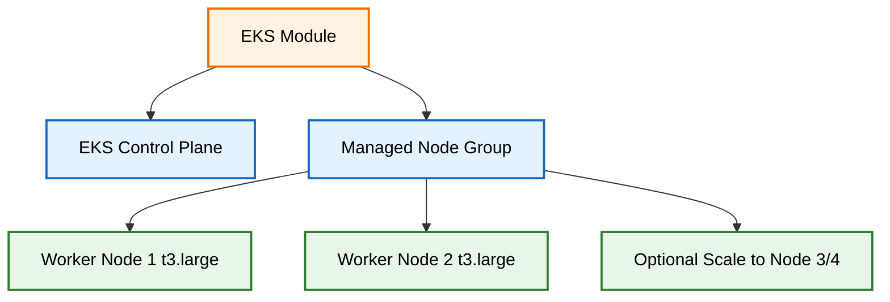

---

# Step 10. Create `modules/eks/outputs.tf`

File:

```text
modules/eks/outputs.tf
```

Content:

```hcl
output "cluster_name" {
  value = module.eks.cluster_name
}

output "cluster_endpoint" {
  value = module.eks.cluster_endpoint
}
```

### Beginner explanation

The EKS module gives useful information back to the root module.

Here we export:

- EKS cluster name
- EKS API endpoint

### What is cluster endpoint?

The cluster endpoint is the Kubernetes API URL.

Your `kubectl` talks to this endpoint.

Example:

```text
kubectl get nodes
```

Behind the scenes:

```text
kubectl -> EKS API endpoint -> Kubernetes API server -> returns node list
```

### Backend example

AWS creates an endpoint like:

```text
https://ABCDEF.gr7.eu-central-1.eks.amazonaws.com
```

Terraform prints it through output.

### Diagram

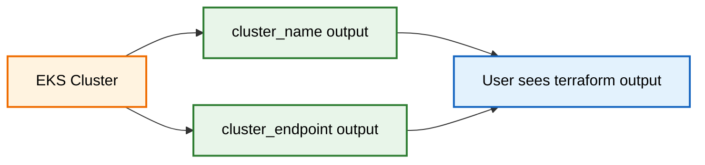

---

# Step 11. Create Root `main.tf`

File:

```text
main.tf
```

Content:

```hcl
module "vpc" {
  source = "./modules/vpc"

  aws_region = var.aws_region
}

module "eks" {
  source = "./modules/eks"

  cluster_name    = var.cluster_name
  vpc_id          = module.vpc.vpc_id
  private_subnets = module.vpc.private_subnets
}
```

### Beginner explanation

This is the main file that connects everything.

The root module calls the VPC module first:

```hcl
module "vpc" {
  source = "./modules/vpc"
}
```

Then it calls the EKS module:

```hcl
module "eks" {
  source = "./modules/eks"
}
```

### How does one module refer to another?

This line is very important:

```hcl
vpc_id = module.vpc.vpc_id
```

Meaning:

```text
Take the vpc_id output from the VPC module and pass it as input to the EKS module.
```

This line is also important:

```hcl
private_subnets = module.vpc.private_subnets
```

Meaning:

```text
Take private subnet IDs created by VPC module and give them to EKS module.
```

### Backend example

Terraform automatically understands dependency order.

Because EKS uses `module.vpc.vpc_id`, Terraform knows:

```text
Create VPC first.
Then create EKS cluster.
```

You do not need to manually say `depends_on` here.

### Diagram

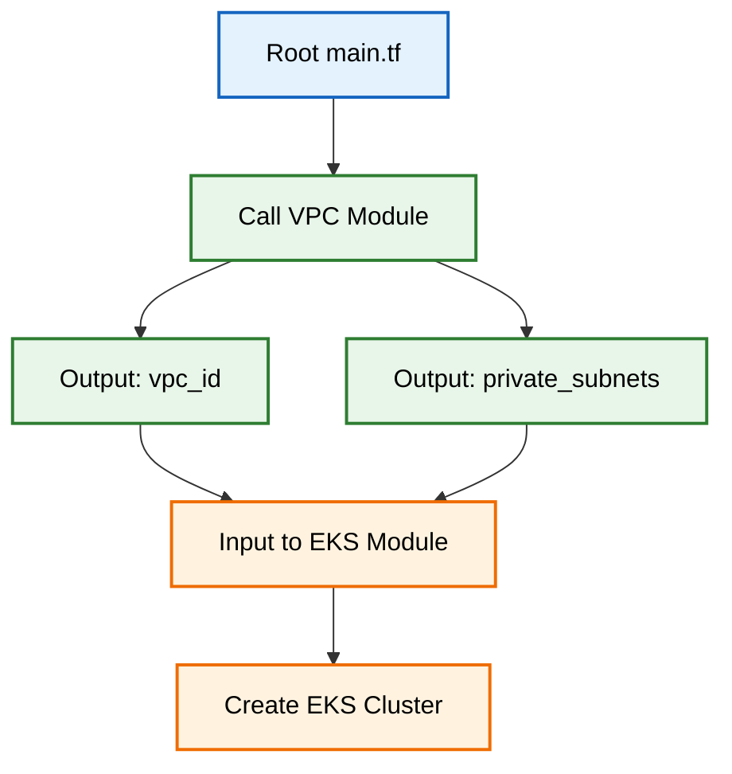

---

# Step 12. Create Root `outputs.tf`

File:

```text
outputs.tf
```

Content:

```hcl
output "cluster_name" {
  value = module.eks.cluster_name
}

output "cluster_endpoint" {
  value = module.eks.cluster_endpoint
}
```

### Beginner explanation

This prints useful information after Terraform finishes.

Example output:

```text
cluster_name = openhelp-prod-eks
cluster_endpoint = https://ABCDEF.gr7.eu-central-1.eks.amazonaws.com
```

### Why root output is needed?

The EKS module has its own output file, but that output is inside the child module.

To show it at the root level, root `outputs.tf` must read it:

```hcl
module.eks.cluster_name
```

### Backend example

Flow:

```text
EKS module output -> root output -> printed in terminal
```

### Diagram

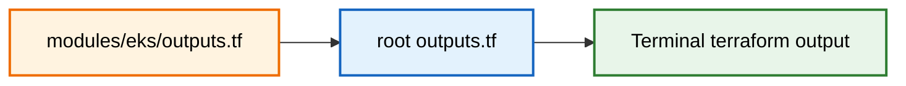

---

# Step 13. Run Terraform From Root Folder

Run commands from this folder only:

```text
eks-modular/
```

Commands:

```bash
terraform init
terraform fmt -recursive
terraform validate
terraform plan
terraform apply
```

### Beginner explanation

#### `terraform init`

Downloads providers and modules.

Backend example:

```text
Downloads AWS provider
Downloads VPC module
Downloads EKS module
Creates .terraform folder
```

#### `terraform fmt -recursive`

Formats all Terraform files, including files inside modules.

#### `terraform validate`

Checks if your Terraform syntax is correct.

#### `terraform plan`

Shows what Terraform is going to create.

Example:

```text
Terraform will create VPC
Terraform will create subnets
Terraform will create EKS cluster
Terraform will create node group
```

#### `terraform apply`

Actually creates resources in AWS.

### Backend example

During apply, Terraform creates resources in this order:

```text
1. VPC
2. Subnets
3. NAT Gateway
4. EKS IAM roles
5. EKS control plane
6. EKS managed node group
7. EC2 worker nodes
```

### Diagram

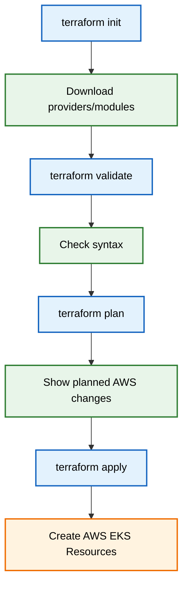

---

# Step 14. Connect kubectl and Verify Cluster

After Terraform finishes, configure your kubeconfig:

```bash
aws eks update-kubeconfig \
  --region eu-central-1 \
  --name openhelp-prod-eks
```

Then verify:

```bash
kubectl get nodes
kubectl get pods -A
```

Expected result:

```text
You should see 2 worker nodes.
System pods should be running in kube-system namespace.
```

### Beginner explanation

Terraform creates the EKS cluster, but your local `kubectl` does not know about it yet.

This command:

```bash
aws eks update-kubeconfig
```

updates your kubeconfig file.

Usually the file is:

```text
~/.kube/config
```

After that, `kubectl` can talk to your EKS cluster.

### Backend example

When you run:

```bash
kubectl get nodes
```

This happens:

```text
kubectl reads ~/.kube/config
kubectl connects to EKS API endpoint
AWS IAM authenticates you
Kubernetes API returns worker node list
```

### Diagram

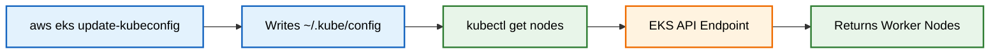

---

# Full Data Flow: How Modules Refer to Each Other

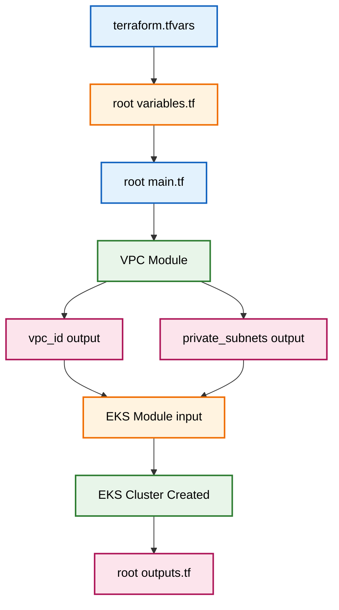

Important lines:

```hcl
vpc_id = module.vpc.vpc_id
```

This means:

```text
Get vpc_id from VPC module output.
Pass it to EKS module input.
```

```hcl
private_subnets = module.vpc.private_subnets
```

This means:

```text
Get private subnet IDs from VPC module output.
Pass them to EKS module input.
```

---

# What Terraform Creates in AWS

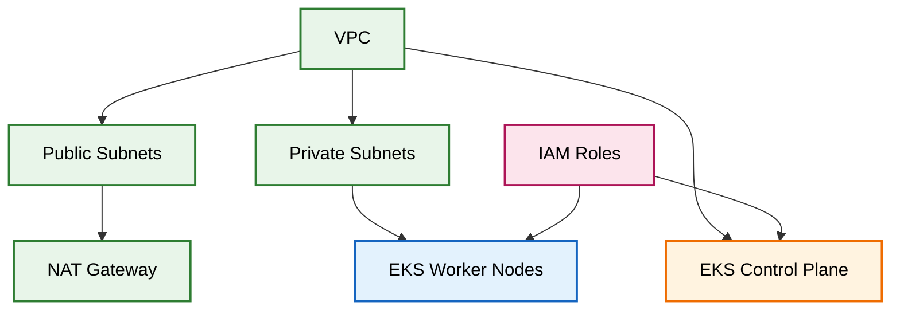

Terraform creates:

```text
VPC
Public subnets
Private subnets
Route tables
Internet gateway
NAT gateway
EKS control plane
EKS managed node group
EC2 worker nodes
IAM roles and policies
Security groups
```

---

# Important Beginner Notes

## 1. Why use modules?

Without modules, one file becomes very large and confusing.

With modules:

```text
VPC code stays in VPC folder.
EKS code stays in EKS folder.
Root folder connects them.
```

## 2. Why EKS nodes use private subnets?

In production, worker nodes should not be directly exposed to the internet.

Private subnet is safer.

## 3. Why public subnets are still needed?

Public subnets are useful for:

- NAT Gateway
- future public load balancers
- ingress controllers

## 4. Why NAT Gateway is needed?

Private worker nodes need outbound internet to pull images.

Example:

```text
Worker node pulls container image from ECR or Docker Hub.
Private node cannot go directly to internet.
It goes through NAT Gateway.
```

## 5. Why use managed node groups?

AWS manages node group lifecycle better than manually creating EC2 nodes.

It helps with:

- scaling
- replacement
- upgrades
- integration with EKS

---

# Simple Troubleshooting Commands

Check Terraform output:

```bash
terraform output
```

Check current kubectl context:

```bash
kubectl config current-context
```

Check nodes:

```bash
kubectl get nodes -o wide
```

Check system pods:

```bash
kubectl get pods -n kube-system
```

Check AWS EKS cluster:

```bash
aws eks describe-cluster \
  --region eu-central-1 \
  --name openhelp-prod-eks
```

---

# Destroy Cluster When Not Needed

To delete everything created by this Terraform:

```bash
terraform destroy
```

### Warning

This deletes the EKS cluster, worker nodes, VPC, NAT gateway, and related AWS resources created by this project.

---

# Final Summary

You created a modular Terraform project with:

```text
Root module
  ├── calls VPC module
  └── calls EKS module

VPC module
  └── creates AWS network

EKS module
  └── creates Kubernetes cluster and worker nodes
```

The most important learning is this:

```hcl
vpc_id = module.vpc.vpc_id
```

That is how one module uses the output from another module.

