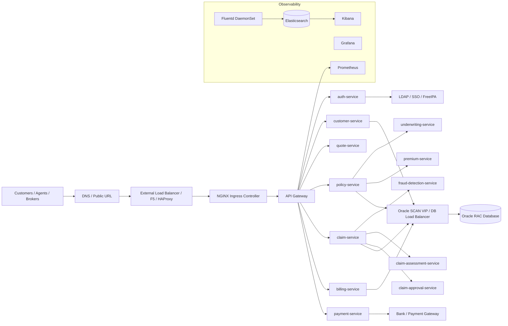
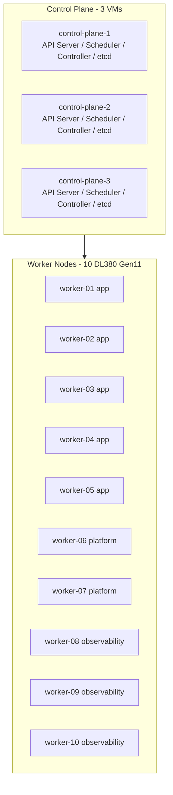
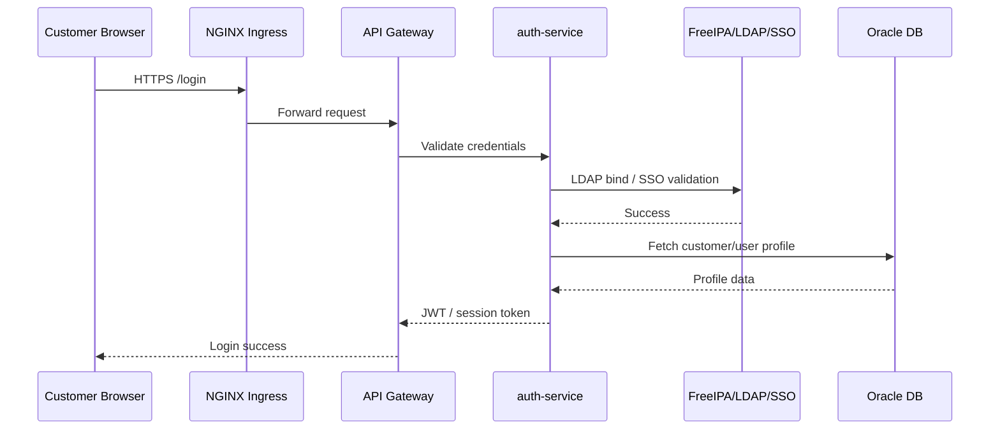
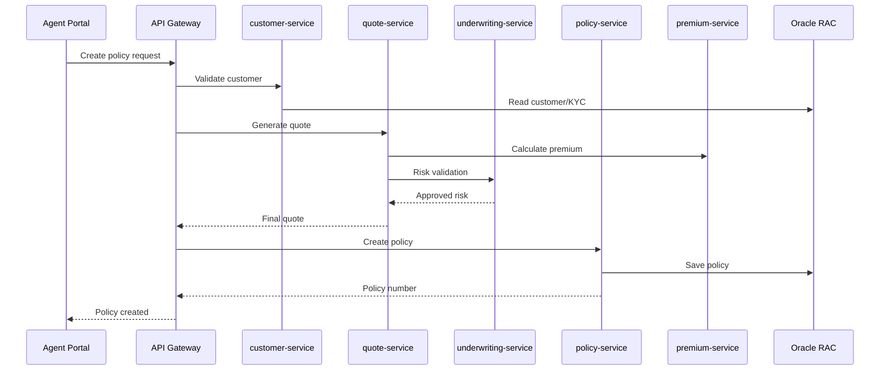
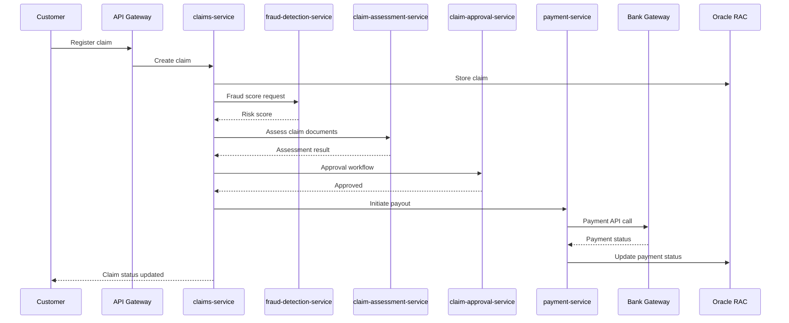
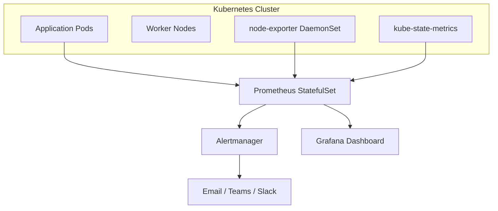
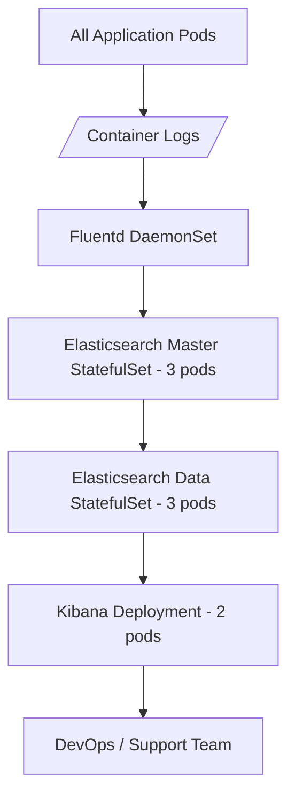
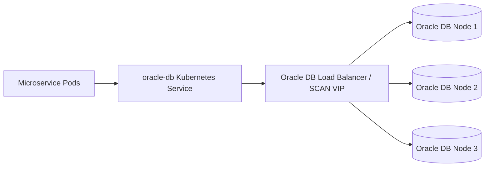

# Insurance Domain Kubernetes Production Architecture

Reference design based on the uploaded architecture diagram. This document explains the production Kubernetes architecture for an insurance company serving about **1 million customers**, including microservices, Kubernetes object types, pod sizing, hardware, CI/CD, monitoring, logging, database connectivity, and end-to-end traffic flows.

> Assumption: Oracle Database, Bitbucket/GitLab, Jenkins, SonarQube, and Nexus run on VMware VMs. Rancher, Argo CD, monitoring, logging, ingress, and insurance microservices run inside Kubernetes.

---

## 1. High-Level Architecture



---

## 2. Hardware Architecture

### 2.1 Recommended Physical Servers

For this production reference design:

| Layer | Hardware | Quantity | Purpose |
|---|---:|---:|---|
| Kubernetes worker hardware | HPE ProLiant DL380 Gen11 | 8 to 12 servers | Run application and platform pods |
| VMware cluster | HPE ProLiant DL380 Gen11 or equivalent | 3 to 5 servers | Run CI/CD VMs, jump host, infra tools |
| Storage | SAN / Ceph / VMware datastore | As required | Persistent volumes, logs, artifacts |
| Network | 10/25 GbE ToR switches | 2+ | Redundant network fabric |
| External LB | F5 / HAProxy pair | 2 | North-south traffic to Kubernetes ingress |
| Oracle DB | Oracle RAC nodes | 3 | Core insurance transactional database |

HPE DL380 Gen11 is a 2U, two-socket server platform. HPE QuickSpecs describe it as supporting 4th/5th Gen Intel Xeon Scalable processors, up to 4 TB memory per processor, and up to 8 TB total memory depending on CPU and memory configuration.

### 2.2 Example Server Sizing Used in This Architecture

| Node Type | Count | CPU per Node | RAM per Node | Total CPU | Total RAM |
|---|---:|---:|---:|---:|---:|
| Kubernetes control-plane VMs | 3 | 24 vCPU | 64 GB | 72 vCPU | 192 GB |
| Kubernetes worker nodes | 10 | 128 cores | 256 GB | 1280 cores | 2560 GB / 2.5 TB |
| CI/CD VMware VMs | 6 to 8 VMs | 8 to 32 vCPU each | 32 to 128 GB each | Depends | Depends |
| Oracle DB nodes | 3 | 32 to 64 cores each | 256 to 512 GB each | 96 to 192 cores | 768 GB to 1.5 TB |

### 2.3 Worker Node Role Split

| Worker Pool | Nodes | Usage |
|---|---:|---|
| app-worker-pool | 5 | Insurance business microservices |
| platform-worker-pool | 2 | Rancher, Argo CD, ingress, cert-manager |
| observability-worker-pool | 3 | Prometheus, Grafana, Elasticsearch, Kibana, Fluentd storage-heavy workloads |

Recommended labels:

```bash
kubectl label node worker01 node-pool=app
kubectl label node worker06 node-pool=platform
kubectl label node worker08 node-pool=observability
```

---

## 3. Kubernetes Cluster Layout



### Production Control Plane

| Component | Recommended Count | Notes |
|---|---:|---|
| Control-plane nodes | 3 | Minimum production HA setup |
| etcd members | 3 | Odd number for quorum |
| API server | 3 | One on each control-plane node |
| Scheduler | 3 | Active/standby leader election |
| Controller manager | 3 | Active/standby leader election |

---

## 4. Namespace Design

| Namespace | Purpose |
|---|---|
| `insurance-prod` | Business microservices |
| `insurance-dev` | Development environment |
| `insurance-uat` | UAT environment |
| `ingress-nginx` | Ingress controller |
| `cattle-system` | Rancher |
| `argocd` | Argo CD GitOps |
| `monitoring` | Prometheus, Grafana, Alertmanager |
| `logging` | Fluentd, Elasticsearch, Kibana |
| `cert-manager` | TLS certificate management |
| `security` | External secrets, policy tools, security agents |

---

## 5. Business Microservices and Kubernetes Object Types

Most insurance business services are stateless and should run as **Deployments**. They scale horizontally using replicas and HPA.

| Microservice | Kubernetes Type | Prod Pods | CPU Request | Memory Request | CPU Limit | Memory Limit | Purpose |
|---|---|---:|---:|---:|---:|---:|---|
| api-gateway | Deployment | 3 | 500m | 512Mi | 2 | 2Gi | Entry point for APIs, routing, rate limit |
| auth-service | Deployment | 3 | 300m | 512Mi | 1 | 1Gi | Login, token validation, IAM integration |
| authorization-service | Deployment | 3 | 300m | 512Mi | 1 | 1Gi | Role and permission checks |
| customer-service | Deployment | 4 | 500m | 1Gi | 2 | 2Gi | Customer profile, KYC, contact data |
| quote-service | Deployment | 3 | 500m | 1Gi | 2 | 2Gi | Insurance quote calculation |
| policy-service | Deployment | 4 | 700m | 1Gi | 2 | 3Gi | Policy creation, renewal, endorsement |
| underwriting-service | Deployment | 3 | 700m | 1Gi | 2 | 3Gi | Risk checks and underwriting rules |
| premium-service | Deployment | 3 | 500m | 1Gi | 2 | 2Gi | Premium calculation |
| claims-service | Deployment | 6 | 700m | 1Gi | 3 | 3Gi | Claim registration and lifecycle |
| claim-assessment-service | Deployment | 4 | 700m | 1Gi | 3 | 3Gi | Claim verification and assessment |
| claim-approval-service | Deployment | 3 | 500m | 1Gi | 2 | 2Gi | Claim approval workflow |
| billing-service | Deployment | 3 | 500m | 1Gi | 2 | 2Gi | Invoice and billing cycle |
| payment-service | Deployment | 3 | 500m | 1Gi | 2 | 2Gi | Bank/payment gateway integration |
| fraud-detection-service | Deployment | 4 | 1 | 2Gi | 4 | 6Gi | Fraud scoring and suspicious claim detection |
| document-service | Deployment | 3 | 500m | 1Gi | 2 | 3Gi | Policy/claim documents, PDF generation |
| notification-service | Deployment | 3 | 300m | 512Mi | 1 | 1Gi | Notification orchestration |
| email-service | Deployment | 2 | 300m | 512Mi | 1 | 1Gi | Email provider integration |
| sms-service | Deployment | 2 | 300m | 512Mi | 1 | 1Gi | SMS provider integration |
| reporting-service | Deployment | 2 | 1 | 2Gi | 4 | 8Gi | Reports and analytics APIs |
| audit-service | Deployment | 3 | 300m | 512Mi | 1 | 1Gi | Audit trail and compliance events |
| agent-service | Deployment | 3 | 500m | 1Gi | 2 | 2Gi | Agent/broker management |
| product-catalog-service | Deployment | 3 | 300m | 512Mi | 1 | 1Gi | Insurance products and plans |

### Why Deployments?

A Deployment is best for stateless microservices because Kubernetes can create, delete, upgrade, and scale pods automatically. If a pod dies, Kubernetes starts another pod. The service data remains in Oracle, object storage, queues, or external systems, not inside the pod.

---

## 6. Platform Services and Kubernetes Object Types

| Component | Kubernetes Type | Prod Pods | Storage | Purpose |
|---|---|---:|---|---|
| NGINX Ingress Controller | Deployment + LoadBalancer Service | 3 | No | HTTP/HTTPS entry to cluster |
| API Gateway | Deployment | 3 | No | API routing and security policies |
| cert-manager | Deployment | 3 | No | TLS certificates |
| Rancher | Deployment | 3 | Optional | Kubernetes management UI |
| Argo CD Server | Deployment | 2 | No | GitOps UI/API |
| Argo CD Repo Server | Deployment | 2 | Optional cache | Reads Git repositories and Helm charts |
| Argo CD Application Controller | StatefulSet | 1 to 2 | Optional | Reconciles desired state |
| Prometheus | StatefulSet | 2 | Yes | Metrics database |
| Alertmanager | StatefulSet | 2 | Yes | Alert routing |
| Grafana | Deployment | 2 | Yes/DB | Dashboards |
| Fluentd | DaemonSet | 1 per worker | No | Log collection from every node |
| Elasticsearch master | StatefulSet | 3 | Yes | Elasticsearch cluster management |
| Elasticsearch data | StatefulSet | 3 | Yes | Log indexing and storage |
| Kibana | Deployment | 2 | No | Log search UI |
| External Secrets Operator | Deployment | 2 | No | Sync secrets from vault |
| SonarQube scanner jobs | Job / CI agent | On demand | No | Code quality scan |

---

## 7. Services, LoadBalancers, and Ingress

| Layer | Kubernetes Object | Example |
|---|---|---|
| External entry | LoadBalancer Service | `ingress-nginx-controller` gets VIP from F5/MetalLB/cloud LB |
| HTTP routing | Ingress | `insurance.example.com/customer` to customer-service |
| Internal service discovery | ClusterIP Service | `customer-service.insurance-prod.svc.cluster.local` |
| Stateful discovery | Headless Service | Elasticsearch, Prometheus, databases if inside K8s |
| External DB access | ExternalName or normal Service + Endpoints | Oracle SCAN/F5 VIP |

Example flow:

```text
User -> DNS -> F5/HAProxy -> Kubernetes LoadBalancer Service -> NGINX Ingress -> API Gateway -> Microservice -> Oracle LB -> Oracle RAC
```

---

## 8. Complete End-to-End Flows

### 8.1 Customer Login Flow



### 8.2 Policy Creation Flow



### 8.3 Claim Processing Flow



### 8.4 CI/CD and GitOps Flow

```mermaid
flowchart LR
    DEV[Developer Machine] --> GIT[Bitbucket / GitLab]
    GIT --> JENKINS[Jenkins Pipeline]
    JENKINS --> BUILD[Build Docker Image]
    BUILD --> SONAR[SonarQube Scan]
    SONAR --> NEXUS[Nexus Artifact Repository]
    NEXUS --> HELM[Helm Chart / Image Tag]
    HELM --> ARGO[Argo CD]
    ARGO --> K8S[Kubernetes Cluster]
    K8S --> PODS[Insurance Microservice Pods]
```



Pipeline stages:

1. Developer commits code to Bitbucket/GitLab.
2. Jenkins pipeline starts.
3. Maven/Gradle builds Java application.
4. SonarQube scanner checks code quality and security.
5. Docker image is built.
6. Image is pushed to Nexus Docker registry.
7. Helm chart values are updated with new image tag.
8. Argo CD detects Git change and deploys to Kubernetes.
9. Kubernetes performs rolling update.

---

## 9. Monitoring Architecture



| Component | Type | Pods | Purpose |
|---|---|---:|---|
| Prometheus | StatefulSet | 2 | Stores metrics and scrapes targets |
| Alertmanager | StatefulSet | 2 | Sends alerts |
| Grafana | Deployment | 2 | Dashboards |
| node-exporter | DaemonSet | 1 per node | Node CPU, memory, disk, network metrics |
| kube-state-metrics | Deployment | 2 | Kubernetes object metrics |

Important dashboards:

- Kubernetes node CPU/memory/disk
- Pod CPU/memory usage
- Microservice latency and error rate
- JVM memory and GC if Java services are used
- Oracle connection pool usage
- Ingress 4xx/5xx errors
- Claim and policy transaction volume

---

## 10. Logging Architecture



| Component | Type | Pods | Storage |
|---|---|---:|---|
| Fluentd | DaemonSet | 10 | No persistent storage |
| Elasticsearch master | StatefulSet | 3 | 100 GB each |
| Elasticsearch data | StatefulSet | 3 | 500 GB to 2 TB each |
| Kibana | Deployment | 2 | No large persistent storage |

Log flow:

```text
Pod stdout/stderr -> Node container log file -> Fluentd -> Elasticsearch index -> Kibana dashboard
```

Recommended log index pattern:

```text
insurance-prod-application-YYYY.MM.DD
insurance-prod-ingress-YYYY.MM.DD
insurance-prod-audit-YYYY.MM.DD
```

---

## 11. Database Connectivity

Oracle should normally remain outside Kubernetes for enterprise insurance production workloads.



Connection pattern:

```text
microservice -> ClusterIP service or external DNS -> Oracle SCAN VIP/F5 -> Oracle RAC node
```

Best practices:

- Use connection pooling in each microservice.
- Store DB credentials in Kubernetes Secrets or external vault.
- Use TLS for DB connectivity if required by security policy.
- Do not hardcode Oracle hostnames in application images.
- Keep max DB connections controlled to avoid Oracle overload.

Example Kubernetes service for external Oracle:

```yaml
apiVersion: v1
kind: Service
metadata:
  name: oracle-db
  namespace: insurance-prod
spec:
  type: ExternalName
  externalName: oracle-scan.insurance.local
```

---

## 12. Example Deployment YAML

```yaml
apiVersion: apps/v1
kind: Deployment
metadata:
  name: policy-service
  namespace: insurance-prod
spec:
  replicas: 4
  strategy:
    type: RollingUpdate
    rollingUpdate:
      maxSurge: 1
      maxUnavailable: 1
  selector:
    matchLabels:
      app: policy-service
  template:
    metadata:
      labels:
        app: policy-service
    spec:
      containers:
      - name: policy-service
        image: nexus.insurance.local/policy-service:1.0.0
        ports:
        - containerPort: 8080
        resources:
          requests:
            cpu: "700m"
            memory: "1Gi"
          limits:
            cpu: "2"
            memory: "3Gi"
        env:
        - name: ORACLE_HOST
          value: oracle-db.insurance-prod.svc.cluster.local
        readinessProbe:
          httpGet:
            path: /actuator/health/readiness
            port: 8080
          initialDelaySeconds: 20
          periodSeconds: 10
        livenessProbe:
          httpGet:
            path: /actuator/health/liveness
            port: 8080
          initialDelaySeconds: 60
          periodSeconds: 20
```

Service:

```yaml
apiVersion: v1
kind: Service
metadata:
  name: policy-service
  namespace: insurance-prod
spec:
  type: ClusterIP
  selector:
    app: policy-service
  ports:
  - port: 80
    targetPort: 8080
```

Ingress:

```yaml
apiVersion: networking.k8s.io/v1
kind: Ingress
metadata:
  name: insurance-prod-ingress
  namespace: insurance-prod
spec:
  ingressClassName: nginx
  rules:
  - host: insurance.example.com
    http:
      paths:
      - path: /policy
        pathType: Prefix
        backend:
          service:
            name: policy-service
            port:
              number: 80
```

---

## 13. StatefulSet Example: Elasticsearch Data Nodes

```yaml
apiVersion: apps/v1
kind: StatefulSet
metadata:
  name: elasticsearch-data
  namespace: logging
spec:
  serviceName: elasticsearch-data
  replicas: 3
  selector:
    matchLabels:
      app: elasticsearch-data
  template:
    metadata:
      labels:
        app: elasticsearch-data
    spec:
      containers:
      - name: elasticsearch
        image: docker.elastic.co/elasticsearch/elasticsearch:8.x
        resources:
          requests:
            cpu: "2"
            memory: "8Gi"
          limits:
            cpu: "4"
            memory: "16Gi"
        volumeMounts:
        - name: data
          mountPath: /usr/share/elasticsearch/data
  volumeClaimTemplates:
  - metadata:
      name: data
    spec:
      accessModes: ["ReadWriteOnce"]
      storageClassName: rook-ceph-block
      resources:
        requests:
          storage: 1Ti
```

---

## 14. Production Pod Count Summary

| Area | Approx Pods |
|---|---:|
| Insurance business microservices | 70 to 90 |
| Ingress/API gateway/security | 10 to 15 |
| Rancher/Argo CD/cert-manager | 15 to 20 |
| Monitoring | 15 to 25 |
| Logging | 20 to 25 |
| Total production pods | 130 to 175 |

With HPA during peak time, this can grow to:

```text
200 to 300 pods
```

---

## 15. Why Some Are Deployments and Some Are StatefulSets

| Kubernetes Type | Used For | Reason |
|---|---|---|
| Deployment | Business microservices, API gateway, Grafana, Kibana, Rancher | Stateless or easily replaceable pods |
| StatefulSet | Elasticsearch, Prometheus, Alertmanager, some Argo CD components | Stable identity and persistent volume needed |
| DaemonSet | Fluentd, node-exporter | One pod must run on every node |
| Job | DB migration, one-time data load, Sonar scanner job | Run once and complete |
| CronJob | Scheduled reports, batch premium calculation, cleanup tasks | Run on schedule |
| Service LoadBalancer | Ingress controller | Expose service outside cluster |
| ClusterIP Service | Internal microservice communication | Stable internal DNS name |

---

## 16. External Integration Layer

| External System | Connected From | Protocol | Purpose |
|---|---|---|---|
| Bank / Payment Gateway | payment-service | HTTPS/API | Premium payment and claim payout |
| SMS Provider | sms-service | HTTPS/API | OTP and claim notification |
| Email Provider | email-service | SMTP/API | Email notifications |
| Govt KYC / Aadhaar / PAN / eKYC | customer-service / kyc-service | HTTPS/API | Customer identity verification |
| Broker / Partner API | agent-service / broker-service | HTTPS/API | Partner integrations |
| Oracle RAC | All core services | JDBC/TCP | Transactional database |
| LDAP/FreeIPA/SSO | auth-service | LDAP/LDAPS/OIDC/SAML | Authentication |

---

## 17. Security Architecture

Recommended controls:

- TLS from user to ingress.
- TLS between ingress and API gateway where required.
- RBAC for Kubernetes access.
- Separate namespaces for prod, UAT, dev.
- NetworkPolicies to restrict pod-to-pod traffic.
- Secrets stored in external vault or sealed secrets.
- Image scanning in CI/CD.
- SonarQube quality gate before deployment.
- Kubernetes audit logging enabled.
- Only jump host can access Kubernetes admin endpoints.
- Developers deploy through GitOps, not direct `kubectl` in production.

---

## 18. Recommended Minimum Resource Capacity

For 1 million customers, the proposed 10 worker nodes with 128 cores and 256 GB RAM each gives strong capacity.

| Resource | Total | Reserve for System | Available for Pods |
|---|---:|---:|---:|
| CPU | 1280 cores | 10-15% | ~1088 to 1152 cores |
| RAM | 2560 GB | 10-15% | ~2176 to 2304 GB |

This is enough for the first production version if properly tuned. Actual sizing must be validated with load testing.

---

## 19. Production Recommendations

1. Use 3 control-plane nodes and 3 etcd members.
2. Use at least 10 worker nodes for this architecture.
3. Keep Oracle outside Kubernetes behind SCAN VIP/F5.
4. Run business microservices as Deployments.
5. Run Elasticsearch and Prometheus as StatefulSets with persistent volumes.
6. Run Fluentd and node-exporter as DaemonSets.
7. Use HPA for customer, policy, claim, quote, billing, and payment services.
8. Use Argo CD for production deployment.
9. Use Jenkins only for build/test/image creation.
10. Use Nexus as Docker and artifact repository.
11. Use SonarQube as mandatory quality gate.
12. Use Grafana and Kibana for operational dashboards.
13. Use separate namespaces and RBAC for each environment.
14. Perform load testing before final CPU/RAM confirmation.

---

## 20. Final Architecture Summary

```text
Users / Agents / Brokers
        ↓
DNS / Public URL
        ↓
F5 / HAProxy / Load Balancer
        ↓
NGINX Ingress Controller
        ↓
API Gateway
        ↓
Insurance Microservices as Kubernetes Deployments
        ↓
Oracle RAC through SCAN VIP / DB Load Balancer

CI/CD:
Developer → Bitbucket/GitLab → Jenkins → SonarQube → Nexus → Argo CD → Kubernetes

Monitoring:
Pods/Nodes → Prometheus → Grafana → Alertmanager

Logging:
Pods/Nodes → Fluentd → Elasticsearch → Kibana
```

