# Insurance Domain Kubernetes Production Architecture

Reference design based on the uploaded architecture diagram. This document explains the production Kubernetes architecture for an insurance company serving about **1 million customers**, including microservices, Kubernetes object types, pod sizing, hardware, CI/CD, monitoring, logging, database connectivity, and end-to-end traffic flows.

> Assumption: Oracle Database, Bitbucket/GitLab, Jenkins, SonarQube, Nexus, **Venafi Trust Protection Platform / Venafi Control Plane connector VM**, and **Active Directory Domain Controllers** run on VMware VMs. Rancher, Argo CD, monitoring, logging, ingress, **Jetstack cert-manager**, and insurance microservices run inside Kubernetes. This update preserves the original architecture and adds Venafi + AD authentication + certificate automation flows.

---

## 1. High-Level Architecture

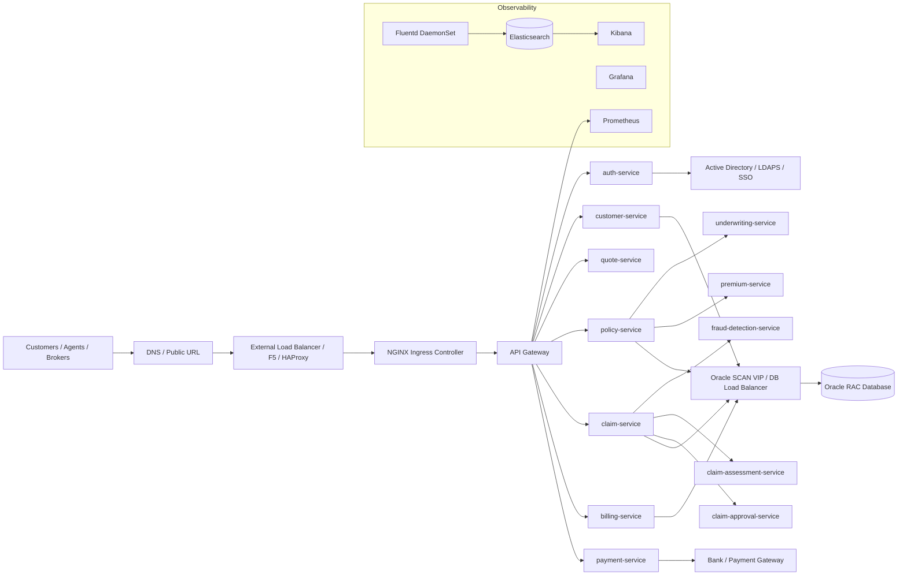


---

## 1.1 Enhanced Color Architecture - AD + Venafi + Jetstack cert-manager

This is the modified production architecture view. It keeps the original flow and adds **Active Directory authentication**, **Venafi VM**, and **Jetstack/cert-manager certificate lifecycle automation**.

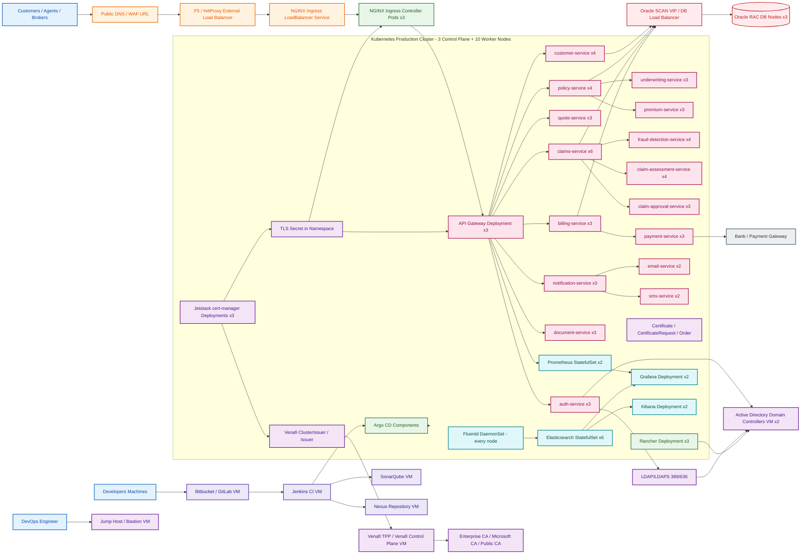

### What changed in the modified architecture

| Area | Added / Modified Component | Why it is used |
|---|---|---|
| Certificate management | Venafi VM | Central enterprise certificate policy, approval, issuance, renewal, inventory, and audit |
| Kubernetes certificate automation | Jetstack cert-manager | Automatically requests and renews Kubernetes TLS certificates |
| Authentication | Active Directory | Enterprise identity source for users, developers, admin groups, and application login |
| Kubernetes management auth | Rancher + AD | Admins and developers login using AD groups mapped to Kubernetes RBAC |
| Application auth | auth-service + AD/LDAP/SSO | Customer/admin/agent authentication and token issuance |

---

## 2. Hardware Architecture

### 2.1 Recommended Physical Servers

For this production reference design:

| Layer | Hardware | Quantity | Purpose |
|---|---:|---:|---|
| Kubernetes worker hardware | HPE ProLiant DL380 Gen11 | 8 to 12 servers | Run application and platform pods |
| VMware cluster | HPE ProLiant DL380 Gen11 or equivalent | 3 to 5 servers | Run CI/CD VMs, jump host, infra tools |
| Venafi VM | VMware VM | 1 production VM + optional DR VM | Enterprise certificate lifecycle management and cert-manager integration |
| Active Directory | VMware VMs / Windows Server | 2 domain controllers minimum | User, developer, admin group authentication |
| Storage | SAN / Ceph / VMware datastore | As required | Persistent volumes, logs, artifacts |
| Network | 10/25 GbE ToR switches | 2+ | Redundant network fabric |
| External LB | F5 / HAProxy pair | 2 | North-south traffic to Kubernetes ingress |
| Oracle DB | Oracle RAC nodes | 3 | Core insurance transactional database |

HPE DL380 Gen11 is a 2U, two-socket server platform. HPE QuickSpecs describe it as supporting 4th/5th Gen Intel Xeon Scalable processors, up to 4 TB memory per processor, and up to 8 TB total memory depending on CPU and memory configuration.

### 2.2 Example Server Sizing Used in This Architecture

| Node Type | Count | CPU per Node | RAM per Node | Total CPU | Total RAM |
|---|---:|---:|---:|---:|---:|
| Kubernetes control-plane VMs | 3 | 24 vCPU | 64 GB | 72 vCPU | 192 GB |
| Kubernetes worker nodes | 10 | 128 cores | 256 GB | 1280 cores | 2560 GB / 2.5 TB |
| CI/CD VMware VMs | 6 to 8 VMs | 8 to 32 vCPU each | 32 to 128 GB each | Depends | Depends |
| Oracle DB nodes | 3 | 32 to 64 cores each | 256 to 512 GB each | 96 to 192 cores | 768 GB to 1.5 TB |

### 2.3 Worker Node Role Split

| Worker Pool | Nodes | Usage |
|---|---:|---|
| app-worker-pool | 5 | Insurance business microservices |
| platform-worker-pool | 2 | Rancher, Argo CD, ingress, cert-manager |
| observability-worker-pool | 3 | Prometheus, Grafana, Elasticsearch, Kibana, Fluentd storage-heavy workloads |

Recommended labels:

```bash
kubectl label node worker01 node-pool=app
kubectl label node worker06 node-pool=platform
kubectl label node worker08 node-pool=observability
```

---

## 3. Kubernetes Cluster Layout

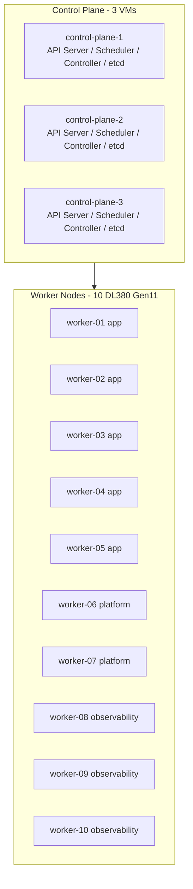

### Production Control Plane

| Component | Recommended Count | Notes |
|---|---:|---|
| Control-plane nodes | 3 | Minimum production HA setup |
| etcd members | 3 | Odd number for quorum |
| API server | 3 | One on each control-plane node |
| Scheduler | 3 | Active/standby leader election |
| Controller manager | 3 | Active/standby leader election |

---

## 4. Namespace Design

| Namespace | Purpose |
|---|---|
| `insurance-prod` | Business microservices |
| `insurance-dev` | Development environment |
| `insurance-uat` | UAT environment |
| `ingress-nginx` | Ingress controller |
| `cattle-system` | Rancher |
| `argocd` | Argo CD GitOps |
| `monitoring` | Prometheus, Grafana, Alertmanager |
| `logging` | Fluentd, Elasticsearch, Kibana |
| `cert-manager` | TLS certificate management |
| `security` | External secrets, policy tools, security agents |

---

## 5. Business Microservices and Kubernetes Object Types

Most insurance business services are stateless and should run as **Deployments**. They scale horizontally using replicas and HPA.

| Microservice | Kubernetes Type | Prod Pods | CPU Request | Memory Request | CPU Limit | Memory Limit | Purpose |
|---|---|---:|---:|---:|---:|---:|---|
| api-gateway | Deployment | 3 | 500m | 512Mi | 2 | 2Gi | Entry point for APIs, routing, rate limit |
| auth-service | Deployment | 3 | 300m | 512Mi | 1 | 1Gi | Login, token validation, IAM integration |
| authorization-service | Deployment | 3 | 300m | 512Mi | 1 | 1Gi | Role and permission checks |
| customer-service | Deployment | 4 | 500m | 1Gi | 2 | 2Gi | Customer profile, KYC, contact data |
| quote-service | Deployment | 3 | 500m | 1Gi | 2 | 2Gi | Insurance quote calculation |
| policy-service | Deployment | 4 | 700m | 1Gi | 2 | 3Gi | Policy creation, renewal, endorsement |
| underwriting-service | Deployment | 3 | 700m | 1Gi | 2 | 3Gi | Risk checks and underwriting rules |
| premium-service | Deployment | 3 | 500m | 1Gi | 2 | 2Gi | Premium calculation |
| claims-service | Deployment | 6 | 700m | 1Gi | 3 | 3Gi | Claim registration and lifecycle |
| claim-assessment-service | Deployment | 4 | 700m | 1Gi | 3 | 3Gi | Claim verification and assessment |
| claim-approval-service | Deployment | 3 | 500m | 1Gi | 2 | 2Gi | Claim approval workflow |
| billing-service | Deployment | 3 | 500m | 1Gi | 2 | 2Gi | Invoice and billing cycle |
| payment-service | Deployment | 3 | 500m | 1Gi | 2 | 2Gi | Bank/payment gateway integration |
| fraud-detection-service | Deployment | 4 | 1 | 2Gi | 4 | 6Gi | Fraud scoring and suspicious claim detection |
| document-service | Deployment | 3 | 500m | 1Gi | 2 | 3Gi | Policy/claim documents, PDF generation |
| notification-service | Deployment | 3 | 300m | 512Mi | 1 | 1Gi | Notification orchestration |
| email-service | Deployment | 2 | 300m | 512Mi | 1 | 1Gi | Email provider integration |
| sms-service | Deployment | 2 | 300m | 512Mi | 1 | 1Gi | SMS provider integration |
| reporting-service | Deployment | 2 | 1 | 2Gi | 4 | 8Gi | Reports and analytics APIs |
| audit-service | Deployment | 3 | 300m | 512Mi | 1 | 1Gi | Audit trail and compliance events |
| agent-service | Deployment | 3 | 500m | 1Gi | 2 | 2Gi | Agent/broker management |
| product-catalog-service | Deployment | 3 | 300m | 512Mi | 1 | 1Gi | Insurance products and plans |

### Why Deployments?

A Deployment is best for stateless microservices because Kubernetes can create, delete, upgrade, and scale pods automatically. If a pod dies, Kubernetes starts another pod. The service data remains in Oracle, object storage, queues, or external systems, not inside the pod.

---

## 6. Platform Services and Kubernetes Object Types

| Component | Kubernetes Type | Prod Pods | Storage | Purpose |
|---|---|---:|---|---|
| NGINX Ingress Controller | Deployment + LoadBalancer Service | 3 | No | HTTP/HTTPS entry to cluster |
| API Gateway | Deployment | 3 | No | API routing and security policies |
| Jetstack cert-manager controller | Deployment | 3 | No | TLS certificate automation inside Kubernetes |
| cert-manager webhook | Deployment | 3 | No | Validates cert-manager CRDs and admission requests |
| cert-manager cainjector | Deployment | 3 | No | Injects CA bundles into webhook configurations |
| Venafi Issuer / ClusterIssuer | Kubernetes CRD object | 1 or more | No | Defines how cert-manager talks to Venafi |
| Rancher | Deployment | 3 | Optional | Kubernetes management UI |
| Argo CD Server | Deployment | 2 | No | GitOps UI/API |
| Argo CD Repo Server | Deployment | 2 | Optional cache | Reads Git repositories and Helm charts |
| Argo CD Application Controller | StatefulSet | 1 to 2 | Optional | Reconciles desired state |
| Prometheus | StatefulSet | 2 | Yes | Metrics database |
| Alertmanager | StatefulSet | 2 | Yes | Alert routing |
| Grafana | Deployment | 2 | Yes/DB | Dashboards |
| Fluentd | DaemonSet | 1 per worker | No | Log collection from every node |
| Elasticsearch master | StatefulSet | 3 | Yes | Elasticsearch cluster management |
| Elasticsearch data | StatefulSet | 3 | Yes | Log indexing and storage |
| Kibana | Deployment | 2 | No | Log search UI |
| External Secrets Operator | Deployment | 2 | No | Sync secrets from vault |
| SonarQube scanner jobs | Job / CI agent | On demand | No | Code quality scan |

---

## 7. Services, LoadBalancers, and Ingress

| Layer | Kubernetes Object | Example |
|---|---|---|
| External entry | LoadBalancer Service | `ingress-nginx-controller` gets VIP from F5/MetalLB/cloud LB |
| HTTP routing | Ingress | `insurance.example.com/customer` to customer-service |
| Internal service discovery | ClusterIP Service | `customer-service.insurance-prod.svc.cluster.local` |
| Stateful discovery | Headless Service | Elasticsearch, Prometheus, databases if inside K8s |
| External DB access | ExternalName or normal Service + Endpoints | Oracle SCAN/F5 VIP |

Example flow:

```text
User -> DNS -> F5/HAProxy -> Kubernetes LoadBalancer Service -> NGINX Ingress -> API Gateway -> Microservice -> Oracle LB -> Oracle RAC
```

---

## 8. Complete End-to-End Flows

### 8.1 Customer Login Flow

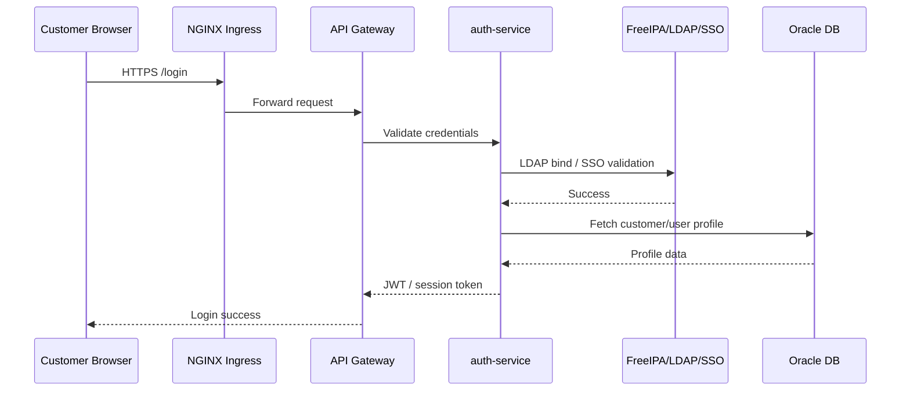

### 8.2 Policy Creation Flow

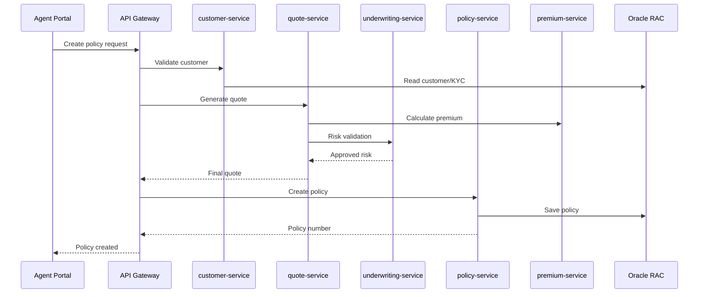

### 8.3 Claim Processing Flow

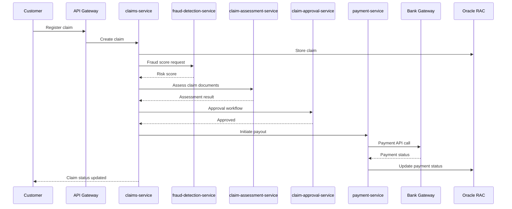

### 8.4 CI/CD and GitOps Flow

```mermaid
flowchart LR
    DEV[Developer Machine] --> GIT[Bitbucket / GitLab]
    GIT --> JENKINS[Jenkins Pipeline]
    JENKINS --> BUILD[Build Docker Image]
    BUILD --> SONAR[SonarQube Scan]
    SONAR --> NEXUS[Nexus Artifact Repository]
    NEXUS --> HELM[Helm Chart / Image Tag]
    HELM --> ARGO[Argo CD]
    ARGO --> K8S[Kubernetes Cluster]
    K8S --> PODS[Insurance Microservice Pods]
```

Pipeline stages:

1. Developer commits code to Bitbucket/GitLab.
2. Jenkins pipeline starts.
3. Maven/Gradle builds Java application.
4. SonarQube scanner checks code quality and security.
5. Docker image is built.
6. Image is pushed to Nexus Docker registry.
7. Helm chart values are updated with new image tag.
8. Argo CD detects Git change and deploys to Kubernetes.
9. Kubernetes performs rolling update.

---

## 9. Monitoring Architecture

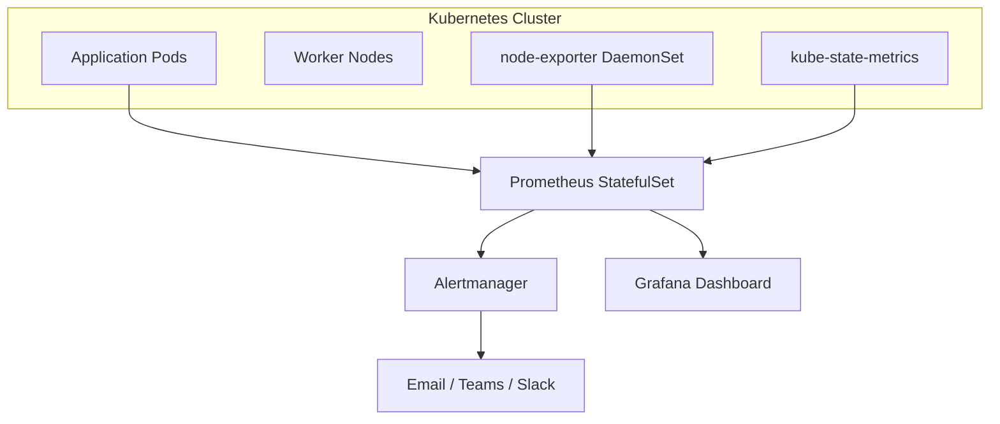

| Component | Type | Pods | Purpose |
|---|---|---:|---|
| Prometheus | StatefulSet | 2 | Stores metrics and scrapes targets |
| Alertmanager | StatefulSet | 2 | Sends alerts |
| Grafana | Deployment | 2 | Dashboards |
| node-exporter | DaemonSet | 1 per node | Node CPU, memory, disk, network metrics |
| kube-state-metrics | Deployment | 2 | Kubernetes object metrics |

Important dashboards:

- Kubernetes node CPU/memory/disk
- Pod CPU/memory usage
- Microservice latency and error rate
- JVM memory and GC if Java services are used
- Oracle connection pool usage
- Ingress 4xx/5xx errors
- Claim and policy transaction volume

---

## 10. Logging Architecture

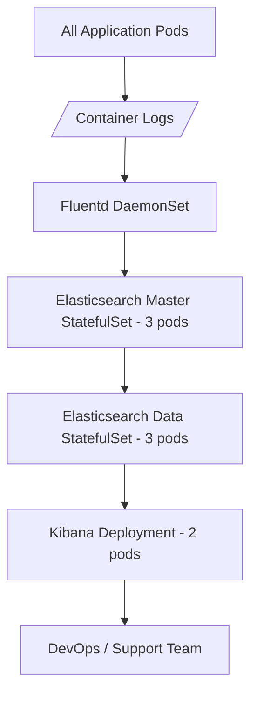

| Component | Type | Pods | Storage |
|---|---|---:|---|
| Fluentd | DaemonSet | 10 | No persistent storage |
| Elasticsearch master | StatefulSet | 3 | 100 GB each |
| Elasticsearch data | StatefulSet | 3 | 500 GB to 2 TB each |
| Kibana | Deployment | 2 | No large persistent storage |

Log flow:

```text
Pod stdout/stderr -> Node container log file -> Fluentd -> Elasticsearch index -> Kibana dashboard
```

Recommended log index pattern:

```text
insurance-prod-application-YYYY.MM.DD
insurance-prod-ingress-YYYY.MM.DD
insurance-prod-audit-YYYY.MM.DD
```

---

## 11. Database Connectivity

Oracle should normally remain outside Kubernetes for enterprise insurance production workloads.

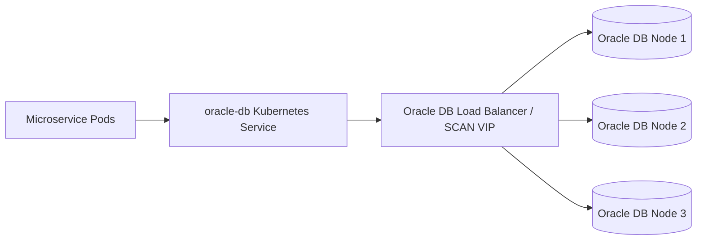

Connection pattern:

```text
microservice -> ClusterIP service or external DNS -> Oracle SCAN VIP/F5 -> Oracle RAC node
```

Best practices:

- Use connection pooling in each microservice.
- Store DB credentials in Kubernetes Secrets or external vault.
- Use TLS for DB connectivity if required by security policy.
- Do not hardcode Oracle hostnames in application images.
- Keep max DB connections controlled to avoid Oracle overload.

Example Kubernetes service for external Oracle:

```yaml
apiVersion: v1
kind: Service
metadata:
  name: oracle-db
  namespace: insurance-prod
spec:
  type: ExternalName
  externalName: oracle-scan.insurance.local
```

---

## 12. Example Deployment YAML

```yaml
apiVersion: apps/v1
kind: Deployment
metadata:
  name: policy-service
  namespace: insurance-prod
spec:
  replicas: 4
  strategy:
    type: RollingUpdate
    rollingUpdate:
      maxSurge: 1
      maxUnavailable: 1
  selector:
    matchLabels:
      app: policy-service
  template:
    metadata:
      labels:
        app: policy-service
    spec:
      containers:
      - name: policy-service
        image: nexus.insurance.local/policy-service:1.0.0
        ports:
        - containerPort: 8080
        resources:
          requests:
            cpu: "700m"
            memory: "1Gi"
          limits:
            cpu: "2"
            memory: "3Gi"
        env:
        - name: ORACLE_HOST
          value: oracle-db.insurance-prod.svc.cluster.local
        readinessProbe:
          httpGet:
            path: /actuator/health/readiness
            port: 8080
          initialDelaySeconds: 20
          periodSeconds: 10
        livenessProbe:
          httpGet:
            path: /actuator/health/liveness
            port: 8080
          initialDelaySeconds: 60
          periodSeconds: 20
```

Service:

```yaml
apiVersion: v1
kind: Service
metadata:
  name: policy-service
  namespace: insurance-prod
spec:
  type: ClusterIP
  selector:
    app: policy-service
  ports:
  - port: 80
    targetPort: 8080
```

Ingress:

```yaml
apiVersion: networking.k8s.io/v1
kind: Ingress
metadata:
  name: insurance-prod-ingress
  namespace: insurance-prod
spec:
  ingressClassName: nginx
  rules:
  - host: insurance.example.com
    http:
      paths:
      - path: /policy
        pathType: Prefix
        backend:
          service:
            name: policy-service
            port:
              number: 80
```

---

## 13. StatefulSet Example: Elasticsearch Data Nodes

```yaml
apiVersion: apps/v1
kind: StatefulSet
metadata:
  name: elasticsearch-data
  namespace: logging
spec:
  serviceName: elasticsearch-data
  replicas: 3
  selector:
    matchLabels:
      app: elasticsearch-data
  template:
    metadata:
      labels:
        app: elasticsearch-data
    spec:
      containers:
      - name: elasticsearch
        image: docker.elastic.co/elasticsearch/elasticsearch:8.x
        resources:
          requests:
            cpu: "2"
            memory: "8Gi"
          limits:
            cpu: "4"
            memory: "16Gi"
        volumeMounts:
        - name: data
          mountPath: /usr/share/elasticsearch/data
  volumeClaimTemplates:
  - metadata:
      name: data
    spec:
      accessModes: ["ReadWriteOnce"]
      storageClassName: rook-ceph-block
      resources:
        requests:
          storage: 1Ti
```

---

## 14. Production Pod Count Summary

| Area | Approx Pods |
|---|---:|
| Insurance business microservices | 70 to 90 |
| Ingress/API gateway/security | 10 to 15 |
| Rancher/Argo CD/cert-manager | 15 to 20 |
| Monitoring | 15 to 25 |
| Logging | 20 to 25 |
| Total production pods | 130 to 175 |

With HPA during peak time, this can grow to:

```text
200 to 300 pods
```

---

## 15. Why Some Are Deployments and Some Are StatefulSets

| Kubernetes Type | Used For | Reason |
|---|---|---|
| Deployment | Business microservices, API gateway, Grafana, Kibana, Rancher | Stateless or easily replaceable pods |
| StatefulSet | Elasticsearch, Prometheus, Alertmanager, some Argo CD components | Stable identity and persistent volume needed |
| DaemonSet | Fluentd, node-exporter | One pod must run on every node |
| Job | DB migration, one-time data load, Sonar scanner job | Run once and complete |
| CronJob | Scheduled reports, batch premium calculation, cleanup tasks | Run on schedule |
| Service LoadBalancer | Ingress controller | Expose service outside cluster |
| ClusterIP Service | Internal microservice communication | Stable internal DNS name |

---

## 16. External Integration Layer

| External System | Connected From | Protocol | Purpose |
|---|---|---|---|
| Bank / Payment Gateway | payment-service | HTTPS/API | Premium payment and claim payout |
| SMS Provider | sms-service | HTTPS/API | OTP and claim notification |
| Email Provider | email-service | SMTP/API | Email notifications |
| Govt KYC / Aadhaar / PAN / eKYC | customer-service / kyc-service | HTTPS/API | Customer identity verification |
| Broker / Partner API | agent-service / broker-service | HTTPS/API | Partner integrations |
| Oracle RAC | All core services | JDBC/TCP | Transactional database |
| LDAP/FreeIPA/SSO | auth-service | LDAP/LDAPS/OIDC/SAML | Authentication |

---

## 17. Security Architecture

Recommended controls:

- TLS from user to ingress.
- TLS between ingress and API gateway where required.
- RBAC for Kubernetes access.
- Separate namespaces for prod, UAT, dev.
- NetworkPolicies to restrict pod-to-pod traffic.
- Secrets stored in external vault or sealed secrets.
- Image scanning in CI/CD.
- SonarQube quality gate before deployment.
- Kubernetes audit logging enabled.
- Only jump host can access Kubernetes admin endpoints.
- Developers deploy through GitOps, not direct `kubectl` in production.

---

## 18. Recommended Minimum Resource Capacity

For 1 million customers, the proposed 10 worker nodes with 128 cores and 256 GB RAM each gives strong capacity.

| Resource | Total | Reserve for System | Available for Pods |
|---|---:|---:|---:|
| CPU | 1280 cores | 10-15% | ~1088 to 1152 cores |
| RAM | 2560 GB | 10-15% | ~2176 to 2304 GB |

This is enough for the first production version if properly tuned. Actual sizing must be validated with load testing.

---

## 19. Production Recommendations

1. Use 3 control-plane nodes and 3 etcd members.
2. Use at least 10 worker nodes for this architecture.
3. Keep Oracle outside Kubernetes behind SCAN VIP/F5.
4. Run business microservices as Deployments.
5. Run Elasticsearch and Prometheus as StatefulSets with persistent volumes.
6. Run Fluentd and node-exporter as DaemonSets.
7. Use HPA for customer, policy, claim, quote, billing, and payment services.
8. Use Argo CD for production deployment.
9. Use Jenkins only for build/test/image creation.
10. Use Nexus as Docker and artifact repository.
11. Use SonarQube as mandatory quality gate.
12. Use Grafana and Kibana for operational dashboards.
13. Use separate namespaces and RBAC for each environment.
14. Perform load testing before final CPU/RAM confirmation.


---

## 19.1 Venafi VM Architecture and Requirements

Venafi is added as an enterprise certificate management VM. It is not normally deployed as a business application pod. In production it usually runs on a hardened VMware Windows/Linux VM and integrates with enterprise CA services.

### Venafi VM sizing

| Component | Deployment Type | Recommended Production Size | Notes |
|---|---|---:|---|
| Venafi TPP / Venafi Control Plane connector | VMware VM | 8 to 16 vCPU, 32 to 64 GB RAM | Certificate policy, issuance workflow, inventory, audit |
| Venafi database | External DB / enterprise DB | As per Venafi product design | Use HA/backup according to enterprise standard |
| Venafi DR VM | VMware VM | Same as production or warm standby | Optional but recommended |
| Network access | Firewall rules | HTTPS 443 from Kubernetes/cert-manager to Venafi | Required for certificate request/renewal |
| CA integration | Microsoft CA / enterprise CA / public CA | Existing PKI | Venafi enforces policy and requests certs from CA |

### Venafi responsibilities

- Central certificate inventory.
- Certificate approval workflow.
- Certificate policy enforcement.
- Certificate expiration tracking.
- Audit trail for issued certificates.
- Integration point between Kubernetes cert-manager and enterprise CA.
- Helps avoid manually creating TLS certificates for every Ingress or microservice.

### Venafi connectivity

```text
cert-manager pod
   ↓ HTTPS 443
Venafi VM / Venafi API
   ↓
Enterprise CA / Microsoft CA / Public CA
   ↓
Issued certificate
   ↓
cert-manager stores certificate in Kubernetes TLS Secret
```

---

## 19.2 Jetstack cert-manager With Venafi

Jetstack cert-manager runs inside Kubernetes and watches Kubernetes certificate resources. When an application or Ingress needs TLS, cert-manager creates a certificate request and sends it to Venafi using the configured Issuer or ClusterIssuer.

### cert-manager Kubernetes objects

| Object / Component | Kubernetes Type | Replicas | Purpose |
|---|---|---:|---|
| cert-manager | Deployment | 3 | Main certificate controller |
| cert-manager-webhook | Deployment | 3 | Admission webhook and CRD validation |
| cert-manager-cainjector | Deployment | 3 | Injects CA bundles into Kubernetes webhook objects |
| Certificate | CRD | Per certificate | Desired certificate definition |
| CertificateRequest | CRD | Per request/renewal | Actual request sent to issuer |
| Issuer | CRD | Namespace scope | Used for namespace-specific certificate issuing |
| ClusterIssuer | CRD | Cluster scope | Used across namespaces |
| Secret | Kubernetes Secret | Per certificate | Stores `tls.crt`, `tls.key`, and CA chain |

### Certificate request flow diagram

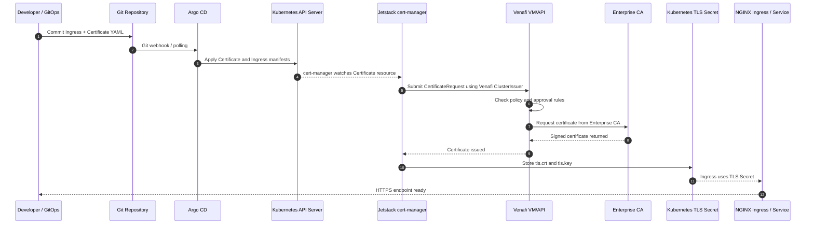

### Certificate renewal flow

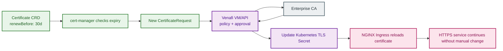

### Sample Venafi ClusterIssuer

```yaml
apiVersion: cert-manager.io/v1
kind: ClusterIssuer
metadata:
  name: venafi-prod-clusterissuer
spec:
  venafi:
    zone: "\VED\Policy\Kubernetes\Insurance-Prod"
    tpp:
      url: https://venafi.openhelp.net/vedsdk
      credentialsRef:
        name: venafi-tpp-secret
```

### Sample Certificate for an insurance service

```yaml
apiVersion: cert-manager.io/v1
kind: Certificate
metadata:
  name: policy-service-tls
  namespace: insurance-prod
spec:
  secretName: policy-service-tls
  duration: 2160h
  renewBefore: 720h
  issuerRef:
    name: venafi-prod-clusterissuer
    kind: ClusterIssuer
  dnsNames:
    - policy.insurance.example.com
```

### Sample Ingress using the generated certificate

```yaml
apiVersion: networking.k8s.io/v1
kind: Ingress
metadata:
  name: policy-service-ingress
  namespace: insurance-prod
  annotations:
    cert-manager.io/cluster-issuer: venafi-prod-clusterissuer
spec:
  ingressClassName: nginx
  tls:
    - hosts:
        - policy.insurance.example.com
      secretName: policy-service-tls
  rules:
    - host: policy.insurance.example.com
      http:
        paths:
          - path: /
            pathType: Prefix
            backend:
              service:
                name: policy-service
                port:
                  number: 8080
```

---

## 19.3 Active Directory Authentication Architecture

Active Directory is added as the enterprise identity provider. AD is used for human user login and group mapping. Applications should not store user passwords locally.

### AD VM sizing

| Component | Deployment Type | Recommended Production Size | Purpose |
|---|---|---:|---|
| AD Domain Controller 1 | VMware VM | 4 to 8 vCPU, 16 to 32 GB RAM | Primary authentication and LDAP/LDAPS |
| AD Domain Controller 2 | VMware VM | 4 to 8 vCPU, 16 to 32 GB RAM | Redundancy and HA |
| DNS service | On AD or separate DNS | HA pair | Name resolution for services |
| Optional ADFS / SSO | VMware VM | 4 to 8 vCPU, 16 to 32 GB RAM | SAML/OIDC federation if required |

### AD groups used in production

| AD Group | Usage |
|---|---|
| `INS-K8S-CLUSTER-ADMIN` | Rancher/Kubernetes cluster admin |
| `INS-K8S-DEVOPS` | DevOps engineers with platform access |
| `INS-APP-DEV` | Developers with non-prod access |
| `INS-APP-READONLY` | Read-only access for audit/support |
| `INS-CLAIMS-ADMIN` | Claims application admin role |
| `INS-POLICY-ADMIN` | Policy application admin role |
| `INS-AUDIT-RO` | Audit/compliance read-only role |

### AD authentication flow for Rancher/Kubernetes

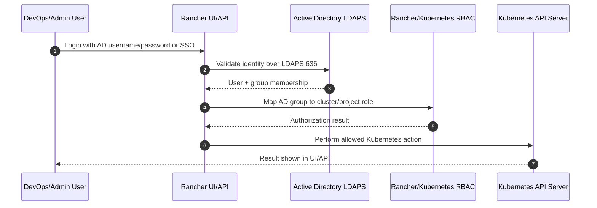

### AD authentication flow for application users

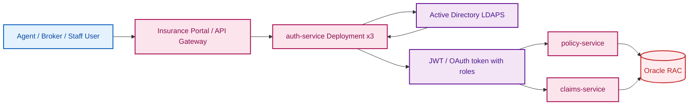

### AD connectivity requirements

| Source | Destination | Port | Purpose |
|---|---|---:|---|
| Rancher pods | AD Domain Controllers | 636 | LDAPS login and group lookup |
| auth-service pods | AD Domain Controllers | 636 | Staff/agent authentication |
| Jump host | AD / DNS | 53, 88, 389, 636 | Admin troubleshooting |
| Kubernetes CoreDNS | Enterprise DNS / AD DNS | 53 | Resolve AD, Venafi, Oracle, external systems |

---

## 19.4 Updated Complete Pod and VM Inventory

### Kubernetes workloads

| Service | Kubernetes Object | Replicas / Pods | Exposure | Persistence | Main Function |
|---|---|---:|---|---|---|
| api-gateway | Deployment | 3 | ClusterIP behind Ingress | No | API routing, rate limits, auth enforcement |
| auth-service | Deployment | 3 | ClusterIP | No | Login, AD/SSO validation, token issue |
| authorization-service | Deployment | 3 | ClusterIP | No | Role/permission checks |
| customer-service | Deployment | 4 | ClusterIP | No | Customer master data APIs |
| quote-service | Deployment | 3 | ClusterIP | No | Quote generation |
| policy-service | Deployment | 4 | ClusterIP | No | Policy lifecycle |
| underwriting-service | Deployment | 3 | ClusterIP | No | Risk evaluation |
| premium-service | Deployment | 3 | ClusterIP | No | Premium calculation |
| claims-service | Deployment | 6 | ClusterIP | No | Claims lifecycle |
| claim-assessment-service | Deployment | 4 | ClusterIP | No | Claim assessment |
| claim-approval-service | Deployment | 3 | ClusterIP | No | Claim approval workflow |
| billing-service | Deployment | 3 | ClusterIP | No | Billing and invoices |
| payment-service | Deployment | 3 | ClusterIP | No | Bank/payment integration |
| fraud-detection-service | Deployment | 4 | ClusterIP | No | Fraud scoring |
| document-service | Deployment | 3 | ClusterIP | Optional object storage | PDF/doc generation |
| notification-service | Deployment | 3 | ClusterIP | No | Notification orchestration |
| email-service | Deployment | 2 | ClusterIP | No | Email provider integration |
| sms-service | Deployment | 2 | ClusterIP | No | SMS provider integration |
| reporting-service | Deployment | 2 | ClusterIP | Optional cache | Reports and analytics APIs |
| audit-service | Deployment | 3 | ClusterIP | No | Audit events |
| NGINX Ingress Controller | Deployment + LoadBalancer Service | 3 | External LoadBalancer | No | Inbound HTTPS |
| Jetstack cert-manager | Deployment | 3 | Internal | No | Certificate automation |
| cert-manager-webhook | Deployment | 3 | Internal webhook | No | CRD validation |
| cert-manager-cainjector | Deployment | 3 | Internal | No | CA bundle injection |
| Rancher | Deployment | 3 | Ingress | Optional | Cluster management |
| Argo CD server | Deployment | 2 | Ingress/internal | No | GitOps UI/API |
| Argo CD repo-server | Deployment | 2 | Internal | Optional cache | Git/Helm render |
| Argo CD application-controller | StatefulSet | 1-2 | Internal | Optional | Reconciliation |
| Prometheus | StatefulSet | 2 | Internal | PVC required | Metrics storage |
| Grafana | Deployment | 2 | Ingress/internal | PVC or DB | Dashboards |
| Alertmanager | StatefulSet | 3 | Internal | PVC recommended | Alert routing |
| Elasticsearch | StatefulSet | 6 | Internal | PVC required | Log indexing |
| Kibana | Deployment | 2 | Ingress/internal | No | Log search UI |
| Fluentd | DaemonSet | 1 per node | Internal | No | Log collection |
| node-exporter | DaemonSet | 1 per node | Internal | No | Node metrics |

### VMware / external workloads

| Component | Type | Count | Main Function |
|---|---|---:|---|
| Venafi | VMware VM | 1 + optional DR | Certificate lifecycle management |
| Active Directory Domain Controllers | VMware VM | 2 | Authentication, groups, LDAPS, DNS |
| Jenkins | VMware VM | 1 or HA pair | CI pipeline |
| Bitbucket / GitLab | VMware VM | 1 or HA pair | Source control |
| SonarQube | VMware VM | 1 | Code quality scanning |
| Nexus Repository | VMware VM | 1 or HA/storage-backed | Docker, Helm, Maven artifacts |
| Jump Host | VMware VM | 1-2 | Secure admin access |
| Oracle RAC | Physical/VM DB nodes | 3 | Core insurance database |
| F5 / HAProxy | Appliance/VM pair | 2 | External load balancing |

---

## 19.5 Updated Certificate and Authentication Network Ports

| From | To | Port | Protocol | Purpose |
|---|---|---:|---|---|
| User browser | F5 / HAProxy | 443 | HTTPS | Public application access |
| F5 / HAProxy | NGINX Ingress LoadBalancer | 443 | HTTPS | Forward traffic to Kubernetes |
| NGINX Ingress | API Gateway service | 8080/8443 | HTTP/HTTPS | Internal API routing |
| cert-manager pods | Venafi VM/API | 443 | HTTPS | Certificate request and renewal |
| Venafi VM | Enterprise CA / Microsoft CA | CA-specific | HTTPS/RPC | Certificate issuance |
| Rancher pods | AD Domain Controllers | 636 | LDAPS | Admin/developer authentication |
| auth-service pods | AD Domain Controllers | 636 | LDAPS | Application staff/agent authentication |
| CoreDNS | AD DNS / enterprise DNS | 53 | UDP/TCP | Name resolution |
| Microservices | Oracle SCAN VIP | 1521/TCPS 2484 | TCP/TCPS | Database access |
| Jenkins VM | Nexus VM | 8081/443 | HTTP/HTTPS | Push artifacts/images |
| Jenkins VM | SonarQube VM | 9000/443 | HTTP/HTTPS | Code quality scanning |
| Argo CD | Git repo | 443/22 | HTTPS/SSH | Pull manifests/Helm charts |

---


---

## 20.1 Updated Recommended Traffic Architecture - NGINX Ingress Direct Routing Without Separate API Gateway

> Update: In this version, the earlier **API Gateway Deployment** is changed to an **optional component**. For the main production traffic path, **NGINX Ingress Controller acts as the entry routing layer** and sends traffic directly to Kubernetes `ClusterIP` services. This avoids confusion and is easier to understand for Kubernetes production routing.

### Updated north-south traffic flow

```text
Users / Agents / Brokers
        ↓
DNS: insurance.example.com
        ↓
F5 HA Pair / WAF
        ↓
NGINX Ingress Controller Service
        ↓
NGINX Ingress Controller Pods x3
        ↓
Kubernetes Ingress Rules
        ↓
ClusterIP Services
        ↓
Microservice Deployments / Pods
```

### Updated color architecture

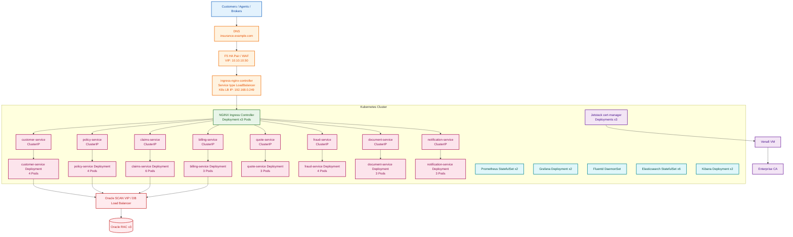

### Why we removed API Gateway from the main path

In this design, there is no separate API Gateway pod in the request path. NGINX Ingress itself performs the routing.

```text
/api/customers/*  → customer-service
/api/policies/*   → policy-service
/api/claims/*     → claims-service
/api/billing/*    → billing-service
/api/quotes/*     → quote-service
/api/fraud/*      → fraud-service
/api/documents/*  → document-service
/api/notifications/* → notification-service
```

Use a separate API Gateway such as Kong, Apigee, or Spring Cloud Gateway only when the organization needs extra API-management features such as API keys, partner API onboarding, developer portal, advanced monetization, or centralized API analytics.

---

## 20.2 How Traffic Routing Works After F5 Load Balancer

### Step-by-step request example

```text
1. User opens:
   https://insurance.example.com/api/customers/profile/1001

2. DNS resolves insurance.example.com to F5 VIP:
   10.10.10.50

3. F5 forwards traffic to Kubernetes LoadBalancer IP:
   192.168.0.249

4. Kubernetes LoadBalancer Service sends traffic to one of the NGINX Ingress pods.

5. NGINX Ingress checks the Ingress rule:
   /api/customers → customer-service

6. NGINX forwards the request to:
   customer-service.insurance-prod.svc.cluster.local:8080

7. Kubernetes Service load-balances to one of the 4 customer-service pods.
```

### Important point

NGINX Ingress does not call pod IPs directly in configuration. It calls Kubernetes **Services**. Services then select healthy pods using labels.

```text
Ingress rule → Kubernetes Service → EndpointSlice → Pods
```

---

## 20.3 How to Add the LoadBalancer IP in YAML

There are two common production options.

### Option A - Bare-metal / MetalLB style static IP

If your Kubernetes cluster uses MetalLB or another bare-metal LoadBalancer implementation, set the static IP in the `Service`.

```yaml
apiVersion: v1
kind: Service
metadata:
  name: ingress-nginx-controller
  namespace: ingress-nginx
  annotations:
    metallb.universe.tf/address-pool: production-lb-pool
spec:
  type: LoadBalancer
  loadBalancerIP: 192.168.0.249
  externalTrafficPolicy: Local
  selector:
    app.kubernetes.io/name: ingress-nginx
    app.kubernetes.io/component: controller
  ports:
    - name: http
      port: 80
      targetPort: http
      protocol: TCP
    - name: https
      port: 443
      targetPort: https
      protocol: TCP
```

After applying:

```bash
kubectl get svc -n ingress-nginx ingress-nginx-controller
```

Expected output:

```text
NAME                       TYPE           CLUSTER-IP      EXTERNAL-IP     PORT(S)
ingress-nginx-controller   LoadBalancer   10.96.55.100    192.168.0.249   80:xxxxx/TCP,443:yyyyy/TCP
```

Then F5 will forward traffic to `192.168.0.249` on ports `80` and `443`.

### Option B - F5 owns the external VIP

In many banks, the public VIP is created on F5, for example:

```text
F5 Public VIP: 10.10.10.50
Kubernetes Ingress LB IP: 192.168.0.249
```

F5 pool members can point to:

```text
192.168.0.249:443
```

or directly to worker-node NodePorts, depending on the F5 design. The simpler design is:

```text
F5 VIP → Kubernetes LoadBalancer IP → NGINX Ingress pods
```

---

## 20.4 YAML 1 - Namespace, Customer Service Deployment and Service

```yaml
apiVersion: v1
kind: Namespace
metadata:
  name: insurance-prod

---
apiVersion: apps/v1
kind: Deployment
metadata:
  name: customer-service
  namespace: insurance-prod
spec:
  replicas: 4
  selector:
    matchLabels:
      app: customer-service
  strategy:
    type: RollingUpdate
    rollingUpdate:
      maxSurge: 1
      maxUnavailable: 1
  template:
    metadata:
      labels:
        app: customer-service
    spec:
      containers:
        - name: customer-service
          image: nexus.insurance.local/insurance/customer-service:1.0.0
          ports:
            - containerPort: 8080
          resources:
            requests:
              cpu: "500m"
              memory: "1Gi"
            limits:
              cpu: "2"
              memory: "2Gi"
          readinessProbe:
            httpGet:
              path: /actuator/health/readiness
              port: 8080
            initialDelaySeconds: 20
            periodSeconds: 10
          livenessProbe:
            httpGet:
              path: /actuator/health/liveness
              port: 8080
            initialDelaySeconds: 60
            periodSeconds: 20

---
apiVersion: v1
kind: Service
metadata:
  name: customer-service
  namespace: insurance-prod
spec:
  type: ClusterIP
  selector:
    app: customer-service
  ports:
    - name: http
      port: 8080
      targetPort: 8080
```

---

## 20.5 YAML 2 - Policy Service Deployment and Service

```yaml
apiVersion: apps/v1
kind: Deployment
metadata:
  name: policy-service
  namespace: insurance-prod
spec:
  replicas: 4
  selector:
    matchLabels:
      app: policy-service
  strategy:
    type: RollingUpdate
    rollingUpdate:
      maxSurge: 1
      maxUnavailable: 1
  template:
    metadata:
      labels:
        app: policy-service
    spec:
      containers:
        - name: policy-service
          image: nexus.insurance.local/insurance/policy-service:1.0.0
          ports:
            - containerPort: 8080
          env:
            - name: ORACLE_SERVICE
              value: oracle-db.insurance-prod.svc.cluster.local
          resources:
            requests:
              cpu: "700m"
              memory: "1Gi"
            limits:
              cpu: "2"
              memory: "3Gi"
          readinessProbe:
            httpGet:
              path: /actuator/health/readiness
              port: 8080
            initialDelaySeconds: 20
            periodSeconds: 10
          livenessProbe:
            httpGet:
              path: /actuator/health/liveness
              port: 8080
            initialDelaySeconds: 60
            periodSeconds: 20

---
apiVersion: v1
kind: Service
metadata:
  name: policy-service
  namespace: insurance-prod
spec:
  type: ClusterIP
  selector:
    app: policy-service
  ports:
    - name: http
      port: 8080
      targetPort: 8080
```

---

## 20.6 YAML 3 - Claims Service Deployment and Service

```yaml
apiVersion: apps/v1
kind: Deployment
metadata:
  name: claims-service
  namespace: insurance-prod
spec:
  replicas: 6
  selector:
    matchLabels:
      app: claims-service
  strategy:
    type: RollingUpdate
    rollingUpdate:
      maxSurge: 2
      maxUnavailable: 1
  template:
    metadata:
      labels:
        app: claims-service
    spec:
      containers:
        - name: claims-service
          image: nexus.insurance.local/insurance/claims-service:1.0.0
          ports:
            - containerPort: 8080
          env:
            - name: FRAUD_SERVICE_URL
              value: http://fraud-service.insurance-prod.svc.cluster.local:8080
            - name: DOCUMENT_SERVICE_URL
              value: http://document-service.insurance-prod.svc.cluster.local:8080
          resources:
            requests:
              cpu: "700m"
              memory: "1Gi"
            limits:
              cpu: "3"
              memory: "3Gi"
          readinessProbe:
            httpGet:
              path: /actuator/health/readiness
              port: 8080
            initialDelaySeconds: 20
            periodSeconds: 10
          livenessProbe:
            httpGet:
              path: /actuator/health/liveness
              port: 8080
            initialDelaySeconds: 60
            periodSeconds: 20

---
apiVersion: v1
kind: Service
metadata:
  name: claims-service
  namespace: insurance-prod
spec:
  type: ClusterIP
  selector:
    app: claims-service
  ports:
    - name: http
      port: 8080
      targetPort: 8080
```

---

## 20.7 YAML 4 - NGINX Ingress Routing to Multiple Deployments

This is the main routing YAML. It maps URL paths to the correct Kubernetes services.

```yaml
apiVersion: networking.k8s.io/v1
kind: Ingress
metadata:
  name: insurance-prod-ingress
  namespace: insurance-prod
  annotations:
    cert-manager.io/cluster-issuer: venafi-prod-clusterissuer
    nginx.ingress.kubernetes.io/ssl-redirect: "true"
    nginx.ingress.kubernetes.io/proxy-connect-timeout: "30"
    nginx.ingress.kubernetes.io/proxy-read-timeout: "120"
    nginx.ingress.kubernetes.io/proxy-send-timeout: "120"
spec:
  ingressClassName: nginx
  tls:
    - hosts:
        - insurance.example.com
      secretName: insurance-prod-tls
  rules:
    - host: insurance.example.com
      http:
        paths:
          - path: /api/customers
            pathType: Prefix
            backend:
              service:
                name: customer-service
                port:
                  number: 8080

          - path: /api/policies
            pathType: Prefix
            backend:
              service:
                name: policy-service
                port:
                  number: 8080

          - path: /api/claims
            pathType: Prefix
            backend:
              service:
                name: claims-service
                port:
                  number: 8080

          - path: /api/billing
            pathType: Prefix
            backend:
              service:
                name: billing-service
                port:
                  number: 8080

          - path: /api/quotes
            pathType: Prefix
            backend:
              service:
                name: quote-service
                port:
                  number: 8080

          - path: /api/fraud
            pathType: Prefix
            backend:
              service:
                name: fraud-service
                port:
                  number: 8080

          - path: /api/documents
            pathType: Prefix
            backend:
              service:
                name: document-service
                port:
                  number: 8080

          - path: /api/notifications
            pathType: Prefix
            backend:
              service:
                name: notification-service
                port:
                  number: 8080
```

### What this Ingress YAML does

| User URL | NGINX forwards to |
|---|---|
| `https://insurance.example.com/api/customers/profile` | `customer-service:8080` |
| `https://insurance.example.com/api/policies/create` | `policy-service:8080` |
| `https://insurance.example.com/api/claims/register` | `claims-service:8080` |
| `https://insurance.example.com/api/billing/invoice` | `billing-service:8080` |
| `https://insurance.example.com/api/quotes/new` | `quote-service:8080` |
| `https://insurance.example.com/api/fraud/check` | `fraud-service:8080` |
| `https://insurance.example.com/api/documents/download` | `document-service:8080` |
| `https://insurance.example.com/api/notifications/send` | `notification-service:8080` |

---

## 20.8 YAML 5 - Certificate Created by cert-manager and Venafi

This certificate is used by the Ingress above. cert-manager requests it from Venafi and stores it in the Kubernetes secret `insurance-prod-tls`.

```yaml
apiVersion: cert-manager.io/v1
kind: Certificate
metadata:
  name: insurance-prod-tls
  namespace: insurance-prod
spec:
  secretName: insurance-prod-tls
  duration: 2160h
  renewBefore: 720h
  issuerRef:
    name: venafi-prod-clusterissuer
    kind: ClusterIssuer
  dnsNames:
    - insurance.example.com
```

Certificate flow:

```text
Certificate YAML
   ↓
cert-manager
   ↓
Venafi ClusterIssuer
   ↓
Venafi VM
   ↓
Enterprise CA
   ↓
Kubernetes Secret: insurance-prod-tls
   ↓
NGINX Ingress uses HTTPS certificate
```

---

## 20.9 Final Updated Routing Decision

For this architecture, use this as the primary design:

```text
F5 HA Pair
     |
     v
NGINX Ingress Controller (3 Pods)
     |
     +----------------------------------+
     |                                  |
     v                                  v
customer-service (4 Pods)         policy-service (4 Pods)
claims-service (6 Pods)           billing-service (3 Pods)
quote-service (3 Pods)            fraud-service (4 Pods)
document-service (3 Pods)         notification-service (3 Pods)
```

The older API Gateway section remains in this document only as an optional enterprise API-management pattern. The recommended Kubernetes-native routing pattern is now **F5 + NGINX Ingress + ClusterIP services + Deployments**.


## 20. Final Architecture Summary

```text
Users / Agents / Brokers
        ↓
DNS / Public URL
        ↓
F5 / HAProxy / Load Balancer
        ↓
NGINX Ingress Controller
        ↓
API Gateway
        ↓
Insurance Microservices as Kubernetes Deployments
        ↓
Oracle RAC through SCAN VIP / DB Load Balancer

CI/CD:
Developer → Bitbucket/GitLab → Jenkins → SonarQube → Nexus → Argo CD → Kubernetes

Monitoring:
Pods/Nodes → Prometheus → Grafana → Alertmanager

Logging:
Pods/Nodes → Fluentd → Elasticsearch → Kibana
```

