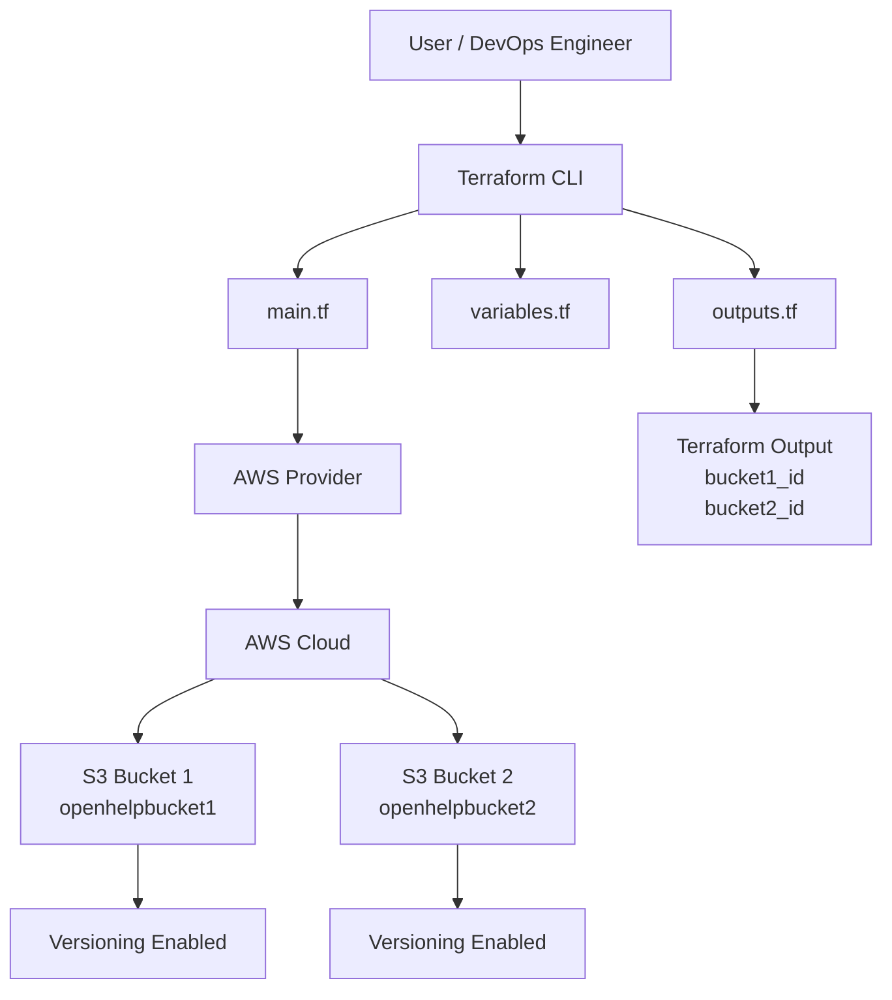
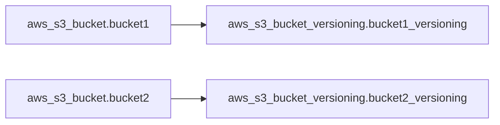

# Terraform AWS S3 Buckets Guide

> Project path example: `~/Microservices-E-Commerce-eks-project/s3-buckets`

This guide explains how Terraform creates **two AWS S3 buckets** with **versioning enabled**, using the files:

- `main.tf`
- `variables.tf`
- `outputs.tf`

---

## 1. Architecture Diagram



---

## 2. Simple Architecture Explanation

<div style="border:1px solid #4CAF50; padding:12px; border-radius:8px; background-color:#f0fff4;">

Terraform reads your `.tf` files and talks to AWS using the AWS provider.  
Then it creates two S3 buckets and enables versioning on both buckets.

</div>

### Flow

```text
You run terraform command
        |
        v
Terraform reads main.tf, variables.tf, outputs.tf
        |
        v
Terraform connects to AWS us-east-1
        |
        v
Creates S3 Bucket 1 and S3 Bucket 2
        |
        v
Enables versioning on both buckets
        |
        v
Shows bucket IDs as output
```

---

## 3. Folder Structure

```text
s3-buckets/
├── main.tf
├── variables.tf
└── outputs.tf
```

---

## 4. Complete Terraform Code

## 4.1 `main.tf`

```hcl
provider "aws" {
  region = "us-east-1"
}

resource "aws_s3_bucket" "bucket1" {
  bucket = var.bucket1_name

  tags = {
    Name        = var.bucket1_name
    Environment = var.environment
  }
}

resource "aws_s3_bucket_versioning" "bucket1_versioning" {
  bucket = aws_s3_bucket.bucket1.id

  versioning_configuration {
    status = "Enabled"
  }
}

resource "aws_s3_bucket" "bucket2" {
  bucket = var.bucket2_name

  tags = {
    Name        = var.bucket2_name
    Environment = var.environment
  }
}

resource "aws_s3_bucket_versioning" "bucket2_versioning" {
  bucket = aws_s3_bucket.bucket2.id

  versioning_configuration {
    status = "Enabled"
  }
}
```

---

## 4.2 `variables.tf`

```hcl
variable "bucket1_name" {
  description = "Name of the first S3 bucket"
  type        = string
  default     = "openhelpbucket1"
}

variable "bucket2_name" {
  description = "Name of the second S3 bucket"
  type        = string
  default     = "openhelpbucket2"
}

variable "environment" {
  description = "Environment tag"
  type        = string
  default     = "dev"
}
```

---

## 4.3 `outputs.tf`

```hcl
output "bucket1_id" {
  description = "ID of Bucket 1"
  value       = aws_s3_bucket.bucket1.id
}

output "bucket2_id" {
  description = "ID of Bucket 2"
  value       = aws_s3_bucket.bucket2.id
}
```

---

## 5. What Each Terraform Block Means

| Terraform Block | Purpose |
|---|---|
| `provider "aws"` | Tells Terraform to use AWS cloud |
| `region = "us-east-1"` | Creates resources in AWS North Virginia region |
| `resource "aws_s3_bucket" "bucket1"` | Creates the first S3 bucket |
| `resource "aws_s3_bucket" "bucket2"` | Creates the second S3 bucket |
| `aws_s3_bucket_versioning` | Enables object versioning on the bucket |
| `tags` | Adds metadata like name and environment |
| `outputs.tf` | Prints useful values after creation |
| `variables.tf` | Stores reusable input values |

---

## 6. Important Note About Your Current Code

Your `variables.tf` file defines variables, but your `main.tf` currently uses hardcoded bucket names.

Current style:

```hcl
bucket = "openhelpbucket1"
```

Variable-based style:

```hcl
bucket = var.bucket1_name
```

Both work, but using variables is better for reusable Terraform code.

---

## 7. Improved Terraform Code Using Variables

You can improve your `main.tf` like this:

```hcl
provider "aws" {
  region = "us-east-1"
}

resource "aws_s3_bucket" "bucket1" {
  bucket = var.bucket1_name

  tags = {
    Name        = var.bucket1_name
    Environment = var.environment
  }
}

resource "aws_s3_bucket_versioning" "bucket1_versioning" {
  bucket = aws_s3_bucket.bucket1.id

  versioning_configuration {
    status = "Enabled"
  }
}

resource "aws_s3_bucket" "bucket2" {
  bucket = var.bucket2_name

  tags = {
    Name        = var.bucket2_name
    Environment = var.environment
  }
}

resource "aws_s3_bucket_versioning" "bucket2_versioning" {
  bucket = aws_s3_bucket.bucket2.id

  versioning_configuration {
    status = "Enabled"
  }
}
```

---

## 8. Why We Use S3 Buckets

Amazon S3 is used to store objects like:

- Images
- Videos
- Logs
- Backups
- Application files
- Static website files
- Terraform state files
- E-commerce product images

For an e-commerce application, S3 can store:

```text
Product images
Invoice PDFs
User uploaded documents
Application logs
Backup files
Static website assets
```

---

## 9. Why We Enable Versioning

S3 versioning keeps multiple versions of the same file.

Example:

```text
product-image.png   version 1
product-image.png   version 2
product-image.png   version 3
```

### Benefits

| Benefit | Explanation |
|---|---|
| Recover deleted files | Old versions can be restored |
| Protect from accidental overwrite | Previous file versions are saved |
| Audit history | You can track file changes |
| Backup safety | Useful for production data protection |

---

## 10. Terraform Commands to Create S3 Buckets

Run these commands inside your Terraform directory:

```bash
cd ~/Microservices-E-Commerce-eks-project/s3-buckets
```

---

## 10.1 Check Terraform Version

```bash
terraform version
```

Example output:

```text
Terraform v1.8.0
on linux_amd64
```

### Why we use it

To verify Terraform is installed correctly.

---

## 10.2 Initialize Terraform

```bash
terraform init
```

Example output:

```text
Initializing the backend...
Initializing provider plugins...
- Finding latest version of hashicorp/aws...
- Installing hashicorp/aws...
Terraform has been successfully initialized!
```

### Why we use it

`terraform init` downloads the required provider plugins.  
In this case, it downloads the AWS provider plugin.

---

## 10.3 Format Terraform Code

```bash
terraform fmt
```

Example output:

```text
main.tf
variables.tf
outputs.tf
```

### Why we use it

`terraform fmt` formats Terraform files properly.

---

## 10.4 Validate Terraform Code

```bash
terraform validate
```

Example output:

```text
Success! The configuration is valid.
```

### Why we use it

It checks whether the Terraform syntax is correct.

---

## 10.5 Preview What Terraform Will Create

```bash
terraform plan
```

Example output:

```text
Terraform will perform the following actions:

  # aws_s3_bucket.bucket1 will be created
  + resource "aws_s3_bucket" "bucket1" {
      + bucket = "openhelpbucket1"
      + tags   = {
          + "Environment" = "dev"
          + "Name"        = "openhelpbucket1"
        }
    }

  # aws_s3_bucket_versioning.bucket1_versioning will be created
  + resource "aws_s3_bucket_versioning" "bucket1_versioning" {
      + bucket = "openhelpbucket1"
    }

  # aws_s3_bucket.bucket2 will be created
  + resource "aws_s3_bucket" "bucket2" {
      + bucket = "openhelpbucket2"
      + tags   = {
          + "Environment" = "dev"
          + "Name"        = "openhelpbucket2"
        }
    }

  # aws_s3_bucket_versioning.bucket2_versioning will be created
  + resource "aws_s3_bucket_versioning" "bucket2_versioning" {
      + bucket = "openhelpbucket2"
    }

Plan: 4 to add, 0 to change, 0 to destroy.
```

### Why we use it

`terraform plan` shows what Terraform will create before applying changes.

---

## 10.6 Create the S3 Buckets

```bash
terraform apply
```

Terraform asks for confirmation:

```text
Do you want to perform these actions?
  Terraform will perform the actions described above.
  Only 'yes' will be accepted to approve.

  Enter a value:
```

Type:

```text
yes
```

Example output:

```text
aws_s3_bucket.bucket1: Creating...
aws_s3_bucket.bucket2: Creating...
aws_s3_bucket.bucket1: Creation complete
aws_s3_bucket.bucket2: Creation complete
aws_s3_bucket_versioning.bucket1_versioning: Creating...
aws_s3_bucket_versioning.bucket2_versioning: Creating...
aws_s3_bucket_versioning.bucket1_versioning: Creation complete
aws_s3_bucket_versioning.bucket2_versioning: Creation complete

Apply complete! Resources: 4 added, 0 changed, 0 destroyed.

Outputs:

bucket1_id = "openhelpbucket1"
bucket2_id = "openhelpbucket2"
```

### Why we use it

`terraform apply` creates the actual resources in AWS.

---

## 10.7 Apply Without Manual Confirmation

```bash
terraform apply -auto-approve
```

### Why we use it

This applies changes without asking for `yes`.

Use carefully, especially in production.

---

## 10.8 Check Terraform State

```bash
terraform state list
```

Example output:

```text
aws_s3_bucket.bucket1
aws_s3_bucket.bucket2
aws_s3_bucket_versioning.bucket1_versioning
aws_s3_bucket_versioning.bucket2_versioning
```

### Why we use it

Terraform state tracks resources created by Terraform.

---

## 10.9 Show Output Values

```bash
terraform output
```

Example output:

```text
bucket1_id = "openhelpbucket1"
bucket2_id = "openhelpbucket2"
```

### Why we use it

It displays values defined in `outputs.tf`.

---

## 10.10 Destroy the S3 Buckets

```bash
terraform destroy
```

Type:

```text
yes
```

Example output:

```text
aws_s3_bucket_versioning.bucket1_versioning: Destroying...
aws_s3_bucket_versioning.bucket2_versioning: Destroying...
aws_s3_bucket.bucket1: Destroying...
aws_s3_bucket.bucket2: Destroying...

Destroy complete! Resources: 4 destroyed.
```

### Why we use it

It deletes the resources created by Terraform.

> Warning: Do not run destroy in production unless you really want to delete the buckets.

---

## 11. Command Summary

| Command | Purpose |
|---|---|
| `terraform version` | Check Terraform installation |
| `terraform init` | Download providers and initialize project |
| `terraform fmt` | Format Terraform code |
| `terraform validate` | Validate Terraform syntax |
| `terraform plan` | Preview changes |
| `terraform apply` | Create resources |
| `terraform apply -auto-approve` | Create resources without confirmation |
| `terraform state list` | Show resources in Terraform state |
| `terraform output` | Show output values |
| `terraform destroy` | Delete resources |

---

## 12. Terraform Resource Dependency Flow



### Explanation

Versioning depends on the bucket.

Terraform first creates:

```text
aws_s3_bucket.bucket1
aws_s3_bucket.bucket2
```

Then Terraform enables versioning:

```text
aws_s3_bucket_versioning.bucket1_versioning
aws_s3_bucket_versioning.bucket2_versioning
```

This line creates the dependency automatically:

```hcl
bucket = aws_s3_bucket.bucket1.id
```

Terraform understands that versioning cannot be enabled before the bucket exists.

---

## 13. Interview-Oriented Explanation

### What is Terraform?

Terraform is an Infrastructure as Code tool. It is used to create cloud resources using code.

---

### What is the AWS provider?

The AWS provider allows Terraform to communicate with AWS APIs.

```hcl
provider "aws" {
  region = "us-east-1"
}
```

---

### What is an S3 bucket?

An S3 bucket is a storage container in AWS used to store objects/files.

---

### Why do we use variables?

Variables make Terraform code reusable.

Instead of hardcoding:

```hcl
bucket = "openhelpbucket1"
```

We can use:

```hcl
bucket = var.bucket1_name
```

---

### Why do we use outputs?

Outputs display useful resource information after Terraform creates resources.

Example:

```hcl
output "bucket1_id" {
  value = aws_s3_bucket.bucket1.id
}
```

---

### Why do we use tags?

Tags help identify and manage AWS resources.

Example:

```hcl
tags = {
  Name        = "openhelpbucket1"
  Environment = "dev"
}
```

---

## 14. Common Error: Bucket Name Already Exists

S3 bucket names must be globally unique.

If someone else already has the same bucket name, Terraform may fail with an error like:

```text
BucketAlreadyExists: The requested bucket name is not available.
```

Solution:

Use a more unique bucket name:

```hcl
bucket = "openhelp-dev-ecommerce-images-001"
```

---

## 15. Final Summary

This Terraform project creates:

| Resource | Name | Purpose |
|---|---|---|
| S3 Bucket 1 | `openhelpbucket1` | Stores objects/files |
| S3 Bucket 2 | `openhelpbucket2` | Stores objects/files |
| Versioning 1 | Enabled | Protects bucket1 objects |
| Versioning 2 | Enabled | Protects bucket2 objects |
| Outputs | bucket IDs | Displays bucket names after creation |

Terraform command flow:

```text
terraform init
terraform fmt
terraform validate
terraform plan
terraform apply
terraform output
```

