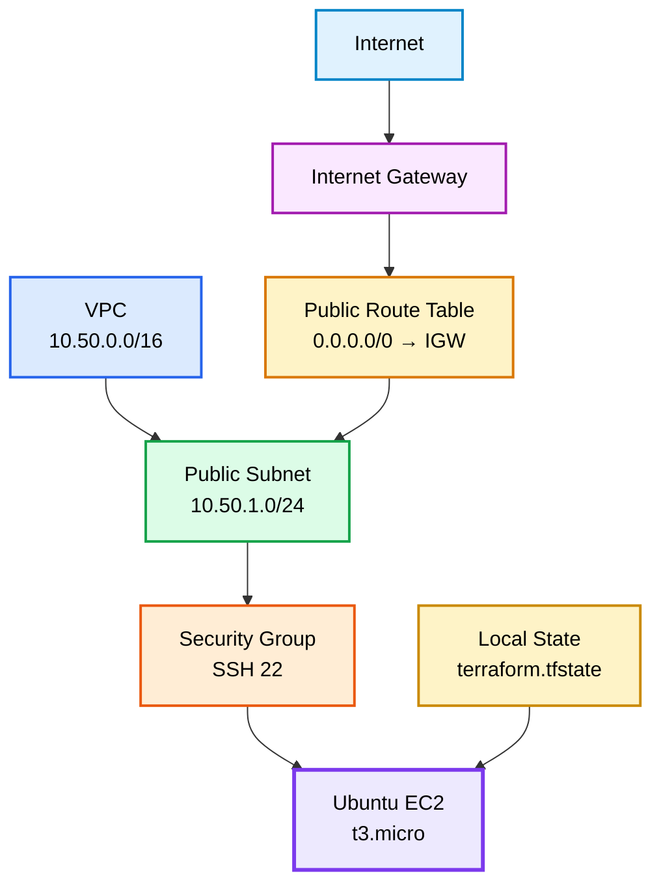
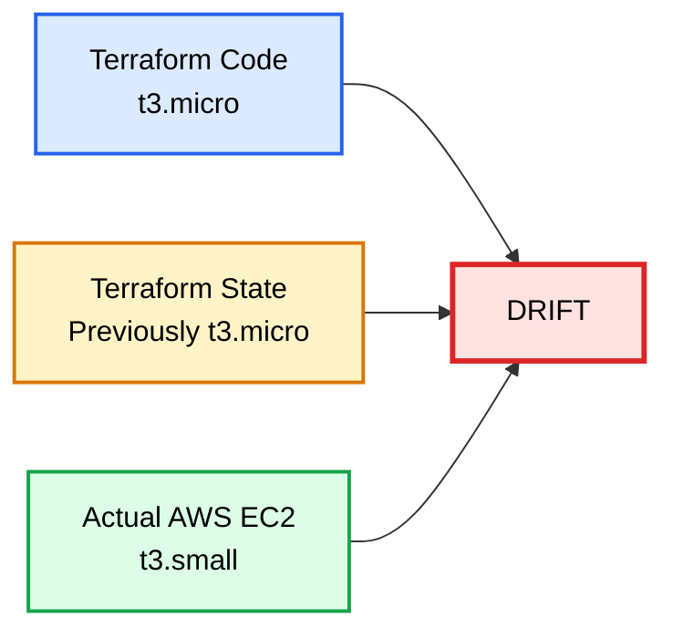
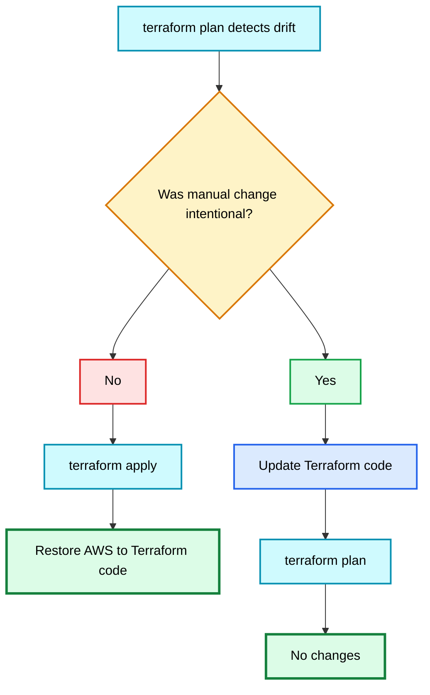
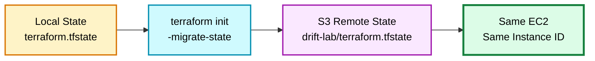
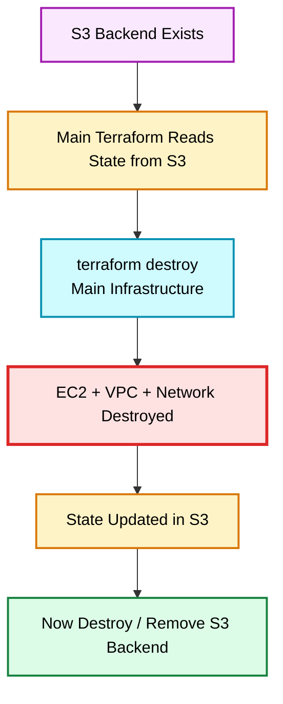

# Terraform Drift + Local State to S3 Migration Lab

> **Purpose:** This lab uses one small EC2 environment to teach Terraform drift first with **local state**, and then teaches how to move that existing state to an **S3 backend without recreating the infrastructure**.

---

# 1. Learning Flow

You will do this in two exercises.

```mermaid
flowchart LR

    A["Exercise 1<br/>Local State"]:::local
    B["Create VPC + Public Subnet + IGW + SG + EC2"]:::infra
    C["Create Drift"]:::drift
    D["Detect and Fix Drift"]:::fix
    E["Exercise 2<br/>Create S3 Bucket"]:::s3
    F["Migrate Local State to S3"]:::migrate
    G["Same EC2<br/>No Recreation"]:::success

    A --> B
    B --> C
    C --> D
    D --> E
    E --> F
    F --> G

    classDef local fill:#fef3c7,stroke:#d97706,stroke-width:2px,color:#000;
    classDef infra fill:#dbeafe,stroke:#2563eb,stroke-width:2px,color:#000;
    classDef drift fill:#fee2e2,stroke:#dc2626,stroke-width:3px,color:#000;
    classDef fix fill:#dcfce7,stroke:#16a34a,stroke-width:2px,color:#000;
    classDef s3 fill:#fae8ff,stroke:#a21caf,stroke-width:2px,color:#000;
    classDef migrate fill:#cffafe,stroke:#0891b2,stroke-width:2px,color:#000;
    classDef success fill:#dcfce7,stroke:#15803d,stroke-width:3px,color:#000;
```



---

# EXERCISE 1 — LOCAL STATE + TERRAFORM DRIFT

---

# 2. Project Structure

Create this folder:

```text
terraform-drift-lab/
```

Create these files:

```text
terraform-drift-lab/
├── main.tf
├── variables.tf
├── terraform.tfvars
└── outputs.tf
```

There is **no backend block yet**.

Therefore Terraform will use:

```text
terraform.tfstate
```

in the same local directory.

---

# 3. Architecture



---

# 4. main.tf

```hcl
terraform {
  required_version = ">= 1.10.0"

  required_providers {
    aws = {
      source  = "hashicorp/aws"
      version = "~> 6.0"
    }
  }
}

provider "aws" {
  region = var.aws_region
}

data "aws_ami" "ubuntu" {
  most_recent = true
  owners      = ["099720109477"]

  filter {
    name   = "name"
    values = ["ubuntu/images/hvm-ssd-gp3/ubuntu-noble-24.04-amd64-server-*"]
  }

  filter {
    name   = "architecture"
    values = ["x86_64"]
  }

  filter {
    name   = "virtualization-type"
    values = ["hvm"]
  }

  filter {
    name   = "root-device-type"
    values = ["ebs"]
  }
}

resource "aws_vpc" "demo" {
  cidr_block           = var.vpc_cidr
  enable_dns_support   = true
  enable_dns_hostnames = true

  tags = {
    Name = "terraform-drift-demo-vpc"
  }
}

resource "aws_internet_gateway" "demo" {
  vpc_id = aws_vpc.demo.id

  tags = {
    Name = "terraform-drift-demo-igw"
  }
}

resource "aws_subnet" "public" {
  vpc_id                  = aws_vpc.demo.id
  cidr_block              = var.public_subnet_cidr
  availability_zone       = var.availability_zone
  map_public_ip_on_launch = true

  tags = {
    Name = "terraform-drift-demo-public-subnet"
  }
}

resource "aws_route_table" "public" {
  vpc_id = aws_vpc.demo.id

  tags = {
    Name = "terraform-drift-demo-public-rt"
  }
}

resource "aws_route" "internet" {
  route_table_id         = aws_route_table.public.id
  destination_cidr_block = "0.0.0.0/0"
  gateway_id             = aws_internet_gateway.demo.id
}

resource "aws_route_table_association" "public" {
  subnet_id      = aws_subnet.public.id
  route_table_id = aws_route_table.public.id
}

resource "aws_security_group" "demo" {
  name        = "terraform-drift-demo-sg"
  description = "SSH access for Terraform drift lab"
  vpc_id      = aws_vpc.demo.id

  ingress {
    description = "SSH from administrator IP"
    from_port   = 22
    to_port     = 22
    protocol    = "tcp"
    cidr_blocks = [var.admin_cidr]
  }

  egress {
    description = "Allow all outbound IPv4 traffic"
    from_port   = 0
    to_port     = 0
    protocol    = "-1"
    cidr_blocks = ["0.0.0.0/0"]
  }

  tags = {
    Name = "terraform-drift-demo-sg"
  }
}

resource "aws_instance" "demo" {
  ami           = data.aws_ami.ubuntu.id
  instance_type = var.instance_type

  subnet_id = aws_subnet.public.id

  vpc_security_group_ids = [
    aws_security_group.demo.id
  ]

  key_name = var.key_name

  associate_public_ip_address = true

  root_block_device {
    volume_type           = "gp3"
    volume_size           = 8
    encrypted             = true
    delete_on_termination = true
  }

  tags = {
    Name        = "terraform-drift-demo"
    Environment = var.environment
  }
}
```

---

# 5. variables.tf

```hcl
variable "aws_region" {
  description = "AWS region"
  type        = string
  default     = "us-east-1"
}

variable "availability_zone" {
  description = "Availability Zone"
  type        = string
  default     = "us-east-1a"
}

variable "vpc_cidr" {
  description = "VPC CIDR"
  type        = string
  default     = "10.50.0.0/16"
}

variable "public_subnet_cidr" {
  description = "Public subnet CIDR"
  type        = string
  default     = "10.50.1.0/24"
}

variable "instance_type" {
  description = "EC2 instance type"
  type        = string
  default     = "t3.micro"
}

variable "environment" {
  description = "Environment tag"
  type        = string
  default     = "dev"
}

variable "key_name" {
  description = "Existing AWS EC2 key pair name"
  type        = string
}

variable "admin_cidr" {
  description = "Your public IP in /32 CIDR format"
  type        = string
}
```

---

# 6. terraform.tfvars

```hcl
aws_region        = "us-east-1"
availability_zone = "us-east-1a"

vpc_cidr           = "10.50.0.0/16"
public_subnet_cidr = "10.50.1.0/24"

instance_type = "t3.micro"
environment   = "dev"

key_name = "openhelp-key"

admin_cidr = "YOUR-PUBLIC-IP/32"
```

Replace:

```text
YOUR-PUBLIC-IP/32
```

with your real public IP.

Example:

```hcl
admin_cidr = "83.20.10.25/32"
```

---

# 7. outputs.tf

```hcl
output "instance_id" {
  value = aws_instance.demo.id
}

output "instance_type" {
  value = aws_instance.demo.instance_type
}

output "public_ip" {
  value = aws_instance.demo.public_ip
}

output "ssh_command" {
  value = "ssh -i openhelp-key.pem ubuntu@${aws_instance.demo.public_ip}"
}
```

---

# 8. Initialize Terraform

Run:

```text
terraform init
```

Possible output:

```text
Initializing the backend...

Initializing provider plugins...

Terraform has been successfully initialized!
```

Because there is no backend block, Terraform uses local state.

---

# 9. Validate

Run:

```text
terraform fmt
terraform validate
```

Possible output:

```text
Success! The configuration is valid.
```

---

# 10. Plan

Run:

```text
terraform plan
```

Possible summary:

```text
Plan: 7 to add, 0 to change, 0 to destroy.
```

Terraform will create:

```text
VPC
Internet Gateway
Public Subnet
Route Table
Internet Route
Route Table Association
Security Group
EC2
```

The exact count may vary by provider implementation.

---

# 11. Apply

Run:

```text
terraform apply
```

Enter:

```text
yes
```

Possible output:

```text

aws_vpc.demo: Creating...
aws_vpc.demo: Creation complete after 3s [id=vpc-0a5267cc5c02797c1]
aws_internet_gateway.demo: Creating...
aws_route_table.public: Creating...
aws_subnet.public: Creating...
aws_security_group.demo: Creating...
aws_route_table.public: Creation complete after 1s [id=rtb-0b0df81d35335ea0a]
aws_internet_gateway.demo: Creation complete after 1s [id=igw-0050b4bfb4c72416c]
aws_route.internet: Creating...
aws_route.internet: Creation complete after 2s [id=r-rtb-0b0df81d35335ea0a1080289494]
aws_security_group.demo: Creation complete after 4s [id=sg-0285a7cc41df10ef5]
aws_subnet.public: Still creating... [00m10s elapsed]
aws_subnet.public: Creation complete after 12s [id=subnet-026b7cc168e0ee7fd]
aws_route_table_association.public: Creating...
aws_instance.demo: Creating...
aws_route_table_association.public: Creation complete after 1s [id=rtbassoc-0d70e48b09084f40f]
aws_instance.demo: Still creating... [00m10s elapsed]
aws_instance.demo: Creation complete after 14s [id=i-0b2e12ce209b30eb3]

Apply complete! Resources: 8 added, 0 changed, 0 destroyed.

Outputs:

instance_id = "i-0b2e12ce209b30eb3"
instance_type = "t3.micro"
public_ip = "18.214.23.9"
ssh_command = "ssh -i openhelp-key.pem ubuntu@18.214.23.9"
```

---

# 12. Check Local State

Run:

```text
terraform state list
```

Possible output:

```text
data.aws_ami.ubuntu
aws_instance.demo
aws_internet_gateway.demo
aws_route.internet
aws_route_table.public
aws_route_table_association.public
aws_security_group.demo
aws_subnet.public
aws_vpc.demo
```

Run:

```text
terraform state show aws_instance.demo
```

Possible output:

```text
# aws_instance.demo:
resource "aws_instance" "demo" {
    id            = "i-0123456789abcdef0"
    instance_type = "t3.micro"
}
```

Your directory now contains:

```text
terraform-drift-lab/
├── main.tf
├── variables.tf
├── terraform.tfvars
├── outputs.tf
├── terraform.tfstate
└── terraform.tfstate.backup
```

---

# 13. SSH to the Ubuntu Instance

Get the public IP:

```text
terraform output -raw public_ip
```

Example:

```text
54.210.10.25
```

Connect:

```text
ssh -i openhelp-key.pem ubuntu@54.210.10.25
```

Or print the generated SSH command:

```text
terraform output -raw ssh_command
```

Possible output:

```text
ssh -i openhelp-key.pem ubuntu@54.210.10.25
```

Ubuntu username:

```text
ubuntu
```

---

# 14. What is Terraform Drift?

Terraform drift happens when the real infrastructure changes outside Terraform and no longer matches your Terraform configuration.

Example:

```text
Terraform code = t3.micro

Actual AWS     = t3.small
```

---

# 15. Create Drift Manually

Go to:

```text
AWS Console
→ EC2
→ Instances
→ terraform-drift-demo
```

Stop the instance.

Then:

```text
Actions
→ Instance settings
→ Change instance type
```

Change:

```text
t3.micro
```

to:

```text
t3.small
```

Start the instance again.

Now:

```text
Terraform code = t3.micro
Actual AWS     = t3.small
```

You now have drift.

---

# 16. Drift Diagram



---

# 17. Detect Drift

Run:

```text
terraform plan
```

Possible output:

```text
aws_instance.demo: Refreshing state... [id=i-0123456789abcdef0]

  # aws_instance.demo will be updated in-place
  ~ resource "aws_instance" "demo" {
      ~ instance_type = "t3.small" -> "t3.micro"
    }

Plan: 0 to add, 1 to change, 0 to destroy.
```

Important line:

```text
t3.small -> t3.micro
```

Meaning:

```text
Actual AWS = t3.small
Code wants = t3.micro
```

---

# 18. Detect External Change Only

Run:

```text
terraform plan -refresh-only
```

Possible output:

```text
Note: Objects have changed outside of Terraform

  # aws_instance.demo has changed
  ~ resource "aws_instance" "demo" {
      ~ instance_type = "t3.micro" -> "t3.small"
    }
```

---

# 19. Fix Drift — Method 1

If the manual AWS change was wrong, keep:

```hcl
instance_type = "t3.micro"
```

Run:

```text
terraform apply
```

Terraform changes:

```text
t3.small -> t3.micro
```

Possible output:

```text
aws_instance.demo: Modifying...
aws_instance.demo: Modifications complete

Apply complete! Resources: 0 added, 1 changed, 0 destroyed.
```

Now:

```text
Code  = t3.micro
AWS   = t3.micro
State = t3.micro
```

---

# 20. Fix Drift — Method 2

Create drift again:

```text
t3.micro -> t3.small
```

This time assume the manual change is correct.

Edit:

```text
terraform.tfvars
```

Change:

```hcl
instance_type = "t3.micro"
```

to:

```hcl
instance_type = "t3.small"
```

Run:

```text
terraform plan
```

Expected:

```text
No changes. Your infrastructure matches the configuration.
```

---

# 21. Drift Decision Diagram



---

# EXERCISE 2 — CREATE S3 AND MIGRATE LOCAL STATE

---

# 22. Goal

Currently:

```text
Terraform Code
      |
      v
Local terraform.tfstate
      |
      v
Existing AWS Infrastructure
```

We want:

```text
Terraform Code
      |
      v
S3 terraform.tfstate
      |
      v
Same Existing AWS Infrastructure
```

We do **not** want to recreate EC2, VPC, subnet, or anything else.

---

# 23. Record the Existing EC2 ID

Before migration:

```text
terraform output -raw instance_id
```

Example:

```text
i-0123456789abcdef0
```

Save this value.

We will compare it after migration.

---

# 24. Create S3 Bucket for State

Create a separate folder:

```text
state-backend/
```

Inside:

```text
state-backend/
├── main.tf
├── variables.tf
└── terraform.tfvars
```

---

# 25. state-backend/main.tf

```hcl
terraform {
  required_version = ">= 1.10.0"

  required_providers {
    aws = {
      source  = "hashicorp/aws"
      version = "~> 6.0"
    }
  }
}

provider "aws" {
  region = var.aws_region
}

resource "aws_s3_bucket" "terraform_state" {
  bucket = var.state_bucket_name

  tags = {
    Name = var.state_bucket_name
  }
}

resource "aws_s3_bucket_versioning" "terraform_state" {
  bucket = aws_s3_bucket.terraform_state.id

  versioning_configuration {
    status = "Enabled"
  }
}

resource "aws_s3_bucket_public_access_block" "terraform_state" {
  bucket = aws_s3_bucket.terraform_state.id

  block_public_acls       = true
  block_public_policy     = true
  ignore_public_acls      = true
  restrict_public_buckets = true
}

output "state_bucket_name" {
  value = aws_s3_bucket.terraform_state.bucket
}
```

---

# 26. state-backend/variables.tf

```hcl
variable "aws_region" {
  type    = string
  default = "us-east-1"
}

variable "state_bucket_name" {
  description = "Globally unique S3 bucket name"
  type        = string
}
```

---

# 27. state-backend/terraform.tfvars

```hcl
aws_region = "us-east-1"

state_bucket_name = "YOUR-UNIQUE-TERRAFORM-STATE-BUCKET"
```

Example:

```hcl
state_bucket_name = "sreejith-openhelp-drift-lab-state-2026"
```

S3 bucket names must be globally unique.

---

# 28. Create the S3 Bucket

Go to:

```text
cd state-backend
```

Run:

```text
terraform init
terraform validate
terraform plan
terraform apply
```

Enter:

```text
yes
```

Possible output:

```text
aws_s3_bucket.terraform_state: Creation complete
aws_s3_bucket_versioning.terraform_state: Creation complete
aws_s3_bucket_public_access_block.terraform_state: Creation complete

Apply complete!

Outputs:

state_bucket_name = "sreejith-openhelp-drift-lab-state-2026"
```

---

# 29. Return to EC2 Project

Go back:

```text
cd ..
```

You should be back in:

```text
terraform-drift-lab/
```

---

# 30. Add S3 Backend to Existing EC2 Project

Now edit the `terraform` block in `main.tf`.

Change:

```hcl
terraform {
  required_version = ">= 1.10.0"

  required_providers {
    aws = {
      source  = "hashicorp/aws"
      version = "~> 6.0"
    }
  }
}
```

to:

```hcl
terraform {
  required_version = ">= 1.10.0"

  required_providers {
    aws = {
      source  = "hashicorp/aws"
      version = "~> 6.0"
    }
  }

  backend "s3" {
    bucket       = "sreejith-openhelp-drift-lab-state-2026"
    key          = "drift-lab/terraform.tfstate"
    region       = "us-east-1"
    use_lockfile = true
  }
}
```

Use your real bucket name.

---

# 31. Important — Do Not Run terraform apply

You changed only the backend.

Now run:

```text
terraform init -migrate-state
```

Possible output:

```text
Initializing the backend...

Do you want to copy existing state to the new backend?

Pre-existing state was found while migrating the previous "local" backend
to the newly configured "s3" backend.

Enter a value:
```

Enter:

```text
yes
```

Possible final output:

```text
Successfully configured the backend "s3"!

Terraform has been successfully initialized!
```

---

# 32. What Just Happened?

Before:

```text
Local terraform.tfstate
        |
        v
EC2 i-0123456789abcdef0
```

After:

```text
S3
└── drift-lab/
    └── terraform.tfstate
            |
            v
EC2 i-0123456789abcdef0
```

The real infrastructure does not move.

Only the state storage location moves.

---

# 33. State Migration Diagram



---

# 34. Verify Same EC2

Run:

```text
terraform state list
```

You should still see:

```text
aws_instance.demo
aws_internet_gateway.demo
aws_route.internet
aws_route_table.public
aws_route_table_association.public
aws_security_group.demo
aws_subnet.public
aws_vpc.demo
```

Now run:

```text
terraform state show aws_instance.demo
```

Check:

```text
id = "i-0123456789abcdef0"
```

It should match the ID you recorded before migration.

Finally:

```text
terraform plan
```

Expected:

```text
No changes. Your infrastructure matches the configuration.
```

This confirms:

```text
State moved
Infrastructure did not recreate
EC2 instance ID stayed the same
```

---

# 35. Interview Answer — What is Terraform Drift?

> Terraform drift occurs when the actual infrastructure changes outside Terraform and becomes different from the desired configuration in Terraform code. For example, if Terraform defines an EC2 instance as `t3.micro`, but someone manually changes it to `t3.small` in AWS, Terraform detects that difference during `terraform plan`.

---

# 36. Interview Answer — How Do You Detect Drift?

> I normally run `terraform plan`. Terraform refreshes the current resource information from the provider and compares the actual infrastructure with the Terraform configuration. If I specifically want to inspect outside changes, I can use `terraform plan -refresh-only`.

---

# 37. Interview Answer — How Do You Fix Drift?

> If the outside change was accidental, I keep the Terraform configuration unchanged and run `terraform apply` so Terraform restores the infrastructure. If the outside change was intentional, I update the Terraform configuration to the new desired value and run `terraform plan` again.

---

# 38. Interview Answer — Where Is State Stored By Default?

> If no backend is configured, Terraform stores state locally in `terraform.tfstate` in the current working directory.

---

# 39. Interview Answer — What Does terraform init -migrate-state Do?

> `terraform init -migrate-state` is used when changing Terraform backends. For example, when moving from local state to an S3 backend, Terraform migrates the existing state to S3 while preserving the resource mappings. The existing EC2 instance is not recreated.

---

# 40. Interview Answer — How Do You Prove Infrastructure Was Not Recreated?

> I record the resource ID before migration, such as the EC2 instance ID. After migration I run `terraform state show aws_instance.demo` and verify the same instance ID is still present. I also run `terraform plan` and expect no changes.

---

# 41. Possible Interview Questions

## Q1. What is Terraform drift?

A difference between Terraform desired configuration and actual infrastructure.

## Q2. What causes Terraform drift?

Examples:

- AWS Console changes
- AWS CLI changes
- Scripts
- Another automation platform
- Emergency manual changes

## Q3. How do you detect drift?

```text
terraform plan
```

or:

```text
terraform plan -refresh-only
```

## Q4. How do you resolve drift?

Either:

```text
terraform apply
```

or update Terraform code if the outside change is intentional.

## Q5. Where is Terraform state stored by default?

```text
terraform.tfstate
```

## Q6. What is a Terraform backend?

A backend defines where Terraform stores state.

## Q7. How do you migrate local state to S3?

Add an S3 backend and run:

```text
terraform init -migrate-state
```

## Q8. Does state migration recreate EC2?

No.

## Q9. How do you verify migration?

```text
terraform state list
terraform state show aws_instance.demo
terraform plan
```

## Q10. What is terraform state mv?

It changes a resource address inside the Terraform state without recreating the real resource.

---

# 42. Destroy the Main Infrastructure

Important:

After state migration, the EC2/VPC state is in S3.

Keep the S3 bucket available until the main infrastructure is destroyed.

Go to:

```text
terraform-drift-lab/
```

Run:

```text
terraform plan -destroy
```

Possible summary:

```text
Plan: 0 to add, 0 to change, multiple resources to destroy.
```

Then:

```text
terraform destroy
```

Enter:

```text
yes
```

Terraform destroys:

```text
EC2
Security Group
Route Table Association
Internet Route
Route Table
Public Subnet
Internet Gateway
VPC
```

Possible output:

```text
aws_instance.demo: Destroying...
aws_instance.demo: Destruction complete
aws_security_group.demo: Destroying...
aws_subnet.public: Destroying...
aws_internet_gateway.demo: Destroying...
aws_vpc.demo: Destroying...

Destroy complete!
```

---

# 43. Verify Main Infrastructure Is Destroyed

Run:

```text
terraform state list
```

There should be no managed infrastructure resources left.

Do not run:

```text
terraform apply
```

unless you want to create the lab again.

---

# 44. Destroy the S3 Backend Last

Only after the main infrastructure is destroyed should you remove the S3 backend.

Go to:

```text
state-backend/
```

Run:

```text
terraform plan -destroy
```

Then:

```text
terraform destroy
```

If the S3 bucket contains Terraform state objects or versions, AWS may refuse to delete it until the bucket is empty.

For a learning lab, you can empty the bucket from the AWS Console first, then run:

```text
terraform destroy
```

again.

---

# 45. Correct Destroy Order



---

# 46. Complete Command Flow

## Exercise 1

```text
terraform init
terraform fmt
terraform validate
terraform plan
terraform apply
terraform state list
terraform state show aws_instance.demo
```

Create manual drift.

Then:

```text
terraform plan
terraform plan -refresh-only
```

Resolve drift with either:

```text
terraform apply
```

or update:

```text
terraform.tfvars
```

and run:

```text
terraform plan
```

---

## Exercise 2

Create S3:

```text
cd state-backend
terraform init
terraform validate
terraform plan
terraform apply
```

Return:

```text
cd ..
```

Add the S3 backend block.

Then:

```text
terraform init -migrate-state
terraform state list
terraform state show aws_instance.demo
terraform plan
```

Expected:

```text
No changes.
```

---

## Destroy

Main infrastructure first:

```text
terraform plan -destroy
terraform destroy
```

Then S3 backend:

```text
cd state-backend
terraform plan -destroy
terraform destroy
```

---

# 47. One-Minute Interview Summary

> Terraform drift happens when the actual infrastructure changes outside Terraform and no longer matches the desired Terraform configuration. I detect drift using `terraform plan`, and I can use `terraform plan -refresh-only` to focus on externally made changes. If the outside change was wrong, I run `terraform apply` to restore the configured state. If it was intentional, I update the Terraform code. Terraform state is stored locally by default in `terraform.tfstate`. To migrate from local state to S3 without recreating infrastructure, I configure an S3 backend and run `terraform init -migrate-state`. I verify the same EC2 instance ID is still tracked and confirm `terraform plan` shows no changes. During cleanup, I destroy the main infrastructure first while the S3 backend still exists, and remove the backend last.
