# Terraform Drift and State Migration Lab

> **Goal:** Learn Terraform drift using one EC2 instance, resolve the drift in two different ways, and then migrate the Terraform state from a local `terraform.tfstate` file to an S3 backend **without recreating the EC2 instance**.

---

## 1. What you will learn

By the end of this exercise you will understand:

1. What Terraform state is.
2. Where Terraform stores state by default.
3. What Terraform drift means.
4. How to intentionally create drift.
5. How `terraform plan` detects drift.
6. How `terraform plan -refresh-only` differs from a normal plan.
7. How to resolve drift by restoring AWS to the Terraform code.
8. How to resolve drift by updating Terraform code to accept an intentional manual change.
9. How to migrate Terraform state from local storage to S3.
10. How to verify that the EC2 instance was **not recreated** during state migration.
11. How to safely destroy the lab.

---

# 2. Architecture Before Drift

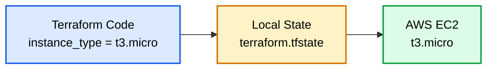

At this point everything matches:

```text
Terraform code  = t3.micro
Terraform state = t3.micro
Actual AWS      = t3.micro
```

There is **no drift**.

---

# 3. Project Structure

Create a folder:

```text
terraform-drift-lab/
```

Create these files:

```text
terraform-drift-lab/
├── main.tf
├── variables.tf
├── terraform.tfvars
└── outputs.tf
```

This revised lab is self-contained. Terraform creates its own VPC, public subnet, Internet Gateway, public route table, SSH security rules, and EC2 instance. It no longer depends on the account's default VPC or default subnets.

Initially, there is no remote backend configuration, so Terraform stores state locally in:

```text
terraform.tfstate
```

## Network Architecture

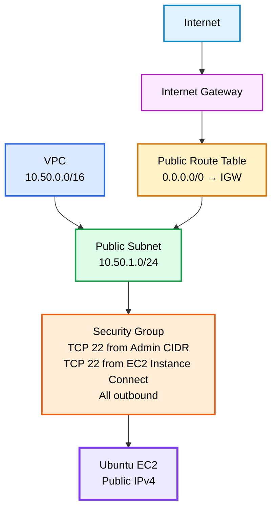

---
# 4. main.tf

```hcl
terraform {
  required_version = ">= 1.10.0"

  required_providers {
    aws = {
      source  = "hashicorp/aws"
      version = "~> 6.0"
    }
  }
}

provider "aws" {
  region = var.aws_region
}

# Latest Canonical Ubuntu 24.04 LTS amd64 AMI.
data "aws_ami" "ubuntu" {
  most_recent = true
  owners      = ["099720109477"]

  filter {
    name   = "name"
    values = ["ubuntu/images/hvm-ssd-gp3/ubuntu-noble-24.04-amd64-server-*"]
  }

  filter {
    name   = "architecture"
    values = ["x86_64"]
  }

  filter {
    name   = "virtualization-type"
    values = ["hvm"]
  }

  filter {
    name   = "root-device-type"
    values = ["ebs"]
  }
}

# AWS-managed regional prefix list used by browser-based EC2 Instance Connect.
data "aws_ec2_managed_prefix_list" "instance_connect" {
  name = "com.amazonaws.${var.aws_region}.ec2-instance-connect"
}

resource "aws_vpc" "demo" {
  cidr_block           = var.vpc_cidr
  enable_dns_support   = true
  enable_dns_hostnames = true

  tags = {
    Name = "terraform-drift-demo-vpc"
  }
}

resource "aws_internet_gateway" "demo" {
  vpc_id = aws_vpc.demo.id

  tags = {
    Name = "terraform-drift-demo-igw"
  }
}

resource "aws_subnet" "public" {
  vpc_id                  = aws_vpc.demo.id
  cidr_block              = var.public_subnet_cidr
  availability_zone       = var.availability_zone
  map_public_ip_on_launch = true

  tags = {
    Name = "terraform-drift-demo-public-subnet"
  }
}

resource "aws_route_table" "public" {
  vpc_id = aws_vpc.demo.id

  tags = {
    Name = "terraform-drift-demo-public-rt"
  }
}

resource "aws_route" "internet" {
  route_table_id         = aws_route_table.public.id
  destination_cidr_block = "0.0.0.0/0"
  gateway_id             = aws_internet_gateway.demo.id
}

resource "aws_route_table_association" "public" {
  subnet_id      = aws_subnet.public.id
  route_table_id = aws_route_table.public.id
}

resource "aws_security_group" "demo" {
  name        = "terraform-drift-demo-sg"
  description = "SSH access for Terraform drift lab"
  vpc_id      = aws_vpc.demo.id

  tags = {
    Name = "terraform-drift-demo-sg"
  }
}

# Normal SSH from your own workstation.
resource "aws_vpc_security_group_ingress_rule" "ssh_admin" {
  security_group_id = aws_security_group.demo.id
  description       = "SSH from administrator public IP"
  cidr_ipv4         = var.admin_cidr
  from_port         = 22
  ip_protocol       = "tcp"
  to_port           = 22
}

# Browser-based EC2 Instance Connect from the AWS Console.
resource "aws_vpc_security_group_ingress_rule" "ssh_instance_connect" {
  security_group_id = aws_security_group.demo.id
  description       = "SSH from AWS EC2 Instance Connect"
  prefix_list_id    = data.aws_ec2_managed_prefix_list.instance_connect.id
  from_port         = 22
  ip_protocol       = "tcp"
  to_port           = 22
}

resource "aws_vpc_security_group_egress_rule" "all_ipv4" {
  security_group_id = aws_security_group.demo.id
  description       = "Allow all outbound IPv4 traffic"
  cidr_ipv4         = "0.0.0.0/0"
  ip_protocol       = "-1"
}

resource "aws_instance" "demo" {
  ami           = data.aws_ami.ubuntu.id
  instance_type = var.instance_type

  subnet_id = aws_subnet.public.id

  vpc_security_group_ids = [
    aws_security_group.demo.id
  ]

  key_name = var.key_name

  associate_public_ip_address = true

  root_block_device {
    volume_type           = "gp3"
    volume_size           = 8
    encrypted             = true
    delete_on_termination = true
  }

  tags = {
    Name        = "terraform-drift-demo"
    Environment = var.environment
  }
}
```

## Why this fixes the original error

The old EC2 resource had no `subnet_id`, so AWS tried to use the default VPC. Your default VPC exists but has no default subnet, which caused:

```text
MissingInput: No subnets found for the default VPC.
Please specify a subnet.
```

The corrected EC2 resource explicitly uses:

```hcl
subnet_id = aws_subnet.public.id
```

so the lab no longer depends on the default VPC.

---
# 5. variables.tf

```hcl
variable "aws_region" {
  description = "AWS region"
  type        = string
  default     = "us-east-1"
}

variable "availability_zone" {
  description = "Availability Zone for the public subnet"
  type        = string
  default     = "us-east-1a"
}

variable "vpc_cidr" {
  description = "CIDR block for the VPC"
  type        = string
  default     = "10.50.0.0/16"
}

variable "public_subnet_cidr" {
  description = "CIDR block for the public subnet"
  type        = string
  default     = "10.50.1.0/24"
}

variable "instance_type" {
  description = "EC2 instance type"
  type        = string
  default     = "t3.micro"
}

variable "environment" {
  description = "Environment tag"
  type        = string
  default     = "dev"
}

variable "key_name" {
  description = "Existing EC2 key pair name for normal SSH"
  type        = string
}

variable "admin_cidr" {
  description = "Your public IPv4 address in CIDR notation, normally x.x.x.x/32"
  type        = string

  validation {
    condition     = can(cidrhost(var.admin_cidr, 0))
    error_message = "admin_cidr must be a valid CIDR such as 83.20.10.25/32."
  }
}
```

---
# 6. terraform.tfvars

```hcl
aws_region        = "us-east-1"
availability_zone = "us-east-1a"

vpc_cidr           = "10.50.0.0/16"
public_subnet_cidr = "10.50.1.0/24"

instance_type = "t3.micro"
environment   = "dev"

key_name = "openhelp-key"

admin_cidr = "YOUR-PUBLIC-IP/32"
```

Replace `YOUR-PUBLIC-IP/32` with your real public IPv4 address, for example:

```hcl
admin_cidr = "83.20.10.25/32"
```

Do not use `0.0.0.0/0` for SSH.

## EC2 Key Pair

For normal SSH, create or use an existing EC2 key pair named:

```text
openhelp-key
```

Check it:

```text
aws ec2 describe-key-pairs --key-names openhelp-key --region us-east-1
```

Or create it in:

```text
AWS Console
→ EC2
→ Network & Security
→ Key Pairs
→ Create key pair
```

Use RSA and `.pem`. Keep the downloaded private key securely.

---
# 7. outputs.tf

```hcl
output "vpc_id" {
  value = aws_vpc.demo.id
}

output "public_subnet_id" {
  value = aws_subnet.public.id
}

output "internet_gateway_id" {
  value = aws_internet_gateway.demo.id
}

output "security_group_id" {
  value = aws_security_group.demo.id
}

output "instance_id" {
  value = aws_instance.demo.id
}

output "instance_type" {
  value = aws_instance.demo.instance_type
}

output "public_ip" {
  value = aws_instance.demo.public_ip
}

output "public_dns" {
  value = aws_instance.demo.public_dns
}

output "ssh_command" {
  value = "ssh -i openhelp-key.pem ubuntu@${aws_instance.demo.public_ip}"
}
```

---
# 8. Initialize Terraform

Run:

```text
terraform init
```

Possible output:

```text
Initializing the backend...

Initializing provider plugins...
- Finding hashicorp/aws versions matching "~> 6.0"...
- Installing hashicorp/aws...

Terraform has been successfully initialized!
```

---

# 9. Format and Validate

Run:

```text
terraform fmt
```

Then:

```text
terraform validate
```

Possible output:

```text
Success! The configuration is valid.
```

---

# 10. Review the Plan

Run:

```text
terraform plan
```

Possible output:

```text
Terraform will perform the following actions:

  # aws_instance.demo will be created
  + resource "aws_instance" "demo" {
      + instance_type = "t3.micro"
      + tags = {
          + "Environment" = "dev"
          + "Name"        = "terraform-drift-demo"
        }
    }

Plan: multiple resources to add, 0 to change, 0 to destroy.
```

---

# 11. Create the EC2 Instance

Run:

```text
terraform apply
```

Enter:

```text
yes
```

Possible output:

```text
aws_instance.demo: Creating...
aws_instance.demo: Still creating...
aws_instance.demo: Creation complete after 30s [id=i-0123456789abcdef0]

Apply complete! Resources: VPC/network/security resources and 1 EC2 instance added.

Outputs:

instance_id = "i-0123456789abcdef0"
instance_type = "t3.micro"
public_ip = "54.10.20.30"
```

Your real values will be different.

If you do not want to prompt for "yes" option you may use the below command
```text
terraform apply -auto-approve
```
Terraform immediately applies the changes.

---

# 11A. Connect to the Ubuntu Instance

After `terraform apply`, get the public IP:

```text
terraform output -raw public_ip
```

Possible output:

```text
54.210.10.25
```

The default Canonical Ubuntu username is:

```text
ubuntu
```

## Option A — AWS Console: EC2 Instance Connect

```text
AWS Console
→ EC2
→ Instances
→ Select terraform-drift-demo
→ Connect
→ EC2 Instance Connect
→ Connect using a Public IP
→ Username: ubuntu
→ Connect
```

Ubuntu 20.04 and later include EC2 Instance Connect support, so the Ubuntu 24.04 AMI used in this lab does not need a separate EC2 Instance Connect package installation.

If it fails, verify:

```text
Instance is Running
Public IPv4 exists
0.0.0.0/0 route points to the Internet Gateway
Security group allows TCP 22 from the EC2 Instance Connect prefix list
Your IAM identity is allowed to use EC2 Instance Connect
Username is ubuntu
```

## Option B — Normal SSH with the PEM Key

Linux/macOS:

```text
chmod 400 openhelp-key.pem
ssh -i openhelp-key.pem ubuntu@PUBLIC-IP
```

Example:

```text
ssh -i openhelp-key.pem ubuntu@54.210.10.25
```

Windows PowerShell:

```text
ssh -i .\openhelp-key.pem ubuntu@54.210.10.25
```

Terraform can print the command:

```text
terraform output -raw ssh_command
```

Possible output:

```text
ssh -i openhelp-key.pem ubuntu@54.210.10.25
```

## SSH Architecture

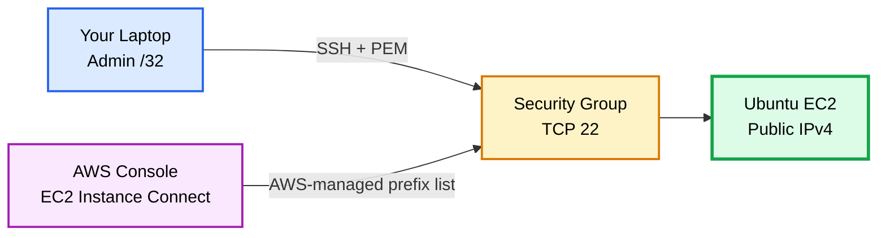

---

# 12. Understand the Local Terraform State

Run:

```text
terraform state list
```

Possible output:

```text
data.aws_ami.ubuntu
data.aws_ec2_managed_prefix_list.instance_connect
aws_instance.demo
aws_internet_gateway.demo
aws_route.internet
aws_route_table.public
aws_route_table_association.public
aws_security_group.demo
aws_subnet.public
aws_vpc.demo
aws_vpc_security_group_egress_rule.all_ipv4
aws_vpc_security_group_ingress_rule.ssh_admin
aws_vpc_security_group_ingress_rule.ssh_instance_connect
```

Run:

```text
terraform state show aws_instance.demo
```

Possible output:

```text
# aws_instance.demo:
resource "aws_instance" "demo" {
    id            = "i-0123456789abcdef0"
    instance_type = "t3.micro"

    tags = {
        "Environment" = "dev"
        "Name"        = "terraform-drift-demo"
    }
}
```

Your folder now contains something similar to:

```text
terraform-drift-lab/
├── main.tf
├── variables.tf
├── terraform.tfvars
├── outputs.tf
├── terraform.tfstate
└── terraform.tfstate.backup
```

The important relationship is:

```text
aws_instance.demo
        |
        v
i-0123456789abcdef0
```

Terraform state remembers that this Terraform resource address corresponds to that real EC2 instance.

---

# 13. What is Terraform Drift?

Terraform drift occurs when the actual infrastructure changes outside Terraform and no longer matches the desired configuration.

Example:

```text
Terraform code = t3.micro

Someone manually changes EC2 in AWS:

Actual AWS = t3.small
```

Now you have drift.

---

# 14. Drift Architecture

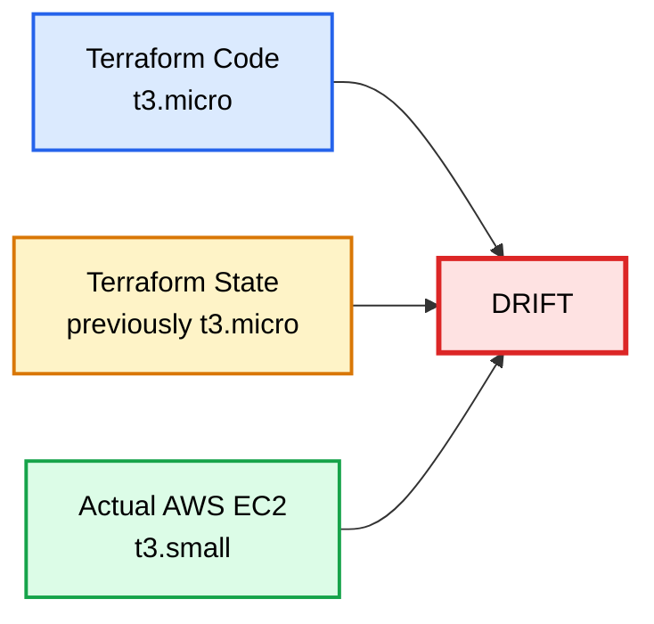

---

# 15. Create Drift Manually

Go to:

```text
AWS Console
→ EC2
→ Instances
→ Select terraform-drift-demo
```

For this exercise, change the EC2 instance type.

First stop the instance.

Then:

```text
Actions
→ Instance settings
→ Change instance type
```

Change:

```text
t3.micro
```

to:

```text
t3.small
```

Start the instance again.

Now:

```text
Terraform code  = t3.micro
Actual AWS      = t3.small
```

This is Terraform drift.

---

# 16. Detect the Drift

Run:

```text
terraform plan
```

Possible output:

```text
aws_instance.demo: Refreshing state... [id=i-0123456789abcdef0]

Terraform will perform the following actions:

  # aws_instance.demo will be updated in-place
  ~ resource "aws_instance" "demo" {
      ~ instance_type = "t3.small" -> "t3.micro"
        id            = "i-0123456789abcdef0"
    }

Plan: 0 to add, 1 to change, 0 to destroy.
```

The important line is:

```text
t3.small -> t3.micro
```

Terraform is saying:

```text
Actual AWS value = t3.small
Desired code     = t3.micro
```

If you run `terraform apply`, Terraform will try to make AWS match the code again.

---

# 17. Use terraform plan -refresh-only

Run:

```text
terraform plan -refresh-only
```

Possible output:

```text
aws_instance.demo: Refreshing state... [id=i-0123456789abcdef0]

Note: Objects have changed outside of Terraform

  # aws_instance.demo has changed
  ~ resource "aws_instance" "demo" {
      ~ instance_type = "t3.micro" -> "t3.small"
    }

This is a refresh-only plan.
```

The purpose is different from a normal plan.

## terraform plan

Asks:

```text
What must change in AWS so that AWS matches my Terraform code?
```

## terraform plan -refresh-only

Asks:

```text
What changed outside Terraform, and how would my recorded state change?
```

---

# 18. Drift Resolution Method 1 — Terraform Code Wins

Suppose the manual AWS change was a mistake.

Your code still says:

```text
t3.micro
```

AWS currently has:

```text
t3.small
```

Run:

```text
terraform plan
```

You should see:

```text
t3.small -> t3.micro
```

Then run:

```text
terraform apply
```

Enter:

```text
yes
```

Possible output:

```text
aws_instance.demo: Modifying... [id=i-0123456789abcdef0]
aws_instance.demo: Modifications complete after 20s [id=i-0123456789abcdef0]

Apply complete! Resources: 0 added, 1 changed, 0 destroyed.
```

Now:

```text
Terraform code  = t3.micro
Terraform state = t3.micro
Actual AWS      = t3.micro
```

Drift has been removed.

---

# 19. Method 1 Architecture

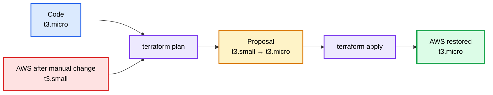

---

# 20. Create Drift Again

For the second learning scenario, manually change the EC2 instance again:

```text
t3.micro -> t3.small
```

Run:

```text
terraform plan
```

Terraform should again show something similar to:

```text
~ instance_type = "t3.small" -> "t3.micro"
```

---

# 21. Drift Resolution Method 2 — Accept the Manual Change

This time imagine the change was intentional.

For example, an administrator changed:

```text
t3.micro
```

to:

```text
t3.small
```

because more CPU or memory was required.

Instead of reverting AWS, change your Terraform code.

Open:

```text
terraform.tfvars
```

Change:

```hcl
instance_type = "t3.micro"
```

to:

```hcl
instance_type = "t3.small"
```

Now:

```text
Terraform code = t3.small
Actual AWS     = t3.small
```

Run:

```text
terraform plan
```

Possible output:

```text
aws_instance.demo: Refreshing state... [id=i-0123456789abcdef0]

No changes. Your infrastructure matches the configuration.
```

That means Terraform code now accepts the manually changed AWS value as the desired configuration.

---

# 22. Method 2 Architecture

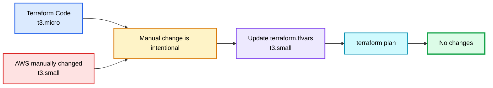

---

# 23. Drift Decision Process

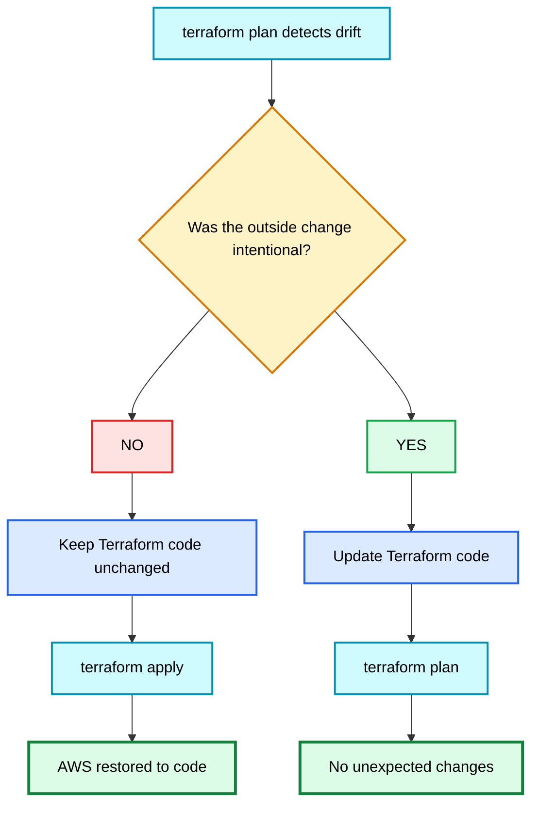

---

# 24. Current State Storage

At this stage Terraform state is still local:

```text
terraform.tfstate
```

Architecture:

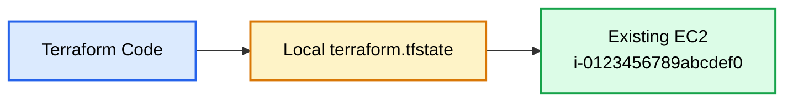

---

# 25. Next Goal — Move State to S3

We want to change:

```text
Local terraform.tfstate
```

to:

```text
S3 remote terraform.tfstate
```

without changing:

```text
EC2 instance ID
```

This is called **backend/state migration**.

---

# 26. Create an S3 Bucket for the Lab

Create an S3 bucket before configuring the backend.

For a simple learning lab, you can create one separately.

Example bucket name:

```text
my-unique-terraform-drift-lab-state
```

Important:

- S3 bucket names are globally unique.
- Use your own unique name.
- Use the same AWS region as the lab, for example `us-east-1`.
- Enable versioning.

Example:

```text
Bucket name:
my-unique-terraform-drift-lab-state

Region:
us-east-1

Versioning:
Enabled
```

---

# 27. Add the S3 Backend

Modify the `terraform` block at the top of `main.tf`.

Change it to:

```hcl
terraform {
  required_version = ">= 1.10.0"

  required_providers {
    aws = {
      source  = "hashicorp/aws"
      version = "~> 6.0"
    }
  }

  backend "s3" {
    bucket       = "my-unique-terraform-drift-lab-state"
    key          = "drift-lab/terraform.tfstate"
    region       = "us-east-1"
    use_lockfile = true
  }
}
```

Replace:

```text
my-unique-terraform-drift-lab-state
```

with your real bucket name.

---

# 28. Architecture Before State Migration

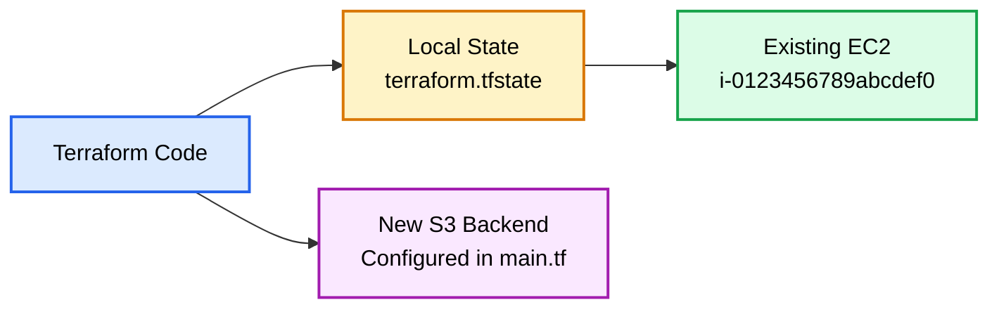

---

# 29. Migrate Local State to S3

Do **not** run `terraform apply` first.

Run:

```text
terraform init -migrate-state
```

Terraform detects that the backend changed.

Possible output:

```text
Initializing the backend...

Do you want to copy existing state to the new backend?

Pre-existing state was found while migrating the previous "local" backend
to the newly configured "s3" backend.

Enter a value: yes
```

Enter:

```text
yes
```

Possible final output:

```text
Successfully configured the backend "s3"!

Terraform has been successfully initialized!
```

---

# 30. What terraform init -migrate-state Does

It changes:

```text
Local terraform.tfstate
```

to:

```text
S3
└── drift-lab/
    └── terraform.tfstate
```

It does **not** recreate your EC2 instance.

The resource mapping remains:

```text
aws_instance.demo
        |
        v
i-0123456789abcdef0
```

Only the state storage location changes.

---

# 31. State Migration Architecture

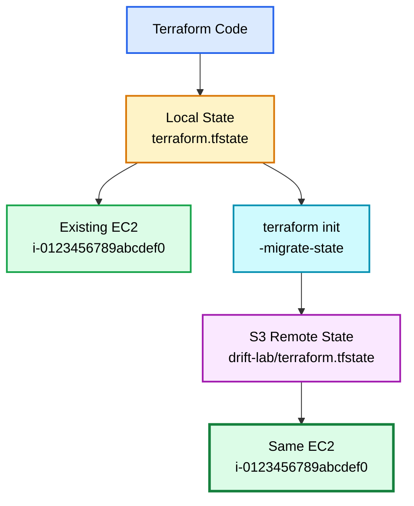

---

# 32. Verify That EC2 Was Not Recreated

Before migration, you should have recorded the instance ID:

```text
terraform output instance_id
```

Example:

```text
i-0123456789abcdef0
```

After migration run:

```text
terraform state list
```

Possible output:

```text
data.aws_ami.ubuntu
data.aws_ec2_managed_prefix_list.instance_connect
aws_instance.demo
aws_internet_gateway.demo
aws_route.internet
aws_route_table.public
aws_route_table_association.public
aws_security_group.demo
aws_subnet.public
aws_vpc.demo
aws_vpc_security_group_egress_rule.all_ipv4
aws_vpc_security_group_ingress_rule.ssh_admin
aws_vpc_security_group_ingress_rule.ssh_instance_connect
```

Now run:

```text
terraform state show aws_instance.demo
```

Look for:

```text
id = "i-0123456789abcdef0"
```

It should be the same EC2 instance ID.

Finally run:

```text
terraform plan
```

Expected output:

```text
No changes. Your infrastructure matches the configuration.
```

This is the strongest verification that the backend migration did not recreate infrastructure.

---

# 33. Full Lab Flow

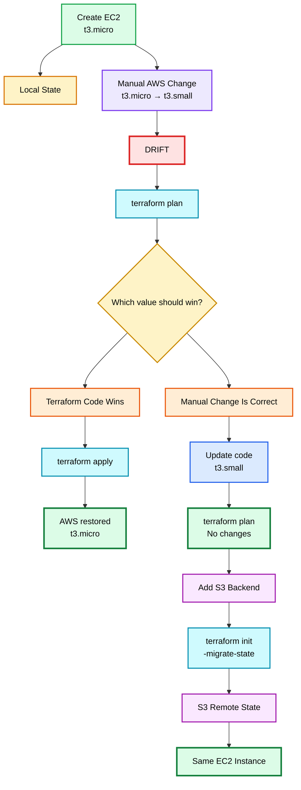

---

# 34. Important Commands Summary

Initialize Terraform:

```text
terraform init
```

Validate:

```text
terraform validate
```

Create a plan:

```text
terraform plan
```

Apply configuration:

```text
terraform apply
```

Detect external changes with a refresh-only plan:

```text
terraform plan -refresh-only
```

List state resources:

```text
terraform state list
```

Inspect one state resource:

```text
terraform state show aws_instance.demo
```

Migrate state to a newly configured backend:

```text
terraform init -migrate-state
```

Destroy managed infrastructure:

```text
terraform destroy
```

---

# 35. Interview Answer — What is Terraform Drift?

> Terraform drift occurs when the actual infrastructure changes outside Terraform and becomes different from the desired configuration defined in Terraform code. For example, if Terraform defines an EC2 instance as `t3.micro`, but someone manually changes the instance in AWS to `t3.small`, that is drift. I normally detect drift using `terraform plan`. Terraform refreshes the current resource information from the provider and compares the real infrastructure with the desired configuration.

---

# 36. Interview Answer — How Do You Detect Terraform Drift?

> I usually run `terraform plan`. During planning Terraform reads the current remote resource information from the provider and compares it with the Terraform configuration and state. If a resource has been changed outside Terraform, the plan will show the difference. I can also use `terraform plan -refresh-only` when I specifically want to review changes that happened outside Terraform and understand how Terraform state would be refreshed.

Example:

```text
~ instance_type = "t3.small" -> "t3.micro"
```

This tells me AWS currently has `t3.small`, while Terraform configuration expects `t3.micro`.

---

# 37. Interview Answer — How Do You Resolve Drift?

> First I run `terraform plan` and determine whether the outside change was intentional. If the change was accidental, I keep the Terraform code unchanged and run `terraform apply` so Terraform restores the infrastructure to the desired configuration. If the outside change was intentional, I update the Terraform code to represent the new desired value and run `terraform plan` again to confirm that there are no unexpected changes.

---

# 38. Interview Answer — What is terraform plan -refresh-only?

> `terraform plan -refresh-only` focuses on differences between Terraform state and the actual remote infrastructure. It shows how Terraform would update its recorded state to reflect changes made outside Terraform. It does not create a normal plan to change remote infrastructure back to the configured desired values.

---

# 39. Interview Answer — Where is Terraform State Stored by Default?

> If no backend is configured, Terraform stores state locally in a file named `terraform.tfstate` in the working directory. A backup file named `terraform.tfstate.backup` may also be created.

---

# 40. Interview Answer — Why is Terraform State Important?

> Terraform state maps Terraform resource addresses to real infrastructure resources. For example, state records that `aws_instance.demo` is associated with a specific EC2 instance ID. Terraform uses this mapping to understand what it already manages and what changes are required.

Example:

```text
aws_instance.demo
        |
        v
i-0123456789abcdef0
```

---

# 41. Interview Answer — How Do You Migrate Terraform State Without Recreating Resources?

> I configure the new backend and run `terraform init -migrate-state`. For example, when moving from local state to an S3 backend, Terraform copies or migrates the existing state to S3. Because the state still contains the mapping between the Terraform resource address and the existing EC2 instance ID, the EC2 instance is not recreated. After migration I verify the instance using `terraform state list`, `terraform state show`, and `terraform plan`.

---

# 42. Interview Answer — How Do You Verify State Migration Was Successful?

A good answer is:

> I record an important resource ID before migration, such as the EC2 instance ID. After `terraform init -migrate-state`, I run `terraform state list` and `terraform state show` to confirm that Terraform is still tracking the same resource ID. Finally I run `terraform plan`. If Terraform reports no changes, it confirms that the new backend is managing the same infrastructure correctly.

---

# 43. Interview Answer — Does Moving State to S3 Move the EC2 Instance?

> No. Moving state to S3 only changes the location where Terraform stores its state data. The real AWS resource remains unchanged. The same EC2 instance continues running with the same instance ID.

---

# 44. Interview Answer — What is terraform state mv?

`terraform state mv` is different from backend migration.

Example:

```text
terraform state mv aws_instance.demo aws_instance.web
```

This changes the resource address inside Terraform state:

```text
Before:
aws_instance.demo
        |
        v
EC2 i-0123456789abcdef0

After:
aws_instance.web
        |
        v
Same EC2 i-0123456789abcdef0
```

It is commonly used when renaming resources or refactoring resources into modules without recreating them.

---

# 45. Interview Answer — What is terraform import?

Terraform import is used when a real resource already exists but Terraform is not currently managing it.

Example:

```text
terraform import aws_instance.demo i-0123456789abcdef0
```

This associates:

```text
aws_instance.demo
```

with:

```text
i-0123456789abcdef0
```

in Terraform state.

---

# 46. Possible Interview Questions

## Q1. What is Terraform drift?

A difference between desired Terraform configuration and actual infrastructure caused by an outside change.

## Q2. What are common causes of drift?

Examples:

- AWS Console changes
- AWS CLI changes
- Scripts
- Another automation platform
- Emergency manual changes
- Another Terraform workspace incorrectly managing the same resource

## Q3. How do you detect drift?

Use:

```text
terraform plan
```

and optionally:

```text
terraform plan -refresh-only
```

## Q4. How do you fix drift?

Either:

```text
terraform apply
```

to restore AWS to the code, or update the Terraform configuration if the outside change is now the correct desired value.

## Q5. Should you manually edit terraform.tfstate?

Normally no. Use Terraform commands and configuration instead.

## Q6. Where is state stored by default?

```text
terraform.tfstate
```

in the local working directory.

## Q7. Why use a remote backend?

Typical reasons:

- Centralized state
- Team access
- State locking
- Better operational control
- Easier backup/versioning

## Q8. How do you move local state to S3?

Configure the S3 backend and run:

```text
terraform init -migrate-state
```

## Q9. Does state migration recreate resources?

No, if the migration is done correctly.

## Q10. How do you prove resources were not recreated?

Compare resource IDs before and after migration and run:

```text
terraform plan
```

Expected:

```text
No changes.
```

## Q11. What is the difference between terraform state mv and terraform init -migrate-state?

`terraform state mv` changes a resource address inside state.

`terraform init -migrate-state` migrates state between backends.

## Q12. What is terraform import?

It associates an existing resource with a Terraform resource address and brings it under state management.

---

# 47. Destroy and Cleanup

This section is important.

After migrating state to S3, Terraform now reads the EC2 state from S3.

Therefore destroy the EC2 and Terraform-created VPC/network resources **while the S3 backend is still available**.

## Step 1 — Confirm Terraform Can Read the Remote State

Run:

```text
terraform state list
```

Expected:

```text
data.aws_ami.ubuntu
data.aws_ec2_managed_prefix_list.instance_connect
aws_instance.demo
aws_internet_gateway.demo
aws_route.internet
aws_route_table.public
aws_route_table_association.public
aws_security_group.demo
aws_subnet.public
aws_vpc.demo
aws_vpc_security_group_egress_rule.all_ipv4
aws_vpc_security_group_ingress_rule.ssh_admin
aws_vpc_security_group_ingress_rule.ssh_instance_connect
```

---

## Step 2 — Review the Destroy Plan

Run:

```text
terraform plan -destroy
```

Possible output:

```text
Terraform will perform the following actions:

  # aws_instance.demo will be destroyed
  - resource "aws_instance" "demo" {
      - id            = "i-0123456789abcdef0"
      - instance_type = "t3.small"
    }

Plan: 0 to add, 0 to change, multiple resources to destroy.
```

---

## Step 3 — Destroy the EC2 Instance

Run:

```text
terraform destroy
```

Enter:

```text
yes
```

Possible output:

```text
aws_instance.demo: Destroying... [id=i-0123456789abcdef0]
aws_instance.demo: Destruction complete after 30s

Destroy complete! Resources: EC2 plus Terraform-created networking and security resources destroyed.
```

---

# 48. Important Cleanup Order

Use this order:

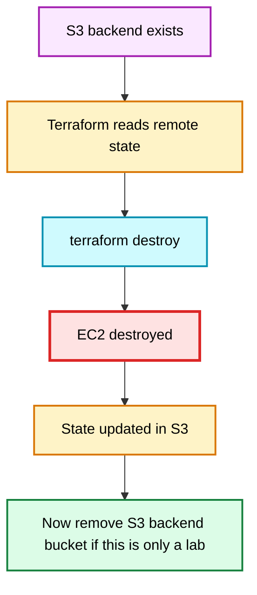

Do **not** delete the S3 state bucket before destroying the EC2 instance if Terraform still depends on that bucket for state.

---

# 49. Verify Destroy

Run:

```text
terraform state list
```

After a successful destroy, there should be no managed EC2 resource.

You may still see data sources only temporarily depending on state handling, but there should be no `aws_instance.demo`.

Run:

```text
terraform plan
```

Because your configuration still contains the EC2 resource, Terraform will now propose creating it again.

Possible output:

```text
Plan: 1 to add, 0 to change, 0 to destroy.
```

That is expected because:

```text
Code says EC2 should exist
AWS EC2 no longer exists
```

If the lab is finished, do not run `terraform apply` again.

---

# 50. Remove the S3 Bucket After the Lab

Only after the EC2 resource has been destroyed and you no longer need the remote state should you remove the S3 backend bucket.

If you created the S3 bucket manually, remove it manually after confirming that:

```text
terraform destroy
```

completed successfully.

If bucket versioning was enabled, remember that object versions may need to be removed before AWS allows bucket deletion.

---

# 51. Final Memory Map

```text
CREATE
terraform apply
        |
        v
EC2 created
        |
        v
MANUAL AWS CHANGE
t3.micro -> t3.small
        |
        v
DRIFT
        |
        v
DETECT
terraform plan
        |
        +-------------------------------+
        |                               |
        v                               v
Manual change wrong              Manual change correct
        |                               |
terraform apply                  Update Terraform code
        |                               |
AWS restored                     terraform plan
                                        |
                                   No changes
                                        |
                                        v
                               STATE MIGRATION
                                 Local -> S3
                                        |
                        terraform init -migrate-state
                                        |
                                        v
                                  VERIFY SAME EC2
                                  state show + plan
                                        |
                                        v
                                    DESTROY
                               terraform plan -destroy
                               terraform destroy
```

---

# 51A. Troubleshooting the Original Subnet Error

Original error:

```text
MissingInput: No subnets found for the default VPC.
Please specify a subnet.
```

The original EC2 resource did not specify a subnet, so AWS attempted default-VPC placement. The fixed lab explicitly creates a public subnet and uses:

```hcl
subnet_id = aws_subnet.public.id
```

The full dependency is:

```text
VPC
 ↓
Public Subnet
 ↓
Internet Gateway
 ↓
Public Route Table
 ↓
0.0.0.0/0 → Internet Gateway
 ↓
Security Group
 ↓
EC2
```

After apply, verify:

```text
terraform output vpc_id
terraform output public_subnet_id
terraform output internet_gateway_id
terraform output security_group_id
terraform output public_ip
terraform state list
```

---

# 52. One-Minute Interview Summary

> Terraform drift occurs when the actual infrastructure changes outside Terraform and no longer matches the desired Terraform configuration. I detect it mainly with `terraform plan`. If the outside change was accidental, I run `terraform apply` to restore the infrastructure to the code. If the change was intentional, I update the Terraform configuration and verify with another plan. Terraform state maps resource addresses to real resource IDs. When migrating state from local storage to S3, I configure the new backend and run `terraform init -migrate-state`. That migrates the state without recreating the existing infrastructure. I verify the same resource ID is still tracked with `terraform state show` and confirm `terraform plan` shows no changes. For cleanup, I keep the remote backend available until `terraform destroy` has successfully removed the managed infrastructure.
